# C++ primer 
## 第一章 开始

### 1.1 编写一个C++程序 
一个C++程序可能包含若干个函数，其中一个必须命名为main()。  
操作系统通过调用main()运行C++程序。  
下面是最简单的main():  
  
```
int main() 
{
    return 0;
}
```  
**int** 是main()的返回值类型，本例返回0  
**main**是函数名  
()是形参列表  
**{}**里面是函数体  

cpp程序从无到有：编写、编译、运行  
code write：就是我们在各种IDE、记事本写代码  
code compile：编译器 路径 .cpp,类似于左边的范式将cpp程序变成.exe  
code run:.exe 执行  

### 1.2 初始输入输出  
cpp未定义任何的IO语句，通过标准库实现IO机制。  
iostream  
cin：输入  
cout:输出  
cerr:输出警告、错误  
clog:输出cpp运行时一般信息  
 
<<输出运算符  >> 输入运算符 
```
#include <iostream>
using namespace std;
int main()
{
    int i = 0, sum = 0;
    
    while (i < 10)
    {
        sum += i;
        ++i;
    }

    cout << "the sum of ten : " << sum << endl;
    
    return 0;
}
```  
解析一下这个cpp:  
`#include < iostream>`：#include 是 指令，< iostream>是头文件  
#include header ：导入使用的标准库  

`using namespace std;` ： using关键字，namespace:关键字，命名空间，将程序划分不同的域；std:C++标准库的命名空间；使用这句话表示当前域使用标准库的命名空间的所有名称 

`int i = 0, sum = 0;`int 内置类型  

`while (i < 10)` while 关键字 ，`i < 10` 表达式，`<`逻辑运算符，`i 10`运算对象，cpp表达式由运算对象和运算符组成  
`cout << "the sum of ten : " << sum << endl;`  
<< 左侧是ostream对象cout，右侧是输出的值，作用是将右侧输出的值写到ostream对象cout里，返回左侧的ostream对象cout。  
`((cout << "the sum of ten : ") << sum) << endl;`   
依次写到cout对象里输出  
`"the sum of ten : "`字符串字面值常量  
`endl` 操纵符，结束当前行，缓冲刷新  

初始化一个变量就是变量在被创建时同时赋值。  
### 1.3  注释简介  
//注释  
/*注释*/：不能嵌套  
### 1.4 控制流  
while  

for(循环头)4循环体  
循环头：1初始条件，2循环条件，3表达式  
12432432...  
```
int sum=0,v=0;
    while (cin >> v)
    {
        sum+=v;
    }
    cout << sum;
```  
从键盘向程序输入数据时，Windows输入文件结束符是Ctrl+Z  
循环条件检测的是cin,即检测流状态，当流有效为真，反之为假（当流是文件结束符或者无效输入(本例输入不是int)）。
`1 3 4 2^Z 10 1 2 3 4 h 10`   
### 1.5 类简介  
 成员函数(方法)是类的一部分的函数。  
 点运算符dot  
 `current_item.isbn()`  dot左侧是类类型对象，右侧是成员名，()调用运算符，调用函数。  

## 第I部分 C++ 基础

## 第2章 变量和基本类型 
### 2.1 基本内置类型  
数据类型决定了程序中数据和操作的意义。  

算术类型：整型、浮点型  
空类型  

整型:bool、char、wchar_t、char16_t、char32_t、short、int、long 、long long   
浮点型：float、double、long double

C++标准规定了内置类型所占位数的最小值，同时允许编译器赋予这些类型更大尺寸。  
总之,`short <= int <= long <= long long`
```
我的编译器MinGW(Minimalist GNU for Windows)内置类型信息，单位是字节：
bool:1  
char:1
wchar_t:2
char16_t:2
char32_t:4
short:2
int:4
long:4
long long:8
float:4
double:8
long double:8
```   
内置类型的机器实现：

可寻址的最小内存块是字节byte，储存的基本单元是字。一个字通常是4个字节。

大多数计算机将一个字节与一个地址关联起来，为了赋予内存的某个地址意义，我们必须知道存储在那里的值的类型，类型决定使用多少位以及如何解释这些位。

通常，float以一个字表示，double以两个字表示。


signed类型:可以表示正数、负数、0  
unsigned类型：可以表示大于等于0的数 

int、long 、long long 是signed，前面加unsigned可以得到无符号类型 

字符型：char, signed char,  unsigned char  
char与signed char不同。  
虽然有三种字符类型，但只有两种表示:有符号和无符号，char表示为哪一种取决于编译器。  
unsigned类型所有的位都可以存储值。 

如何选择类型：  

使用 int 进行整数运算。 Short 通常太小，并且在实践中，long 通常与 int 具有相同的大小。如果您的数据值大于 int 的最小保证大小，则使用 long long。

当您知道值不能为负时，请使用无符号类型。

使用 double 进行浮点计算； float 通常没有足够的精度，双精度计算的成本相对于单精度可以忽略不计。事实上，在某些机器上，双精度运算比单精度运算更快。 long double 提供的精度通常是不必要的，并且通常会带来相当大的运行时成本。

算术表达式不要用char/bool，只有在存放字符或者布尔值才使用它们，因为char表示为有符号和无符号哪一种取决于编译器。

类型转换

当一个算数表达式里有无符号数和int值，int值将会转为无符号数，int本身是signed
```
    int x = -1;
    unsigned y = 1;
    cout << x*y << endl;//int是32位，4294967295
    unsigned u = 10;
    int v = -42;
    cout << u+u << endl; //20
    cout << v+v << endl; //-84
    cout << u+v << endl; //int是32位，4294967264
    cout << u-v << endl; //52
    cout << v-u << endl; //int是32位，4294967244
```

使用无符号数循环：打印10-0
```
    for(unsigned u=10;u>=0;--u)
            cout << u << endl;//死循环，u=0,--u =-1,-1是int,转换成无符号数4294967295

    unsigned u = 11;
    while(u>0)
    {
        --u;
        cout << u << endl;
    }//打印10-0
```

发现：for 递减语句一定在输出语句后，while 递减语句在输出语句前后看需求，本例`unsigned u = 11`，打印10-0，因此在输出语句前，完美使用了unsigned知识点和while，实现打印10-0，其实for也可以
```
    for(unsigned u=11;u>0;--u)
            cout << u-1 << endl;
```

字面值常量  literal

整型、浮点型字面值

整型字面值可以写成十进制、八进制(0开头)、十六进制(0X、0x开头)数的形式。

字符和字符串字面值

单引号括起来的是char字面值，双引号括起来的是字符串字面值(string literal)

string literal:常量字符构成的数组，编译器在每个字符串后面加一个空字符'\0',实际长度比内容多1。

转义序列

转义序列以反斜线\开始：\\\ 反斜线、\\"：双引号、\\t:Tab

C++ '\n'和endl有什么区别：  
chatgpt:'\n'和std::endl都可以用于换行，但std::endl除了插入换行符外，还会刷新输出缓冲区。在大多数情况下，使用'\n'更为常见和推荐，而在需要显式刷新缓冲区的情况下，可以使用std::endl。

### 2.2 变量  
变量的定义

```
    std::string s("hi cpp!");
    // cin >> s;
    cout << s << endl;//hi cpp!
    int i = 3.14;
    cout << i << endl;//3
    // int i {3};
    // int i (0);
    int i = {3.14};
    cout << i << endl;//错误
```

初始化不是赋值，初始化的含义是创建变量时赋予其一个初始值，赋值的含义是将当前值擦除，而以一个新值代替。

`int i = {3.14}`列表初始化，存在信息丢失风险编译将报错，比如左边这个丢失精度，因此会报错 

变量声明和定义的关系

声明：使得名字为程序所知，一个文件如果想使用别处定义的名字则必须

定义：负责创建与名字关联的实体。
```
    extern int e;//声明一个变量而非定义
    extern int e = 3.14//包含显示初始化的声明就是定义，不能在函数体内部这样做，否则报错
    int k;//声明并定义
```
如果在多个文件中使用一个变量，必须将声明和定义分离，定义只能出现在一个文件中，其他文件使用这个变量必须声明，绝不能重复定义，可以多次声明

标识符

名字的作用域
```
int s = 42;//全局变量
int main()
{
    cout << s << endl;//42
    int s = 42;
    cout << s << endl;//24，覆盖掉全局变量s
    cout << :: s << endl;//42,::作用域操作符，指定操作哪个作用域的名字，全局作用域没有名字，所以::操作符左侧为空，向全局作用域发出请求作用域操作符右侧的名字对应的变量
    return 0;
}
```
### 2.3 复合类型
引用类型：为对象起了另外一个名字，引用另外一种类型,必须初始化  
&
```
#include <iostream>
using namespace std;
int main(int argc, char const *argv[])
{
    int i = 1024;
    int j = 4201;
    int &ref_i = i;//ref_i指向i
    cout << ref_i << endl;//1024
    cout << ref_i+1 <<endl;//1025
    //int &ref;//引用必须初始化
    ref_i = j;
    cout << ref_i << endl;//4201
    cout << ref_i-1 << endl;//4200
    //int &X = 1;//错
    return 0;
}
```
引用即别名，所有操作都是在与之绑定的对象上进行的，类型必须与其引用对象一致。引用本身不是对象，因此不能定义引用的引用。

引用，一旦初始化完成就不能改变其绑定的对象，例子：
```
    int x = 1;
    int y = 10;
    int &ref_x = x;
    ref_x = y;
    cout << ref_x << endl;//10
    cout << x << endl;//10只是修改了x,没有绑定y
```

引用只能和对象绑定，不能和值，表达式绑定。

指针类型：pointer，存放某个对象的地址，获取地址使用取址符&，不同于引用，指针本身就是一个对象，且无需在定义时赋值。  
* 
引用不是对象，没有实际地址，不能定义指向引用的指针

指针的类型和它所指向对象的类型必须匹配。

利用指针访问对象

解引符 *,对指针解引得到指针指向的对象。
```
    int i = 1;
    int * r;
    r = & i;
    cout << *r << endl;//1
    *r = 10;
    cout << *r << endl;//10
    cout << i << endl;//10
    int &a = *r;
    cout << "a:"<< a << endl;//10
```
空指针：最简单就是用字面值nullptr初始化，c++11新特性，又或是0初始化，又或是用预处理变量NULL,这个变量在头文件cstdlib定义

不能直接把int变量值直接赋值给指针，int变量值为0也不行

void * :可以存放任意对象的地址，但是具体存放什么类型不知道

复合类型的声明  
`int i = 1024, *p = &i, &ref = i;//int变量，指针，引用`  
`int* p1，p2;`//合法但容易产生误导，基本数据类型是int，*只是修饰了p，对定义语句的其他变量不产生任何的作用

pointer to pointer :`int *p, **pp=&p;`

`int *r, *&y=r;`y是对指针r的引用。从右向左阅读y的定义，距离y最近的最本质，其余部分用于说明y的类型。

### 2.4 const限定符
const对象一旦创建之后其值就不能改变，因此必须初始化，只能在const对象上执行不改变其内容的操作。

默认状态下，const对象仅在文件内有效，要实现文件共享const对象，定义或声明时加extern
`extern const pi=3.14;`

引用与const：

初始化常量的引用，允许用任意表达式作为其初始值
```
#include <iostream>
int main(int argc, char const *argv[])
{
    const int i = 1;
    // int &ref = i；//非常量引用不能指向常量对象
    const int &ref = i;
    // ref = 2;//const的引用不能修改其绑定的对象
    return 0;
}
```
常量的引用不能修改其绑定的对象，但是对于引用的对象是否为常量未做限定，换句话说可是变量、值...,这个和引用不一样
```
    int j = 2;
    const int &ref_a = 3;//const int &ref_a = j;
    cout << ref_a << endl;
    // int &k = 4;
    //上一行报错信息：cannot bind non-const lvalue reference of type 'int&' to an rvalue of type 'int'
```
指针与const：  
类似于引用，允许一个指向常量的指针指向非常量对象
```
#include <iostream>
int main() {
    int p = 5; // 假设有一个整数变量 p，初始值为 5

    // int *const ptr = &p;
    int *const ptr = &p; // ptr 是一个常量指针，指向 p，一旦初始化后，不能改变指向的地址
    *ptr = 10; // 可以修改 ptr 所指向的对象的值
    // ptr = &other; // 错误！ptr 是常量指针，不能重新指向其他地址

    // const int *const ptr1 = &p;
    const int *const ptr1 = &p; // ptr1 是一个指向常量的常量指针，指向 p，一旦初始化后，不能改变指向的地址，并且不能修改所指向对象的值
    // *ptr1 = 20; // 错误！ptr1 是指向常量的指针，不能修改所指向对象的值
    // ptr1 = &other; // 错误！ptr1 是常量指针，不能重新指向其他地址

    std::cout << "p: " << p << std::endl; // 输出：p: 10，因为我们通过 ptr 修改了 p 的值为 10

    return 0;
}
```
`const int *p; `指向常量的指针

顶层const、底层const  
top-level-const:表示任意对象是常量。  
low-level-const:表示指针指的对象是常量，用于声明引用的都是底层const

执行对象拷贝操作时，顶层没有什么影响。  
底层const限制：  
拷入和拷出的对象具有一样的底层 const，或者两个对象的数据类型可以转换，一般是非常量可以转换成常量。

constexpr和常量表达式

声明为constexpr的变量一定是常量，而且必须使用常量表达式初始化

限定符constexpr仅对指针有效，对指针指向的对象无效
```
    const int *a = nullptr;//a是指向整型常量对象的指针
    constexpr int *b = nullptr;//b是指向整型对象的常量指针
```
constexpr将它所定义的对象置为了顶层const，constexpr既可以指向常量也可以指向非常量。
### 2.5 处理类型
类型别名  
typedef,
```
    typedef int integer;//第一种
    integer i = 10;
    cout << i << endl;//10

    using character = char ;//第二种，新特性
    character ch ='h';
    cout << ch << endl;//h

    double d = 3.14;
    typedef double * pointer_double;
    const pointer_double pd = &d;
    cout << *pd << endl;//3.14  
    const pointer_double *dd = &pd;
    cout << **dd << endl;//3.14 
```
int的类型别名integer

pd是指向d的常量指针，dd是指向常量指针对象pd的常量指针。  
`const pointer_double pd = &d;`基本数据类型是`const pointer_double`,`pointer_double`是指向double对象的指针，因此`const pointer_double`是指向double对象的常量指针，而不是指向double常量对象的指针。

auto类型说明符

auto让编译器分析推算式所属的类型，auto定义的变量必须具有初始值。

一个auto声明多个变量时，基本类型必须是一样的，&、*是声明符的一部分，不属于基本类型部分。
```
    auto j = 10, *p = &j;
    auto k = j + p;
    cout << p << endl;
    cout << k <<endl;

    auto x = 10, y =10.1;//错

    integer v = 0, &ref_v = v;
    auto auto_v = v;
```
编译器以引用对象的类型作为auto的类型。

auto一般会忽略掉顶层const，保留底层const。
```
    const int i_auto = i, &ref_i_auto = i_auto;
    auto a = i_auto;//整数，const int i_auto是顶层const
    auto b = ref_i_auto;//整数，ref_i_auto是i的别名
    auto c = &i;//整型指针
    auto e = &i_auto;//e是指向整型常量对象的指针，
```
decltype类型指示符

返回操作数的数据类型，却不实际计算表达式的值，即不初始化。

decltype((variable)):永远是引用，decltype(variable)只有variable是引用才是引用。
```
    const int ci = 10, &cr = ci, *cip =&ci;
    decltype(ci) l = 12;
    decltype(cr) s = i;
    decltype(*cip) f = i;
    cout << l << endl;
    cout << s << endl;
```
如果表达式的内容是解引用操作，将得到引用类型。`decltype(*cip) f = i;`,f的类型是const int&

赋值会产生引用，引用类型是左值类型。  
`decltype(a=b) c;`假如a是int类型，则c是int&类型
```
int i = 0, &r = i;
// same
auto a = i;
decltype(i) b = i;
// different "c" will be int "d1" will be int&
auto c = r;
decltype(r) d1 = r;//d1引用
decltype(r+0) d2;//d2int
```
### 2.6 自定义数据结构
```
struct sales_data{
    string bookNo;

};
```
struct 类名 类体 {};

;有必要,一般将类的定义和对象的定义分开。

类内初始值，初始化数据成员，没有类内初始值将被默认初始化。

初始化数据成员，等号和花括号都可以，圆括号不行，容易造成歧义，`int a()`，与函数声明一样。

为了保证各个文件中类的定义一致，类通常写在头文件中，类所在的头文件名与类名相同。

预处理器确保头文件多次包含仍可以正常工作，预处理器将头文件的内容替代#include。

头文件保护符 预处理变量(大写)

#define 定义预处理变量

#ifdef 预处理变量定义了为真

#ifndef 预处理变量没定义为真，执行后续操作直到#endif

## 第三章 字符串、向量、数组
### 命名空间的using声明

### 3.2 标准库类型string
string表示可变长字符序列。

定义和初始化string对象  

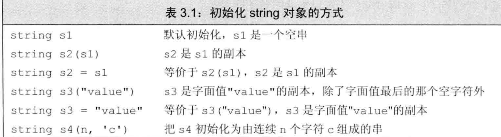

使用=号是拷贝初始化，编译器将右边的初始化值拷贝到新创建的对象。  
反之，是直接初始化。

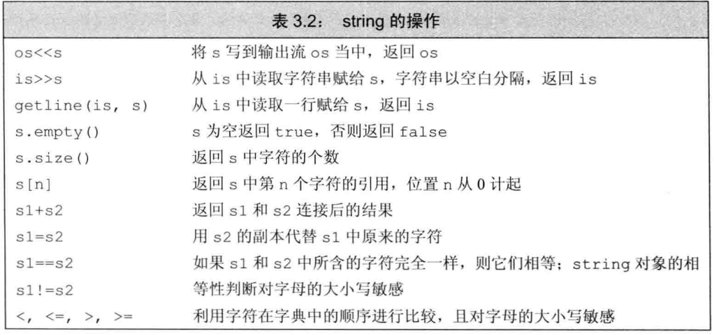

getline函数的参数是一个输入流一个string对象，从给定的输入流读取数据到string对象，直到遇到换行符截止，并丢弃换行符。

empty()根据string对象是否为空返回一个布尔值。

size()返回string对象字符的个数，返回的是string::size_type类型的值，是一个无符号整数。

如果一个表达式里有size()就不要使用int，避免int和unsigned问题。
```
 string line;
    while (getline(cin,line))
    {
        if(!line.empty())
        {
            cout << line << endl;
            cout << "字符个数：" <<line.size() << endl;
        }    
    }
```
string对象比较，string是字符“串”

string类定义了比较运算符 == != ，逐个比较string对象的字符，对大小写敏感。

如果两个string对象长度不同，而且较短的string对象每个位置上的字符都与较长string对象对应位置上的字符相同，则较短的string对象小于较长的string对象。

如果两个string对象在某些位置上不一致，比较结果是第一对不一样字符比较结果。
```
    string str1 = "abc";
    string str2 = "abcd";
    string str3 = "aec";

    cout << (str1 < str2) << endl;//true
    cout << (str1 < str3) << endl;//true
    cout << (str2 < str3) << endl;//true

    cout << (str1+str2) << endl;//abcabcd
    cout << (str1 + "!" + "!") << endl;//abc!!
```
+运算符的作用如上代码：  
两个string对象+
字面值和string对象+：必须确保+一侧是string对象  

字符串字面值和string不是一种类型。

处理string对象的字符
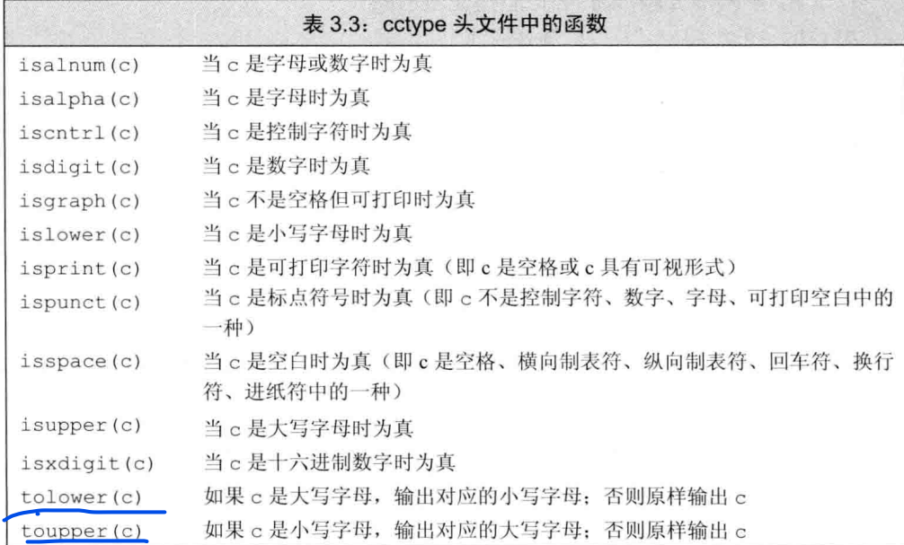

范围for语句
for(declaration:expression)
    statement
```
    string s("hello cpp,i like cpp,yes!");
    decltype(s.size()) punct_count = 0;//推断出无符号整数类型string::size_type
    for(auto c:s)
        if(ispunct(c))
            punct_count++;
    cout << punct_count << endl;
```
expression是对象用于表示一个序列，declaration是变量用于访问序列，statement是操作。

想要改变string对象的值，必须将循环变量定义为引用，这个变量实际上被捆绑到序列的每个元素上。
```
    string str("hello cpp");
    for(auto &c:str)
        c = toupper(c);
    cout << str << endl;//HELLO CPP
```
[]下标运算符接受的是string::size_type类型，表示要访问字符的位置，返回值是该位置字符的引用。

无论何时使用字符串下标都应该检查其合法性，保证下标在0-size()之间，令下标的类型为string::size_type，无符号数>=0,在保证小于size()即可。
```
    for(decltype(hexdigits.size()) index=0;index<hexdigits.size();++index)
        hexdigits[index]='X';
    cout << hexdigits << endl;
```

### 3.3 标准库类型vector
vector表示对象的集合，可以通过索引访问集合的对象，也被称为容器，是一个类模板而非类型。

模板可以看作为编译器生成类或函数编写的一份声明。编译器根据模板创建类或函数的过程为实例化，使用模板时用指出编译器应把类或函数实例化成何种类型，还需要提供一些额外信息指出模板到底实例化成什么样的类，模板名字后面跟上尖括号放信息。

引用不是对象，不存在包含引用的vector。

定义和初始化vector对象
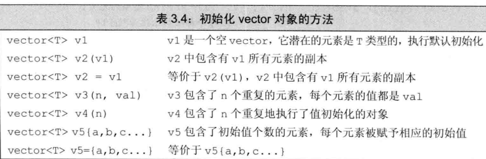

```
    vector<string> str{"hi","cpp","!"};
    vector<int> i(10,-2);
    vector<double> d(10);
```
列表初始化  
指定元素的数量和初始值初始化  
值初始化：通常可以只指定元素数量，元素初始化值由vector对象类型决定。

尖括号、花括号
```
    vector<string> str{10，-2};//两个元素，10，-2
    vector<int> i(10,-2);//十个元素都是-2
```
初始化过程尽量将花括号的值当当元素初始值列表来处理，只有无法完成初始化时才会考虑其他形式：
```
    vector<string> str1{"hi"};//列表初始化，一个元素hi
    vector<string> str2{10};//十个string默认初始化元素
    vector<string> str3{10,"hi"};//十个元素值为Hi
```
向vector对象中添加元素

push_back:在vector对象尾添加元素。

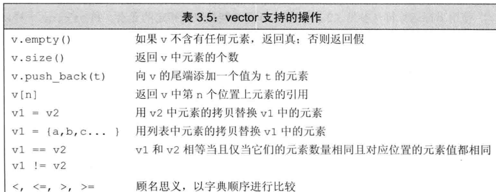

vector对象的下标运算符，可用于访问已存在的元素，不能用来添加元素。

### 3.4 迭代器介绍
所有标准库容器都可以使用迭代器iterator,类似于指针。

begin成员：负责返回指向第一个元素的迭代器  
end成员：负责返回指向容器尾元素下一位置的迭代器，没有什么实际含义，仅表示处理完了容器的所有元素。

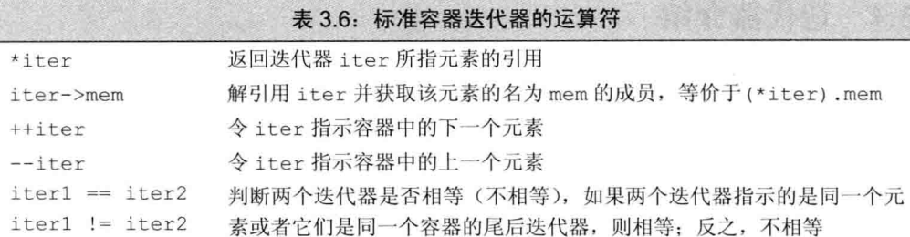

可以通过解引用迭代器获取它指向的元素,迭代器通过++，从一个元素移动到下一个元素。
```
    string s("some string");
    auto v = s.begin();
    if(s.begin() != s.end())
        *v = toupper(*v);
    cout << s << endl; 
    for(auto index=s.begin();index!=s.end()&&!isspace((*index));++index)
        *index = toupper(*index);
    cout << s << endl; 
```
多用!=而非<,因为容器都定义了!=,但是大多数没有定义<。

迭代器类型：iterator、const_iterator

c++新标准：cbegin、cend,无论对象本身是否为常量，返回值都是const_iterator。

解引用迭代器可以获得迭代器指向的对象，如果指向类，可以访问类的成员。
```
    for(auto it = s.cbegin();it!=s.cend()&&!(*it).empty();++it)
        cout << *it << ' ';
    cout << endl;
    for(auto it = s.cbegin();it!=s.cend()&&!(it->empty());++it)
        cout << *it << ' ';
    cout << endl;
```
(*it).empty()、it->empty():二者一样，->是将解引和成员访问放在一起。

可能改变vector容量的操作比如push_back，都会导致该vector对象的迭代器无效。
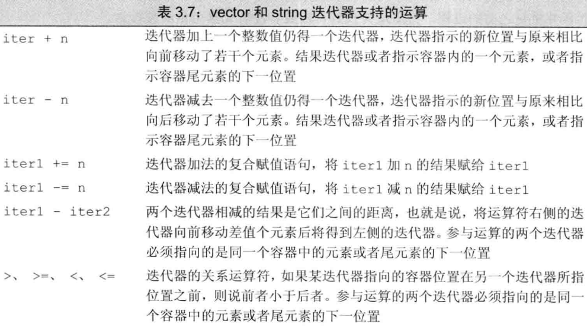

两个迭代器想减得到的是两个迭代器的距离具体是指的是右侧迭代器向前多少就能追上左侧的，类型是difference_type。

### 3.5 数组
数组是存放类型相同对象的容器，大小固定

定义：形如a[d],a数组名，d维度是一个常量表达式,初始化使用花括号

默认初始化，不允许使用auto推导数组类型，不存在引用的数组。

字符串字面值初始化数组时，末尾有一个空字符，要保留一个位置给空字符，不允许用一个数组初始化另一个数组,也不能用数组给其他数组赋值。

想要理解数组的声明，从数组的名字开始由内向外开始阅读。

在很多使用到数组名的地方编译器会将自动替换为指向首元素的指针。

使用数组作为一个auto变量的初始值时，推断出的是指针类型不是数组类型,decltype可以推断数组类型。

指针的递增运算从当前对象向前移动到下一个位置。

为了让指针更安全简单，C++11引入了begin、end函数，类似于容器的同名成员，数组是它们的参数，指针的操作也类似于迭代器

两指针相减的类型是ptrdiff_t

如果表达式含有解引运算符或者点运算符最好加圆括号

字符串字面值存放在字符数组中以空字符结束'\0',没有使用空字符会产生未定义的结果
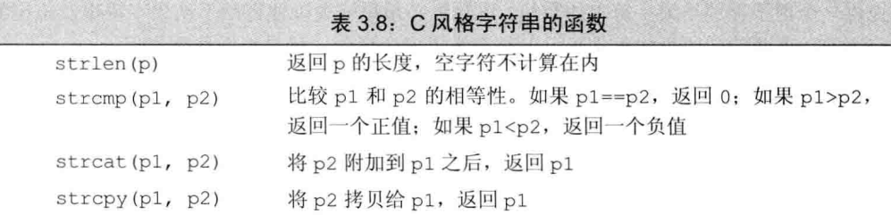

允许使用数组初始化vector对象，指明拷贝区域的起始和结束位置

现代C++程序尽量使用vector和迭代器，避免使用内置数组和指针；尽量使用string，避免使用C风格的基于数组的字符串。
### 3.6 多维数组
使用范围for循环处理多维数组时，除了最内层其他的控制变量都是引用类型，因为数组名会被认为是指针。

```
    使用范围for遍历多维数组：
    int a[2][3]  = {0,1,2,3,4,5};
    for(auto &p:a)
    {
        for(auto q:p)
            cout << q << ' ';
        cout << endl;
    }
    使用指针：
    for(auto p=a;p!=a+2;++p)
    {
        for(auto q = *p;q!=*p+3;++q)
            cout << *q << ' ';
        cout << endl;
    }
    还是用begin、end好：
    for(auto v=begin(a);v!=end(a);++v)
    {
        for(auto p=begin(*v);p!=end(*v);++p)
            cout << *p << ' ';
        cout << endl;

    }
```

## 第四章 表达式
### 4.1 基础
运算符作用于多少对象可以分为：  
一元运算符：取址& 解引*  
二元运算符：乘*  
三元运算符   
特殊的运算符：函数调用(对象没有数量限制)  

重载运算符：为已存在的运算符赋予了另一种含义

左值、右值

左值 (lvalue, locator value) 表示了一个占据内存中某个可识别的位置（也就是一个地址）的对象。

右值 (rvalue) 则使用排除法来定义。一个表达式不是 左值 就是 右值 。 那么，右值是一个 不 表示内存中某个可识别位置的对象的表达式。

有四种运算符规定了运算对象的求值顺序，&& 先求值左侧只有左侧为真才求值右侧。||、?:、,

求值顺序、优先级、结合律  
优先级：    
https://en.cppreference.com/w/cpp/language/operator_precedence


### 4.2 算术运算符
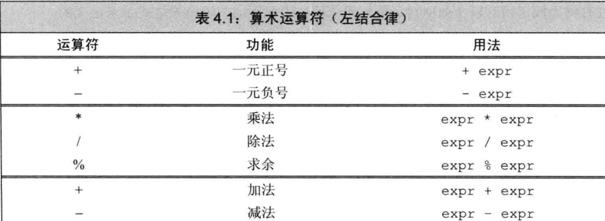
算术运算的对象和结果都是右值。

### 4.3 逻辑和关系运算符
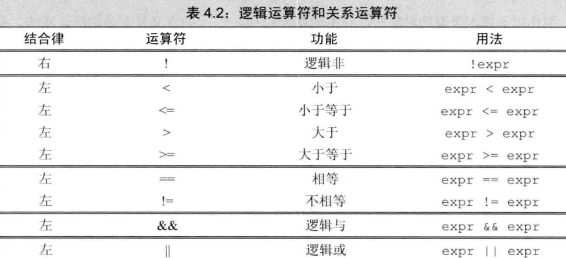
逻辑和关系运算的对象和结果都是右值。

&&：当左侧值为真时才求右侧
||：当左侧值为假时才求右侧

在比较运算时除非运算对象是布尔值否则不要与true或false比较。

### 4.4 赋值运算符
=：左侧的运算对象必须是一个可修改的左值，如果左右对象类型不同右侧将转换成左侧的类型，满足右结合律

C++11允许用花括号括起来的初始化列表作为赋值语句的右侧对象，如果左侧是是内置类型，初始化列表只有一个值且转换所占的内存空间不能超过目标类型的空间。

### 4.5 递增递减运算符
++、--  
前置版本：先将运算对象加一，再将改变后的对象作为求值的结果  
后置版本：运算对象加一，但是求值结果是运算对象改变之前的副本  
尽量避免使用后置版本，如果我们想让对象递增或递减又想使用原来的值，这个时候使用后置版本
```
    vector<int> vt{0,1,2,3,-1};
    auto pbeg = vt.begin();
    while(pbeg!=vt.end() && *pbeg>=0)
    {
        cout << *pbeg++ << ' ';
    }
```   
后置递增运算符优先级高于解引

### 4.6 成员访问运算符
点运算符  (*p).mem:解引用优先级低于点运算符，必须加括号，成员所属对象是左值右值，结果是左值右值  
箭头运算符  p->mem，箭头作用于指针类型的对象，结果是左值

### 4.7 条件运算符
?: condition?expr1:expr2  
执行condition结果为1，返回执行expr1的结果  
执行condition结果为0，返回执行expr2的结果

条件运算符的优先级非常低，通常需要加括号

### 4.8 位运算符
作用于整数类型运算对象，并把对象看成二进制位的集合，提供检查和设置二进制位的功能
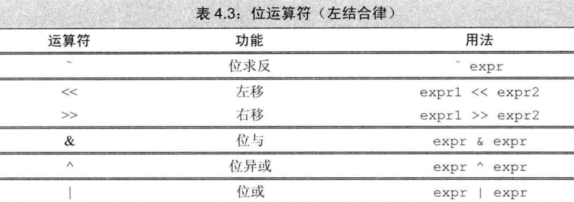

<< >>这两种运算符的内置含义是对运算对象执行基于二进制位的移动操作。

<<左移运算符 ：在右侧插入值为0的二进制位    
      >>右移运算符：依赖于左侧运算对象的类型

### 4.9 sizeof运算符
sizeof返回一个表达式或者一个类型名字所占的字节数，满足右结合律，所得值的类型是size_t的常量表达式。

### 4.10 逗号运算符
comma operator,含有两个运算对象，按照从左向右的顺序依次求值,左侧求值结果被丢弃，最终结果是右侧，如果右侧运算对象是右值，最终求值结果也是右值。
```
    int n = 1;
    int m = (++n, std::cout << "n = " << n << '\n', ++n, 2 * n);
    std::cout << "m = " << (++m, m) << '\n';
    n = 2
    m = 7
```
### 4.11 类型转换 
如果两种类型可以转换，那么他们就是关联的。

隐式转换：数组转换成指针

算数转换

显示转换

命名的强制类型转换：  
`cast-name<new type>(expression)`  
type是转换的目标类型，expression转换的值  
cast-name:static_cast、dynamic_cast、const_cast、reinterpret_cast

任何具有明确定义的类型转换，只要不包含底层const，都可以使用static_cast。

const_cast只能改变运算对象的底层const。  
头大看不懂了。
```
    char c ='a';
    const char *p = &c;
    *const_cast<char*>(p) = 'b';
    cout << c << endl;//b
```  
`*const_cast<char*>(p) = 'b';`将*p由const改为non const然后解引赋值为b
```
    const char c ='a';
    const char *pc = &c;
    char *p = const_cast<char*>(pc);//合法
    *p = 'b';//不合法，pc是const char *，产生UB
    cout << *pc;//b
    cout << c;//a
```  
一旦去掉const就可以修改对象的值，但是如果对象是const对象执行写操作会产生为定义的行为。


避免强制类型转换。

### 4.12 运算符优先级表
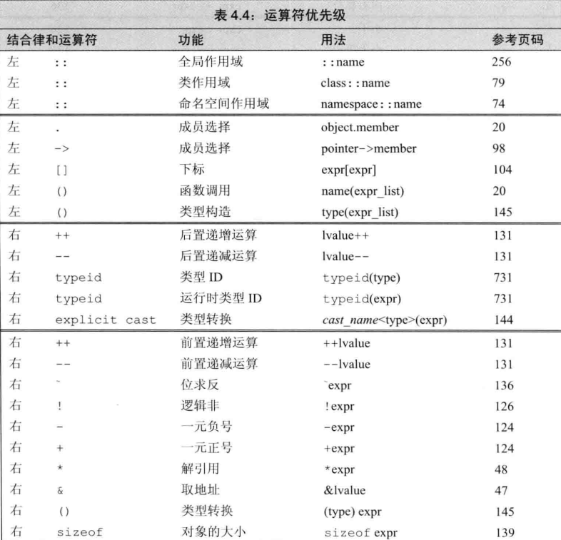
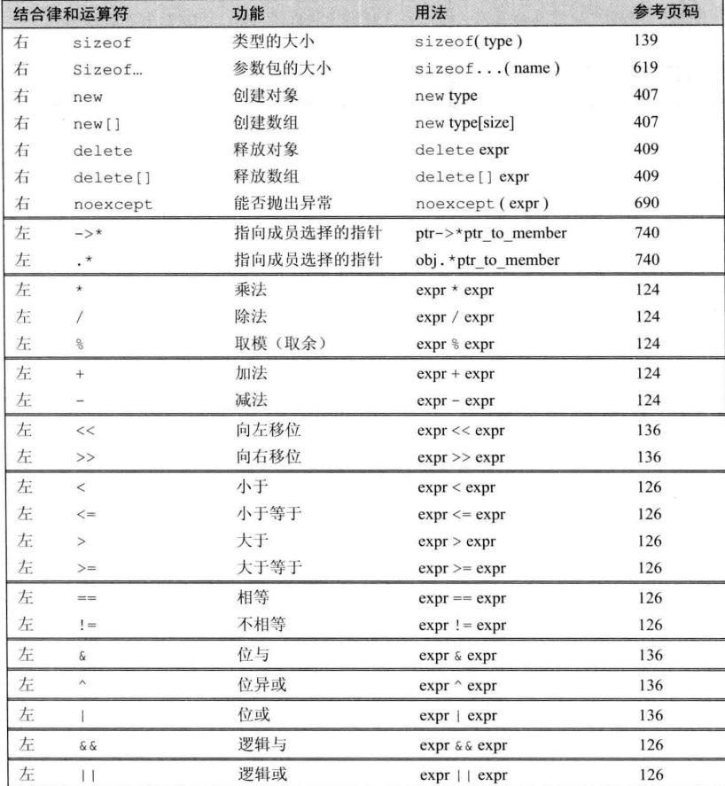
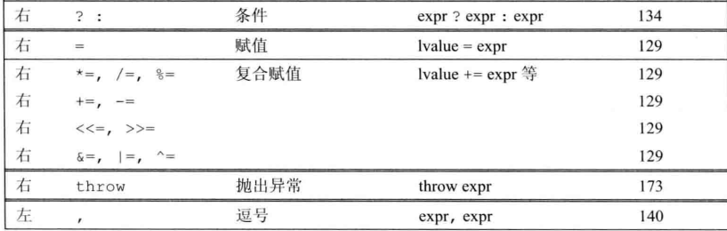


## 第五章 语句
### 5.1 简单语句
### 5.2 语句作用域
### 5.3 条件语句
if 根据条件决定控制流  
switch 计算整型表达式的值，根据值选择一条执行路径。  
首先对紧跟在switch后的括号里的表达式求值，该表达式可以是初始化的变量声明，表达式的值转为整型然后与case标签匹配， case标签必须是整型常量表达式。

如果某个case匹配成功，将从该标签开始往后执行所有的case分支，除非程序显式中断，直到switch结尾处。如果避免执行后续的case，必须显式告诉编译器。一般情况一个case一个break。

如果没有任何一个case标签可以匹配上，程序将执行default后面的语句。

如果要为case分支定义并初始化一个变量，我们应该把变量定义在块内，确保后面所有的case都在变量作用域之外。

### 5.4迭代语句
while  
for  
先检查条件再执行循环  
do while  
先执行循环再检查条件  

不确定迭代次数使用while比较合适，循环结束后访问循环变量使用while比较合适。

for迭代语句头的三个部分可以省略,分号必须保留，省略条件等于在条件部分写了一个true

C++ 11引入了更简单的范围for，可以遍历容器或者其他的序列所有的元素。

每次迭代都会重新定义循环控制变量，并将其初始化为序列的下一个值，之后再执行statement。

不能通过范围for语句增加vector对象，在范围for语句中预存了end()的值，一旦删除或增加元素，end函数的值就变得无效了。

do while 先执行语句或块后判断条件，不允许在条件部分定义变量,循环条件不能定义在do内部。

### 5.5 跳转语句
break  
continue   
goto  
return

continue终止最近循环的当前迭代立即开始下一次迭代，终止当前迭代但是继续执行循环，只有switch语句嵌套在迭代语句内部时，才能在switch里使用continue。

不要在程序中使用auto语句，它使得程序既难以理解又难以修改。

### 5.6 try语句块和异常处理
异常检测  
throw表达式引发异常，表达式的类型就是抛出的异常类型。  
异常处理  

程序本来要执行的任务出现在try语句块中，因为这段代码可能出现异常

## 第六章 函数 

### 6.1 函数基础

函数：返回值类型 函数名 形参列表 函数体

通过调用运算符执行函数，调用运算符是一对圆括号，作用于一个表达式，该表达式是函数或指向函数的指针，圆括号内是用逗号隔开的实参列表用来初始化形参列表。

实参是形参的初始值，数量一致，类型匹配。

void表示函数没有形参，形参用逗号分开，每个形参都有一个声明符。

局部对象

变量有作用域，对象有生命周期。只存在于块执行期间的对象称自动对象，形参是自动对象。局部静态对象初始化直到程序终止才销毁。
```
int a(void)
{
    static int sv = 0;
    return ++sv;
}

int main(int argc, char const *argv[])
{
    // int sum = add(100);
    // cout << "the sum of 100:" << sum <<endl; 
    for(int i=0;i!=10;++i)
        cout << a() << endl;
    return 0;
}
```
输出结果是1-10，如果`int sv = 0`输出结果是10个1

函数声明、函数定义

只能定义一次可以声明多次，区别是声明无需函数体，用一个分号代替即可，也可以么有形参列表。

函数应该在头文件声明源文件中定义，在头文件声明可以确保同一函数的所有声明一直。

C++支持分离式编译，把程序分割到几个文件中，每个文件独立编译。

### 6.2 参数传递
传值参数：  
拷贝形参将实参的值拷贝后赋值给形参，形参改变实参不受到影响。  
指针形参可以访问函数外部的对象。  

传引用参数：  
引用形参允许函数改变一个或多个实参的值。

C使用指针形参访问外部对象，C++使用引用形参代替指针

使用引用避免使用拷贝，如果无需改变引用形参的值，最好声明为常量引用。
```
string::size_type find_char(const string &s,char c,string::size_type &ocr)
{
    auto index = s.size();
    ocr = 0;
    for(decltype(index) i=0;i!=s.size();++i)
    {
        if(s[i] == c){
            if(index == s.size())
                index = i;
            ++ocr;
        }
    }
    return ocr;
}
int main(int argc, char const *argv[])
{
    string s;
    cin >> s;
    string::size_type ocr;
    string::size_type idx = find_char(s,'a',ocr);
    cout << "a ocr times in s:" << ocr << endl;
    cout << "a first index in s:" << idx << endl; 
    return 0;
}
```
当用实参初始化形参时，会忽略掉顶层的const，即当形参有顶层const是，传给它常量对象或者非常量对象都可以。

尽量使用常量引用形参，因为普通引用形参会误导函数调用者，也会极大的限制函数所能接受的实参类型，比如不能把const对象、字面值或者需要类型转换的对象传递给普通引用形参。

parameter形参  
argument实参  

数组形参  
数组两个特性：不允许拷贝，使用数组时会将其转换为指针。  
`void print(const int *)`

数组是以指针的形式 传递给函数的，调用者应该提供一些额外的信息，管理指针形参常见的三种方法：  
1、要求数组本身包含结束标记，例如C风格字符串数组，最后一个元素是空字符。  
2、传递数组首元素和尾后元素的指针  
3、专门定义一个表示数组大小的形参   

数组引用形参   
`void print(int (&arr)[10]);` ()必不可少

形参：由内向外看首先形参是一个引用其次是整型数组，所以形参是一个大小10整型数组引用。

有时需要给main传实参，第一个形参是argc:数组中字符串的数量，第二个形参argv:指向C字符串的指针数组。

可变形参函数：  
1、形参数量未知但类型相同：initializer_list是一种标准类型库
initializer_list是一种模板类型，定义时必须指明列表元素类型，且元素永远是常量值。如果想向initializer_list形参传递一个值序列，必须把序列放在一对花括号内。  、
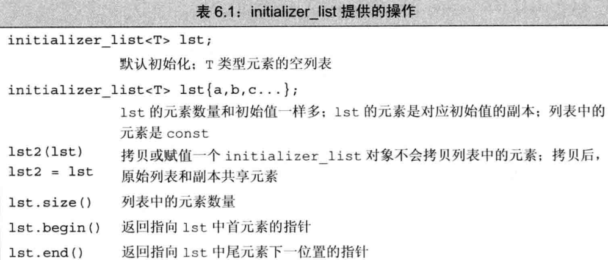

2、省略符形参：为了C++程序方便访问C代码设置的，只能出现在形参列表的最后一个位置`void foo(param list,...);`，对应的实参无需类型检查。

### 6.3 返回类型和return语句 
return语句终止当前函数，并将控制权返回

含有return语句的循环后面应该也有一条return语句否则就是错误的。

返回值用于初始化调用点的一个临时量，该临时量就是函数调用的结果。

函数终止意味着局部变量的引用指向不在有效的内存区域，不要返回局部对象的引用或者指针。

调用一个返回引用的函数得到左值，其他类型得到右值，可以为非常量引用赋值。

C++11规定函数可以返回花括号包围的值列表，如果返回内置类型，花括号最多包含一个值，如果返回类类型，由类本身定义初始值如何使用。

声明一个返回数组指针的函数：  
1、`int (*foo(int i))[10]{}`  
2、使用尾置返回类型，C++11，任何函数都可以使用但是返回值类型比较复杂函数最有效，跟在形参列表后并以->开头，原来的地方放置auto`auto foo(int i)->int(*)[10]`  
3、使用decltype  
4、类型别名

### 6.4 函数重载
同一作用域内函数名相同形参列表不同，称之为重载函数，编译器根据实参类型确定应该调用哪个。

一个拥有顶层const的形参无法和没有顶层const的形参区分开来。

如果形参是某种类型的引用或者指针，可以通过区分指向的是常量对象还是非常量对象实现函数的重载，此时const是底层的。

如果在内层作用域声明名字，它将隐藏外层作用域的同名实体。

C++的名字查找发生在类型检查之前。

### 6.5 特殊用途语言特性 
默认实参：既能接纳默认值，也能接受指定的值,一旦一个形参开始有了默认值后面的必须都有默认值  
`viod foo(int x=0, int y=1){}`  
函数调用时实参按其位置解析，尽量将不怎么使用默认值的形参放在列表前，让经常使用默认值的的形参放在列表后面。

多次声明同一个函数时需要注意，给定的作用域一个形参只能被赋予一次默认实参，后续只能为前面的没有默认实参的形参添加默认实参，并且该形参右侧形参必须都有默认实参。

局部变量不能作为默认实参。
```
int x=1,y=2;
void foo1(int x=1,y=2);
foo1();
void foo2()
{
    x = 3;
    int y = 4;
    foo1();//调用的是foo(x=3,y=2)
}
```
虽然foo2定义了y屏蔽了外部的，但是局部变量与传递给foo1的实参没任何关系。

内联函数可避免函数调用的开销:在调用点上内联地展开，在函数的返回值类型前加上inline即可声明函数为内联函数，内联机制用于优化规模较小、频繁调用的函数

constexpr函数：能用于常量表达式的函数。函数的返回类型形参类型都是字面值类型，而且函数必须有且只有一个return语句。允许返回值并非一个常量。

程序可以包含一些用于调试的代码，但是这些代码只能在开发程序时使用，当代码完成发布时，需要屏蔽掉这些代码，我们可以使用一下内容实现：

assert是一种预处理宏，就是预处理变量。assert宏使用一个表达式作为它的条件，assert(expr)表达式假输出信息并终止程序，表达是真什么也不做，常用于检查不能发生的条件。
```
    #include<cassert>
    int x  = 1, y = 2;
    assert(x>y);
    /*
    程序运行的结果：
                    Assertion failed!
                    Program: D:\code\cpp\C++primer_5th\chapter6\part6.2.exe
                    File: D:\code\cpp\C++primer_5th\chapter6\part6.2.cpp, Line 144
                    Expression: x>y
    */
```

NDEBUG 预处理变量  
assert的行为依赖于NDEBUG预处理变量的状态，如果定义了NDEBUG，assert什么也不做，默认状态没有定义NDEBUG，可以使用#define 定义NDEBUG 从而关闭调试状态。

预处理器定义的对调试有用的函数：
```
    cout << __func__ << endl;//存放函数名字的字符串字面值
    cout << __FILE__ << endl;//存放文件名字的字符串字面值
    cout << __LINE__ << endl;//存放当前行号的整型字面值
    cout << __DATE__ << endl;//存放文件编译日期的字符串字面值
    cout << __TIME__ << endl;//存放文件编译时间的字符串字面值
```

### 6.6 函数匹配
当重载函数的形参列表数量一致，某些形参的类型可以由其他类型转换的来，函数匹配。  
1、确定候选函数集  
2、确定可行函数集  
3、选取最佳函数

每个可行函数在各自的形参上都匹配，整体上无法判断哪个更好，编译器返回错误二义性调用。

编译器将实参到形参的转换划分为一下等级：  
1、精确匹配  
2、通过const转换实现匹配  
3、通过类型提升实现匹配  
4、通过算术类型转换或指针转换实现匹配：所有算术类型转换的级别都一样  
5、通过类类型转换实现匹配  

如果函数重载的区别在于引用类型的形参是否引用了const对象或者指针类型的形参是否指向了const对象，当调用发生时编译器通过实参是否为const对象选取函数。

`const char * 和 char * const`  
https://stackoverflow.com/questions/890535/what-is-the-difference-between-char-const-and-const-char  
定义的是指针，不要说指针的类型，指针就是指向对象，指向int类型的指针

### 6.7 函数指针
```
void f(){
    cout << __func__ << endl;
}
int main(int argc, char const *argv[])
{
    void (*p)() =f;
    cout << p << endl;
    (*p)();
    p();
    f();
}
```
函数指针指向函数而非对象，声明函数指针，只需将函数名改为指针加括号。`void (*p)()`  
把函数名当值使用时，函数自动转换成指针。`void (*p)() =f;`    
指向不同函数的指针不存在转换，可以为函数指针赋值0或者nullptr表示没有指向任何函数。  
可以直接使用函数指针调用函数，或者解引用，或者调用运算符。  
`(*p)();p();f();`输出都是函数名f

函数指针形参  
形参不能是函数但却可以是函数指针，直接把函数当做实参使用它会自动转换为指针，也可以显示的使用函数指针，但是都比较繁琐。  
`void foo(void (*p)())`  
`void foo(void pf())`  

类型别名和decltype可以简化：  
`typedef decltype(f) *ptr_f1;`  
`typedef void(*ptr_f2)();`  
`void foo(ptr_f1)`  
`void foo(ptr_f2)` 

返回函数指针的函数：  
```
void f(int x,int y)
{
    cout << __func__ << ':' << x+y << endl;
}

using F = void(int,int);
using FP  = void(*)(int,int);

FP rfp(int x)
{
    cout <<__func__ << ':' << x << endl;
    return f;
}

int main(int argc, char const *argv[])
{
    auto f = rfp(1);
    f(1,2);
    return 0;
}
```
尾置声明返回指针类型的函数：`auto rfp(int) -> void(*)(int,int){}`

## 第七章 类
类的基本思想是数据抽象和封装。  
数据抽象是依赖于接口和实现的分离的编程技术。  
类的接口包括类用户所能执行的操作。  
类的实现包括类的数据成员、负责接口实现的函数体以及定义类所需的各种私有函数。  
封装实现了类的接口和实现的分离，类要想实现封装，首先需要定义抽象数据类型，类的设计者负责考虑类的实现过程，类的使用者只需抽象地思考类型做了什么。
### 7.1 定义抽象数据类型
成员函数的声明必须在类的内部，它的定义即成员函数体可以在内部也可以在外部，接口的非成员函数定义和声明都在类外部。  
定义在类内部的函数是隐式的inline函数。

类实例化对象调用成员函数时，请求该函数的对象地址作为实参初始化隐式形参this，this是指向调用对象的指针，我们可以在成员函数的内部使用this，任何自定义名为this的参数或者变量都是违法的。

`std::string isbn() const { return this->bookNo; }`

默认情况下，this的类型是指向类类型非常量版本的常量指针，不能把this绑到一个常量对象上，this是普通的指针参数。

isbn是一个普通的函数，this是普通的指针参数，isbn不会改变对象，将this设置为指向常量对象的指针有助于提高函数的灵活性，常量对象或者常量对象的引用、指针只能调用常量成员函数。

由于this是隐式的并且不会出现在形参列表中，c++允许把const关键字放在成员函数形参列表后，表示this是指向常量的指针，这样的函数称为常量成员函数。  
`std::string isbn() const { return bookNo; }`

类本身就是作用域，类的成员函数的定义嵌套在类的作用域中。

编译器首先编译成员的声明，其次是成员函数体，因此成员函数体可以无视顺序使用其他的成员。

在类外部定义成员函数时，成员函数的定义必须与类内部的声明匹配，类外部定义的成员必须包含它所属的类名。  
`double sala_data::avg_price()const{}`

定义一个返回this对象的函数
```
Sales_data& Sales_data::combine(const Sales_data &rhs)
{
	units_sold += rhs.units_sold; // add the members of rhs into 
	revenue += rhs.revenue;       // the members of ``this'' object
	return *this; // return the object on which the function was called
}
```

值传递和引用传递：  
```
istream& read(istream& is,person& p)
{  
    return is >> p.name >>p.address;
}

ostream& print(ostream& os,person& p)
{
    return os << p.name << p.address;
}
```
当使用 read(istream& is, person p) 函数时，传递的是对象的副本，函数内部对 p 的修改不会影响原始对象。  
当使用 read(istream& is, person &p) 函数时，传递的是对象的引用，函数内部对 p 的修改会直接反映在原始对象上。

每个类都定义了它的对象被初始化的方式，类通过一个或几个构造函数初始化其对象。

构造函数与类名相同，没有返回值类型，不同的构造函数之间形参列表必须不一样，不能声明为const的。

如果类没有显式的定义构造函数，编译器会隐式的构造默认构造函数，默认初始化，如果存在类内的初始值用它初始化成员，否则默认初始化该成员。

对于一个普通的类来说，必须定义它的默认构造函数：  
1、只有类没有声明任何构造函数时，编译器才会自动地生成默认构造函数。  
2、如果块中的内置类型或者复合类型的对象被默认初始化，则它们的值将是未定义的，因此应该定义自己的默认构造函数。  
3、某些情况编译器不能为类合成默认构造函数。  
```
Sales_data() = default;
Sales_data(const std::string &s): bookNo(s) { }
Sales_data(const std::string &s, unsigned n, double p):bookNo(s), units_sold(n), revenu(p*n){}
```
=default,我们定义这个构造函数的目的就是我们需要其他形式的构造函数。  

冒号以及冒号和花括号之间的代码是构造函数初始值列表，为新创建的对象的数据成员赋值，每个名字后面的圆括号是成员初始值，当某个成员被构造函数初始值列表忽略时，它将与默认构造函数相同的方式隐式初始化。  

在类的外部定义构造函数，必须指明该构造函数是哪个类的成员
```
    person q;
    print(cout,q);
    person p("bg","vgshui");
    cout << endl;
    print(cout,p);
    cout << endl;
    person x(cin);
    print(cout,x);
```

除了定义类的对象如何初始化以外，类还需要控制拷贝、赋值、销毁时对象的行为。如果我们不主动定义，则编译器将替我们合成，将对对象每个成员执行拷贝、赋值、销毁操作。

### 7.2 访问控制与封装  
C++中使用访问说明符加强类的封装性，public、private。  
public：定义在其后的成员在整个程序内可以被访问，public定义类的接口  
private：定义在其后的成员可以被类的成员函数访问，但不能被使用该类的代码访问，private部分封装了类的实现细节。  

类可以在它的第一个访问说明符之前定义成员，对于这种成员的访问依赖于类的定义方式，如果使用struct定义类，此种成员是public的，如果使用class定义类，此种成员是private的。  

类允许其他类或者函数使用它的private成员，方法是将其他类或者函数成为该类的友元，即在该类内部函数声明语句前加关键字friend，友元只能在类内部位置不限，一般是在开始或结尾，友元不是类成员不受public、private限制。

友元的声明仅仅是访问权限，而非通常意义的函数声明，如果类的对象要调用某个友元，除了友元声明外必须专门对函数声明一次，为了使友元对类的用户可见，通常将友元的声明与类本身放置在同一个头文件。

### 7.3 类的其他特性  
类型成员：类可以自定义某种类型在类中的别名，存在访问限制，可以是public或private的一种，类型成员必须先定义后使用，通常出现类开始的地方
```
    typedef std::string::size_type pos;
    pos cursor = 0;
    pos height = 0, width = 0;
```

可变数据成员：mutable关键字可以修改类的某个数据成员，即使是在const函数内，可变数据成员永远不是是const的即使它是const对象的成员。

类数据成员的初始值，初始化类类型的成员，需要为该类的构造函数传递一个符合成员类型的实参，类内初始值必须用等号或者花括号。

隐式内联，定义在类内部的成员函数是自动inline的，同样可以，显式内联，在类内部把inline作为声明的一部分显示地声明成员函数，类外部使用inline关键字修饰函数的定义。

一个const成员函数如果以引用的方式返回*this，那么它的返回类型将是常量引用。

通过区分成员函数是否是const的，可以对其重载，非常量版本的函数对于常量对象是不可用的，所以常量对象只能调用const成员函数，虽然可在非常量对象上调用常量版本和非常量版本，但是非常量版本是更好的匹配。  

`class Screen myscreen`是合法的，从C语言继承。  
可以仅声明类而不定义它，这种声明叫前向声明，声明之后定义之前是不完全类型，此时使用场景非常有限，可以定义指向这种类型的指针或引用，可以作为函数的参数或返回值。

对于一个类创建对象前必须定义，否则编译器无法为对象开辟多大的空间为此对象。

一个类的名字一旦出现了，它就被认为是声明过了，因此可以包含指向它自身的指针或引用。

如果一个类指定了友元类，则该友元类可以访问此类所有的成员。友元关系不存在传递性，每个类控制自己的友元类或友元函数。  

当把成员函数声明友元时，必须明确指出该成员函数属于什么类。  
书上的文字很绕，这是gpt给的一个例子：
```
#include <iostream>

class B; // 前向声明，用于让类 A 知道类 B 的存在

class A {
private:
    int dataA;

public:
    A(int d) : dataA(d) {}

    void display() {
        std::cout << "Data in A: " << dataA << std::endl;
    }

    // 将类 B 声明为友元类
    friend class B;
};

class B {
private:
    int dataB;

public:
    B(int d) : dataB(d) {}

    void display() {
        std::cout << "Data in B: " << dataB << std::endl;
    }

    // 类 B 可以访问类 A 的私有成员
    void showDataFromA(A& a) {
        std::cout << "Data in A from B: " << a.dataA << std::endl;
    }
};

int main() {
    A objA(10);
    B objB(20);

    objA.display();
    objB.display();

    // 调用类 B 的成员函数，让类 B 访问类 A 的私有成员
    objB.showDataFromA(objA);

    return 0;
}
Data in A: 10       
Data in B: 20       
Data in A from B: 10
```

重载的函数是不同的函数，如果一个类想把一组重载的函数声明成它的友元，需要对每一个分别函数声明。

### 7.4 类的作用域  
一个类就是一个作用域，在类外部定义成员函数时必须提供类名和成员函数名。

名字查找：  
1、首先在名字所在的块中寻找声明语句，只考虑名字出现前的声明。  
2、如果没找到继续查找外层  
3、最后没找到匹配的则报错。  

编译器处理完类的全部声明后，才会处理成员函数的定义，所以成员函数可以访问类所有的名字。  

内层作用域可重新定义外层作用域的名字，然而在类中，如果成员使用了外层作用域中的某个名字，而且改名字代表一种类型，则类不能之后重新定义该名字。  

### 7.5 构造函数再谈  
构造函数初始值列表：如果成员是const、引用或者属于某种未提供默认构造函数的类类型，我们必须通过构造函数初始值列表为这些成员提供初始值。  

初始化和赋值存在一些区别，建议养成使用构造函数初始值列表的习惯，避免意料之外的编译错误。  

成员初始化的顺序：构造函数初始值列表成员的位置不会影响实际初始化顺序，实际初始化顺序是成员声明顺序，初始化顺序在这种情况很重要，如果一个成员被用来初始化另一个成员。  
```
class foo{
private:
    int x;
    int y;
public:
    foo(int a):y(a),x(y){};
}
```
上面代码使用未定义的y初始化x!  

最好使用构造函数的参数作为成员的初始值，尽量避免使用同一对象的成员初始化另一个成员，这样可以不必考虑成员的初始化顺序。  

默认实参和构造函数：  
默认实参（Default Arguments）是指在定义函数时为参数提供默认值，如果一个函数为所有的参数都提供了默认实参，则它实际上也定义了默认构造函数。  

委托构造函数：一个委托构造函数使用它所属类的其他构造函数执行它自己的初始化过程，就是把自己的职责委托给其他的构造函数。
```
    Sale_data(const string &s, unsigned n, double p): bookNo(s),units_sold(n),revenue(p) 
    {
        cout << "constructor initialize bookno" << endl;
        cout << bookNo << ' ' << units_sold << ' ' << revenue << endl;
    }

    Sale_data():Sale_data("",0,0.0f)
    {
        cout << "Sale_data()" << endl;
    }

    Sale_data(const string &s):Sale_data(s,0,0.0f)
    {
        cout << "Sale_data(string &s)" << endl;
    }

    string s = "fghj";
    Sale_data item(s);

    constructor initialize bookno
    fghj 0 0
    Sale_data(string &s)
```

前面的是委托者后面是被委托者，一个构造函数委托给另一个构造函数时，受委托的构造函数的初始值列表和函数体依次被执行，然后控制权才交给委托者的函数体。

在实际中，如果定义了其他的构造函数，那么最好也提供一个默认构造函数。

如果想定义一个使用默认构造函数进行初始化的对象，正确方法是去掉对象后的圆括号：
```
    Sale_data item2();//定义的是函数而不是对象
    cout << item2.units_sold << endl;//报错，不能对函数调用成员
    Sale_data item3;//定义的是对象而不是函数
    cout << item3.revenue << endl;//正确，能调用对象成员
```
隐式类类型转换：能通过一个实参调用的构造函数定义了一条从构造函数的参数类型向类类型转换的规则。 
```
    string null_book = "999-9999-999";
    Sale_data item;
    item.combine(null_book);
```
sting实参null_book调用了Sale_data的combine成员，编译器用给定string自动创建了一个Sale_data对象，新生成的临时对象被传递给combine，因为combine的参数是一个常量引用，所以我们可以给该参数传递一个临时量。

编译器只允许一步类类型转换：  
```
    Sale_data item;
    item.combine("999-9999-999");
```
经历了"999-9999-999"转换为string，string转换成Sale_data，编译器报错。  

explicit抑制构造函数定义的隐式转换，只对一个实参的构造函数有效，只能在类内声明构造函数时使用，在类外部定义构造函数时不应重复，需要多个实参的构造函数不能用于执行隐式转换，因此不需要explicit，

在直接初始化中，即显式地调用构造函数：使用圆括号（）来将初始化的参数传递给构造函数,explicit构造函数只能用于直接初始化，发生隐式转换的一种情况是拷贝初始化时，此时我们只能使用直接初始化不能使用explicit构造函数。  

为了转换我们显式得使用构造函数  
`item.combine(string("999-9999-999"))`    
`item.combine(Sale_data("999-9999-999"))`  
`item.combine(static_cast<Sale_data>("999-9999-999"))`

标准库含有显式构造函数的类：  
接受一个容量参数的vector构造函数是explicit的。  
原因：  
`std::vector<int> myVector = 5; // 隐式转换，将整数5转换为std::vector<int>`  
如果 std::vector 的单参数构造函数没有被声明为 explicit，编译器会将整数5隐式地转换为一个只包含一个元素5的 std::vector<int> 对象。这可能会引起意想不到的问题，尤其是当我们本意是要直接初始化一个 std::vector 而不是使用隐式转换。  
`std::vector<int> myVector = std::vector<int>(5); // 显式调用构造函数`   
由于构造函数被声明为 explicit，我们必须显式地调用构造函数来创建 std::vector 对象

聚合类使得用户可以直接访问其成员，并且有特殊的初始化语法形式，当一个类满足一下条件时，则是聚合的：   
1、所有的成员都是public的  
2、没定义任何构造函数  
3、没有类内初始值  
4、没有基类也没有virtual函数  

一个花括号括起来的成员初始值列表，用它初始化聚合类的成员，初始值顺序必须与声明顺序一致，初始值列表元素个数小于等于聚合类成员个数，小于时靠后的成员被值初始化。

成员都是字面值类型的聚合类是字面值常量类。  
或  
1、数据成员必须都是字面值类型    
2、类必须至少有一个constexpr构造函数  
3、如果一个成员含有类内初始值，则内置类型成员的初始值必须是一条常量表达式，或者该成员属于某类类型，则初始值必须使用自己的constexpr构造函数。  
4、类必须使用析构函数的默认定义，该成员负责销毁类的对象。
```
class LiteralConstant {
public:
    constexpr LiteralConstant(int value) : data(value) {}

    constexpr int getValue() const {
        return data;
    }

private:
    int data;
};
```

constexpr构造函数可以声明成=default，否则一般来说constexpr函数体应该是空的，必须初始化所有的成员。

### 7.6 类的静态成员  
在成员的声明之前加上关键字static使得与类关联在一起，类的静态成员存在于任何对象之外，对象中不包含任何与静态成员有关的数据。

静态成员函数不与任何的对象绑定在一起，不包含this指针，不能声明成const的。

使用类的静态成员：  
1、作用域运算符`double r = Account::rate();`     
2、类的对象、指针、引用访问静态成员  
3、成员函数可以不通过作用域运算符可以直接访问静态成员  

既可以在类的内部定义也可以在类的外部定义静态成员函数。  
当在类的外部定义静态成员时，不能重复static关键字，该关键字只出现在类内部的声明语句。  

静态成员不是由构造函数初始化的，一般不在类的内部初始化静态成员，相反必须在类的外部定义并初始化静态成员，一个静态成员只能定义一次，一旦被定义就将存在于程序的整个生命周期。

类的静态成员不应该在类的内部初始化，然而，我们可以为静态成员提供const整数类型的类内初始值，要求静态成员必须是字面值常量类型的constexpr。  
`constexpr static double rate = 0.5;`  

即使一个常量静态成员在类内被初始化了，通常情况也需要在类外部定义一下该成员。
`constexpr double Sale_data::rate;`  

静态成员可以是不完全类型，静态成员类型可以是它所属的类型，非静态成员只能声明成它所属类的指针或者引用。
```
    static Sale_data mem0;//静态成员可以是不完全类型
    Sale_data *mem1;//非静态成员能声明成它所属类的指针
    Sale_data mem2;//数据成员必须是完全类型
    报错：
    definition of 'class Sale_data' is not complete until the closing brace
 class Sale_data
```

静态成员可以作为默认实参，非静态成员不能，因为它的值本属于对象的一部分。


## 第II部分 C++标准库

## 第8章 IO库

istream（输入流）类型，提供输入操作。  
ostream(输出流）类型，提供输出操作。  
cin，一个istream对象，从标准输入读取数据。  
cout，一个ostream对象，向标准输出写入数据。  
cerr，一个ostream对象，通常用于输出程序错误消息，写入到标准错误。  
">>运算符，用来从一个istream对象读取输入数据。  
"<<运算符，用来向一个ostream对象写入输出数据。  
getline函数（参见3.3.2节，第78页)，从一个给定的istream读取一行数据，存入一个给定的string对象中。  


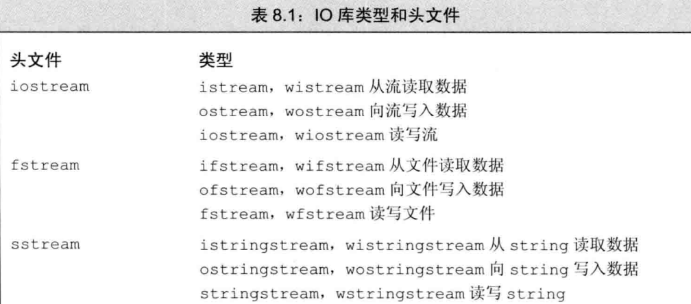
宽字符版本的类型和函数的名字以w开头，宽字符版本的类型和对象与其对应的普通char版本的类型定义在同一个文件。

标准库使用继承机制，使我们可以忽略不同类型流之间的差异，通常可以将一个派生类的对象当做其基类来使用。  

不能拷贝和对io对象赋值,进行io操作的函数通常以引用方式传递和返回流，读写一个io对象会改变状态，因此传递和返回的引用不是const的。  

io类所定义的一些函数和标志，可以帮助我们访问和操纵流的条件状态。  
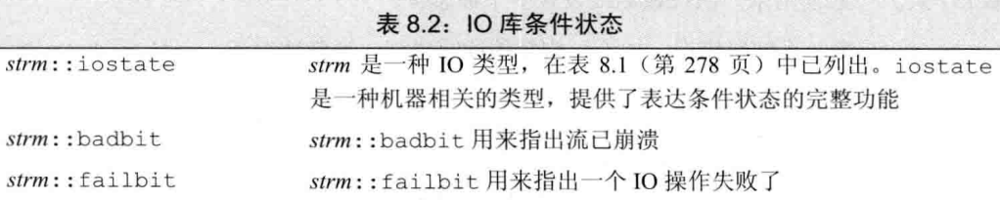
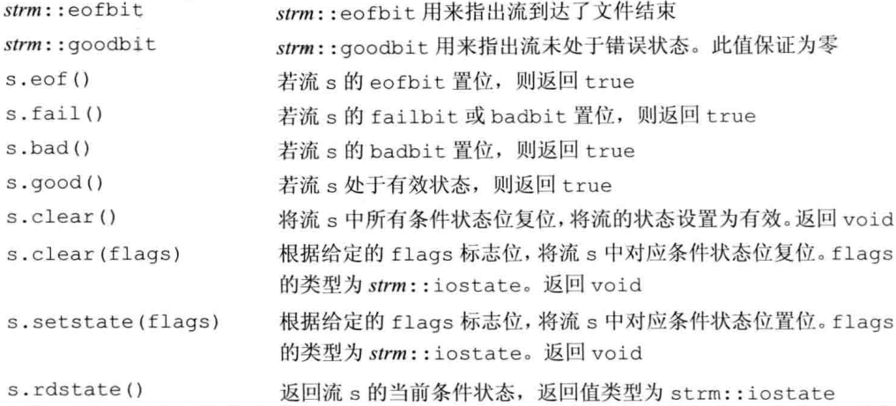

一个流一旦发生错误，其上后续的IO操作都会失败。只有当一个流处于无错状态时我们才可以从它读取数据，向它写入数据。由于流可能处于错误状态，因此代码通常应在使用一个流之前检查它是否处于良好状态。确定一个流对象的状态的最简单的方法是将它当作一个条件来使用:
`while(cin >> val){}`

查询流状态：  
io库定义了一个与机器无关的iostate类型，它提供了表达流状态的完整功能。  

badbit表示系统级错误，一旦 badbit 被置位，流就无法再使用了。  
在发生可恢复错误后，failbit_被置位，如期望读取数值却读出一个字符等错误。这种问题通常是可以修正的，流还可以继续使用。   
如果到达文件结束位置，eofbit和 failbit 都会被置位。  
goodbit的值为0，表示流未发生错误。  
如果badbit、failbit和eofbit任一个被置位，则检测流状态的条件会失败。

```
void stream_state(istream &is)
{
    if(is.bad())
        cout << "cin bad!" << endl;
    else if(is.fail())
        cout << "cin fail" << endl;
    else if(is.eof())
        cout << "cin eof" << endl;
    else
        cout << "cin good" << endl;
}

    stream_state(cin);//cin good
    cin.setstate(istream::badbit);
    stream_state(cin);//cin bad
    cin.clear();
    stream_state(cin);//cin good
    cin.setstate(istream::badbit | istream::failbit | istream::eofbit);
    stream_state(cin);//cin bad! cin fail cin eof
    cin.clear(istream::badbit);
    stream_state(cin);

    istream::iostate old_state = cin.rdstate();
    cin.setstate(old_state);
```

管理条件状态：   
流对象rdstate成员返回一个iostate值，对应流的当前状态。  
setstate将给定条件位置位，表示发生了对应的错误。  
clear不接受参数的版本清除（复位）所有错误标志位，使用clear()后调用good()返回true

```
具有一定容错的：
void sum(istream &is)
{
    int n;
    int sum = 0;
    while(is >> n,!is.eof())
    {
        if(is.bad())
            throw runtime_error("io bad");
        else if (is.fail())
        {
            cerr << "wrong input!again!" << endl;
            is.clear();
            is.ignore(100,'\n');
            continue;
        }
        else
            sum += n;
        cout << "sum:" << sum << endl;
        
    }
}
```

管理输出缓冲：  
每个输出流都管理一个缓冲区，用来保存程序读写的数据。可能立即打印出来，也可能被操作系统保存在缓冲区中，随后再打印。有了缓冲机制，操作系统就可以将程序的多个输出操作组合成单一的系统级写操作。

导致缓冲刷新（即，数据真正写到输出设备或文件）的原因有很多:  
1、程序正常结束，作为main函数的return操作的一部分，缓冲刷新被执行。  
2、缓冲区满时，需要刷新缓冲，而后新的数据才能继续写入缓冲区。  
3、使用操纵符如endl来显式刷新缓冲区。  
4、在每个输出操作之后，我们可以用操纵符unitbuf设置流的内部状态，来清空缓冲区。默认情况下，对cerr是设置unitbuf的，因此写到cerr的内容都是立即刷新的。  
5、一个输出流可能被关联到另一个流。在这种情况下，当读写被关联的流时，关联到的流的缓冲区会被刷新。例如，默认情况下，cin和 cerr都关联到cout。因此，读cin或写cerr都会导致cout的缓冲区被刷新。

```
    // writes hi and a newline, then flushes the buffer
    cout << "hi!" << endl;  

	// writes hi, then flushes the buffer; adds no data
    cout << "hi!" << flush; 

	// writes hi and a null, then flushes the buffer
    cout << "hi!" << ends;  

    cout << unitbuf;         // all writes will be flushed immediately

	// any output is flushed immediately, no buffering
    cout << "first" << " second" << endl;

	cout << nounitbuf;       // returns to normal buffering
```

flush刷新缓冲区但是不输出任何字符，ends向缓冲区插入一个空字符，然后刷新缓冲区。  

在每次输出操作后都刷新缓冲区，使用unitbuf操纵符在接下来的每次写操作之后都进行一次flush 操作。  
nounitbuf操纵符则重置流使其恢复使用正常的系统管理的缓冲区刷新机制。

如果程序崩溃输出，输出缓冲区不会被刷新，输出数据被挂起没有打印。

当一个输入流被关联到一个输出流时，任何试图从输入流读取数据的操作都会先刷新关联的输出流。标准库将cout 和 cin关联在一起。每个流只能同时关联到一个流，多个流可以同时关联到一个ostream。  

tie():  
不带参数，返回指向输出流的指针，如果本对象当前关联到一个输出流，则返回的就是指向这个流的指针，如果对象未关联到流，则返回空指针。  
接受一个指向ostream的指针，将自己关联到此ostream。即，x.tie (&o)将流×关联到输出流o.

### 8.2 文件输入输出 
头文件 fstream定义了三个类型来支持文件IO:  
ifstream从一个给定文件读取数据  
ofstream向一个给定文件写入数据  
fstream可以读写给定文件  
fstream继承自iostream类型，与我们之前已经使用过的对象cin和 cout的操作一样，可以用IO运算符（<<和>>）来读写文件，可以用getline从一个ifstream读取数据。

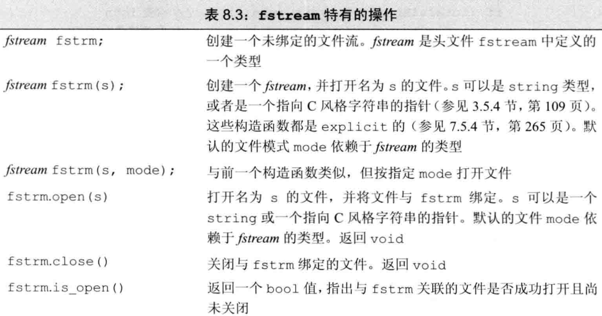

使用文件流对象：  
当我们想要读写一个文件时，可以定义一个文件流对象，并将对象与文件关联起来。每个文件流类都定义了一个名为open的成员函数，它完成一些系统相关的操作，来定给定的文件，并视情况打开为读或写模式。  
创建文件流对象时，我们可以提供文件名(可选的)。如果提供了一个文件名,则ope会自动被调用  
在新C+标准中，文件名既可以是库类型string对象，也可以是C风格字符数组  

```
    string ifile{"example.txt"};
    //构造一个ifstream并打开给定文件
    // ifstream infile("example.txt");
    ifstream infile(ifile);
    //输出文件流未关联到任何文件
    ofstream outfile;
    string s;
    infile >> s;
    cout << s;
```

用fstream 代替iostream&：  
使用基类型对象的地方，可以用继承类型的对象来替代。接受一个 iostream类型引用（或指针）参数的数，可以用一个对应的fstream(或sstream)类型来调用。如果有一个函数接受一个ostream&参数，可以传递给它一个 ofstream对象，对istream&和ifstream也是类似的。


```
    ifstream input("infile.txt");//打开销售记录文件
    
    ofstream output("outfile.txt");//打开输出文件
    
    Sales_data total;//保存销售总额的变量
    
    if (read(input, total)) 
    {
        //读取第一条销售记录
        Sales_data trans;
        //保存下一条销售记录的变量
        while(read (input, trans))
        {
            //读取剩余记录
            if (total.isbn ( ) == trans.isbn() ) //检查isbn
                 total.combine (trans); //更新销售总额
            else 
            {
                print (output, total) <<endl;//原例子传入ostream是打印结果，现在传入ofstream是将数据total写入文件outfile.txt
                total = trans;//处理下一本书
            }
        }
        print (output, total) <<endl;//原例子传入ostream是打印最后一本书的销售额，现在传入ofstream是将最后一个数据total写入文件outfile.txt
    } 
    else
        cerr <<"No data? !" <<endl;//文件中无输入数据
```

成员函数open和close：  
如果我们定义了空文件流对象，随后可以调用open将它与文件关联起来，如里调用opon生败.failbit会被置位进行open是否成功的检测通常是一个好习惯。  

一旦一个文件流已经打开，它就保持与对应文件的关联。实际上，对一个已经打开的文件流调用open 会失败，并会导致failbit被置位。随后的试图使用文件流的操作都会失败。为了将文件流关联到另外一个文件，必须首先关闭已经关联的文件。一旦文件成功关闭，我们可以打开新的文件。

```
    string file{"example.txt"};
    ofstream out;
    out.open(file);
    if(out)
        out << "file";
    out.close();
    out.open("cc.txt");
    if(out)
        out << "cpp" ;
    out.open(file+".copy");
```

当一个fstream对象离开其作用域时即被销毁，与之关联的文件会自动关闭即自动调用close。

每个流都有关联的文件模式，用来指定如何使用文件：  


只可以对ofstream或fstream对象设定out模式。  
只可以对ifstream或fstream对象设定in模式。  
只有当out也被设定时才可设定trunc模式。  
只要trunc没被设定，就可以设定app模式。在 app模式下，即使没有显式指定out模式，立件也总是以输出方式被打开。    
默认情况下，即使我们没有指定trunc，以out模式打开的文件也会被截断。为了保留以out模式打开的文件的内容，我们必须同时指定app模式，这样只会将数据追加写到文件末尾;或者同时指定in模式,即打开文件同时进行读写操作。  
ate和 binary模式可用于任何类型的文件流对象,且可以与其他任何文件模式组合使用。

每个文件流类型都定义了一个默认的文件模式，当我们未指定文件模式时，就使用此默认模式。  
与ifstream关联的文件默认以in模式打开;  
与ofstream关联的文件默认以out模式打开;  
与fstream关联的文件默认以in和 out模式打开。

```
    ofstream out("example.txt");
    ofstream out("example.txt",ofstream::out);
    ofstream out("example.txt",ofstream::out | ofstream::trunc);
    ofstream out("example.txt",ofstream::app);
    ofstream out("example.txt",ofstream::out | ofstream::app);
```

以out模式打开文件会丢弃已有数据,默认情况下，当我们打开一个 ofstream时，文件的内容会被丢弃,阻止一个ofstream清空给定文件内容的方法是同时指定app模式。  


对于一个给定流，每次调用open时，都会确定文件模式，都可以改变其文件模式。
```
ofstream out; //未指定文件打开模式
out. open ( "scratchpad" );//模式隐含设置为输出和截断   
out.close() ; //关闭out，以便我们将其用于其他文件
out.open ( "precious", ofstream: :app); //模式为输出和追加  
out.close () ;
```
通常情况下. out模式意味着同时使用trunc模式。  
在每次调用open时，都要设置文件模式,可能是显式地设置，也可能是隐式地设置。当程序未指定模式时,就使用默认值。  

### 8.3 string流  
istringstream 从 string读取数据  
ostringstream向string 写入数据  
头文件 stringstream既可从string读数据也可向string写数据  
与fstream类型类似，头文件sstream中定义的类型都继承自iostream头文件


`istringstream iss(p)`  
将流iss绑定到p

当我们希望逐步构造输出，最后一起打印ostringstream很有用。
```
    ostringstream oss;
    for(auto p:vs)
        oss << p << ",";    
    cout << oss.str();

    彭飞鸿 16637458637 19112335625,X 123 ,Y 456 789 000,
```
## 第9章 顺序容器
一个容器就是一些特定类型对象的集合。顺序容器( sequential container)为程序员提供了控制元素存储和访问顺序的能力。

### 9.1 顺序容器概述  


string和 vector将元素保存在连续的内存空间中。由元素的下标来计算其地址是非常快速的。但在一次插入或删除操作后，需要移动插入/删除位置之后的所有元素,来保持连续存储。可能还需要分配额外的存储空间。  

list和 forward_list两个容器的设计目的是令容器任何位詈的添加和删除操作都很快速。不支持元素的随机访问:为了访问一个元素，我们只能遍历整个容器。额外内存开销也很大。

deque是一个更为复杂的数据结构。与string和 vector类似，deaue支持快速。

forward list和array是新C++标准增加的类型。与内置数组相比，array 是种更安全、更容易使用的数组类型。

现代程序应该使用标准库容器而不是更原始的数据结构，通常使用 vector是最好的选择除非你有很好的理由选择其他容器。

选择容器的基本原则: 
·除非你有很好的理由选择其他容器，否则应使用vector。

如果你的程序有很多小的元素，且空间的额外开销很重要，则不要使用list或forward_list。

如果程序要求随机访问元素，应使用vector或deque。

如果程序要求在容器的中间插入或删除元素，应使用list或forward_list。如果程序需要在头尾位置插入或删除元素，但不会在中间位置进行插入或删除操作，则使用deque。

·如果程序只有在读取输入时才需要在容器中间位置插入元素，随后需要随机访问元素，则：  
首先，确定是否真的需要在容器中间位置添加元素。当处理输入数据时，通常可以很容易地向 vector追加数据，然后再调用标准库的sort函数来重排容器中的元素，从而避免在中间位置添加元素。  
如果必须在中间位置插入元素，考虑在输入阶段使用list，一旦输入完成，将list中的内容拷贝到一个vector 中。

如果程序既需要随机访问元素，又需要在容器中间位置插入元素，那该怎么办?答案取决于在list或forward_list 中访问元素与vector或deque 中插入/删除元素的相对性能。一般来说，应用中占主导地位的操作(执行的访问操作更多还是插入/删除更多)决定了容器类型的选择。在此情况下，对两种容器分别测试应用的性能可能就是必要的了。  

如果你不确定应该使用哪种容器，那么可以在程序中只使用vector和list公共的操作:使用迭代器，不使用下标操作，避免随机访问。这样,在必要时选择使用vector或list都很方便。

### 9.2 容器库概览 
本节介绍所有容器都适用的操作：  

一般来说，每个容器都定义在一个头文件中，文件名与类型名相同。容器均定义为模板类，必须提供额外信息来生成特定的容器类型，有可能还需要额外提供元素类型信息。
```
    list<Sale_data> l;
    deque<double> d;
```
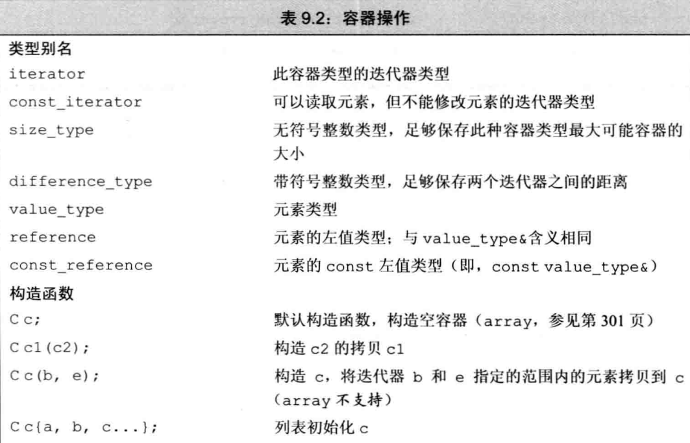
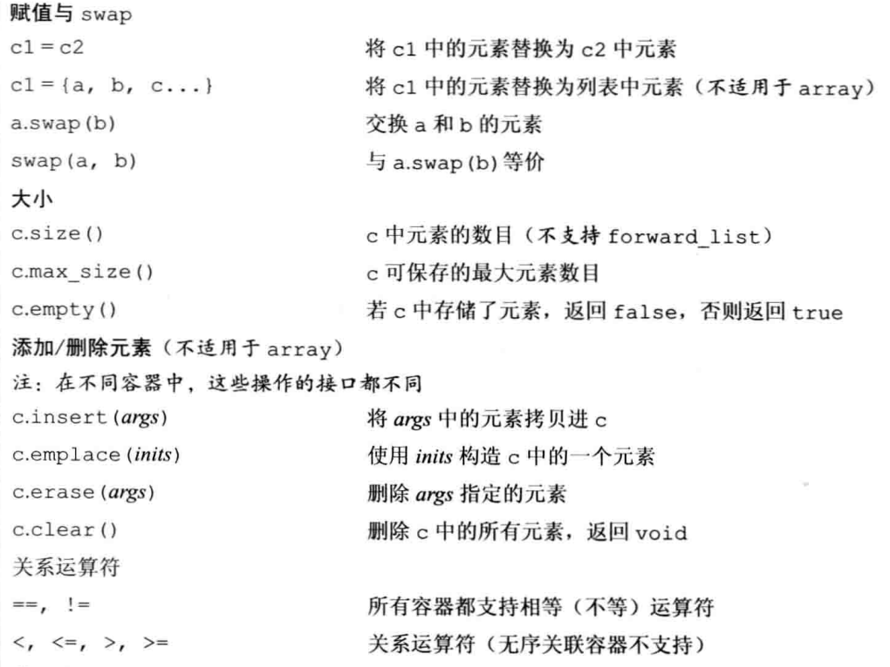
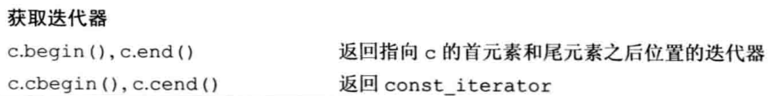
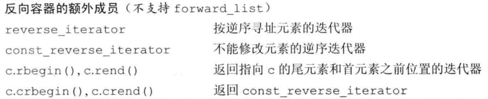

如果一个迭代器提供某种操作，那么所有提供相同操作的迭代器对这个操作的实现方式都是一样的，

一个迭代器范围由一对迭代器表示，两个迭代器分别指向同一个容器中的元素或者是尾元素之后的位置。这两个迭代器通常被称为begin和end，或者是 first和last，它们标记了容器中元素的一个范围。

迭代器范围中的元素包含first所表示的元素以及从first开始直至last(但不包含last)之间的所有元素。被称为左闭合区间，表示范围自begin开始，于end之前结束。

迭代器begin和end必须指向相同的容器。end可以与begin指向相同的位置，但不能指向begin之前的位置。

容器类型成员：  
大多数容器提供反向迭代器，是一种反向遍历容器的迭代器，与正向相比，各种操作的含义发生了颠倒。

```
    list<string>::iterator iter;
    vector<int>::difference_type count;
    vector<int>::size_type;
    list<string>::const_iterator; // to read
    list<string>::iterator; // to write
```

begin()、end()：  
```
    list<string> a = { "Milton","Shakespeare", "Austen"};
    auto it1 = a.begin();//list<string> : :iterator
    auto it2 = a.rbegin (); // list<string> : :reverse_iterator
    auto it3 = a.cbegin (); // list<string> : :const_iterator
    auto it4 = a.crbegin();// list<string> : :const_reverse_iterator
```

不以c开头的函数都是被重载过的。当我们对一个非常量对象调用这些成员时，得到的是返回 iterator 的版本。只有在对一个const对象调用这些函数时，才会得到一个const版本。  
与const 指针和引用类似，可以将一个普通的iterator转换为对应的const iterator，但反之不行。

以c开头的版本是C++新标准引入的，为了支持auto和begin()、end()结合使用(获得的迭代器的类型依赖于容器类型，但是以c开头的版本可以获得const——iterator,不管容器类型是什么),过去只能显式声明希望使用的类型。
```
    auto it1 = a.begin();//list<string> : :iterator
    list<string>::iterator it2 = a.begin();//list<string> : :iterator
```

每个容器类型都定义了一个默认构造函数。除array之外，其他容器的默认构造函数都会创建一个指定类型的空容器，且都可以接受指定容器大小和元素初始值的参数。

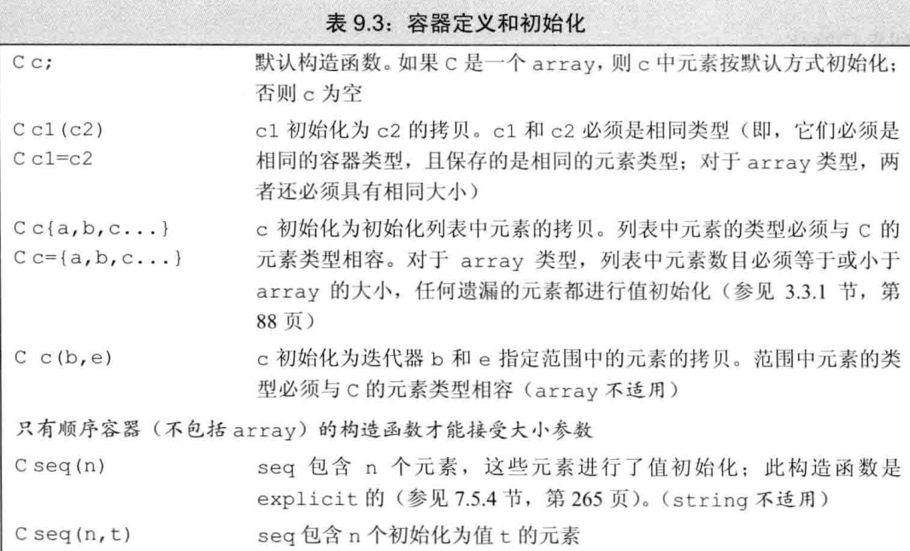

将一个新容器创建为另一个容器的拷贝的方法有两种:可以直接拷贝整个容器，或者(array除外)拷贝由一个迭代器对指定的元素范围。

为了创建一个容器为另一个容器的拷贝，两个容器的类型及其元素类型必须匹配。不过，当传递迭代器参数来拷贝一个范围时，就不要求容器类型是相同的了。而且，新容器和原容器中的元素类型也可以不同、只要能将要拷贝的元素转换为要初始化的容器的元素类型即可。  

```
    list<string> authors = {"Milton", "Shakespeare", "Austen"};
    vector<const char*> articles = {"a", "an", "the" };
    list<string> list2 (authors) ;//正确:类型匹配
    //deque<string> authList(authors); //错误:容器类型不匹配
    //vector<string> words (articles); //错误:容器类型必须匹配
    //正确:可以将const char*元素转换为string
    forward_list<string> words (articles.begin(), articles.end () );
```

除了与关联容器相同的构造函数外,顺序容器(arrav除外)还提供另一个构造函数，它接受一个容器大小和一个(可选的)元素初始值。如果我们不提供元素初始值，则标准库会创建一个值初始化器:  

```
    vector<int> ivec (10,-1) ;// 10个int元素，每个都初始化为-1
    list<string> svec (10,"hi ! ");//10个strings;每个都初始化为"hi
    forward_list<int> ivec (10) ;// 10个元素，每个都初始化为0
    deque<string> svec (10) ;// 10个元素，每个都是空string
```

如果元素类型是内置类型或者是具有默认构造函数的类类型，可以只为构造函数提做一个容器大小参数。如果元素类型没有默认构造函数，除了大小参数外，还必须指定一个显式的元素初始值。  
只有顺序容器的构造函数才接受大小参数关联容器并不支持。

与内置数组一样，标准库array的大小也是类型的一部分。当定义一个array时除了指定元素类型，还要指定容器大小:  
```
    array<int, 42> x;
    //类型为:保存42个int的数组
    array<string, 10> y;
    //类型为:保存10个string的数组
```
为了使用array类型，我们必须同时指定元素类型和大小:  
```
array<int, 10>: :size_type i;
//数组类型包括元素类型和大小
array<int>: :size_type j;
//错误:array<int>不是一个类型
```
大小是array类型的一部分，array不支持普通的容器构诰函数，因为这些构造函数都会确定容器的大小，要么隐式地，要么显式地。而允许用户向一个array构造函数传递大小参数,最好情况下也是多余的,而且容易出错，所以array不支持普通的容器构诰函数。

一个默认构造的array是非空的:它包含了与其大小一样多的元素。这些元素都被默认初始化。如果我们对array进行列表初始化，初始值的数目必须等于或小于array的大小。如果初始值数目小于array的大小，则它们被用来初始化array中靠前的元素，所有剩余元素都会进行值初始化。在这两种情况下，如果元素类型是一个类类型，那么该类必须有一个默认构造函数，以使值初始化能够进行:  
```
    array<int,10> ial;
    //10个默认初始化的int
    array<int,10> ia2 = {0,1,2,3,4,5,6,7,8,9};
    //列表初始化
    array<int,10> ia3 = {42}; 
    //ia3 [0]为42，剩余元素为0
```
值得注意的是，虽然我们不能对内置数组类型进行拷贝或对象赋值操作，但 array并无此限制:  
```
    int digs [10]= {0,1,2,3,4,5,6,7,8,9};int cpy [10]= digs;
    //错误:内置数组不支持拷贝或赋值
    array<int,10> digits = {0,1,2,3,4,5,6,7,8,9};
    array<int,10> copy = digits;
    //正确:只要数组类型匹配即合法
```
array也要求初始值的类型必须与要创建的容器类型相同。此外array还要求元素类型和大小也都一样，因为大小是array类型的一部分。

赋值和swap:

赋值运算符将其左边容器中的全部元素替换为右边容器中元素的拷贝:  
```
c1 =c2;
//将c1的内容替换为c2中元素的拷贝
c1{ a ,b,c};
//赋值后,c1大小为3
```
第一个赋值运算后，左边容器将与右边容器相等。如果两个容器原来大小不同，赋值运算后两者的大小都与右边容器的原大小相同。第二个赋值运算后，c1的size变为3，即花括号列表中值的数目。  
```
array<int, 10> al = {0,1,2,3,4,5,6,7,8,9};
array<int, 10> a2 = {0}; //所有元素值均为0
al = a2;//替换a1中的元素
a2 = {0}; //错误:不能将一个花括号列表赋予数组
```
由于右边运算对象的大小可能与左边运算对象的大小不同，因此array类型不支持assign,也不允许用花括号包围的值列表进行赋值。

```
    list<string> names;
    vector<const char*> oldstyle;
    // names = oldstyle;
    names.assign(oldstyle.cbegin(),oldstyle.cend());
    names.assign(2,"hu");
```

swap操作交换两个相同类型容器的内容。调用swap之后，两个容器中的元素将会交换:  
```
vector<string> svec1 (10);// 10个元素的vector
vector<string> svec2 (24);// 24个元素的vector
swap(svec1,svec2 ) ;
```
交换两个容器内容的操作保证会很快—--元素本身并未交换，swap只是交换了两个容器的内部数据结构。

除array外,swap 不对任何元素进行拷贝、删除或插入操作，因此可以保证在常数时间内完成。元素不会被移动的事实意味着，除string 外，指向容器的迭代器、引用和指针在swap操作之后都不会失效。它们仍指向swap操作之前所指向的那些元素。但是,在swap之后，这些元素已经属于不同的容器了。

与其他容器不同,对一个string调用swap会导致迭代器、引用和指针失效。  
与其他容器不同，swap两个 array会真正交换它们的元素。因此，交换两个array所需的时间与array中元素的数目成正比。

因此，对于array，在 swap操作之后，指针、引用和迭代器所绑定的元素保持不变，但元素值已经与另一个array中对应元素的值进行了交换。

每个容器类型都有三个与大小相关的操作。成员函数size返回容器中元素的数目: empty当size为 o时返回布尔值true否则返回 false;max size返回一个大于或等于该类型容器所能容纳的最大元素数的值。forward list支持max size和 empty，但不支持size

每个容器类型都支持相等运算符(==和!=);除了无序关联容器外的所有容器都支持关系运算符(>、>=、<、<=)。关系运算符左右两边的运算对象必须是相同类型的容器，且必须保存相同类型的元素.
比较两个容器实际上是进行元素的逐对比较: 
如果两个容器具有相同大小且所有元素都两两对应相等，则这两个容器相等;否则两个容器不等。  
如果两个容器大小不同，但较小容器中每个元素都等于较大容器中的对应元素，较小容器小于较大容器。  
如里两个容器都不是另一个容器的前缀子序列，则它们的比较结果取决于第一个不相等的元素的比较结果。

容器的相等运算符实际上是使用元素的==运算符实现比较的，而其他关系运算符是使用元素的<运算符。如果元素类型不支持所需运算符，那么保存这种元素的容器就不能使用相应的关系运算。

### 顺序容器操作 
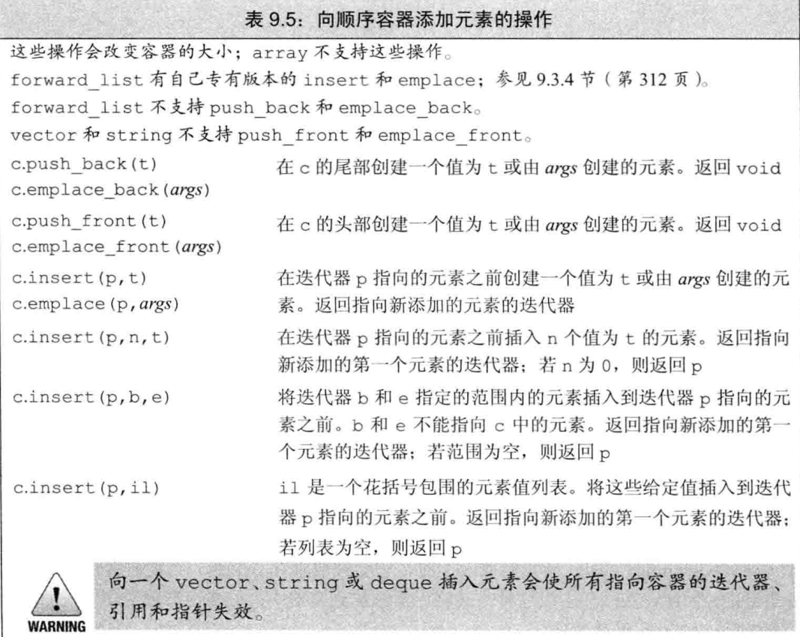

当我们使用这些操作时，必须记得不同容器使用不同的策略来分配元素空间，而这些策略直接影响性能。向一个vector或string添加元素可能引起整个对象存储空间的重新分配。重新分配一个对象的存储空间需要分配新的内存，并将元素从旧的空间移动到新的空间中。  

当我们用一个对象来初始化容器时,或将一个对象插入到容器中时，实际上放入容器中的是对象值的一个搓贝,而不是对象本身。就像我们将一个对象传递给非引用数一样，容器中的元素与提供值的对象之间没有任何关联随后对容器中元素的任何改变都不会影响到原始对象，反之亦然。

虽然某些容器不支持 push_front操作，但它们对于 insert 操作并无类似的限制(插入开始位置)。因此我们可以将元素插入到容器的开始位置，而不必担心容器是否支持push_front,虽然有些情况可能很耗时:  
`list.insert(list.begin(),4);`等价于`list.push_front(4);`

通过使用insert的返回值，我们可以在特定的位置反复插入。
```
    int i;
    auto iter = list.begin();//1
    while(cin >> i)
        iter = list.insert(iter,i);//2,1+2，等价于list.push_front
```

新标准引入了三个新成员emplace、emplace_front和 emplace back，这些操作构造而不是拷贝元素。这些操作分别对应push front、insert和push_back,允许我们将元素放置在容器头部、一个指定位置之前或容器尾部。

当调用push或insert成员函数时，我们将元素类型的对象传递给它们，这些对象被拷贝到容器中。而当我们调用一个emplace成员函数时，则是将参数传递给元素类型的构造函数。emplace 成品使用这些参数在容器管理的内存空间中直接构造元素。
```
//在c的末尾构造一个Sales_data对象
//使用三个参数的Sales_data构造函数
c.emplace_back ("978-0590353403",25，15.99);
//错误:没有接受三个参数的push_back版本
c.push_back ("978-0590353403",25,15.99);
//正确:创建一个临时的Sales_data对象传递给push_back
c.push_back(Sales_data("978-0590353403"，25，15.99) ) ;
```
在调用emplace_back 时，会在容器管理的内存空间中直接创建对象。而调用push_back 则会创建一个局部临时对象，并将其压入容器中。

emplace函数的参数根据元素类型而变化，参数必须与元素类型的构造函数相匹配:
```
//iter指向c中一个元素，其中保存了sales_data元素
3顺序容器操作
c.emplace_back(); //使用sales_data的默认构造函数
c.emplace(iter,"999-999999999");//使用sales_data(string)
//使用sales_data的接受一个ISBN、一个count和一个price的构造函数
c.emplace_front ( "978-0590353403"，25,15.99);
```

```
//9.22
void double_and_insert(std::vector<int>& v, int some_val)
{   
    auto mid = [&](){ return v.begin() + v.size() / 2; };
    for (auto curr = v.begin(); curr != mid(); ++curr)
        if (*curr == some_val)
            ++(curr = v.insert(curr, 2 * some_val));
}

```
//To use other variables other than what was passed to lambda within it, we can use capture-clause []. You can capture by both reference and value, which you can specify using & and = respectively:

// [=] capture all variables within scope by value  
// [&] capture all variables within scope by reference  
// [&var] capture var by reference  
// [&, var] specify that the default way of   capturing is by reference and we want to capture var  
// [=, &var] capture the variables in scope by value by default, but capture var using reference instead

如果容器中没有元素，访问操作的结果是未定义的。包括array在内的每个顺序容器都有一个front成员函数，而除forward list之外的所有顺序容器都有一个back成员函数。这两个操作分别返回首元素和尾元素的引用。
```
    list<string> c{"pfh","cpp","data struct"};
    //在解引用一个迭代器或调用front或back之前检查是否有元素
    if ( !c.empty())
    {
        // val和val2是c中第一个元素值的考贝
        auto val = *c.begin (), val2= c.front ();
        //val3和val4是c中最后一个元素值的拷贝
        auto last =c.end () ;
        auto val3 = *(--last); //不能递减forward_list迭代器
        auto val4 =c.back(); // forward_list不支持

        cout << val << " " << val2 << endl;
        cout << val3 << " " << val4 << endl;
    }
```


在容器中访问元素的成员函数（即，front、back、下标和at）返回的都是引用。如果容器是一个const对象，则返回值是const的引用。如果容器不是const的，则返回值是普通引用，我们可以用来改变元素的值:
```
if ( !c.empty() ) {
    c.front() = 42;
    //将42赋予c中的第一个元素
    auto &V = c.back ();
    1/获得指向最后一个元素的引用
    v = 1024;
    //改变c中的元素
    auto v2 = c.back ();
    l/ v2不是一个引用，它是c.back()的一个拷贝
    v2 = 0;
    //未改变c中的元素
}
```
如果我们使用auto变量来保存这些函数的返回值，并且希望使用此变量来改变元素的值，必须记得将变量定义为引用类型。

下标操作和安全的随机访问  
提供快速随机访问的容器(string、vector、deque和 array)也都提供下标运算符,下标运算符接受一个下标参数，返回容器中该位置的元素的引用。给定下标必须“在范围内”(即，大于等于0，且小于容器的大小)。  
如果我们希望确保下标是合法的，可以使用at成员函数。at成员函数类似下标运算符，但如果下标越界，at会抛出一个out_of_range异常
```
vector<string> svec;
//空vector
cout << svec[0];
//运行时错误:svec中没有元素!
cout << svec.at (0);
//抛出一个out_of_range异常
```
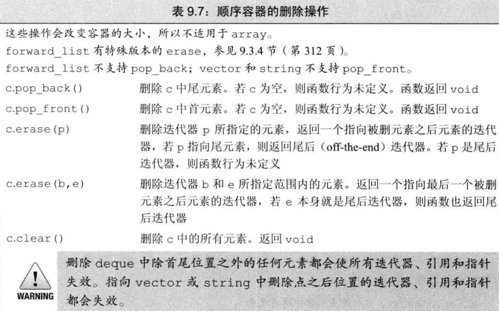

当添加或删除一个元素时，删除或添加的元素之前的那个元素的后继会发生改变。为了添加或删除一个元素，我们需要访问其前驱，以便改变前驱的链接。forward_ list 是单向链表。在一个单向链表中，没有简单的方法来获取一个元素的前驱。在一个forward_ list 中添加或删除元素的操作是通过改变给定元
素之后的元素来完成的。这样，我们总是可以访问到被添加或删除操作所影响的元素。

forward list定义了insert after、 emplace after 和
erase after 的操作。 为了支持这些操作，forward list 也定义了before begin, 它返回一个首前迭代器。这个迭代器允许我们在链表首元素之前并不存在的元素“之后”添加或删除元素(亦即在链表首元素之前添加删除元素)。

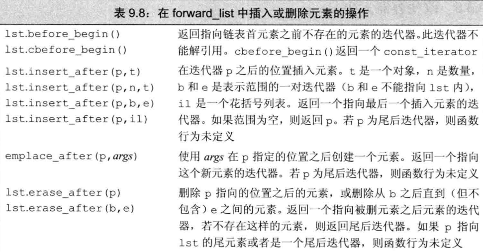

当在forward list 中添加或删除元素时，我们必须关注两个迭代器一个指向我们要处理的元素，另一个指向其前驱。

使用resize增大或减小容器

resize操作接受一个可选的元素值参数，用来初始化添加到容器中的元素。如果调用者未提供此参数，新元素进行值初始化。如果容器保存的是类类型元素，且resize向容器添加新元素，则我们必须提供初始值，或者元系类型必须提供一个默认构造函数。

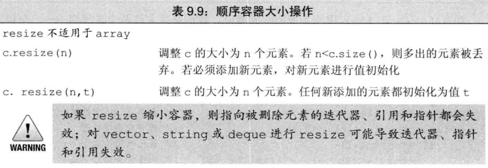

容器操作可能使迭代器失效：  

在向容器添加元素后:
如果容器是vector或string，且存储空间被重新分配，则指向容器的迭代器、指针和引用都会失效。如果存储空间未重新分配，指向插入位置之前的元素的迭代器、指针和引用仍有效，但指向插入位置之后元素的迭代器、指针和引用将会失效。  
对于deque，插入到除首尾位置之外的任何位置都会导致迭代器、指针和引用失效。如果在首尾位置添加元素，迭代器会失效，但指向存在的元素的引用和指针不会失效。

当我们从一一个容器中删除元素后，指向被删除元素的迭代器、指针和引用会失效，  
对于list和forward_list，指向容器其他位置的迭代器(包括尾后迭代器和首前迭代器)、引用和指针仍有效。    
对于deque,如果在首尾之外的任何位置删除元素，那么指向被删除元素外其他元素的迭代器、引用或指针也会失效。如果是删除deque的尾元素，则尾后迭代器也会失效，但其他迭代器、引用和指针不受影响;如果是删除首元素，这些也不会受影响。  
对于vector和string， 指向被删元素之前元素的迭代器、引用和指针仍有效。  
当我们删除元素时，尾后迭代器总是会失效。

使用失效的迭代器、指针或引用是严重的运行时错误，必须保证每次改变容器的操作后都正确的重新定位迭代器，对string、vector、deque十分重要。

添加/删除vector、string 或deque元素的循环程序必须考虑迭代器、引用和指针可能失效的问题。程序必须保证每个循环步中都更新迭代器、引用或指针。如果循环中调用的是insert 或erase，那么更新迭代器很容易。这些操作都返回迭代器，我们可以用来更新:
```
//傻瓜循环，删除偶数元素，复制每个奇数元素
vector<int> vi = {0,1,2,3,4,5,6, 7,8,9};
auto iter = vi.begin(); // 调用begin而不是cbegin，因为我们要改变vi
while (iter != vi.end()) 
{
    if (*iter % 2) 
    {
        iter = vi.insert(iter, *iter); //复制当前元素
        iter += 2; //向前移动迭代器，跳过当前元素以及插入到它之前的元素
        } 
    else
        iter = vi.erase (iter) ;//删除偶数元素
}
//不应向前移动迭代器，iter指向我们删除的元素之后的元素
```
此程序删除vector中的偶数值元素，并复制每个奇数值元素。我们在调用insert和erase后都更新迭代器，因为两者都会使迭代器失效。在调用erase后，不必递增迭代器，因为erase返回的迭代器已经指向序列中下一个元素。调用insert后，需要递增迭代器两次。记住，insert在给定位置之前插入新元素，然后返回指向新插入元素的迭代器。因此，在调用insert后，iter指向新插入元素，位于我们正在处理的元素之前。我们将迭代器递增两次，恰好越过了新添加的元素和正在处理的元素，指向下一个未处理的元素。

当我们添加/删除vector或string的元素后，或在deque中首元素之外任何位置添加/删除元素后，原来end返回的迭代器总是会失效。因此，添加或删除元素的循环程序必须反复调用end，而不能在循环之前保存end返回的迭代器，一直当作容器末尾使
用。  
```
    //灾难:此循环的行为是未定义的
    auto begin = v.begin(),end = v.end(); //保存尾迭代器的值是一个坏主意
    while (begin != end) 
    {
        //做一些处理
        //插入新值，对begin重新赋值，否则的话它就会失效
        ++begin; // 向前移动begin,因为我们想在此元素之后插入元素
        begin = v. insert (begin, 42); //插入新值
        ++begin; // 向前移动begin跳过我们刚刚加入的元素
    }
```
此代码的行为是未定义的。在很多标准库实现上，此代码会导致无限循环。问题在于我们
将end操作返回的迭代器保存在一个名为end的局部变量中。在循环体中，我们向容器中添加了一个元素，这个操作使保存在end中的迭代器失效了。这个迭代器不再指向v中任何元素，或是v中尾元素之后的位置。
如果在一个循环中插入/删除deque、string 或vector中的元素，不要缓存end返回的迭代器。必须在每次插入操作后重新调用end()，而不能在循环开始前保存它返回的迭代器:
```
    //更安全的方法:在每个循环步添加/删除元素后都重新计算end
    while (begin != v.end()) 
    {
        //做一些处理
        ++begin; //向前移动begin，因为我们想在此元素之后插入元素
        begin = v. insert (begin，42); // 插入新值
        ++begin; //向前移动begin,跳过我们刚刚加入的元素
    }
```
### 9.4 vector对象是如何增长的
假定容器是连续存储的，而且大小可变，考虑向vector或string中添加元素会发生什么:如果没有空间容纳新元素，容器不可能简单地将它添加到内存中其他位置一因 为元素必须连续存储。容器必须分配新的内存空间来保存已有元素和新元素，将已有元素从旧位置移动到新空间中，然后添加新元素，释放旧存储空间。如果我每添加一一个新元素，vector就执行1次这样的内存分配和释放操作，性能会慢到不可
接受。

为了避免这种代价，标准库实现者采用了可以减少容器空间重新分配次数的策略。不得不获取新的内存空间时，vector和string的实现通常会分配比新的空间需求更大的内存空间。容器预留这些空间作为备用，可用来保存更多的新元素。这样，就不需要每次添加新元素都重新分配容器的内存空间了。
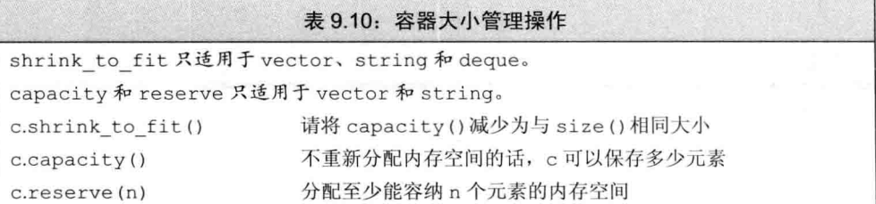

只直当需要的内在空间超过当前容量时，reserve 调用才会改变vector的容量。如果需求大小大于当前容量，reserve 至少分配与需求一样大的内存空间(可能更大)。如果需求大小小于或等于当前容量，reserve 什么也不做。特别是，当需求大小小
于当前容量时，容器不会退回内存空间。因此，在调用reserve之后，capacity 将会大于或等于传递给reserve的参数。

这样，调用reserve 永远也不会减少容器占用的内存空间。resize成员函数只改变容器中元素的数目，而不是容器的容量。我们同样不能使用resize来减少容器预留的内存空间。

在新标准库中，我们可以调用shrink_ _to_ fit来要求deque. vector或string退回不需要的内存空间。此函数指出我们不再需要任何多余的内存空间。但是，具体的实现可以选择忽略此请求。也就是说，调用shrink to fit也并不保证一定退回内存 空间。

容器的size是指它已经保存的元素的数目;而capacity则是在不分配新的内存空间的前提下它最多可以保存多少元素。
```
    vector<string> vs;
    
    cout << vs.size() << endl;
    cout << vs.capacity() << endl;
    
    for(int id=0;id<5;++id)
        vs.push_back("id");
    
    cout << vs.size() << endl;
    cout << vs.capacity() << endl;

    vs.reserve(10);
    cout << vs.size() << endl;
    cout << vs.capacity() << endl;

    while(vs.size()!=vs.capacity())
        vs.push_back("0");
    
    cout << vs.size() << endl;
    cout << vs.capacity() << endl;

    for(auto p:vs)
        cout << p << " " ;
    
    运行结果：
    0
    0
    5
    8
    5
    10
    10
    10
    id id id id id 0 0 0 0 0
```
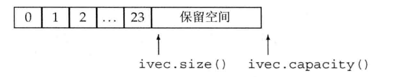

只有在执行insert操作时size与capacity相等，或者调用resize或reserve时给定的大小超过当前capacity,vector才可能重新分配内存空间。会分配多少超过给定容量的额外空间，取决于具体实现。

虽然不同的实现可以采用不同的分配策略，但所有实现都应遵循一个原则:确保用push_ back向vector添加元素的操作有高效率。从技术角度说，就是通过在一个初始为空的vector.上调用n次push_ back来创建-一个n个元素的vector,所花费的时间不能超过n的常数倍。

### 9.5 额外的string操作
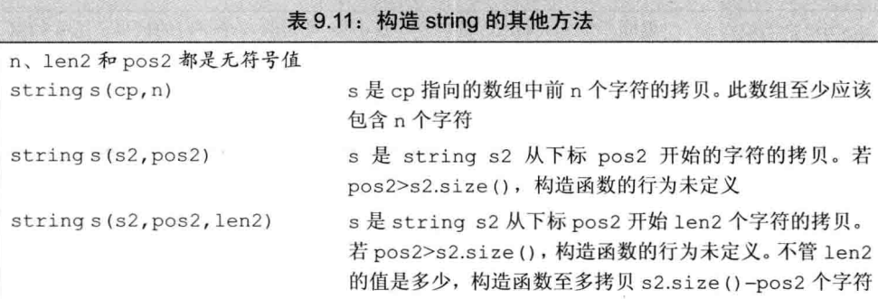
这些构造函数接受-一个 string或一个const char*参数，还接受(可选的)指定拷贝多少个字符的参数。当我们传递给它们的是一个 string时，还可以给定一个下标来指出从哪里开始拷贝:
```
const char *cp = "Hello World!! !";
//以空字符结束的数组
char noNull[] = {'H', ' i' };
//不是以空字符结束
string s1(cp); // 拷贝cp中的字符直到遇到空字符; s1 == "Hello world!!!"
string s2 (noNull,2) ;
//从noNull拷贝两个字符; s2 == "Hi"
string s3 (noNu1l) ;
//未定义: noNull不是以空字符结束
strings4(cp+6，5);
//从cp[6]开始拷贝5个字符; s4 == "World"
string s5(s1, 6，5) ;
//从s1[6]开始拷贝5个字符; s5 == "World"
string s6(s1， 6) ;
//从s1[6]开始拷贝，直至s1末尾; s6 == "World!!!"
string s7 (s1, 6,20) ;
//正确，只拷贝到s1末尾; s7 == "world!!!"
string s8(s1， 16) ;
//抛出一个out_ _of_ range异常
```
通常当我们从一一个const char*创建strinq时，指针指向的数组必须以空字符结尾，拷贝操作遇到空字符时停止。如果我们还传递给构造函数一个计数值，数组就不必以空字符结尾。如果我们未传递计数值且数组也未以空字符结尾，或者给定计数值大于数组大小，则构造函数的行为是未定义的。

当丛一个string拷贝字符时，我们可以提供-一个可选的开始位置和一一个计数值。 开始位置必须小于或等于给定的string的大小。如果位置大于size,则构造函数抛出一个out_ of_ range 异常。如果我们传递了一个计数值，则从给定位置开始拷贝这么多个字符。不管我们要求拷贝多少个字符，标准库最多拷贝到string结尾，不会更多。

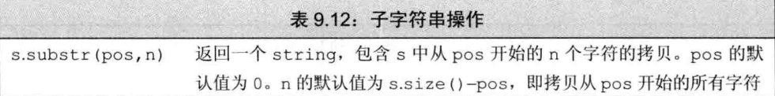

string类型它还定义了额外的insert和erase版本,提供了接受下标的版本。
下标指出了开始删除的位置，或是insert到给定值之前的位置:
``` 
    s.insert(s.size(), 5，'!'); // 在s末尾插入5个感叹号
    s.erase(s.size() - 5，5) ;//从s删除最后5个字符
```
标准库string类型还提供了接受C风格字符数组的insert和assign版本。例如，我们可以将以空字符结尾的字符数组insert到或assign给一个string:
```
    const char *CP = "Stately, plump Buck";
    s.assign(cp, 7) ;// s == "Stately"
    s.insert(s.size()，cp + 7); // s == "Stately, plump Buck"
```
我们也可以指定将来自其他string或子字符串的字符插入到当前string中或赋予当前string:
```
    string s = "some string", s2 = "some other string";
    s. insert(0，s2); //在s中位置0之前插入s2的拷贝
    //在s[0]之前插入s2中s2[0]开始的s2.size()个字符
    s. insert (0， s2， 0，s2.size()) ;
```
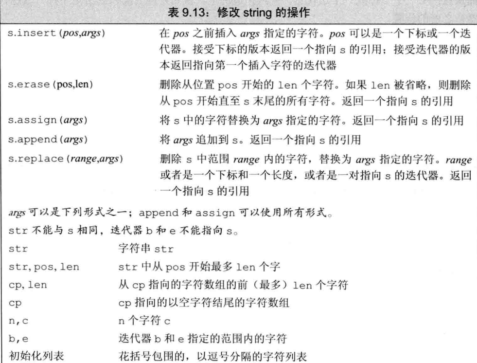
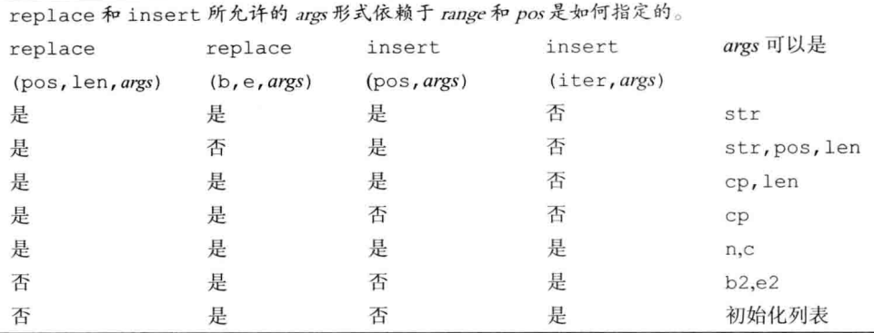

assign 总是替换string中的所有内容，append总是将新字符追加到string末尾。
replace_函数提供了两种指定删除元素范围的方式。可以通过一个位置和一个长度来指定范围，也可以通过一个迭代器范围来指定。  
insert函数允许我们用两种方式指定插入点:用一个下标或一个造代器。在两种情况下，新元素都会插入到给定下标(或迭代
器)之前的位置。

并不是每个函数都支持所有形式的参数。例如，insert就不支持下标和初始化列表参数。类似的，如果我们希望用迭代器指定插入点，就不能用字符指针指定新字符的来源。

string类提供了6个不同的搜索函数，每个函数都有4个重载版本。每个搜索操作都返回一个string:size type值，表示匹
配发生位置的下标。如果搜索失败，则返回一个名为string:npos的static成员标准库将npos定义为-一个const string::size_ type类型，并初始化为值-1。由于npos是一个unsigned类型，此初始值意味着npos等于任何string最大的可能大小。

string搜索函数返回string:: size_ type值，该类型是一个unsigned类型。因此，用一个int或其他带符号类型来保存这些函数的返回值不是一个好主意

搜索是大小写敏感的！
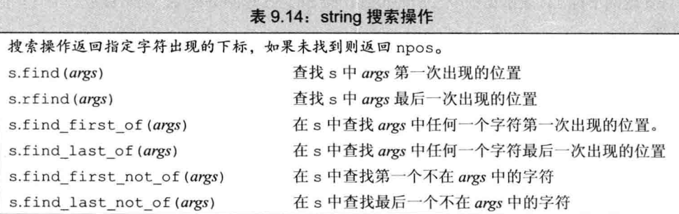
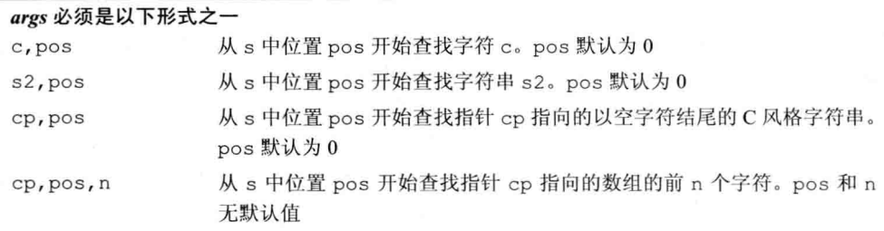
```
    string info{"cppxyz"};
    cout << info.find("px",3) << endl;//npos,默认值是-1
    string::size_type x = -1 ;
    cout << x << endl;
```

标准库还提供了类似的，但由右至左搜索的操作。rfind成员函数搜索最后-一个匹配，即子字符串最靠右的出现位置

compare有6个版本。根据我们是要比较两个string还是一个
string与一个字符数组，参数各有不同。在这两种情况下，都可以比较整个或部分字符串。
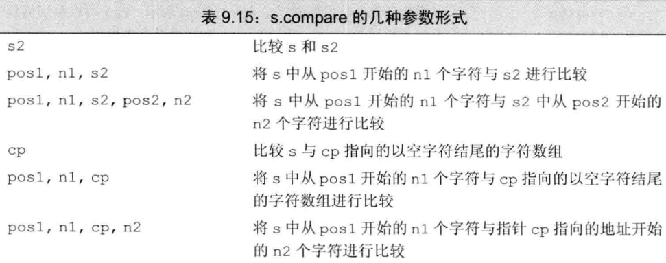

要转换为数值的string中第-一个非空白符必须是数值中可能出现的字符:
```
string s2 = "pi = 3.14";
//转换s中以数字开始的第一个子串，结果d = 3.14
d = stod(s2.substr (s2.find_ first_ of ("+-.0123456789"))) ;
```
string参数中第一个非空白符必须是符号(+或-)或数字。它可以以0x或0X开头来表示十六进制数。对那些将字符串转换为浮点值的函数，string参数也可以以小数点(.)开头，并可以包含e或E来表示指数部分。对于那些将字符串转换为整型值的函数，根据基数不同，string 参数可以包含字母字符，对应大于数字9的数。

如果string不能转换为一个数值，这些函数抛出一个invalid _argument异常。如果转换得到的数值无法用任何类型来表示，
则抛出一个out of range 异常。
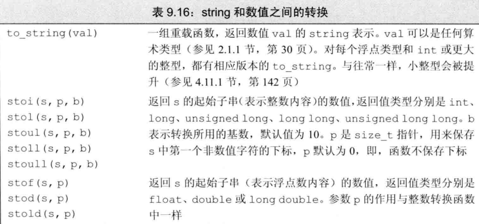
```
    string s{"213afy"};
    auto a = stoi(s);
    cout << a << endl;//213

    vector<string> s{"1","2","3"};
    int sum = 0;
    for(auto p:s)
    {
        sum += stoi(p);
    }
    cout << sum << endl;//6
```

### 9.6 容器适配器
Container Adaptors

除了顺序容器外，标准库还定义了三个顺序容器适配器: stack、 queue 和priority_ queue.适配器( adaptor)是标准库中的一个通用概念。容器、迭代器和函数都有适配器。本质上，一个适配器是一种机制，能使某种事物的行为看起来像另外一种事物一样。一个容器适配器接受一种已有的容器类型，使其行为看起来像一种不同的类型。
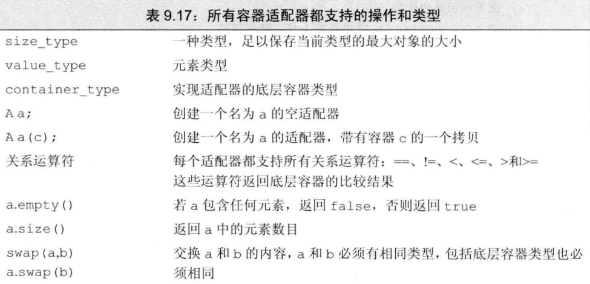
每个适配器都定义两个构造函数:默认构造函数创建一个空对象，接受一个容器的构造函数拷贝该容器来初始化适配器。
`stack<int> stk(deq); // 从deq拷贝元素到stk`

默认情况下,stack 和queue是基于deque实现的，priority_ queue 是在vector 之上实现的。我们可以在创建一个适配器时将一个命名的顺序容器作为第二个类型参数,来重载默认容器类型。
```
//在vector.上实现的空栈
stack<string, vector<string>> str_ stk;
// str_ _stk2在vector上实现，初始化时保存svec的拷贝
stack<string, vector<string>> str_ stk2 (svec) ;
```
对于一个给定的适配器，可以使用哪些容器是有限制的。所有适配器都要求容器且有添加和删除元素的能力。因此，适配器不能构造在array之上。类似的，我们也不能用forwardlist来构造适配器，因为所有适配器都要求容器具有添加、删除以及访问尾.
元素的能力

stack只要求pushback、popback和back操作，因此可以使用除array和forward_ list之外的任何容器类型来构造stack。

queue 适配器要求back、push_ back、front和push_ front，因此它可以构造于list或deque之上，但不能
基于vector构造。

priority queue 除了front、push, _back和pop_ back操作之外还要求随机访问能力，因此它可以构造于vector或deque之上，但不能基于list构造。

栈适配器：  
```
    stack<int> intStack; // empty stack
    // fill up the stack
    for (size_t ix = 0; ix != 10; ++ix)
    intStack.push(ix); // intStack holds 0 . . . 9 inclusive
    while (!intStack.empty()) 
    { 
        // while there are still values in intStack
        int value = intStack.top();
        // code that uses value
        intStack.pop(); // pop the top element, and repeat
    }
```
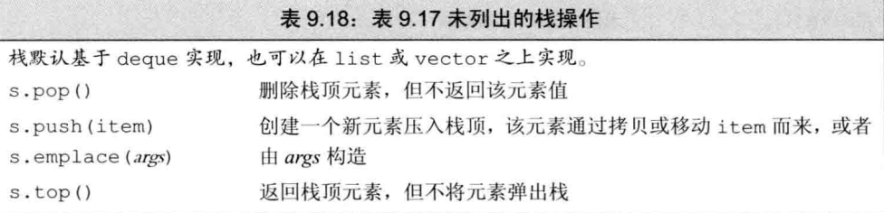
队列适配器：  
标准库queue使用一种先进先出( first-in，first-out， FIFO) 的存储和访问策略。进入队列的对象被放置到队尾，而离开队列的对象则从队首删除。饭店按客人到达的顺序来为他们安排座位，就是一一个先进先出队列的例子。

priority_ queue允许我们为队列中的元素建立优先级。新加入的元素会排在所有优先级比它低的已有元素之前。饭店按照客人预定时间而不是到来时间的早晚来为他们安排座位，就是一个优先队列的例子。默认情况下，标准库在元素类型上使用<运算符来确定相对优先级。
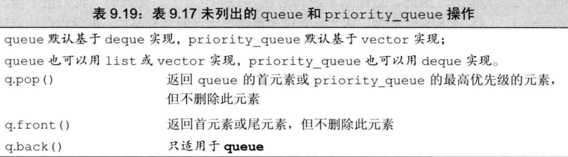
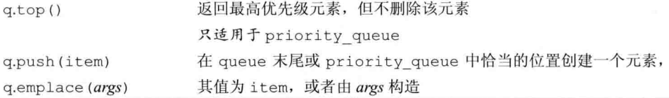

使用stack处理括号化的表达式。当你看到一一个左括号，将其记录下来。当你在一一个左括号之后看到一个右括号，从stack中pop对象，直至遇到左括号，将左括号也一起弹出栈。 然后将一个值(括号内的运算结果) push 到栈中，表示一个括号化的(子)表达式已经处理完毕，被其运算结果所替代。
```
    string expression{ "This is (pezy)." };
    bool bSeen = false;
    stack<char> stk;
    for (const auto &s : expression)
    {
        if (s == '(') { bSeen = true; continue; }
        else if (s == ')') bSeen = false;
        
        if (bSeen) stk.push(s);
    }
    
    string repstr;
    while (!stk.empty())
    {
        repstr += stk.top();//This is (yzep).
        repstr.insert(0,1,stk.top()) ;//This is (pezy).
        stk.pop();
    }
    
    expression.replace(expression.find("(")+1, repstr.size(), repstr);
    
    cout << expression << endl;
```

## 第10章 泛型算法
标准库容器定义的操作集合惊人得小。标准库并未给每个容器添加大量功能，而是提供了一组泛型算法，这些算法中的大多数都独立于任何特定的容器，实现了一些经典算法的公共接口，例如排序、搜索。这些算法是通用的(generic,或称泛型的),它们可用于不同类型的容器和不同类型的元素。

### 10.1 概述
大多数算法都定义在头文件algorithm中。标准库还在头文件numeric中定义了一组数值泛型算法。一般情况下，这些算法并不直接操作容器，而是遍历由两个迭代器指定的一个元素范围来进行操作。通常情况下，算法遍历范围，对其中每个元素进行一些处理。

算法如何工作：  
为了弄清这些算法如何用于不同类型的容器，让我们更近地观察一下 find。 find的工作是在一个未排序的元素序列中查找= 个特定元素。概念上, find应执行如下步骤:

1.访问序列中的首元素。

2.比较此元素与我们要查找的值。

3.如果此元素与我们要查找的值匹配，find返回标识此元素的值。

4.否则，find前进到下一个元素，重复执行步骤2和3。

5.如果到达序列尾，find 应停止。

6.如果_ find到达序列末尾，它应该返回一个指出元素未找到的值。此值和步骤3返回的值必须具有相容的类型。

这些步骤都不依赖于容器所保存的元素类型。因此，只要有一个迭代器可用来访问元素，find就完全不依赖于容器类型(甚至无须理会保存元素的是不是容器)。

算法永远不会执行容器的操作：  
泛型算法本身不会执行容器的操作，它们只会运行于迭代器之上，执行迭代器的操作。泛型算法运行于迭代器之上而不会执行容器操作的特性带来了一个令人惊讶但非常必要的编程假定:算法永远不会改变底层容器的大小。算法可能改变容器中保存的元素的值，也可能在容器内移动元素，但永远不会直接添加或删除元素。标准库定义了一类特殊的迭代器，称为插入器(inserter)。与普通迭代器只能遍历所绑定的容器相比，插入器能做更多的事情。当给这类迭代器赋值时，它们会在底层的容器上执行插入操作。因此，当一个算法操作一个这样的迭代器时，迭代器可以完成向容器添加元素的效果，但算法自身永远不会做这样的操作。

标准库提供了超过100个算法。这些算法有一致的结构，理解此结构可以帮助我们学习这些算法。除了少数例外，标准库算法都对一个范围内的元素进行操作。我们将此元素范围称为“输入范围”。接受输入范围的算法总是使用前两个参数来表示此范围，两个参数分别是指向要处理的第一个元素和尾元素之后位置的迭代器。虽然大多数算法遍历输入范围的方式相似，但它们使用范围中元素的方式不同。理解算法的最基本的方法就是了解它们是否读取元素、改变元素或是重排元素顺序。

只读算法：  
find,count,accumulate

算法和元素类型：  
accumulate定义在头文件numeric中。accumulate函数接受三个参数，前两个指出了需要求和的元素的范围，第三个参数是和的初值。

假定vec是一个整数序列，则:
```
//对vec中的元素求和，和的初值是0
int sum = accumulate (vec.cbegin()，vec.cend(), 0) ;
```
这条语句将sum设置为vec中元素的和，和的初值被设置为0。
accumulate的第三个参数的类型决定了函数中使用哪个加法运算符以及返回值的类型。

accumulate将第三个参数作为求和起点，这蕴含着一个编程假定:将元素类型加到和的类型上的操作必须是可行的。即序列中元素的类型必须与第三个参数匹配，或者能够转换为第三个参数的类型。
由于string定义了+运算符，我们可以通过accumulate将vector的string元素连接起来,
```
    string sum = accumulate (v.cbegin(), v.cend(), string(""));
```
此调用将v中每个元素连接到一个string上，该string初始时为空串。注意，我们通过第三个参数显式地创建了一个string。将空串当做一个字符串字面值传递给第三个参数是不可以的。会导致一个编译错误。
```
    //错误: const char*.上没有定义+运算符
    string sum = accumulate (v. cbegin(), v.cend() ,"") ;
```
原因在于，如果我们传递了一个字符串字面值，用于保存和的对象的类型将是constchar*。此类型决定了使用哪个+运算符。由于const char*并没有+运算符，此调用将产生编译错误。

操作两个序列的算法:

equal,用于确定两个序列是否保存相同的值。它将第一个序列中
的每个元素与第二个序列中的对应元素进行比较。如果所有对应元素都相等，则返回true,否则返回false。

此算法接受三个迭代器:前两个(与以往一-样)表示第一个序列中的元素范围，第三个表示第二个序列的首元素:
```
 // roster2中的元素数目应该至少与rosterl一样多
equal (roster1 .cbegin()，rosterl.cend() ，roster2.cbegin() );
```
由于equal利用迭代器完成操作，因此我们可以通过调用equal来比较两个不同类型容器中的元素。而且，元素类型也不必一样，只要我们能用==来比较两个元素类型即可。例如，在此例中，rosterl 可以是vector<string>，而roster2是list<const
char*>。

equal基于一个非常重要的假设:它假定第二个序列至少与第一个序列一样长。此算法要处理第一个序列中的每个元素，它假定每个元素在第二个序列中都有一个与之对应的元素。

那些只接受一个单一迭代器来表示第二个序列的算法，都假定第二个序列至少与第一个序列一样长。

算法fill接受一对迭代器表示一个范围，还接受一个值作为第三个参数。fill将给定的这个值赋予输入序列中的每个元素。
```
fill (vec.begin(), vec.end(), 0); // 将每个元素重置为0
//将容器的一个子序列设置为10
fill (vec.begin()，vec.begin() + vec.size()/2, 10) ;
```
由于fill向给定输入序列中写入数据，因此，只要我们传递了一个有效的输入序列，写入操作就是安全的。

fill_n接受一个迭代器、一个计数值和一个值。它将给定值赋予迭代器指向的元素开始的指定个元素。我可以用fill_ n将一个新值赋予vector中的元素:
```
    vector<int> vec; // 空vector
    //使用vec，赋予它不同值
    fill_ n(vec.begin(), vec.size(), 0); //将所有元素重置为0
    fill_n(vec.begin(),10,0);//错误，修改十个不存在元素
```

插入迭代器是一种向容器中添加元素的迭代器。通常情况，当我们通过一个迭代器向容器元素赋值时，值被赋予迭代器指向的元素。而当我们通过一个插入迭代器赋值时，一个与赋值号右侧值相等的元素被添加到容器中。  
back_ inserter, 它是定义在头文件iterator中的一个函数，接受-一个指向容器的引用，返回一个与该容器绑定的插入迭代器。当我们通过此迭代器赋值时，赋值运算符会调用push_ _back将一个具有给定值的元素添加到容器中:
```
    vector<int> vec; // 空向量
    auto it = back_ inserter(vec); // 通过它赋值会将元素添加到vec中
    *it = 42; // vec 中现在有一个元素，值为42
```
使用back_inserter来创建一个迭代器，作为算法的目的位置来使用。
```
    vector<int> vec; //空向量
    //正确: back_inserter创建一个插入迭代器，可用来向vec添加元素
    fill_n (back_inserter (vec), 10，0); //添加10个元素到vec 
```

拷贝(copy)算法是另一个向目的位置迭代器指向的输出序列中的元素写入数据的算法。此算法接受三个迭代器，前两个表示一;个输入范围，第三个表示且的序列的起始位置。此算法将输入范围中的元素拷贝到目的序列中。传递给copy的目的序列至少要包含
与输入序列-一样多的元素，
内置数组的拷贝:
```
    int a1[] = {0,1,2,3,4,5,6, 7,8,9};
    int a2[sizeof(al) /sizeof (*a1)]; // a2与al大小一样
    // ret指向拷贝到a2的尾元素之后的位置
    auto ret = copy (begin(a1)，end(al), a2); //把al的内容拷贝给a2.
```
copy返回的是目的位置迭代器递增后的值。

多个算法都提供所谓的“拷贝”版本。这些算法计算新元素的值，但不会将它们放置在输入序列的末尾，而是创建一个 新序列保存这些结果。

replace 算法读入一个序列，并将其中所有等于给定值的元素都改为另一个值。此算法接受4个参数，前两个是迭代器，表示输入序列，后两个一个是要搜索的值，另一个是新值。它将所有等于第一个值的元素替换为第二个值:
```
    //将所有值为0的元素改为42
    replace (ilst.begin(), ilst.end(), 0，42) ;
```
如果我们希望保留原序列不变，可以调用replace_ copy。此算法接受额外第三个迭代器参数，指出调整后序列的保存位置:
```
    //使用back_ inserter按需要增长目标序列
    replace_ copy (ilst.cbegin()，ilst.cend(),
    back_ inserter (ivec), 0，42) ;
```
此调用后，ilst并未改变，ivec包含ilst的一份拷贝，不过原来在ilst中值为0的元素在ivec中都变为42。

### 10.3 定制操作


 


