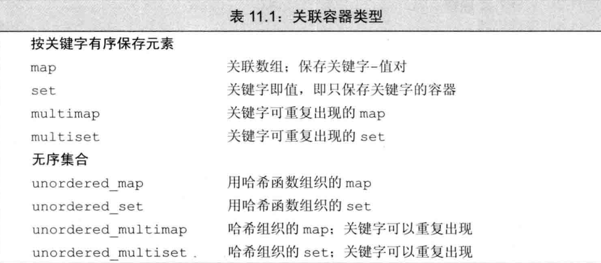

# C++ primer 
## 第一章 开始

### 1.1 编写一个C++程序 
一个C++程序可能包含若干个函数，其中一个必须命名为main()。  
操作系统通过调用main()运行C++程序。  
下面是最简单的main():  
  
```
int main() 
{
    return 0;
}
```  
**int** 是main()的返回值类型，本例返回0  
**main**是函数名  
()是形参列表  
**{}**里面是函数体  

cpp程序从无到有：编写、编译、运行  
code write：就是我们在各种IDE、记事本写代码  
code compile：编译器 路径 .cpp,类似于左边的范式将cpp程序变成.exe  
code run:.exe 执行  

### 1.2 初始输入输出  
cpp未定义任何的IO语句，通过标准库实现IO机制。  
iostream  
cin：输入  
cout:输出  
cerr:输出警告、错误  
clog:输出cpp运行时一般信息  
 
<<输出运算符  >> 输入运算符 
```
#include <iostream>
using namespace std;
int main()
{
    int i = 0, sum = 0;
    
    while (i < 10)
    {
        sum += i;
        ++i;
    }

    cout << "the sum of ten : " << sum << endl;
    
    return 0;
}
```  
解析一下这个cpp:  
`#include < iostream>`：#include 是 指令，< iostream>是头文件  
#include header ：导入使用的标准库  

`using namespace std;` ： using关键字，namespace:关键字，命名空间，将程序划分不同的域；std:C++标准库的命名空间；使用这句话表示当前域使用标准库的命名空间的所有名称 

`int i = 0, sum = 0;`int 内置类型  

`while (i < 10)` while 关键字 ，`i < 10` 表达式，`<`逻辑运算符，`i 10`运算对象，cpp表达式由运算对象和运算符组成  
`cout << "the sum of ten : " << sum << endl;`  
<< 左侧是ostream对象cout，右侧是输出的值，作用是将右侧输出的值写到ostream对象cout里，返回左侧的ostream对象cout。  
`((cout << "the sum of ten : ") << sum) << endl;`   
依次写到cout对象里输出  
`"the sum of ten : "`字符串字面值常量  
`endl` 操纵符，结束当前行，缓冲刷新  

初始化一个变量就是变量在被创建时同时赋值。  
### 1.3  注释简介  
//注释  
/*注释*/：不能嵌套  
### 1.4 控制流  
while  

for(循环头)4循环体  
循环头：1初始条件，2循环条件，3表达式  
12432432...  
```
int sum=0,v=0;
    while (cin >> v)
    {
        sum+=v;
    }
    cout << sum;
```  
从键盘向程序输入数据时，Windows输入文件结束符是Ctrl+Z  
循环条件检测的是cin,即检测流状态，当流有效为真，反之为假（当流是文件结束符或者无效输入(本例输入不是int)）。
`1 3 4 2^Z 10 1 2 3 4 h 10`   
### 1.5 类简介  
 成员函数(方法)是类的一部分的函数。  
 点运算符dot  
 `current_item.isbn()`  dot左侧是类类型对象，右侧是成员名，()调用运算符，调用函数。  

## 第I部分 C++ 基础

## 第2章 变量和基本类型 
### 2.1 基本内置类型  
数据类型决定了程序中数据和操作的意义。  

算术类型：整型、浮点型  
空类型  

整型:bool、char、wchar_t、char16_t、char32_t、short、int、long 、long long   
浮点型：float、double、long double

C++标准规定了内置类型所占位数的最小值，同时允许编译器赋予这些类型更大尺寸。  
总之,`short <= int <= long <= long long`
```
我的编译器MinGW(Minimalist GNU for Windows)内置类型信息，单位是字节：
bool:1  
char:1
wchar_t:2
char16_t:2
char32_t:4
short:2
int:4
long:4
long long:8
float:4
double:8
long double:8
```   
内置类型的机器实现：

可寻址的最小内存块是字节byte，储存的基本单元是字。一个字通常是4个字节。

大多数计算机将一个字节与一个地址关联起来，为了赋予内存的某个地址意义，我们必须知道存储在那里的值的类型，类型决定使用多少位以及如何解释这些位。

通常，float以一个字表示，double以两个字表示。


signed类型:可以表示正数、负数、0  
unsigned类型：可以表示大于等于0的数 

int、long 、long long 是signed，前面加unsigned可以得到无符号类型 

字符型：char, signed char,  unsigned char  
char与signed char不同。  
虽然有三种字符类型，但只有两种表示:有符号和无符号，char表示为哪一种取决于编译器。  
unsigned类型所有的位都可以存储值。 

如何选择类型：  

使用 int 进行整数运算。 Short 通常太小，并且在实践中，long 通常与 int 具有相同的大小。如果您的数据值大于 int 的最小保证大小，则使用 long long。

当您知道值不能为负时，请使用无符号类型。

使用 double 进行浮点计算； float 通常没有足够的精度，双精度计算的成本相对于单精度可以忽略不计。事实上，在某些机器上，双精度运算比单精度运算更快。 long double 提供的精度通常是不必要的，并且通常会带来相当大的运行时成本。

算术表达式不要用char/bool，只有在存放字符或者布尔值才使用它们，因为char表示为有符号和无符号哪一种取决于编译器。

类型转换

当一个算数表达式里有无符号数和int值，int值将会转为无符号数，int本身是signed
```
    int x = -1;
    unsigned y = 1;
    cout << x*y << endl;//int是32位，4294967295
    unsigned u = 10;
    int v = -42;
    cout << u+u << endl; //20
    cout << v+v << endl; //-84
    cout << u+v << endl; //int是32位，4294967264
    cout << u-v << endl; //52
    cout << v-u << endl; //int是32位，4294967244
```

使用无符号数循环：打印10-0
```
    for(unsigned u=10;u>=0;--u)
            cout << u << endl;//死循环，u=0,--u =-1,-1是int,转换成无符号数4294967295

    unsigned u = 11;
    while(u>0)
    {
        --u;
        cout << u << endl;
    }//打印10-0
```

发现：for 递减语句一定在输出语句后，while 递减语句在输出语句前后看需求，本例`unsigned u = 11`，打印10-0，因此在输出语句前，完美使用了unsigned知识点和while，实现打印10-0，其实for也可以
```
    for(unsigned u=11;u>0;--u)
            cout << u-1 << endl;
```

字面值常量  literal

整型、浮点型字面值

整型字面值可以写成十进制、八进制(0开头)、十六进制(0X、0x开头)数的形式。

字符和字符串字面值

单引号括起来的是char字面值，双引号括起来的是字符串字面值(string literal)

string literal:常量字符构成的数组，编译器在每个字符串后面加一个空字符'\0',实际长度比内容多1。

转义序列

转义序列以反斜线\开始：\\\ 反斜线、\\"：双引号、\\t:Tab

C++ '\n'和endl有什么区别：  
chatgpt:'\n'和std::endl都可以用于换行，但std::endl除了插入换行符外，还会刷新输出缓冲区。在大多数情况下，使用'\n'更为常见和推荐，而在需要显式刷新缓冲区的情况下，可以使用std::endl。

### 2.2 变量  
变量的定义

```
    std::string s("hi cpp!");
    // cin >> s;
    cout << s << endl;//hi cpp!
    int i = 3.14;
    cout << i << endl;//3
    // int i {3};
    // int i (0);
    int i = {3.14};
    cout << i << endl;//错误
```

初始化不是赋值，初始化的含义是创建变量时赋予其一个初始值，赋值的含义是将当前值擦除，而以一个新值代替。

`int i = {3.14}`列表初始化，存在信息丢失风险编译将报错，比如左边这个丢失精度，因此会报错 

变量声明和定义的关系

声明：使得名字为程序所知，一个文件如果想使用别处定义的名字则必须

定义：负责创建与名字关联的实体。
```
    extern int e;//声明一个变量而非定义
    extern int e = 3.14//包含显示初始化的声明就是定义，不能在函数体内部这样做，否则报错
    int k;//声明并定义
```
如果在多个文件中使用一个变量，必须将声明和定义分离，定义只能出现在一个文件中，其他文件使用这个变量必须声明，绝不能重复定义，可以多次声明

标识符

名字的作用域
```
int s = 42;//全局变量
int main()
{
    cout << s << endl;//42
    int s = 42;
    cout << s << endl;//24，覆盖掉全局变量s
    cout << :: s << endl;//42,::作用域操作符，指定操作哪个作用域的名字，全局作用域没有名字，所以::操作符左侧为空，向全局作用域发出请求作用域操作符右侧的名字对应的变量
    return 0;
}
```
### 2.3 复合类型
引用类型：为对象起了另外一个名字，引用另外一种类型,必须初始化  
&
```
#include <iostream>
using namespace std;
int main(int argc, char const *argv[])
{
    int i = 1024;
    int j = 4201;
    int &ref_i = i;//ref_i指向i
    cout << ref_i << endl;//1024
    cout << ref_i+1 <<endl;//1025
    //int &ref;//引用必须初始化
    ref_i = j;
    cout << ref_i << endl;//4201
    cout << ref_i-1 << endl;//4200
    //int &X = 1;//错
    return 0;
}
```
引用即别名，所有操作都是在与之绑定的对象上进行的，类型必须与其引用对象一致。引用本身不是对象，因此不能定义引用的引用。

引用，一旦初始化完成就不能改变其绑定的对象，例子：
```
    int x = 1;
    int y = 10;
    int &ref_x = x;
    ref_x = y;
    cout << ref_x << endl;//10
    cout << x << endl;//10只是修改了x,没有绑定y
```

引用只能和对象绑定，不能和值，表达式绑定。

指针类型：pointer，存放某个对象的地址，获取地址使用取址符&，不同于引用，指针本身就是一个对象，且无需在定义时赋值。  
* 
引用不是对象，没有实际地址，不能定义指向引用的指针

指针的类型和它所指向对象的类型必须匹配。

利用指针访问对象

解引符 *,对指针解引得到指针指向的对象。
```
    int i = 1;
    int * r;
    r = & i;
    cout << *r << endl;//1
    *r = 10;
    cout << *r << endl;//10
    cout << i << endl;//10
    int &a = *r;
    cout << "a:"<< a << endl;//10
```
空指针：最简单就是用字面值nullptr初始化，c++11新特性，又或是0初始化，又或是用预处理变量NULL,这个变量在头文件cstdlib定义

不能直接把int变量值直接赋值给指针，int变量值为0也不行

void * :可以存放任意对象的地址，但是具体存放什么类型不知道

复合类型的声明  
`int i = 1024, *p = &i, &ref = i;//int变量，指针，引用`  
`int* p1，p2;`//合法但容易产生误导，基本数据类型是int，*只是修饰了p，对定义语句的其他变量不产生任何的作用

pointer to pointer :`int *p, **pp=&p;`

`int *r, *&y=r;`y是对指针r的引用。从右向左阅读y的定义，距离y最近的最本质，其余部分用于说明y的类型。

### 2.4 const限定符
const对象一旦创建之后其值就不能改变，因此必须初始化，只能在const对象上执行不改变其内容的操作。

默认状态下，const对象仅在文件内有效，要实现文件共享const对象，定义或声明时加extern
`extern const pi=3.14;`

引用与const：

初始化常量的引用，允许用任意表达式作为其初始值
```
#include <iostream>
int main(int argc, char const *argv[])
{
    const int i = 1;
    // int &ref = i；//非常量引用不能指向常量对象
    const int &ref = i;
    // ref = 2;//const的引用不能修改其绑定的对象
    return 0;
}
```
常量的引用不能修改其绑定的对象，但是对于引用的对象是否为常量未做限定，换句话说可是变量、值...,这个和引用不一样
```
    int j = 2;
    const int &ref_a = 3;//const int &ref_a = j;
    cout << ref_a << endl;
    // int &k = 4;
    //上一行报错信息：cannot bind non-const lvalue reference of type 'int&' to an rvalue of type 'int'
```
指针与const：  
类似于引用，允许一个指向常量的指针指向非常量对象
```
#include <iostream>
int main() {
    int p = 5; // 假设有一个整数变量 p，初始值为 5

    // int *const ptr = &p;
    int *const ptr = &p; // ptr 是一个常量指针，指向 p，一旦初始化后，不能改变指向的地址
    *ptr = 10; // 可以修改 ptr 所指向的对象的值
    // ptr = &other; // 错误！ptr 是常量指针，不能重新指向其他地址

    // const int *const ptr1 = &p;
    const int *const ptr1 = &p; // ptr1 是一个指向常量的常量指针，指向 p，一旦初始化后，不能改变指向的地址，并且不能修改所指向对象的值
    // *ptr1 = 20; // 错误！ptr1 是指向常量的指针，不能修改所指向对象的值
    // ptr1 = &other; // 错误！ptr1 是常量指针，不能重新指向其他地址

    std::cout << "p: " << p << std::endl; // 输出：p: 10，因为我们通过 ptr 修改了 p 的值为 10

    return 0;
}
```
`const int *p; `指向常量的指针

顶层const、底层const  
top-level-const:表示任意对象是常量。  
low-level-const:表示指针指的对象是常量，用于声明引用的都是底层const

执行对象拷贝操作时，顶层没有什么影响。  
底层const限制：  
拷入和拷出的对象具有一样的底层 const，或者两个对象的数据类型可以转换，一般是非常量可以转换成常量。

constexpr和常量表达式

声明为constexpr的变量一定是常量，而且必须使用常量表达式初始化

限定符constexpr仅对指针有效，对指针指向的对象无效
```
    const int *a = nullptr;//a是指向整型常量对象的指针
    constexpr int *b = nullptr;//b是指向整型对象的常量指针
```
constexpr将它所定义的对象置为了顶层const，constexpr既可以指向常量也可以指向非常量。
### 2.5 处理类型
类型别名  
typedef,
```
    typedef int integer;//第一种
    integer i = 10;
    cout << i << endl;//10

    using character = char ;//第二种，新特性
    character ch ='h';
    cout << ch << endl;//h

    double d = 3.14;
    typedef double * pointer_double;
    const pointer_double pd = &d;
    cout << *pd << endl;//3.14  
    const pointer_double *dd = &pd;
    cout << **dd << endl;//3.14 
```
int的类型别名integer

pd是指向d的常量指针，dd是指向常量指针对象pd的常量指针。  
`const pointer_double pd = &d;`基本数据类型是`const pointer_double`,`pointer_double`是指向double对象的指针，因此`const pointer_double`是指向double对象的常量指针，而不是指向double常量对象的指针。

auto类型说明符

auto让编译器分析推算式所属的类型，auto定义的变量必须具有初始值。

一个auto声明多个变量时，基本类型必须是一样的，&、*是声明符的一部分，不属于基本类型部分。
```
    auto j = 10, *p = &j;
    auto k = j + p;
    cout << p << endl;
    cout << k <<endl;

    auto x = 10, y =10.1;//错

    integer v = 0, &ref_v = v;
    auto auto_v = v;
```
编译器以引用对象的类型作为auto的类型。

auto一般会忽略掉顶层const，保留底层const。
```
    const int i_auto = i, &ref_i_auto = i_auto;
    auto a = i_auto;//整数，const int i_auto是顶层const
    auto b = ref_i_auto;//整数，ref_i_auto是i的别名
    auto c = &i;//整型指针
    auto e = &i_auto;//e是指向整型常量对象的指针，
```
decltype类型指示符

返回操作数的数据类型，却不实际计算表达式的值，即不初始化。

decltype((variable)):永远是引用，decltype(variable)只有variable是引用才是引用。
```
    const int ci = 10, &cr = ci, *cip =&ci;
    decltype(ci) l = 12;
    decltype(cr) s = i;
    decltype(*cip) f = i;
    cout << l << endl;
    cout << s << endl;
```
如果表达式的内容是解引用操作，将得到引用类型。`decltype(*cip) f = i;`,f的类型是const int&

赋值会产生引用，引用类型是左值类型。  
`decltype(a=b) c;`假如a是int类型，则c是int&类型
```
int i = 0, &r = i;
// same
auto a = i;
decltype(i) b = i;
// different "c" will be int "d1" will be int&
auto c = r;
decltype(r) d1 = r;//d1引用
decltype(r+0) d2;//d2int
```
### 2.6 自定义数据结构
```
struct sales_data{
    string bookNo;

};
```
struct 类名 类体 {};

;有必要,一般将类的定义和对象的定义分开。

类内初始值，初始化数据成员，没有类内初始值将被默认初始化。

初始化数据成员，等号和花括号都可以，圆括号不行，容易造成歧义，`int a()`，与函数声明一样。

为了保证各个文件中类的定义一致，类通常写在头文件中，类所在的头文件名与类名相同。

预处理器确保头文件多次包含仍可以正常工作，预处理器将头文件的内容替代#include。

头文件保护符 预处理变量(大写)

#define 定义预处理变量

#ifdef 预处理变量定义了为真

#ifndef 预处理变量没定义为真，执行后续操作直到#endif

## 第三章 字符串、向量、数组
### 命名空间的using声明

### 3.2 标准库类型string
string表示可变长字符序列。

定义和初始化string对象  


使用=号是拷贝初始化，编译器将右边的初始化值拷贝到新创建的对象。  
反之，是直接初始化。


getline函数的参数是一个输入流一个string对象，从给定的输入流读取数据到string对象，直到遇到换行符截止，并丢弃换行符。

empty()根据string对象是否为空返回一个布尔值。

size()返回string对象字符的个数，返回的是string::size_type类型的值，是一个无符号整数。

如果一个表达式里有size()就不要使用int，避免int和unsigned问题。
```
 string line;
    while (getline(cin,line))
    {
        if(!line.empty())
        {
            cout << line << endl;
            cout << "字符个数：" <<line.size() << endl;
        }    
    }
```
string对象比较，string是字符“串”

string类定义了比较运算符 == != ，逐个比较string对象的字符，对大小写敏感。

如果两个string对象长度不同，而且较短的string对象每个位置上的字符都与较长string对象对应位置上的字符相同，则较短的string对象小于较长的string对象。

如果两个string对象在某些位置上不一致，比较结果是第一对不一样字符比较结果。
```
    string str1 = "abc";
    string str2 = "abcd";
    string str3 = "aec";

    cout << (str1 < str2) << endl;//true
    cout << (str1 < str3) << endl;//true
    cout << (str2 < str3) << endl;//true

    cout << (str1+str2) << endl;//abcabcd
    cout << (str1 + "!" + "!") << endl;//abc!!
```
+运算符的作用如上代码：  
两个string对象+
字面值和string对象+：必须确保+一侧是string对象  

字符串字面值和string不是一种类型。

处理string对象的字符


范围for语句
for(declaration:expression)
    statement
```
    string s("hello cpp,i like cpp,yes!");
    decltype(s.size()) punct_count = 0;//推断出无符号整数类型string::size_type
    for(auto c:s)
        if(ispunct(c))
            punct_count++;
    cout << punct_count << endl;
```
expression是对象用于表示一个序列，declaration是变量用于访问序列，statement是操作。

想要改变string对象的值，必须将循环变量定义为引用，这个变量实际上被捆绑到序列的每个元素上。
```
    string str("hello cpp");
    for(auto &c:str)
        c = toupper(c);
    cout << str << endl;//HELLO CPP
```
[]下标运算符接受的是string::size_type类型，表示要访问字符的位置，返回值是该位置字符的引用。

无论何时使用字符串下标都应该检查其合法性，保证下标在0-size()之间，令下标的类型为string::size_type，无符号数>=0,在保证小于size()即可。
```
    for(decltype(hexdigits.size()) index=0;index<hexdigits.size();++index)
        hexdigits[index]='X';
    cout << hexdigits << endl;
```

### 3.3 标准库类型vector
vector表示对象的集合，可以通过索引访问集合的对象，也被称为容器，是一个类模板而非类型。

模板可以看作为编译器生成类或函数编写的一份声明。编译器根据模板创建类或函数的过程为实例化，使用模板时用指出编译器应把类或函数实例化成何种类型，还需要提供一些额外信息指出模板到底实例化成什么样的类，模板名字后面跟上尖括号放信息。

引用不是对象，不存在包含引用的vector。

定义和初始化vector对象


```
    vector<string> str{"hi","cpp","!"};
    vector<int> i(10,-2);
    vector<double> d(10);
```
列表初始化  
指定元素的数量和初始值初始化  
值初始化：通常可以只指定元素数量，元素初始化值由vector对象类型决定。

尖括号、花括号
```
    vector<string> str{10，-2};//两个元素，10，-2
    vector<int> i(10,-2);//十个元素都是-2
```
初始化过程尽量将花括号的值当当元素初始值列表来处理，只有无法完成初始化时才会考虑其他形式：
```
    vector<string> str1{"hi"};//列表初始化，一个元素hi
    vector<string> str2{10};//十个string默认初始化元素
    vector<string> str3{10,"hi"};//十个元素值为Hi
```
向vector对象中添加元素

push_back:在vector对象尾添加元素。


vector对象的下标运算符，可用于访问已存在的元素，不能用来添加元素。

### 3.4 迭代器介绍
所有标准库容器都可以使用迭代器iterator,类似于指针。

begin成员：负责返回指向第一个元素的迭代器  
end成员：负责返回指向容器尾元素下一位置的迭代器，没有什么实际含义，仅表示处理完了容器的所有元素。


可以通过解引用迭代器获取它指向的元素,迭代器通过++，从一个元素移动到下一个元素。
```
    string s("some string");
    auto v = s.begin();
    if(s.begin() != s.end())
        *v = toupper(*v);
    cout << s << endl; 
    for(auto index=s.begin();index!=s.end()&&!isspace((*index));++index)
        *index = toupper(*index);
    cout << s << endl; 
```
多用!=而非<,因为容器都定义了!=,但是大多数没有定义<。

迭代器类型：iterator、const_iterator

c++新标准：cbegin、cend,无论对象本身是否为常量，返回值都是const_iterator。

解引用迭代器可以获得迭代器指向的对象，如果指向类，可以访问类的成员。
```
    for(auto it = s.cbegin();it!=s.cend()&&!(*it).empty();++it)
        cout << *it << ' ';
    cout << endl;
    for(auto it = s.cbegin();it!=s.cend()&&!(it->empty());++it)
        cout << *it << ' ';
    cout << endl;
```
(*it).empty()、it->empty():二者一样，->是将解引和成员访问放在一起。

可能改变vector容量的操作比如push_back，都会导致该vector对象的迭代器无效。


两个迭代器想减得到的是两个迭代器的距离具体是指的是右侧迭代器向前多少就能追上左侧的，类型是difference_type。

### 3.5 数组
数组是存放类型相同对象的容器，大小固定

定义：形如a[d],a数组名，d维度是一个常量表达式,初始化使用花括号

默认初始化，不允许使用auto推导数组类型，不存在引用的数组。

字符串字面值初始化数组时，末尾有一个空字符，要保留一个位置给空字符，不允许用一个数组初始化另一个数组,也不能用数组给其他数组赋值。

想要理解数组的声明，从数组的名字开始由内向外开始阅读。

在很多使用到数组名的地方编译器会将自动替换为指向首元素的指针。

使用数组作为一个auto变量的初始值时，推断出的是指针类型不是数组类型,decltype可以推断数组类型。

指针的递增运算从当前对象向前移动到下一个位置。

为了让指针更安全简单，C++11引入了begin、end函数，类似于容器的同名成员，数组是它们的参数，指针的操作也类似于迭代器

两指针相减的类型是ptrdiff_t

如果表达式含有解引运算符或者点运算符最好加圆括号

字符串字面值存放在字符数组中以空字符结束'\0',没有使用空字符会产生未定义的结果


允许使用数组初始化vector对象，指明拷贝区域的起始和结束位置

现代C++程序尽量使用vector和迭代器，避免使用内置数组和指针；尽量使用string，避免使用C风格的基于数组的字符串。
### 3.6 多维数组
使用范围for循环处理多维数组时，除了最内层其他的控制变量都是引用类型，因为数组名会被认为是指针。

```
    使用范围for遍历多维数组：
    int a[2][3]  = {0,1,2,3,4,5};
    for(auto &p:a)
    {
        for(auto q:p)
            cout << q << ' ';
        cout << endl;
    }
    使用指针：
    for(auto p=a;p!=a+2;++p)
    {
        for(auto q = *p;q!=*p+3;++q)
            cout << *q << ' ';
        cout << endl;
    }
    还是用begin、end好：
    for(auto v=begin(a);v!=end(a);++v)
    {
        for(auto p=begin(*v);p!=end(*v);++p)
            cout << *p << ' ';
        cout << endl;

    }
```

## 第四章 表达式
### 4.1 基础
运算符作用于多少对象可以分为：  
一元运算符：取址& 解引*  
二元运算符：乘*  
三元运算符   
特殊的运算符：函数调用(对象没有数量限制)  

重载运算符：为已存在的运算符赋予了另一种含义

左值、右值

左值 (lvalue, locator value) 表示了一个占据内存中某个可识别的位置（也就是一个地址）的对象。

右值 (rvalue) 则使用排除法来定义。一个表达式不是 左值 就是 右值 。 那么，右值是一个 不 表示内存中某个可识别位置的对象的表达式。

有四种运算符规定了运算对象的求值顺序，&& 先求值左侧只有左侧为真才求值右侧。||、?:、,

求值顺序、优先级、结合律  
优先级：    
https://en.cppreference.com/w/cpp/language/operator_precedence


### 4.2 算术运算符

算术运算的对象和结果都是右值。

### 4.3 逻辑和关系运算符

逻辑和关系运算的对象和结果都是右值。

&&：当左侧值为真时才求右侧
||：当左侧值为假时才求右侧

在比较运算时除非运算对象是布尔值否则不要与true或false比较。

### 4.4 赋值运算符
=：左侧的运算对象必须是一个可修改的左值，如果左右对象类型不同右侧将转换成左侧的类型，满足右结合律

C++11允许用花括号括起来的初始化列表作为赋值语句的右侧对象，如果左侧是是内置类型，初始化列表只有一个值且转换所占的内存空间不能超过目标类型的空间。

### 4.5 递增递减运算符
++、--  
前置版本：先将运算对象加一，再将改变后的对象作为求值的结果  
后置版本：运算对象加一，但是求值结果是运算对象改变之前的副本  
尽量避免使用后置版本，如果我们想让对象递增或递减又想使用原来的值，这个时候使用后置版本
```
    vector<int> vt{0,1,2,3,-1};
    auto pbeg = vt.begin();
    while(pbeg!=vt.end() && *pbeg>=0)
    {
        cout << *pbeg++ << ' ';
    }
```   
后置递增运算符优先级高于解引

### 4.6 成员访问运算符
点运算符  (*p).mem:解引用优先级低于点运算符，必须加括号，成员所属对象是左值右值，结果是左值右值  
箭头运算符  p->mem，箭头作用于指针类型的对象，结果是左值

### 4.7 条件运算符
?: condition?expr1:expr2  
执行condition结果为1，返回执行expr1的结果  
执行condition结果为0，返回执行expr2的结果

条件运算符的优先级非常低，通常需要加括号

### 4.8 位运算符
作用于整数类型运算对象，并把对象看成二进制位的集合，提供检查和设置二进制位的功能


<< >>这两种运算符的内置含义是对运算对象执行基于二进制位的移动操作。

<<左移运算符 ：在右侧插入值为0的二进制位    
      >>右移运算符：依赖于左侧运算对象的类型

### 4.9 sizeof运算符
sizeof返回一个表达式或者一个类型名字所占的字节数，满足右结合律，所得值的类型是size_t的常量表达式。

### 4.10 逗号运算符
comma operator,含有两个运算对象，按照从左向右的顺序依次求值,左侧求值结果被丢弃，最终结果是右侧，如果右侧运算对象是右值，最终求值结果也是右值。
```
    int n = 1;
    int m = (++n, std::cout << "n = " << n << '\n', ++n, 2 * n);
    std::cout << "m = " << (++m, m) << '\n';
    n = 2
    m = 7
```
### 4.11 类型转换 
如果两种类型可以转换，那么他们就是关联的。

隐式转换：数组转换成指针

算数转换

显示转换

命名的强制类型转换：  
`cast-name<new type>(expression)`  
type是转换的目标类型，expression转换的值  
cast-name:static_cast、dynamic_cast、const_cast、reinterpret_cast

任何具有明确定义的类型转换，只要不包含底层const，都可以使用static_cast。

const_cast只能改变运算对象的底层const。  
头大看不懂了。
```
    char c ='a';
    const char *p = &c;
    *const_cast<char*>(p) = 'b';
    cout << c << endl;//b
```  
`*const_cast<char*>(p) = 'b';`将*p由const改为non const然后解引赋值为b
```
    const char c ='a';
    const char *pc = &c;
    char *p = const_cast<char*>(pc);//合法
    *p = 'b';//不合法，pc是const char *，产生UB
    cout << *pc;//b
    cout << c;//a
```  
一旦去掉const就可以修改对象的值，但是如果对象是const对象执行写操作会产生为定义的行为。


避免强制类型转换。

### 4.12 运算符优先级表


## 第五章 语句
### 5.1 简单语句
### 5.2 语句作用域
### 5.3 条件语句
if 根据条件决定控制流  
switch 计算整型表达式的值，根据值选择一条执行路径。  
首先对紧跟在switch后的括号里的表达式求值，该表达式可以是初始化的变量声明，表达式的值转为整型然后与case标签匹配， case标签必须是整型常量表达式。

如果某个case匹配成功，将从该标签开始往后执行所有的case分支，除非程序显式中断，直到switch结尾处。如果避免执行后续的case，必须显式告诉编译器。一般情况一个case一个break。

如果没有任何一个case标签可以匹配上，程序将执行default后面的语句。

如果要为case分支定义并初始化一个变量，我们应该把变量定义在块内，确保后面所有的case都在变量作用域之外。

### 5.4迭代语句
while  
for  
先检查条件再执行循环  
do while  
先执行循环再检查条件  

不确定迭代次数使用while比较合适，循环结束后访问循环变量使用while比较合适。

for迭代语句头的三个部分可以省略,分号必须保留，省略条件等于在条件部分写了一个true

C++ 11引入了更简单的范围for，可以遍历容器或者其他的序列所有的元素。

每次迭代都会重新定义循环控制变量，并将其初始化为序列的下一个值，之后再执行statement。

不能通过范围for语句增加vector对象，在范围for语句中预存了end()的值，一旦删除或增加元素，end函数的值就变得无效了。

do while 先执行语句或块后判断条件，不允许在条件部分定义变量,循环条件不能定义在do内部。

### 5.5 跳转语句
break  
continue   
goto  
return

continue终止最近循环的当前迭代立即开始下一次迭代，终止当前迭代但是继续执行循环，只有switch语句嵌套在迭代语句内部时，才能在switch里使用continue。

不要在程序中使用auto语句，它使得程序既难以理解又难以修改。

### 5.6 try语句块和异常处理
异常检测  
throw表达式引发异常，表达式的类型就是抛出的异常类型。  
异常处理  

程序本来要执行的任务出现在try语句块中，因为这段代码可能出现异常

## 第六章 函数 

### 6.1 函数基础

函数：返回值类型 函数名 形参列表 函数体

通过调用运算符执行函数，调用运算符是一对圆括号，作用于一个表达式，该表达式是函数或指向函数的指针，圆括号内是用逗号隔开的实参列表用来初始化形参列表。

实参是形参的初始值，数量一致，类型匹配。

void表示函数没有形参，形参用逗号分开，每个形参都有一个声明符。

局部对象

变量有作用域，对象有生命周期。只存在于块执行期间的对象称自动对象，形参是自动对象。局部静态对象初始化直到程序终止才销毁。
```
int a(void)
{
    static int sv = 0;
    return ++sv;
}

int main(int argc, char const *argv[])
{
    // int sum = add(100);
    // cout << "the sum of 100:" << sum <<endl; 
    for(int i=0;i!=10;++i)
        cout << a() << endl;
    return 0;
}
```
输出结果是1-10，如果`int sv = 0`输出结果是10个1

函数声明、函数定义

只能定义一次可以声明多次，区别是声明无需函数体，用一个分号代替即可，也可以么有形参列表。

函数应该在头文件声明源文件中定义，在头文件声明可以确保同一函数的所有声明一直。

C++支持分离式编译，把程序分割到几个文件中，每个文件独立编译。

### 6.2 参数传递
传值参数：  
拷贝形参将实参的值拷贝后赋值给形参，形参改变实参不受到影响。  
指针形参可以访问函数外部的对象。  

传引用参数：  
引用形参允许函数改变一个或多个实参的值。

C使用指针形参访问外部对象，C++使用引用形参代替指针

使用引用避免使用拷贝，如果无需改变引用形参的值，最好声明为常量引用。
```
string::size_type find_char(const string &s,char c,string::size_type &ocr)
{
    auto index = s.size();
    ocr = 0;
    for(decltype(index) i=0;i!=s.size();++i)
    {
        if(s[i] == c){
            if(index == s.size())
                index = i;
            ++ocr;
        }
    }
    return ocr;
}
int main(int argc, char const *argv[])
{
    string s;
    cin >> s;
    string::size_type ocr;
    string::size_type idx = find_char(s,'a',ocr);
    cout << "a ocr times in s:" << ocr << endl;
    cout << "a first index in s:" << idx << endl; 
    return 0;
}
```
当用实参初始化形参时，会忽略掉顶层的const，即当形参有顶层const是，传给它常量对象或者非常量对象都可以。

尽量使用常量引用形参，因为普通引用形参会误导函数调用者，也会极大的限制函数所能接受的实参类型，比如不能把const对象、字面值或者需要类型转换的对象传递给普通引用形参。

parameter形参  
argument实参  

数组形参  
数组两个特性：不允许拷贝，使用数组时会将其转换为指针。  
`void print(const int *)`

数组是以指针的形式 传递给函数的，调用者应该提供一些额外的信息，管理指针形参常见的三种方法：  
1、要求数组本身包含结束标记，例如C风格字符串数组，最后一个元素是空字符。  
2、传递数组首元素和尾后元素的指针  
3、专门定义一个表示数组大小的形参   

数组引用形参   
`void print(int (&arr)[10]);` ()必不可少

形参：由内向外看首先形参是一个引用其次是整型数组，所以形参是一个大小10整型数组引用。

有时需要给main传实参，第一个形参是argc:数组中字符串的数量，第二个形参argv:指向C字符串的指针数组。

可变形参函数：  
1、形参数量未知但类型相同：initializer_list是一种标准类型库
initializer_list是一种模板类型，定义时必须指明列表元素类型，且元素永远是常量值。如果想向initializer_list形参传递一个值序列，必须把序列放在一对花括号内。  、


2、省略符形参：为了C++程序方便访问C代码设置的，只能出现在形参列表的最后一个位置`void foo(param list,...);`，对应的实参无需类型检查。

### 6.3 返回类型和return语句 
return语句终止当前函数，并将控制权返回

含有return语句的循环后面应该也有一条return语句否则就是错误的。

返回值用于初始化调用点的一个临时量，该临时量就是函数调用的结果。

函数终止意味着局部变量的引用指向不在有效的内存区域，不要返回局部对象的引用或者指针。

调用一个返回引用的函数得到左值，其他类型得到右值，可以为非常量引用赋值。

C++11规定函数可以返回花括号包围的值列表，如果返回内置类型，花括号最多包含一个值，如果返回类类型，由类本身定义初始值如何使用。

声明一个返回数组指针的函数：  
1、`int (*foo(int i))[10]{}`  
2、使用尾置返回类型，C++11，任何函数都可以使用但是返回值类型比较复杂函数最有效，跟在形参列表后并以->开头，原来的地方放置auto`auto foo(int i)->int(*)[10]`  
3、使用decltype  
4、类型别名

### 6.4 函数重载
同一作用域内函数名相同形参列表不同，称之为重载函数，编译器根据实参类型确定应该调用哪个。

一个拥有顶层const的形参无法和没有顶层const的形参区分开来。

如果形参是某种类型的引用或者指针，可以通过区分指向的是常量对象还是非常量对象实现函数的重载，此时const是底层的。

如果在内层作用域声明名字，它将隐藏外层作用域的同名实体。

C++的名字查找发生在类型检查之前。

### 6.5 特殊用途语言特性 
默认实参：既能接纳默认值，也能接受指定的值,一旦一个形参开始有了默认值后面的必须都有默认值  
`viod foo(int x=0, int y=1){}`  
函数调用时实参按其位置解析，尽量将不怎么使用默认值的形参放在列表前，让经常使用默认值的的形参放在列表后面。

多次声明同一个函数时需要注意，给定的作用域一个形参只能被赋予一次默认实参，后续只能为前面的没有默认实参的形参添加默认实参，并且该形参右侧形参必须都有默认实参。

局部变量不能作为默认实参。
```
int x=1,y=2;
void foo1(int x=1,y=2);
foo1();
void foo2()
{
    x = 3;
    int y = 4;
    foo1();//调用的是foo(x=3,y=2)
}
```
虽然foo2定义了y屏蔽了外部的，但是局部变量与传递给foo1的实参没任何关系。

内联函数可避免函数调用的开销:在调用点上内联地展开，在函数的返回值类型前加上inline即可声明函数为内联函数，内联机制用于优化规模较小、频繁调用的函数

constexpr函数：能用于常量表达式的函数。函数的返回类型形参类型都是字面值类型，而且函数必须有且只有一个return语句。允许返回值并非一个常量。

程序可以包含一些用于调试的代码，但是这些代码只能在开发程序时使用，当代码完成发布时，需要屏蔽掉这些代码，我们可以使用一下内容实现：

assert是一种预处理宏，就是预处理变量。assert宏使用一个表达式作为它的条件，assert(expr)表达式假输出信息并终止程序，表达是真什么也不做，常用于检查不能发生的条件。
```
    #include<cassert>
    int x  = 1, y = 2;
    assert(x>y);
    /*
    程序运行的结果：
                    Assertion failed!
                    Program: D:\code\cpp\C++primer_5th\chapter6\part6.2.exe
                    File: D:\code\cpp\C++primer_5th\chapter6\part6.2.cpp, Line 144
                    Expression: x>y
    */
```

NDEBUG 预处理变量  
assert的行为依赖于NDEBUG预处理变量的状态，如果定义了NDEBUG，assert什么也不做，默认状态没有定义NDEBUG，可以使用#define 定义NDEBUG 从而关闭调试状态。

预处理器定义的对调试有用的函数：
```
    cout << __func__ << endl;//存放函数名字的字符串字面值
    cout << __FILE__ << endl;//存放文件名字的字符串字面值
    cout << __LINE__ << endl;//存放当前行号的整型字面值
    cout << __DATE__ << endl;//存放文件编译日期的字符串字面值
    cout << __TIME__ << endl;//存放文件编译时间的字符串字面值
```

### 6.6 函数匹配
当重载函数的形参列表数量一致，某些形参的类型可以由其他类型转换的来，函数匹配。  
1、确定候选函数集  
2、确定可行函数集  
3、选取最佳函数

每个可行函数在各自的形参上都匹配，整体上无法判断哪个更好，编译器返回错误二义性调用。

编译器将实参到形参的转换划分为一下等级：  
1、精确匹配  
2、通过const转换实现匹配  
3、通过类型提升实现匹配  
4、通过算术类型转换或指针转换实现匹配：所有算术类型转换的级别都一样  
5、通过类类型转换实现匹配  

如果函数重载的区别在于引用类型的形参是否引用了const对象或者指针类型的形参是否指向了const对象，当调用发生时编译器通过实参是否为const对象选取函数。

`const char * 和 char * const`  
https://stackoverflow.com/questions/890535/what-is-the-difference-between-char-const-and-const-char  
定义的是指针，不要说指针的类型，指针就是指向对象，指向int类型的指针

### 6.7 函数指针
```
void f(){
    cout << __func__ << endl;
}
int main(int argc, char const *argv[])
{
    void (*p)() =f;
    cout << p << endl;
    (*p)();
    p();
    f();
}
```
函数指针指向函数而非对象，声明函数指针，只需将函数名改为指针加括号。`void (*p)()`  
把函数名当值使用时，函数自动转换成指针。`void (*p)() =f;`    
指向不同函数的指针不存在转换，可以为函数指针赋值0或者nullptr表示没有指向任何函数。  
可以直接使用函数指针调用函数，或者解引用，或者调用运算符。  
`(*p)();p();f();`输出都是函数名f

函数指针形参  
形参不能是函数但却可以是函数指针，直接把函数当做实参使用它会自动转换为指针，也可以显示的使用函数指针，但是都比较繁琐。  
`void foo(void (*p)())`  
`void foo(void pf())`  

类型别名和decltype可以简化：  
`typedef decltype(f) *ptr_f1;`  
`typedef void(*ptr_f2)();`  
`void foo(ptr_f1)`  
`void foo(ptr_f2)` 

返回函数指针的函数：  
```
void f(int x,int y)
{
    cout << __func__ << ':' << x+y << endl;
}

using F = void(int,int);
using FP  = void(*)(int,int);

FP rfp(int x)
{
    cout <<__func__ << ':' << x << endl;
    return f;
}

int main(int argc, char const *argv[])
{
    auto f = rfp(1);
    f(1,2);
    return 0;
}
```
尾置声明返回指针类型的函数：`auto rfp(int) -> void(*)(int,int){}`

## 第七章 类
类的基本思想是数据抽象和封装。  
数据抽象是依赖于接口和实现的分离的编程技术。  
类的接口包括类用户所能执行的操作。  
类的实现包括类的数据成员、负责接口实现的函数体以及定义类所需的各种私有函数。  
封装实现了类的接口和实现的分离，类要想实现封装，首先需要定义抽象数据类型，类的设计者负责考虑类的实现过程，类的使用者只需抽象地思考类型做了什么。
### 7.1 定义抽象数据类型
成员函数的声明必须在类的内部，它的定义即成员函数体可以在内部也可以在外部，接口的非成员函数定义和声明都在类外部。  
定义在类内部的函数是隐式的inline函数。

类实例化对象调用成员函数时，请求该函数的对象地址作为实参初始化隐式形参this，this是指向调用对象的指针，我们可以在成员函数的内部使用this，任何自定义名为this的参数或者变量都是违法的。

`std::string isbn() const { return this->bookNo; }`

默认情况下，this的类型是指向类类型非常量版本的常量指针，不能把this绑到一个常量对象上，this是普通的指针参数。

isbn是一个普通的函数，this是普通的指针参数，isbn不会改变对象，将this设置为指向常量对象的指针有助于提高函数的灵活性，常量对象或者常量对象的引用、指针只能调用常量成员函数。

由于this是隐式的并且不会出现在形参列表中，c++允许把const关键字放在成员函数形参列表后，表示this是指向常量的指针，这样的函数称为常量成员函数。  
`std::string isbn() const { return bookNo; }`

类本身就是作用域，类的成员函数的定义嵌套在类的作用域中。

编译器首先编译成员的声明，其次是成员函数体，因此成员函数体可以无视顺序使用其他的成员。

在类外部定义成员函数时，成员函数的定义必须与类内部的声明匹配，类外部定义的成员必须包含它所属的类名。  
`double sala_data::avg_price()const{}`

定义一个返回this对象的函数
```
Sales_data& Sales_data::combine(const Sales_data &rhs)
{
	units_sold += rhs.units_sold; // add the members of rhs into 
	revenue += rhs.revenue;       // the members of ``this'' object
	return *this; // return the object on which the function was called
}
```

值传递和引用传递：  
```
istream& read(istream& is,person& p)
{  
    return is >> p.name >>p.address;
}

ostream& print(ostream& os,person& p)
{
    return os << p.name << p.address;
}
```
当使用 read(istream& is, person p) 函数时，传递的是对象的副本，函数内部对 p 的修改不会影响原始对象。  
当使用 read(istream& is, person &p) 函数时，传递的是对象的引用，函数内部对 p 的修改会直接反映在原始对象上。

每个类都定义了它的对象被初始化的方式，类通过一个或几个构造函数初始化其对象。

构造函数与类名相同，没有返回值类型，不同的构造函数之间形参列表必须不一样，不能声明为const的。

如果类没有显式的定义构造函数，编译器会隐式的构造默认构造函数，默认初始化，如果存在类内的初始值用它初始化成员，否则默认初始化该成员。

对于一个普通的类来说，必须定义它的默认构造函数：  
1、只有类没有声明任何构造函数时，编译器才会自动地生成默认构造函数。  
2、如果块中的内置类型或者复合类型的对象被默认初始化，则它们的值将是未定义的，因此应该定义自己的默认构造函数。  
3、某些情况编译器不能为类合成默认构造函数。  
```
Sales_data() = default;
Sales_data(const std::string &s): bookNo(s) { }
Sales_data(const std::string &s, unsigned n, double p):bookNo(s), units_sold(n), revenu(p*n){}
```
=default,我们定义这个构造函数的目的就是我们需要其他形式的构造函数。  

冒号以及冒号和花括号之间的代码是构造函数初始值列表，为新创建的对象的数据成员赋值，每个名字后面的圆括号是成员初始值，当某个成员被构造函数初始值列表忽略时，它将与默认构造函数相同的方式隐式初始化。  

在类的外部定义构造函数，必须指明该构造函数是哪个类的成员
```
    person q;
    print(cout,q);
    person p("bg","vgshui");
    cout << endl;
    print(cout,p);
    cout << endl;
    person x(cin);
    print(cout,x);
```

除了定义类的对象如何初始化以外，类还需要控制拷贝、赋值、销毁时对象的行为。如果我们不主动定义，则编译器将替我们合成，将对对象每个成员执行拷贝、赋值、销毁操作。

### 7.2 访问控制与封装  
C++中使用访问说明符加强类的封装性，public、private。  
public：定义在其后的成员在整个程序内可以被访问，public定义类的接口  
private：定义在其后的成员可以被类的成员函数访问，但不能被使用该类的代码访问，private部分封装了类的实现细节。  

类可以在它的第一个访问说明符之前定义成员，对于这种成员的访问依赖于类的定义方式，如果使用struct定义类，此种成员是public的，如果使用class定义类，此种成员是private的。  

类允许其他类或者函数使用它的private成员，方法是将其他类或者函数成为该类的友元，即在该类内部函数声明语句前加关键字friend，友元只能在类内部位置不限，一般是在开始或结尾，友元不是类成员不受public、private限制。

友元的声明仅仅是访问权限，而非通常意义的函数声明，如果类的对象要调用某个友元，除了友元声明外必须专门对函数声明一次，为了使友元对类的用户可见，通常将友元的声明与类本身放置在同一个头文件。

### 7.3 类的其他特性  
类型成员：类可以自定义某种类型在类中的别名，存在访问限制，可以是public或private的一种，类型成员必须先定义后使用，通常出现类开始的地方
```
    typedef std::string::size_type pos;
    pos cursor = 0;
    pos height = 0, width = 0;
```

可变数据成员：mutable关键字可以修改类的某个数据成员，即使是在const函数内，可变数据成员永远不是是const的即使它是const对象的成员。

类数据成员的初始值，初始化类类型的成员，需要为该类的构造函数传递一个符合成员类型的实参，类内初始值必须用等号或者花括号。

隐式内联，定义在类内部的成员函数是自动inline的，同样可以，显式内联，在类内部把inline作为声明的一部分显示地声明成员函数，类外部使用inline关键字修饰函数的定义。

一个const成员函数如果以引用的方式返回*this，那么它的返回类型将是常量引用。

通过区分成员函数是否是const的，可以对其重载，非常量版本的函数对于常量对象是不可用的，所以常量对象只能调用const成员函数，虽然可在非常量对象上调用常量版本和非常量版本，但是非常量版本是更好的匹配。  

`class Screen myscreen`是合法的，从C语言继承。  
可以仅声明类而不定义它，这种声明叫前向声明，声明之后定义之前是不完全类型，此时使用场景非常有限，可以定义指向这种类型的指针或引用，可以作为函数的参数或返回值。

对于一个类创建对象前必须定义，否则编译器无法为对象开辟多大的空间为此对象。

一个类的名字一旦出现了，它就被认为是声明过了，因此可以包含指向它自身的指针或引用。

如果一个类指定了友元类，则该友元类可以访问此类所有的成员。友元关系不存在传递性，每个类控制自己的友元类或友元函数。  

当把成员函数声明友元时，必须明确指出该成员函数属于什么类。  
书上的文字很绕，这是gpt给的一个例子：
```
#include <iostream>

class B; // 前向声明，用于让类 A 知道类 B 的存在

class A {
private:
    int dataA;

public:
    A(int d) : dataA(d) {}

    void display() {
        std::cout << "Data in A: " << dataA << std::endl;
    }

    // 将类 B 声明为友元类
    friend class B;
};

class B {
private:
    int dataB;

public:
    B(int d) : dataB(d) {}

    void display() {
        std::cout << "Data in B: " << dataB << std::endl;
    }

    // 类 B 可以访问类 A 的私有成员
    void showDataFromA(A& a) {
        std::cout << "Data in A from B: " << a.dataA << std::endl;
    }
};

int main() {
    A objA(10);
    B objB(20);

    objA.display();
    objB.display();

    // 调用类 B 的成员函数，让类 B 访问类 A 的私有成员
    objB.showDataFromA(objA);

    return 0;
}
Data in A: 10       
Data in B: 20       
Data in A from B: 10
```

重载的函数是不同的函数，如果一个类想把一组重载的函数声明成它的友元，需要对每一个分别函数声明。

### 7.4 类的作用域  
一个类就是一个作用域，在类外部定义成员函数时必须提供类名和成员函数名。

名字查找：  
1、首先在名字所在的块中寻找声明语句，只考虑名字出现前的声明。  
2、如果没找到继续查找外层  
3、最后没找到匹配的则报错。  

编译器处理完类的全部声明后，才会处理成员函数的定义，所以成员函数可以访问类所有的名字。  

内层作用域可重新定义外层作用域的名字，然而在类中，如果成员使用了外层作用域中的某个名字，而且改名字代表一种类型，则类不能之后重新定义该名字。  

### 7.5 构造函数再谈  
构造函数初始值列表：如果成员是const、引用或者属于某种未提供默认构造函数的类类型，我们必须通过构造函数初始值列表为这些成员提供初始值。  

初始化和赋值存在一些区别，建议养成使用构造函数初始值列表的习惯，避免意料之外的编译错误。  

成员初始化的顺序：构造函数初始值列表成员的位置不会影响实际初始化顺序，实际初始化顺序是成员声明顺序，初始化顺序在这种情况很重要，如果一个成员被用来初始化另一个成员。  
```
class foo{
private:
    int x;
    int y;
public:
    foo(int a):y(a),x(y){};
}
```
上面代码使用未定义的y初始化x!  

最好使用构造函数的参数作为成员的初始值，尽量避免使用同一对象的成员初始化另一个成员，这样可以不必考虑成员的初始化顺序。  

默认实参和构造函数：  
默认实参（Default Arguments）是指在定义函数时为参数提供默认值，如果一个函数为所有的参数都提供了默认实参，则它实际上也定义了默认构造函数。  

委托构造函数：一个委托构造函数使用它所属类的其他构造函数执行它自己的初始化过程，就是把自己的职责委托给其他的构造函数。
```
    Sale_data(const string &s, unsigned n, double p): bookNo(s),units_sold(n),revenue(p) 
    {
        cout << "constructor initialize bookno" << endl;
        cout << bookNo << ' ' << units_sold << ' ' << revenue << endl;
    }

    Sale_data():Sale_data("",0,0.0f)
    {
        cout << "Sale_data()" << endl;
    }

    Sale_data(const string &s):Sale_data(s,0,0.0f)
    {
        cout << "Sale_data(string &s)" << endl;
    }

    string s = "fghj";
    Sale_data item(s);

    constructor initialize bookno
    fghj 0 0
    Sale_data(string &s)
```

前面的是委托者后面是被委托者，一个构造函数委托给另一个构造函数时，受委托的构造函数的初始值列表和函数体依次被执行，然后控制权才交给委托者的函数体。

在实际中，如果定义了其他的构造函数，那么最好也提供一个默认构造函数。

如果想定义一个使用默认构造函数进行初始化的对象，正确方法是去掉对象后的圆括号：
```
    Sale_data item2();//定义的是函数而不是对象
    cout << item2.units_sold << endl;//报错，不能对函数调用成员
    Sale_data item3;//定义的是对象而不是函数
    cout << item3.revenue << endl;//正确，能调用对象成员
```
隐式类类型转换：能通过一个实参调用的构造函数定义了一条从构造函数的参数类型向类类型转换的规则。 
```
    string null_book = "999-9999-999";
    Sale_data item;
    item.combine(null_book);
```
sting实参null_book调用了Sale_data的combine成员，编译器用给定string自动创建了一个Sale_data对象，新生成的临时对象被传递给combine，因为combine的参数是一个常量引用，所以我们可以给该参数传递一个临时量。

编译器只允许一步类类型转换：  
```
    Sale_data item;
    item.combine("999-9999-999");
```
经历了"999-9999-999"转换为string，string转换成Sale_data，编译器报错。  

explicit抑制构造函数定义的隐式转换，只对一个实参的构造函数有效，只能在类内声明构造函数时使用，在类外部定义构造函数时不应重复，需要多个实参的构造函数不能用于执行隐式转换，因此不需要explicit，

在直接初始化中，即显式地调用构造函数：使用圆括号（）来将初始化的参数传递给构造函数,explicit构造函数只能用于直接初始化，发生隐式转换的一种情况是拷贝初始化时，此时我们只能使用直接初始化不能使用explicit构造函数。  

为了转换我们显式得使用构造函数  
`item.combine(string("999-9999-999"))`    
`item.combine(Sale_data("999-9999-999"))`  
`item.combine(static_cast<Sale_data>("999-9999-999"))`

标准库含有显式构造函数的类：  
接受一个容量参数的vector构造函数是explicit的。  
原因：  
`std::vector<int> myVector = 5; // 隐式转换，将整数5转换为std::vector<int>`  
如果 std::vector 的单参数构造函数没有被声明为 explicit，编译器会将整数5隐式地转换为一个只包含一个元素5的 std::vector<int> 对象。这可能会引起意想不到的问题，尤其是当我们本意是要直接初始化一个 std::vector 而不是使用隐式转换。  
`std::vector<int> myVector = std::vector<int>(5); // 显式调用构造函数`   
由于构造函数被声明为 explicit，我们必须显式地调用构造函数来创建 std::vector 对象

聚合类使得用户可以直接访问其成员，并且有特殊的初始化语法形式，当一个类满足一下条件时，则是聚合的：   
1、所有的成员都是public的  
2、没定义任何构造函数  
3、没有类内初始值  
4、没有基类也没有virtual函数  

一个花括号括起来的成员初始值列表，用它初始化聚合类的成员，初始值顺序必须与声明顺序一致，初始值列表元素个数小于等于聚合类成员个数，小于时靠后的成员被值初始化。

成员都是字面值类型的聚合类是字面值常量类。  
或  
1、数据成员必须都是字面值类型    
2、类必须至少有一个constexpr构造函数  
3、如果一个成员含有类内初始值，则内置类型成员的初始值必须是一条常量表达式，或者该成员属于某类类型，则初始值必须使用自己的constexpr构造函数。  
4、类必须使用析构函数的默认定义，该成员负责销毁类的对象。
```
class LiteralConstant {
public:
    constexpr LiteralConstant(int value) : data(value) {}

    constexpr int getValue() const {
        return data;
    }

private:
    int data;
};
```

constexpr构造函数可以声明成=default，否则一般来说constexpr函数体应该是空的，必须初始化所有的成员。

### 7.6 类的静态成员  
在成员的声明之前加上关键字static使得与类关联在一起，类的静态成员存在于任何对象之外，对象中不包含任何与静态成员有关的数据。

静态成员函数不与任何的对象绑定在一起，不包含this指针，不能声明成const的。

使用类的静态成员：  
1、作用域运算符`double r = Account::rate();`     
2、类的对象、指针、引用访问静态成员  
3、成员函数可以不通过作用域运算符可以直接访问静态成员  

既可以在类的内部定义也可以在类的外部定义静态成员函数。  
当在类的外部定义静态成员时，不能重复static关键字，该关键字只出现在类内部的声明语句。  

静态成员不是由构造函数初始化的，一般不在类的内部初始化静态成员，相反必须在类的外部定义并初始化静态成员，一个静态成员只能定义一次，一旦被定义就将存在于程序的整个生命周期。

类的静态成员不应该在类的内部初始化，然而，我们可以为静态成员提供const整数类型的类内初始值，要求静态成员必须是字面值常量类型的constexpr。  
`constexpr static double rate = 0.5;`  

即使一个常量静态成员在类内被初始化了，通常情况也需要在类外部定义一下该成员。
`constexpr double Sale_data::rate;`  

静态成员可以是不完全类型，静态成员类型可以是它所属的类型，非静态成员只能声明成它所属类的指针或者引用。
```
    static Sale_data mem0;//静态成员可以是不完全类型
    Sale_data *mem1;//非静态成员能声明成它所属类的指针
    Sale_data mem2;//数据成员必须是完全类型
    报错：
    definition of 'class Sale_data' is not complete until the closing brace
 class Sale_data
```

静态成员可以作为默认实参，非静态成员不能，因为它的值本属于对象的一部分。


## 第II部分 C++标准库

## 第8章 IO库

istream（输入流）类型，提供输入操作。  
ostream(输出流）类型，提供输出操作。  
cin，一个istream对象，从标准输入读取数据。  
cout，一个ostream对象，向标准输出写入数据。  
cerr，一个ostream对象，通常用于输出程序错误消息，写入到标准错误。  
">>运算符，用来从一个istream对象读取输入数据。  
"<<运算符，用来向一个ostream对象写入输出数据。  
getline函数（参见3.3.2节，第78页)，从一个给定的istream读取一行数据，存入一个给定的string对象中。  


宽字符版本的类型和函数的名字以w开头，宽字符版本的类型和对象与其对应的普通char版本的类型定义在同一个文件。

标准库使用继承机制，使我们可以忽略不同类型流之间的差异，通常可以将一个派生类的对象当做其基类来使用。  

不能拷贝和对io对象赋值,进行io操作的函数通常以引用方式传递和返回流，读写一个io对象会改变状态，因此传递和返回的引用不是const的。  

io类所定义的一些函数和标志，可以帮助我们访问和操纵流的条件状态。  


一个流一旦发生错误，其上后续的IO操作都会失败。只有当一个流处于无错状态时我们才可以从它读取数据，向它写入数据。由于流可能处于错误状态，因此代码通常应在使用一个流之前检查它是否处于良好状态。确定一个流对象的状态的最简单的方法是将它当作一个条件来使用:
`while(cin >> val){}`

查询流状态：  
io库定义了一个与机器无关的iostate类型，它提供了表达流状态的完整功能。  

badbit表示系统级错误，一旦 badbit 被置位，流就无法再使用了。  
在发生可恢复错误后，failbit_被置位，如期望读取数值却读出一个字符等错误。这种问题通常是可以修正的，流还可以继续使用。   
如果到达文件结束位置，eofbit和 failbit 都会被置位。  
goodbit的值为0，表示流未发生错误。  
如果badbit、failbit和eofbit任一个被置位，则检测流状态的条件会失败。

```
void stream_state(istream &is)
{
    if(is.bad())
        cout << "cin bad!" << endl;
    else if(is.fail())
        cout << "cin fail" << endl;
    else if(is.eof())
        cout << "cin eof" << endl;
    else
        cout << "cin good" << endl;
}

    stream_state(cin);//cin good
    cin.setstate(istream::badbit);
    stream_state(cin);//cin bad
    cin.clear();
    stream_state(cin);//cin good
    cin.setstate(istream::badbit | istream::failbit | istream::eofbit);
    stream_state(cin);//cin bad! cin fail cin eof
    cin.clear(istream::badbit);
    stream_state(cin);

    istream::iostate old_state = cin.rdstate();
    cin.setstate(old_state);
```

管理条件状态：   
流对象rdstate成员返回一个iostate值，对应流的当前状态。  
setstate将给定条件位置位，表示发生了对应的错误。  
clear不接受参数的版本清除（复位）所有错误标志位，使用clear()后调用good()返回true

```
具有一定容错的：
void sum(istream &is)
{
    int n;
    int sum = 0;
    while(is >> n,!is.eof())
    {
        if(is.bad())
            throw runtime_error("io bad");
        else if (is.fail())
        {
            cerr << "wrong input!again!" << endl;
            is.clear();
            is.ignore(100,'\n');
            continue;
        }
        else
            sum += n;
        cout << "sum:" << sum << endl;
        
    }
}
```

管理输出缓冲：  
每个输出流都管理一个缓冲区，用来保存程序读写的数据。可能立即打印出来，也可能被操作系统保存在缓冲区中，随后再打印。有了缓冲机制，操作系统就可以将程序的多个输出操作组合成单一的系统级写操作。

导致缓冲刷新（即，数据真正写到输出设备或文件）的原因有很多:  
1、程序正常结束，作为main函数的return操作的一部分，缓冲刷新被执行。  
2、缓冲区满时，需要刷新缓冲，而后新的数据才能继续写入缓冲区。  
3、使用操纵符如endl来显式刷新缓冲区。  
4、在每个输出操作之后，我们可以用操纵符unitbuf设置流的内部状态，来清空缓冲区。默认情况下，对cerr是设置unitbuf的，因此写到cerr的内容都是立即刷新的。  
5、一个输出流可能被关联到另一个流。在这种情况下，当读写被关联的流时，关联到的流的缓冲区会被刷新。例如，默认情况下，cin和 cerr都关联到cout。因此，读cin或写cerr都会导致cout的缓冲区被刷新。

```
    // writes hi and a newline, then flushes the buffer
    cout << "hi!" << endl;  

	// writes hi, then flushes the buffer; adds no data
    cout << "hi!" << flush; 

	// writes hi and a null, then flushes the buffer
    cout << "hi!" << ends;  

    cout << unitbuf;         // all writes will be flushed immediately

	// any output is flushed immediately, no buffering
    cout << "first" << " second" << endl;

	cout << nounitbuf;       // returns to normal buffering
```

flush刷新缓冲区但是不输出任何字符，ends向缓冲区插入一个空字符，然后刷新缓冲区。  

在每次输出操作后都刷新缓冲区，使用unitbuf操纵符在接下来的每次写操作之后都进行一次flush 操作。  
nounitbuf操纵符则重置流使其恢复使用正常的系统管理的缓冲区刷新机制。

如果程序崩溃输出，输出缓冲区不会被刷新，输出数据被挂起没有打印。

当一个输入流被关联到一个输出流时，任何试图从输入流读取数据的操作都会先刷新关联的输出流。标准库将cout 和 cin关联在一起。每个流只能同时关联到一个流，多个流可以同时关联到一个ostream。  

tie():  
不带参数，返回指向输出流的指针，如果本对象当前关联到一个输出流，则返回的就是指向这个流的指针，如果对象未关联到流，则返回空指针。  
接受一个指向ostream的指针，将自己关联到此ostream。即，x.tie (&o)将流×关联到输出流o.

### 8.2 文件输入输出 
头文件 fstream定义了三个类型来支持文件IO:  
ifstream从一个给定文件读取数据  
ofstream向一个给定文件写入数据  
fstream可以读写给定文件  
fstream继承自iostream类型，与我们之前已经使用过的对象cin和 cout的操作一样，可以用IO运算符（<<和>>）来读写文件，可以用getline从一个ifstream读取数据。


使用文件流对象：  
当我们想要读写一个文件时，可以定义一个文件流对象，并将对象与文件关联起来。每个文件流类都定义了一个名为open的成员函数，它完成一些系统相关的操作，来定给定的文件，并视情况打开为读或写模式。  
创建文件流对象时，我们可以提供文件名(可选的)。如果提供了一个文件名,则ope会自动被调用  
在新C+标准中，文件名既可以是库类型string对象，也可以是C风格字符数组  

```
    string ifile{"example.txt"};
    //构造一个ifstream并打开给定文件
    // ifstream infile("example.txt");
    ifstream infile(ifile);
    //输出文件流未关联到任何文件
    ofstream outfile;
    string s;
    infile >> s;
    cout << s;
```

用fstream 代替iostream&：  
使用基类型对象的地方，可以用继承类型的对象来替代。接受一个 iostream类型引用（或指针）参数的数，可以用一个对应的fstream(或sstream)类型来调用。如果有一个函数接受一个ostream&参数，可以传递给它一个 ofstream对象，对istream&和ifstream也是类似的。


```
    ifstream input("infile.txt");//打开销售记录文件
    
    ofstream output("outfile.txt");//打开输出文件
    
    Sales_data total;//保存销售总额的变量
    
    if (read(input, total)) 
    {
        //读取第一条销售记录
        Sales_data trans;
        //保存下一条销售记录的变量
        while(read (input, trans))
        {
            //读取剩余记录
            if (total.isbn ( ) == trans.isbn() ) //检查isbn
                 total.combine (trans); //更新销售总额
            else 
            {
                print (output, total) <<endl;//原例子传入ostream是打印结果，现在传入ofstream是将数据total写入文件outfile.txt
                total = trans;//处理下一本书
            }
        }
        print (output, total) <<endl;//原例子传入ostream是打印最后一本书的销售额，现在传入ofstream是将最后一个数据total写入文件outfile.txt
    } 
    else
        cerr <<"No data? !" <<endl;//文件中无输入数据
```

成员函数open和close：  
如果我们定义了空文件流对象，随后可以调用open将它与文件关联起来，如里调用opon生败.failbit会被置位进行open是否成功的检测通常是一个好习惯。  

一旦一个文件流已经打开，它就保持与对应文件的关联。实际上，对一个已经打开的文件流调用open 会失败，并会导致failbit被置位。随后的试图使用文件流的操作都会失败。为了将文件流关联到另外一个文件，必须首先关闭已经关联的文件。一旦文件成功关闭，我们可以打开新的文件。

```
    string file{"example.txt"};
    ofstream out;
    out.open(file);
    if(out)
        out << "file";
    out.close();
    out.open("cc.txt");
    if(out)
        out << "cpp" ;
    out.open(file+".copy");
```

当一个fstream对象离开其作用域时即被销毁，与之关联的文件会自动关闭即自动调用close。

每个流都有关联的文件模式，用来指定如何使用文件：  


只可以对ofstream或fstream对象设定out模式。  
只可以对ifstream或fstream对象设定in模式。  
只有当out也被设定时才可设定trunc模式。  
只要trunc没被设定，就可以设定app模式。在 app模式下，即使没有显式指定out模式，立件也总是以输出方式被打开。    
默认情况下，即使我们没有指定trunc，以out模式打开的文件也会被截断。为了保留以out模式打开的文件的内容，我们必须同时指定app模式，这样只会将数据追加写到文件末尾;或者同时指定in模式,即打开文件同时进行读写操作。  
ate和 binary模式可用于任何类型的文件流对象,且可以与其他任何文件模式组合使用。

每个文件流类型都定义了一个默认的文件模式，当我们未指定文件模式时，就使用此默认模式。  
与ifstream关联的文件默认以in模式打开;  
与ofstream关联的文件默认以out模式打开;  
与fstream关联的文件默认以in和 out模式打开。

```
    ofstream out("example.txt");
    ofstream out("example.txt",ofstream::out);
    ofstream out("example.txt",ofstream::out | ofstream::trunc);
    ofstream out("example.txt",ofstream::app);
    ofstream out("example.txt",ofstream::out | ofstream::app);
```

以out模式打开文件会丢弃已有数据,默认情况下，当我们打开一个 ofstream时，文件的内容会被丢弃,阻止一个ofstream清空给定文件内容的方法是同时指定app模式。  


对于一个给定流，每次调用open时，都会确定文件模式，都可以改变其文件模式。
```
ofstream out; //未指定文件打开模式
out. open ( "scratchpad" );//模式隐含设置为输出和截断   
out.close() ; //关闭out，以便我们将其用于其他文件
out.open ( "precious", ofstream: :app); //模式为输出和追加  
out.close () ;
```
通常情况下. out模式意味着同时使用trunc模式。  
在每次调用open时，都要设置文件模式,可能是显式地设置，也可能是隐式地设置。当程序未指定模式时,就使用默认值。  

### 8.3 string流  
istringstream 从 string读取数据  
ostringstream向string 写入数据  
头文件 stringstream既可从string读数据也可向string写数据  
与fstream类型类似，头文件sstream中定义的类型都继承自iostream头文件


`istringstream iss(p)`  
将流iss绑定到p

当我们希望逐步构造输出，最后一起打印ostringstream很有用。
```
    ostringstream oss;
    for(auto p:vs)
        oss << p << ",";    
    cout << oss.str();

    彭飞鸿 16637458637 19112335625,X 123 ,Y 456 789 000,
```
## 第9章 顺序容器
一个容器就是一些特定类型对象的集合。顺序容器( sequential container)为程序员提供了控制元素存储和访问顺序的能力。

### 9.1 顺序容器概述  


string和 vector将元素保存在连续的内存空间中。由元素的下标来计算其地址是非常快速的。但在一次插入或删除操作后，需要移动插入/删除位置之后的所有元素,来保持连续存储。可能还需要分配额外的存储空间。  

list和 forward_list两个容器的设计目的是令容器任何位詈的添加和删除操作都很快速。不支持元素的随机访问:为了访问一个元素，我们只能遍历整个容器。额外内存开销也很大。

deque是一个更为复杂的数据结构。与string和 vector类似，deaue支持快速。

forward list和array是新C++标准增加的类型。与内置数组相比，array 是种更安全、更容易使用的数组类型。

现代程序应该使用标准库容器而不是更原始的数据结构，通常使用 vector是最好的选择除非你有很好的理由选择其他容器。

选择容器的基本原则: 
·除非你有很好的理由选择其他容器，否则应使用vector。

如果你的程序有很多小的元素，且空间的额外开销很重要，则不要使用list或forward_list。

如果程序要求随机访问元素，应使用vector或deque。

如果程序要求在容器的中间插入或删除元素，应使用list或forward_list。如果程序需要在头尾位置插入或删除元素，但不会在中间位置进行插入或删除操作，则使用deque。

·如果程序只有在读取输入时才需要在容器中间位置插入元素，随后需要随机访问元素，则：  
首先，确定是否真的需要在容器中间位置添加元素。当处理输入数据时，通常可以很容易地向 vector追加数据，然后再调用标准库的sort函数来重排容器中的元素，从而避免在中间位置添加元素。  
如果必须在中间位置插入元素，考虑在输入阶段使用list，一旦输入完成，将list中的内容拷贝到一个vector 中。

如果程序既需要随机访问元素，又需要在容器中间位置插入元素，那该怎么办?答案取决于在list或forward_list 中访问元素与vector或deque 中插入/删除元素的相对性能。一般来说，应用中占主导地位的操作(执行的访问操作更多还是插入/删除更多)决定了容器类型的选择。在此情况下，对两种容器分别测试应用的性能可能就是必要的了。  

如果你不确定应该使用哪种容器，那么可以在程序中只使用vector和list公共的操作:使用迭代器，不使用下标操作，避免随机访问。这样,在必要时选择使用vector或list都很方便。

### 9.2 容器库概览 
本节介绍所有容器都适用的操作：  

一般来说，每个容器都定义在一个头文件中，文件名与类型名相同。容器均定义为模板类，必须提供额外信息来生成特定的容器类型，有可能还需要额外提供元素类型信息。
```
    list<Sale_data> l;
    deque<double> d;
```


如果一个迭代器提供某种操作，那么所有提供相同操作的迭代器对这个操作的实现方式都是一样的，

一个迭代器范围由一对迭代器表示，两个迭代器分别指向同一个容器中的元素或者是尾元素之后的位置。这两个迭代器通常被称为begin和end，或者是 first和last，它们标记了容器中元素的一个范围。

迭代器范围中的元素包含first所表示的元素以及从first开始直至last(但不包含last)之间的所有元素。被称为左闭合区间，表示范围自begin开始，于end之前结束。

迭代器begin和end必须指向相同的容器。end可以与begin指向相同的位置，但不能指向begin之前的位置。

容器类型成员：  
大多数容器提供反向迭代器，是一种反向遍历容器的迭代器，与正向相比，各种操作的含义发生了颠倒。

```
    list<string>::iterator iter;
    vector<int>::difference_type count;
    vector<int>::size_type;
    list<string>::const_iterator; // to read
    list<string>::iterator; // to write
```

begin()、end()：  
```
    list<string> a = { "Milton","Shakespeare", "Austen"};
    auto it1 = a.begin();//list<string> : :iterator
    auto it2 = a.rbegin (); // list<string> : :reverse_iterator
    auto it3 = a.cbegin (); // list<string> : :const_iterator
    auto it4 = a.crbegin();// list<string> : :const_reverse_iterator
```

不以c开头的函数都是被重载过的。当我们对一个非常量对象调用这些成员时，得到的是返回 iterator 的版本。只有在对一个const对象调用这些函数时，才会得到一个const版本。  
与const 指针和引用类似，可以将一个普通的iterator转换为对应的const iterator，但反之不行。

以c开头的版本是C++新标准引入的，为了支持auto和begin()、end()结合使用(获得的迭代器的类型依赖于容器类型，但是以c开头的版本可以获得const——iterator,不管容器类型是什么),过去只能显式声明希望使用的类型。
```
    auto it1 = a.begin();//list<string> : :iterator
    list<string>::iterator it2 = a.begin();//list<string> : :iterator
```

每个容器类型都定义了一个默认构造函数。除array之外，其他容器的默认构造函数都会创建一个指定类型的空容器，且都可以接受指定容器大小和元素初始值的参数。


将一个新容器创建为另一个容器的拷贝的方法有两种:可以直接拷贝整个容器，或者(array除外)拷贝由一个迭代器对指定的元素范围。

为了创建一个容器为另一个容器的拷贝，两个容器的类型及其元素类型必须匹配。不过，当传递迭代器参数来拷贝一个范围时，就不要求容器类型是相同的了。而且，新容器和原容器中的元素类型也可以不同、只要能将要拷贝的元素转换为要初始化的容器的元素类型即可。  

```
    list<string> authors = {"Milton", "Shakespeare", "Austen"};
    vector<const char*> articles = {"a", "an", "the" };
    list<string> list2 (authors) ;//正确:类型匹配
    //deque<string> authList(authors); //错误:容器类型不匹配
    //vector<string> words (articles); //错误:容器类型必须匹配
    //正确:可以将const char*元素转换为string
    forward_list<string> words (articles.begin(), articles.end () );
```

除了与关联容器相同的构造函数外,顺序容器(arrav除外)还提供另一个构造函数，它接受一个容器大小和一个(可选的)元素初始值。如果我们不提供元素初始值，则标准库会创建一个值初始化器:  

```
    vector<int> ivec (10,-1) ;// 10个int元素，每个都初始化为-1
    list<string> svec (10,"hi ! ");//10个strings;每个都初始化为"hi
    forward_list<int> ivec (10) ;// 10个元素，每个都初始化为0
    deque<string> svec (10) ;// 10个元素，每个都是空string
```

如果元素类型是内置类型或者是具有默认构造函数的类类型，可以只为构造函数提做一个容器大小参数。如果元素类型没有默认构造函数，除了大小参数外，还必须指定一个显式的元素初始值。  
只有顺序容器的构造函数才接受大小参数关联容器并不支持。

与内置数组一样，标准库array的大小也是类型的一部分。当定义一个array时除了指定元素类型，还要指定容器大小:  
```
    array<int, 42> x;
    //类型为:保存42个int的数组
    array<string, 10> y;
    //类型为:保存10个string的数组
```
为了使用array类型，我们必须同时指定元素类型和大小:  
```
array<int, 10>: :size_type i;
//数组类型包括元素类型和大小
array<int>: :size_type j;
//错误:array<int>不是一个类型
```
大小是array类型的一部分，array不支持普通的容器构诰函数，因为这些构造函数都会确定容器的大小，要么隐式地，要么显式地。而允许用户向一个array构造函数传递大小参数,最好情况下也是多余的,而且容易出错，所以array不支持普通的容器构诰函数。

一个默认构造的array是非空的:它包含了与其大小一样多的元素。这些元素都被默认初始化。如果我们对array进行列表初始化，初始值的数目必须等于或小于array的大小。如果初始值数目小于array的大小，则它们被用来初始化array中靠前的元素，所有剩余元素都会进行值初始化。在这两种情况下，如果元素类型是一个类类型，那么该类必须有一个默认构造函数，以使值初始化能够进行:  
```
    array<int,10> ial;
    //10个默认初始化的int
    array<int,10> ia2 = {0,1,2,3,4,5,6,7,8,9};
    //列表初始化
    array<int,10> ia3 = {42}; 
    //ia3 [0]为42，剩余元素为0
```
值得注意的是，虽然我们不能对内置数组类型进行拷贝或对象赋值操作，但 array并无此限制:  
```
    int digs [10]= {0,1,2,3,4,5,6,7,8,9};int cpy [10]= digs;
    //错误:内置数组不支持拷贝或赋值
    array<int,10> digits = {0,1,2,3,4,5,6,7,8,9};
    array<int,10> copy = digits;
    //正确:只要数组类型匹配即合法
```
array也要求初始值的类型必须与要创建的容器类型相同。此外array还要求元素类型和大小也都一样，因为大小是array类型的一部分。

赋值和swap:

赋值运算符将其左边容器中的全部元素替换为右边容器中元素的拷贝:  
```
c1 =c2;
//将c1的内容替换为c2中元素的拷贝
c1{ a ,b,c};
//赋值后,c1大小为3
```
第一个赋值运算后，左边容器将与右边容器相等。如果两个容器原来大小不同，赋值运算后两者的大小都与右边容器的原大小相同。第二个赋值运算后，c1的size变为3，即花括号列表中值的数目。  
```
array<int, 10> al = {0,1,2,3,4,5,6,7,8,9};
array<int, 10> a2 = {0}; //所有元素值均为0
al = a2;//替换a1中的元素
a2 = {0}; //错误:不能将一个花括号列表赋予数组
```
由于右边运算对象的大小可能与左边运算对象的大小不同，因此array类型不支持assign,也不允许用花括号包围的值列表进行赋值。

```
    list<string> names;
    vector<const char*> oldstyle;
    // names = oldstyle;
    names.assign(oldstyle.cbegin(),oldstyle.cend());
    names.assign(2,"hu");
```

swap操作交换两个相同类型容器的内容。调用swap之后，两个容器中的元素将会交换:  
```
vector<string> svec1 (10);// 10个元素的vector
vector<string> svec2 (24);// 24个元素的vector
swap(svec1,svec2 ) ;
```
交换两个容器内容的操作保证会很快—--元素本身并未交换，swap只是交换了两个容器的内部数据结构。

除array外,swap 不对任何元素进行拷贝、删除或插入操作，因此可以保证在常数时间内完成。元素不会被移动的事实意味着，除string 外，指向容器的迭代器、引用和指针在swap操作之后都不会失效。它们仍指向swap操作之前所指向的那些元素。但是,在swap之后，这些元素已经属于不同的容器了。

与其他容器不同,对一个string调用swap会导致迭代器、引用和指针失效。  
与其他容器不同，swap两个 array会真正交换它们的元素。因此，交换两个array所需的时间与array中元素的数目成正比。

因此，对于array，在 swap操作之后，指针、引用和迭代器所绑定的元素保持不变，但元素值已经与另一个array中对应元素的值进行了交换。

每个容器类型都有三个与大小相关的操作。成员函数size返回容器中元素的数目: empty当size为 o时返回布尔值true否则返回 false;max size返回一个大于或等于该类型容器所能容纳的最大元素数的值。forward list支持max size和 empty，但不支持size

每个容器类型都支持相等运算符(==和!=);除了无序关联容器外的所有容器都支持关系运算符(>、>=、<、<=)。关系运算符左右两边的运算对象必须是相同类型的容器，且必须保存相同类型的元素.
比较两个容器实际上是进行元素的逐对比较: 
如果两个容器具有相同大小且所有元素都两两对应相等，则这两个容器相等;否则两个容器不等。  
如果两个容器大小不同，但较小容器中每个元素都等于较大容器中的对应元素，较小容器小于较大容器。  
如里两个容器都不是另一个容器的前缀子序列，则它们的比较结果取决于第一个不相等的元素的比较结果。

容器的相等运算符实际上是使用元素的==运算符实现比较的，而其他关系运算符是使用元素的<运算符。如果元素类型不支持所需运算符，那么保存这种元素的容器就不能使用相应的关系运算。

### 顺序容器操作 


当我们使用这些操作时，必须记得不同容器使用不同的策略来分配元素空间，而这些策略直接影响性能。向一个vector或string添加元素可能引起整个对象存储空间的重新分配。重新分配一个对象的存储空间需要分配新的内存，并将元素从旧的空间移动到新的空间中。  

当我们用一个对象来初始化容器时,或将一个对象插入到容器中时，实际上放入容器中的是对象值的一个搓贝,而不是对象本身。就像我们将一个对象传递给非引用数一样，容器中的元素与提供值的对象之间没有任何关联随后对容器中元素的任何改变都不会影响到原始对象，反之亦然。

虽然某些容器不支持 push_front操作，但它们对于 insert 操作并无类似的限制(插入开始位置)。因此我们可以将元素插入到容器的开始位置，而不必担心容器是否支持push_front,虽然有些情况可能很耗时:  
`list.insert(list.begin(),4);`等价于`list.push_front(4);`

通过使用insert的返回值，我们可以在特定的位置反复插入。
```
    int i;
    auto iter = list.begin();//1
    while(cin >> i)
        iter = list.insert(iter,i);//2,1+2，等价于list.push_front
```

新标准引入了三个新成员emplace、emplace_front和 emplace back，这些操作构造而不是拷贝元素。这些操作分别对应push front、insert和push_back,允许我们将元素放置在容器头部、一个指定位置之前或容器尾部。

当调用push或insert成员函数时，我们将元素类型的对象传递给它们，这些对象被拷贝到容器中。而当我们调用一个emplace成员函数时，则是将参数传递给元素类型的构造函数。emplace 成品使用这些参数在容器管理的内存空间中直接构造元素。
```
//在c的末尾构造一个Sales_data对象
//使用三个参数的Sales_data构造函数
c.emplace_back ("978-0590353403",25，15.99);
//错误:没有接受三个参数的push_back版本
c.push_back ("978-0590353403",25,15.99);
//正确:创建一个临时的Sales_data对象传递给push_back
c.push_back(Sales_data("978-0590353403"，25，15.99) ) ;
```
在调用emplace_back 时，会在容器管理的内存空间中直接创建对象。而调用push_back 则会创建一个局部临时对象，并将其压入容器中。

emplace函数的参数根据元素类型而变化，参数必须与元素类型的构造函数相匹配:
```
//iter指向c中一个元素，其中保存了sales_data元素
3顺序容器操作
c.emplace_back(); //使用sales_data的默认构造函数
c.emplace(iter,"999-999999999");//使用sales_data(string)
//使用sales_data的接受一个ISBN、一个count和一个price的构造函数
c.emplace_front ( "978-0590353403"，25,15.99);
```

```
//9.22
void double_and_insert(std::vector<int>& v, int some_val)
{   
    auto mid = [&](){ return v.begin() + v.size() / 2; };
    for (auto curr = v.begin(); curr != mid(); ++curr)
        if (*curr == some_val)
            ++(curr = v.insert(curr, 2 * some_val));
}

```
//To use other variables other than what was passed to lambda within it, we can use capture-clause []. You can capture by both reference and value, which you can specify using & and = respectively:

// [=] capture all variables within scope by value  
// [&] capture all variables within scope by reference  
// [&var] capture var by reference  
// [&, var] specify that the default way of   capturing is by reference and we want to capture var  
// [=, &var] capture the variables in scope by value by default, but capture var using reference instead

如果容器中没有元素，访问操作的结果是未定义的。包括array在内的每个顺序容器都有一个front成员函数，而除forward list之外的所有顺序容器都有一个back成员函数。这两个操作分别返回首元素和尾元素的引用。
```
    list<string> c{"pfh","cpp","data struct"};
    //在解引用一个迭代器或调用front或back之前检查是否有元素
    if ( !c.empty())
    {
        // val和val2是c中第一个元素值的考贝
        auto val = *c.begin (), val2= c.front ();
        //val3和val4是c中最后一个元素值的拷贝
        auto last =c.end () ;
        auto val3 = *(--last); //不能递减forward_list迭代器
        auto val4 =c.back(); // forward_list不支持

        cout << val << " " << val2 << endl;
        cout << val3 << " " << val4 << endl;
    }
```


在容器中访问元素的成员函数（即，front、back、下标和at）返回的都是引用。如果容器是一个const对象，则返回值是const的引用。如果容器不是const的，则返回值是普通引用，我们可以用来改变元素的值:
```
if ( !c.empty() ) {
    c.front() = 42;
    //将42赋予c中的第一个元素
    auto &V = c.back ();
    1/获得指向最后一个元素的引用
    v = 1024;
    //改变c中的元素
    auto v2 = c.back ();
    l/ v2不是一个引用，它是c.back()的一个拷贝
    v2 = 0;
    //未改变c中的元素
}
```
如果我们使用auto变量来保存这些函数的返回值，并且希望使用此变量来改变元素的值，必须记得将变量定义为引用类型。

下标操作和安全的随机访问  
提供快速随机访问的容器(string、vector、deque和 array)也都提供下标运算符,下标运算符接受一个下标参数，返回容器中该位置的元素的引用。给定下标必须“在范围内”(即，大于等于0，且小于容器的大小)。  
如果我们希望确保下标是合法的，可以使用at成员函数。at成员函数类似下标运算符，但如果下标越界，at会抛出一个out_of_range异常
```
vector<string> svec;
//空vector
cout << svec[0];
//运行时错误:svec中没有元素!
cout << svec.at (0);
//抛出一个out_of_range异常
```


当添加或删除一个元素时，删除或添加的元素之前的那个元素的后继会发生改变。为了添加或删除一个元素，我们需要访问其前驱，以便改变前驱的链接。forward_ list 是单向链表。在一个单向链表中，没有简单的方法来获取一个元素的前驱。在一个forward_ list 中添加或删除元素的操作是通过改变给定元
素之后的元素来完成的。这样，我们总是可以访问到被添加或删除操作所影响的元素。

forward list定义了insert after、 emplace after 和
erase after 的操作。 为了支持这些操作，forward list 也定义了before begin, 它返回一个首前迭代器。这个迭代器允许我们在链表首元素之前并不存在的元素“之后”添加或删除元素(亦即在链表首元素之前添加删除元素)。


当在forward list 中添加或删除元素时，我们必须关注两个迭代器一个指向我们要处理的元素，另一个指向其前驱。

使用resize增大或减小容器

resize操作接受一个可选的元素值参数，用来初始化添加到容器中的元素。如果调用者未提供此参数，新元素进行值初始化。如果容器保存的是类类型元素，且resize向容器添加新元素，则我们必须提供初始值，或者元系类型必须提供一个默认构造函数。


容器操作可能使迭代器失效：  

在向容器添加元素后:
如果容器是vector或string，且存储空间被重新分配，则指向容器的迭代器、指针和引用都会失效。如果存储空间未重新分配，指向插入位置之前的元素的迭代器、指针和引用仍有效，但指向插入位置之后元素的迭代器、指针和引用将会失效。  
对于deque，插入到除首尾位置之外的任何位置都会导致迭代器、指针和引用失效。如果在首尾位置添加元素，迭代器会失效，但指向存在的元素的引用和指针不会失效。

当我们从一一个容器中删除元素后，指向被删除元素的迭代器、指针和引用会失效，  
对于list和forward_list，指向容器其他位置的迭代器(包括尾后迭代器和首前迭代器)、引用和指针仍有效。    
对于deque,如果在首尾之外的任何位置删除元素，那么指向被删除元素外其他元素的迭代器、引用或指针也会失效。如果是删除deque的尾元素，则尾后迭代器也会失效，但其他迭代器、引用和指针不受影响;如果是删除首元素，这些也不会受影响。  
对于vector和string， 指向被删元素之前元素的迭代器、引用和指针仍有效。  
当我们删除元素时，尾后迭代器总是会失效。

使用失效的迭代器、指针或引用是严重的运行时错误，必须保证每次改变容器的操作后都正确的重新定位迭代器，对string、vector、deque十分重要。

添加/删除vector、string 或deque元素的循环程序必须考虑迭代器、引用和指针可能失效的问题。程序必须保证每个循环步中都更新迭代器、引用或指针。如果循环中调用的是insert 或erase，那么更新迭代器很容易。这些操作都返回迭代器，我们可以用来更新:
```
//傻瓜循环，删除偶数元素，复制每个奇数元素
vector<int> vi = {0,1,2,3,4,5,6, 7,8,9};
auto iter = vi.begin(); // 调用begin而不是cbegin，因为我们要改变vi
while (iter != vi.end()) 
{
    if (*iter % 2) 
    {
        iter = vi.insert(iter, *iter); //复制当前元素
        iter += 2; //向前移动迭代器，跳过当前元素以及插入到它之前的元素
        } 
    else
        iter = vi.erase (iter) ;//删除偶数元素
}
//不应向前移动迭代器，iter指向我们删除的元素之后的元素
```
此程序删除vector中的偶数值元素，并复制每个奇数值元素。我们在调用insert和erase后都更新迭代器，因为两者都会使迭代器失效。在调用erase后，不必递增迭代器，因为erase返回的迭代器已经指向序列中下一个元素。调用insert后，需要递增迭代器两次。记住，insert在给定位置之前插入新元素，然后返回指向新插入元素的迭代器。因此，在调用insert后，iter指向新插入元素，位于我们正在处理的元素之前。我们将迭代器递增两次，恰好越过了新添加的元素和正在处理的元素，指向下一个未处理的元素。

当我们添加/删除vector或string的元素后，或在deque中首元素之外任何位置添加/删除元素后，原来end返回的迭代器总是会失效。因此，添加或删除元素的循环程序必须反复调用end，而不能在循环之前保存end返回的迭代器，一直当作容器末尾使
用。  
```
    //灾难:此循环的行为是未定义的
    auto begin = v.begin(),end = v.end(); //保存尾迭代器的值是一个坏主意
    while (begin != end) 
    {
        //做一些处理
        //插入新值，对begin重新赋值，否则的话它就会失效
        ++begin; // 向前移动begin,因为我们想在此元素之后插入元素
        begin = v. insert (begin, 42); //插入新值
        ++begin; // 向前移动begin跳过我们刚刚加入的元素
    }
```
此代码的行为是未定义的。在很多标准库实现上，此代码会导致无限循环。问题在于我们
将end操作返回的迭代器保存在一个名为end的局部变量中。在循环体中，我们向容器中添加了一个元素，这个操作使保存在end中的迭代器失效了。这个迭代器不再指向v中任何元素，或是v中尾元素之后的位置。
如果在一个循环中插入/删除deque、string 或vector中的元素，不要缓存end返回的迭代器。必须在每次插入操作后重新调用end()，而不能在循环开始前保存它返回的迭代器:
```
    //更安全的方法:在每个循环步添加/删除元素后都重新计算end
    while (begin != v.end()) 
    {
        //做一些处理
        ++begin; //向前移动begin，因为我们想在此元素之后插入元素
        begin = v. insert (begin，42); // 插入新值
        ++begin; //向前移动begin,跳过我们刚刚加入的元素
    }
```
### 9.4 vector对象是如何增长的
假定容器是连续存储的，而且大小可变，考虑向vector或string中添加元素会发生什么:如果没有空间容纳新元素，容器不可能简单地将它添加到内存中其他位置一因 为元素必须连续存储。容器必须分配新的内存空间来保存已有元素和新元素，将已有元素从旧位置移动到新空间中，然后添加新元素，释放旧存储空间。如果我每添加一一个新元素，vector就执行1次这样的内存分配和释放操作，性能会慢到不可
接受。

为了避免这种代价，标准库实现者采用了可以减少容器空间重新分配次数的策略。不得不获取新的内存空间时，vector和string的实现通常会分配比新的空间需求更大的内存空间。容器预留这些空间作为备用，可用来保存更多的新元素。这样，就不需要每次添加新元素都重新分配容器的内存空间了。


只直当需要的内在空间超过当前容量时，reserve 调用才会改变vector的容量。如果需求大小大于当前容量，reserve 至少分配与需求一样大的内存空间(可能更大)。如果需求大小小于或等于当前容量，reserve 什么也不做。特别是，当需求大小小
于当前容量时，容器不会退回内存空间。因此，在调用reserve之后，capacity 将会大于或等于传递给reserve的参数。

这样，调用reserve 永远也不会减少容器占用的内存空间。resize成员函数只改变容器中元素的数目，而不是容器的容量。我们同样不能使用resize来减少容器预留的内存空间。

在新标准库中，我们可以调用shrink_ _to_ fit来要求deque. vector或string退回不需要的内存空间。此函数指出我们不再需要任何多余的内存空间。但是，具体的实现可以选择忽略此请求。也就是说，调用shrink to fit也并不保证一定退回内存 空间。

容器的size是指它已经保存的元素的数目;而capacity则是在不分配新的内存空间的前提下它最多可以保存多少元素。
```
    vector<string> vs;
    
    cout << vs.size() << endl;
    cout << vs.capacity() << endl;
    
    for(int id=0;id<5;++id)
        vs.push_back("id");
    
    cout << vs.size() << endl;
    cout << vs.capacity() << endl;

    vs.reserve(10);
    cout << vs.size() << endl;
    cout << vs.capacity() << endl;

    while(vs.size()!=vs.capacity())
        vs.push_back("0");
    
    cout << vs.size() << endl;
    cout << vs.capacity() << endl;

    for(auto p:vs)
        cout << p << " " ;
    
    运行结果：
    0
    0
    5
    8
    5
    10
    10
    10
    id id id id id 0 0 0 0 0
```


只有在执行insert操作时size与capacity相等，或者调用resize或reserve时给定的大小超过当前capacity,vector才可能重新分配内存空间。会分配多少超过给定容量的额外空间，取决于具体实现。

虽然不同的实现可以采用不同的分配策略，但所有实现都应遵循一个原则:确保用push_ back向vector添加元素的操作有高效率。从技术角度说，就是通过在一个初始为空的vector.上调用n次push_ back来创建-一个n个元素的vector,所花费的时间不能超过n的常数倍。

### 9.5 额外的string操作

这些构造函数接受-一个 string或一个const char*参数，还接受(可选的)指定拷贝多少个字符的参数。当我们传递给它们的是一个 string时，还可以给定一个下标来指出从哪里开始拷贝:
```
const char *cp = "Hello World!! !";
//以空字符结束的数组
char noNull[] = {'H', ' i' };
//不是以空字符结束
string s1(cp); // 拷贝cp中的字符直到遇到空字符; s1 == "Hello world!!!"
string s2 (noNull,2) ;
//从noNull拷贝两个字符; s2 == "Hi"
string s3 (noNu1l) ;
//未定义: noNull不是以空字符结束
strings4(cp+6，5);
//从cp[6]开始拷贝5个字符; s4 == "World"
string s5(s1, 6，5) ;
//从s1[6]开始拷贝5个字符; s5 == "World"
string s6(s1， 6) ;
//从s1[6]开始拷贝，直至s1末尾; s6 == "World!!!"
string s7 (s1, 6,20) ;
//正确，只拷贝到s1末尾; s7 == "world!!!"
string s8(s1， 16) ;
//抛出一个out_ _of_ range异常
```
通常当我们从一一个const char*创建strinq时，指针指向的数组必须以空字符结尾，拷贝操作遇到空字符时停止。如果我们还传递给构造函数一个计数值，数组就不必以空字符结尾。如果我们未传递计数值且数组也未以空字符结尾，或者给定计数值大于数组大小，则构造函数的行为是未定义的。

当丛一个string拷贝字符时，我们可以提供-一个可选的开始位置和一一个计数值。 开始位置必须小于或等于给定的string的大小。如果位置大于size,则构造函数抛出一个out_ of_ range 异常。如果我们传递了一个计数值，则从给定位置开始拷贝这么多个字符。不管我们要求拷贝多少个字符，标准库最多拷贝到string结尾，不会更多。


string类型它还定义了额外的insert和erase版本,提供了接受下标的版本。
下标指出了开始删除的位置，或是insert到给定值之前的位置:
``` 
    s.insert(s.size(), 5，'!'); // 在s末尾插入5个感叹号
    s.erase(s.size() - 5，5) ;//从s删除最后5个字符
```
标准库string类型还提供了接受C风格字符数组的insert和assign版本。例如，我们可以将以空字符结尾的字符数组insert到或assign给一个string:
```
    const char *CP = "Stately, plump Buck";
    s.assign(cp, 7) ;// s == "Stately"
    s.insert(s.size()，cp + 7); // s == "Stately, plump Buck"
```
我们也可以指定将来自其他string或子字符串的字符插入到当前string中或赋予当前string:
```
    string s = "some string", s2 = "some other string";
    s. insert(0，s2); //在s中位置0之前插入s2的拷贝
    //在s[0]之前插入s2中s2[0]开始的s2.size()个字符
    s. insert (0， s2， 0，s2.size()) ;
```


assign 总是替换string中的所有内容，append总是将新字符追加到string末尾。
replace_函数提供了两种指定删除元素范围的方式。可以通过一个位置和一个长度来指定范围，也可以通过一个迭代器范围来指定。  
insert函数允许我们用两种方式指定插入点:用一个下标或一个造代器。在两种情况下，新元素都会插入到给定下标(或迭代
器)之前的位置。

并不是每个函数都支持所有形式的参数。例如，insert就不支持下标和初始化列表参数。类似的，如果我们希望用迭代器指定插入点，就不能用字符指针指定新字符的来源。

string类提供了6个不同的搜索函数，每个函数都有4个重载版本。每个搜索操作都返回一个string:size type值，表示匹
配发生位置的下标。如果搜索失败，则返回一个名为string:npos的static成员标准库将npos定义为-一个const string::size_ type类型，并初始化为值-1。由于npos是一个unsigned类型，此初始值意味着npos等于任何string最大的可能大小。

string搜索函数返回string:: size_ type值，该类型是一个unsigned类型。因此，用一个int或其他带符号类型来保存这些函数的返回值不是一个好主意

搜索是大小写敏感的！


```
    string info{"cppxyz"};
    cout << info.find("px",3) << endl;//npos,默认值是-1
    string::size_type x = -1 ;
    cout << x << endl;
```

标准库还提供了类似的，但由右至左搜索的操作。rfind成员函数搜索最后-一个匹配，即子字符串最靠右的出现位置

compare有6个版本。根据我们是要比较两个string还是一个
string与一个字符数组，参数各有不同。在这两种情况下，都可以比较整个或部分字符串。


要转换为数值的string中第-一个非空白符必须是数值中可能出现的字符:
```
string s2 = "pi = 3.14";
//转换s中以数字开始的第一个子串，结果d = 3.14
d = stod(s2.substr (s2.find_ first_ of ("+-.0123456789"))) ;
```
string参数中第一个非空白符必须是符号(+或-)或数字。它可以以0x或0X开头来表示十六进制数。对那些将字符串转换为浮点值的函数，string参数也可以以小数点(.)开头，并可以包含e或E来表示指数部分。对于那些将字符串转换为整型值的函数，根据基数不同，string 参数可以包含字母字符，对应大于数字9的数。

如果string不能转换为一个数值，这些函数抛出一个invalid _argument异常。如果转换得到的数值无法用任何类型来表示，
则抛出一个out of range 异常。

```
    string s{"213afy"};
    auto a = stoi(s);
    cout << a << endl;//213

    vector<string> s{"1","2","3"};
    int sum = 0;
    for(auto p:s)
    {
        sum += stoi(p);
    }
    cout << sum << endl;//6
```

### 9.6 容器适配器
Container Adaptors

除了顺序容器外，标准库还定义了三个顺序容器适配器: stack、 queue 和priority_ queue.适配器( adaptor)是标准库中的一个通用概念。容器、迭代器和函数都有适配器。本质上，一个适配器是一种机制，能使某种事物的行为看起来像另外一种事物一样。一个容器适配器接受一种已有的容器类型，使其行为看起来像一种不同的类型。

每个适配器都定义两个构造函数:默认构造函数创建一个空对象，接受一个容器的构造函数拷贝该容器来初始化适配器。
`stack<int> stk(deq); // 从deq拷贝元素到stk`

默认情况下,stack 和queue是基于deque实现的，priority_ queue 是在vector 之上实现的。我们可以在创建一个适配器时将一个命名的顺序容器作为第二个类型参数,来重载默认容器类型。
```
//在vector.上实现的空栈
stack<string, vector<string>> str_ stk;
// str_ _stk2在vector上实现，初始化时保存svec的拷贝
stack<string, vector<string>> str_ stk2 (svec) ;
```
对于一个给定的适配器，可以使用哪些容器是有限制的。所有适配器都要求容器且有添加和删除元素的能力。因此，适配器不能构造在array之上。类似的，我们也不能用forwardlist来构造适配器，因为所有适配器都要求容器具有添加、删除以及访问尾.
元素的能力

stack只要求pushback、popback和back操作，因此可以使用除array和forward_ list之外的任何容器类型来构造stack。

queue 适配器要求back、push_ back、front和push_ front，因此它可以构造于list或deque之上，但不能
基于vector构造。

priority queue 除了front、push, _back和pop_ back操作之外还要求随机访问能力，因此它可以构造于vector或deque之上，但不能基于list构造。

栈适配器：  
```
    stack<int> intStack; // empty stack
    // fill up the stack
    for (size_t ix = 0; ix != 10; ++ix)
    intStack.push(ix); // intStack holds 0 . . . 9 inclusive
    while (!intStack.empty()) 
    { 
        // while there are still values in intStack
        int value = intStack.top();
        // code that uses value
        intStack.pop(); // pop the top element, and repeat
    }
```

队列适配器：  
标准库queue使用一种先进先出( first-in，first-out， FIFO) 的存储和访问策略。进入队列的对象被放置到队尾，而离开队列的对象则从队首删除。饭店按客人到达的顺序来为他们安排座位，就是一一个先进先出队列的例子。

priority_ queue允许我们为队列中的元素建立优先级。新加入的元素会排在所有优先级比它低的已有元素之前。饭店按照客人预定时间而不是到来时间的早晚来为他们安排座位，就是一个优先队列的例子。默认情况下，标准库在元素类型上使用<运算符来确定相对优先级。


使用stack处理括号化的表达式。当你看到一一个左括号，将其记录下来。当你在一一个左括号之后看到一个右括号，从stack中pop对象，直至遇到左括号，将左括号也一起弹出栈。 然后将一个值(括号内的运算结果) push 到栈中，表示一个括号化的(子)表达式已经处理完毕，被其运算结果所替代。
```
    string expression{ "This is (pezy)." };
    bool bSeen = false;
    stack<char> stk;
    for (const auto &s : expression)
    {
        if (s == '(') { bSeen = true; continue; }
        else if (s == ')') bSeen = false;
        
        if (bSeen) stk.push(s);
    }
    
    string repstr;
    while (!stk.empty())
    {
        repstr += stk.top();//This is (yzep).
        repstr.insert(0,1,stk.top()) ;//This is (pezy).
        stk.pop();
    }
    
    expression.replace(expression.find("(")+1, repstr.size(), repstr);
    
    cout << expression << endl;
```

## 第10章 泛型算法
标准库容器定义的操作集合惊人得小。标准库并未给每个容器添加大量功能，而是提供了一组泛型算法，这些算法中的大多数都独立于任何特定的容器，实现了一些经典算法的公共接口，例如排序、搜索。这些算法是通用的(generic,或称泛型的),它们可用于不同类型的容器和不同类型的元素。

### 10.1 概述
大多数算法都定义在头文件algorithm中。标准库还在头文件numeric中定义了一组数值泛型算法。一般情况下，这些算法并不直接操作容器，而是遍历由两个迭代器指定的一个元素范围来进行操作。通常情况下，算法遍历范围，对其中每个元素进行一些处理。

算法如何工作：  
为了弄清这些算法如何用于不同类型的容器，让我们更近地观察一下 find。 find的工作是在一个未排序的元素序列中查找= 个特定元素。概念上, find应执行如下步骤:

1.访问序列中的首元素。

2.比较此元素与我们要查找的值。

3.如果此元素与我们要查找的值匹配，find返回标识此元素的值。

4.否则，find前进到下一个元素，重复执行步骤2和3。

5.如果到达序列尾，find 应停止。

6.如果_ find到达序列末尾，它应该返回一个指出元素未找到的值。此值和步骤3返回的值必须具有相容的类型。

这些步骤都不依赖于容器所保存的元素类型。因此，只要有一个迭代器可用来访问元素，find就完全不依赖于容器类型(甚至无须理会保存元素的是不是容器)。

算法永远不会执行容器的操作：  
泛型算法本身不会执行容器的操作，它们只会运行于迭代器之上，执行迭代器的操作。泛型算法运行于迭代器之上而不会执行容器操作的特性带来了一个令人惊讶但非常必要的编程假定:算法永远不会改变底层容器的大小。算法可能改变容器中保存的元素的值，也可能在容器内移动元素，但永远不会直接添加或删除元素。标准库定义了一类特殊的迭代器，称为插入器(inserter)。与普通迭代器只能遍历所绑定的容器相比，插入器能做更多的事情。当给这类迭代器赋值时，它们会在底层的容器上执行插入操作。因此，当一个算法操作一个这样的迭代器时，迭代器可以完成向容器添加元素的效果，但算法自身永远不会做这样的操作。

标准库提供了超过100个算法。这些算法有一致的结构，理解此结构可以帮助我们学习这些算法。除了少数例外，标准库算法都对一个范围内的元素进行操作。我们将此元素范围称为“输入范围”。接受输入范围的算法总是使用前两个参数来表示此范围，两个参数分别是指向要处理的第一个元素和尾元素之后位置的迭代器。虽然大多数算法遍历输入范围的方式相似，但它们使用范围中元素的方式不同。理解算法的最基本的方法就是了解它们是否读取元素、改变元素或是重排元素顺序。

只读算法：  
find,count,accumulate

算法和元素类型：  
accumulate定义在头文件numeric中。accumulate函数接受三个参数，前两个指出了需要求和的元素的范围，第三个参数是和的初值。

假定vec是一个整数序列，则:
```
//对vec中的元素求和，和的初值是0
int sum = accumulate (vec.cbegin()，vec.cend(), 0) ;
```
这条语句将sum设置为vec中元素的和，和的初值被设置为0。
accumulate的第三个参数的类型决定了函数中使用哪个加法运算符以及返回值的类型。

accumulate将第三个参数作为求和起点，这蕴含着一个编程假定:将元素类型加到和的类型上的操作必须是可行的。即序列中元素的类型必须与第三个参数匹配，或者能够转换为第三个参数的类型。
由于string定义了+运算符，我们可以通过accumulate将vector的string元素连接起来,
```
    string sum = accumulate (v.cbegin(), v.cend(), string(""));
```
此调用将v中每个元素连接到一个string上，该string初始时为空串。注意，我们通过第三个参数显式地创建了一个string。将空串当做一个字符串字面值传递给第三个参数是不可以的。会导致一个编译错误。
```
    //错误: const char*.上没有定义+运算符
    string sum = accumulate (v. cbegin(), v.cend() ,"") ;
```
原因在于，如果我们传递了一个字符串字面值，用于保存和的对象的类型将是constchar*。此类型决定了使用哪个+运算符。由于const char*并没有+运算符，此调用将产生编译错误。

操作两个序列的算法:

equal,用于确定两个序列是否保存相同的值。它将第一个序列中
的每个元素与第二个序列中的对应元素进行比较。如果所有对应元素都相等，则返回true,否则返回false。

此算法接受三个迭代器:前两个(与以往一-样)表示第一个序列中的元素范围，第三个表示第二个序列的首元素:
```
 // roster2中的元素数目应该至少与rosterl一样多
equal (roster1 .cbegin()，rosterl.cend() ，roster2.cbegin() );
```
由于equal利用迭代器完成操作，因此我们可以通过调用equal来比较两个不同类型容器中的元素。而且，元素类型也不必一样，只要我们能用==来比较两个元素类型即可。例如，在此例中，rosterl 可以是vector<string>，而roster2是list<const
char*>。

equal基于一个非常重要的假设:它假定第二个序列至少与第一个序列一样长。此算法要处理第一个序列中的每个元素，它假定每个元素在第二个序列中都有一个与之对应的元素。

那些只接受一个单一迭代器来表示第二个序列的算法，都假定第二个序列至少与第一个序列一样长。

算法fill接受一对迭代器表示一个范围，还接受一个值作为第三个参数。fill将给定的这个值赋予输入序列中的每个元素。
```
fill (vec.begin(), vec.end(), 0); // 将每个元素重置为0
//将容器的一个子序列设置为10
fill (vec.begin()，vec.begin() + vec.size()/2, 10) ;
```
由于fill向给定输入序列中写入数据，因此，只要我们传递了一个有效的输入序列，写入操作就是安全的。

fill_n接受一个迭代器、一个计数值和一个值。它将给定值赋予迭代器指向的元素开始的指定个元素。我可以用fill_ n将一个新值赋予vector中的元素:
```
    vector<int> vec; // 空vector
    //使用vec，赋予它不同值
    fill_ n(vec.begin(), vec.size(), 0); //将所有元素重置为0
    fill_n(vec.begin(),10,0);//错误，修改十个不存在元素
```

插入迭代器是一种向容器中添加元素的迭代器。通常情况，当我们通过一个迭代器向容器元素赋值时，值被赋予迭代器指向的元素。而当我们通过一个插入迭代器赋值时，一个与赋值号右侧值相等的元素被添加到容器中。  
back_ inserter, 它是定义在头文件iterator中的一个函数，接受-一个指向容器的引用，返回一个与该容器绑定的插入迭代器。当我们通过此迭代器赋值时，赋值运算符会调用push_ _back将一个具有给定值的元素添加到容器中:
```
    vector<int> vec; // 空向量
    auto it = back_ inserter(vec); // 通过它赋值会将元素添加到vec中
    *it = 42; // vec 中现在有一个元素，值为42
```
使用back_inserter来创建一个迭代器，作为算法的目的位置来使用。
```
    vector<int> vec; //空向量
    //正确: back_inserter创建一个插入迭代器，可用来向vec添加元素
    fill_n (back_inserter (vec), 10，0); //添加10个元素到vec 
```

拷贝(copy)算法是另一个向目的位置迭代器指向的输出序列中的元素写入数据的算法。此算法接受三个迭代器，前两个表示一;个输入范围，第三个表示且的序列的起始位置。此算法将输入范围中的元素拷贝到目的序列中。传递给copy的目的序列至少要包含
与输入序列-一样多的元素，
内置数组的拷贝:
```
    int a1[] = {0,1,2,3,4,5,6, 7,8,9};
    int a2[sizeof(al) /sizeof (*a1)]; // a2与al大小一样
    // ret指向拷贝到a2的尾元素之后的位置
    auto ret = copy (begin(a1)，end(al), a2); //把al的内容拷贝给a2.
```
copy返回的是目的位置迭代器递增后的值。

多个算法都提供所谓的“拷贝”版本。这些算法计算新元素的值，但不会将它们放置在输入序列的末尾，而是创建一个 新序列保存这些结果。

replace 算法读入一个序列，并将其中所有等于给定值的元素都改为另一个值。此算法接受4个参数，前两个是迭代器，表示输入序列，后两个一个是要搜索的值，另一个是新值。它将所有等于第一个值的元素替换为第二个值:
```
    //将所有值为0的元素改为42
    replace (ilst.begin(), ilst.end(), 0，42) ;
```
如果我们希望保留原序列不变，可以调用replace_ copy。此算法接受额外第三个迭代器参数，指出调整后序列的保存位置:
```
    //使用back_ inserter按需要增长目标序列
    replace_ copy (ilst.cbegin()，ilst.cend(),
    back_ inserter (ivec), 0，42) ;
```
此调用后，ilst并未改变，ivec包含ilst的一份拷贝，不过原来在ilst中值为0的元素在ivec中都变为42。

### 10.3 定制操作
向算法传递函数：  
谓词是一个可调用的表达式，其返回结果是一个能用作条件的值。标准库算法所使用的谓词分为两类:一元谓词和二元谓词。

接受谓词参数的算法对输入序列中的元素调用谓词。因此，元素类型必须能转换为谓词的参数类型。此操作必须在输入序列中所有可能的元素值上定义一个一致的序。
```
    //比较函数，用来按长度排序单词
    bool isShorter (const string &s1, const string &s2)
    {
    return sl.size() < s2.size() ;
    }
    //按长度由短至长对words排序
    sort(words.begin(),words.end(),isShorter);
    //相同长度的用字典序排序
    stable_sort(words.begin(),words.end(),isShorter);
```
lambda表达式：  
我们可以向一个算法传递任何类别的可调用对象( callable object)。 对于一个对象或一个表达式，如果可以对其使用调用运算符，则称它为可调用的。

到目前为止，我们使用过的仅有的两种可调用对象是函数和函数指针，还有其他两种可调用对象:重载了函数调用运算符的类，以及lambda表达式。

一个lambda表达式表示一个可调用的代码单元。我们可以将其理解为一个未命名的内联函数。与任何函数类似，一个 lamboda具有一个返回类型、一个参数列表和一一个函数体。但与函数不同，lambda 可能定义在函数内部。一个lambda表达式具有如下形式:  
[capture list] (parameter list) -> return type { function body }

其中，capture list ( 捕获列表)是一个lambda所在函数中定义的局部变量的列表(通常为空); return type、parameter list和function body与任何普通函数-样，分别表示返回类型、参数列表和函数体。但是，与普通函数不同，lambda 必须使用尾置返回来指定返回类型。

我们可以忽略参数列表和返回类型，但必须永远包含捕获列表和函数体
`auto f=[]{return42;};`

定义了一个可调用对象f,它不接受参数，返回42

lambda的调用方式与普通函数的调用方式相同，都是使用调用运算符:  
`cout << f() << endl; // 打印42`  
在lambda中忽略括号和参数列表等价于指定一一个空参数列表。当调用f时，参数列表是空的。如果忽略返回类型，lambda 根据函数体中的代码推断出返回类型。如果函数体只是一个return语句，则返回类型从返回的表达式的类型推断而来。否则，返回类型为void.

与一个普通函数调用类似，调用一个lambda时给定的实参被用来初始化lambda的形参。通常，实参和形参的类型必须匹配。但与普通函数不同，lambda 不能有默认参数。因此，一个lambda调用的实参数目永远与形参数目相等。一旦形参初始化完毕，就可以执行函数体了。
编写一个与isShorter函数完成相同功能的lambda:
```
    [] (const string &a, const string &b)
    { return a.size() < b.size() ; }
````
空捕获列表表明此lambda不使用它所在函数中的任何局部变量。

可以使用此lambda来调用stable_ sort:
```
    //按长度排序，长度相同的单词维持字典序
    stable_ sort (words.begin(), words.end() ,
    [] (const string &a, const string &b) { return a.size() < b.size() ;}) ;
    当stable_ sort需要比较两个元素时，它就会调用给定的这个lambda表达式。
```
一个lambda可以出现在一个函数中，使用其局部变量，但它只能使用那些明确指明的变量。一个lambda通过将局部变量包含在其捕获列表中来指出将会使用这些变量。捕获列表指引lambda在其内部包含访问局部变量所需的信息。一个lambda 只有在其捕获列表中捕获一个它所在函数中的局部变量，才能在函数体中使用该变量。

标准库find_ if 算法来查找第一个具有特定大小的元素接受一对迭代器，表示一个范围。但与find不同的是，find_ if的第三个参数是一个谓词。find_if算法对输入序列中的每个元素调用给定的这个谓词。它返回第一个使谓词返回非0值的元素，如果不存在这样的元素，则返回尾迭代器。

for_each算法接受两个表示范围的迭代器，和一个可调用对象，并对此范围的每个元素调用此对象

捕获列表只用于局部非static变量，lambda可以直接使用局部static变量和在它所在函数之外声明的名字。

lambda捕获和返回：  
当定义一个lambda时，编译器生成一个与lambda对应的新的(未命名的)类类型。当向一个函数传递一个lambda时，同时定义了一个新类型和该类型的一个对象:传递的参数就是此编译器生成的类类型的未命名对象。

当使用auto定义一个用lambda初始化的变量时，定义了一个从lambda生成的类型的对象。默认情况下，从lambda生成的类都包含一个对应该lambda所捕获的变量的数据成员，lambda的数据成员也在lambda对象创建时被初始化。

变量的捕获方式也可以是值或引用。与传值参数类似，采用值捕获的前提是变量可以拷见。与参数不同，被捕获的变量的值是在lambda创建时拷贝，而不是调用时拷贝，随后对其修改不会影响到lambda内对应的值。
```
    void fcnl ()
    {
        size_ t v1 = 42; //局部变量
        //将v1拷贝到名为f的可调用对象
        auto f = [v1]{returnv1;};
        v1 = 0;
        auto j = f();//j为42;f保存了我们创建它时v1的拷贝
    }
```

一个以引用方式捕获的变量与其他任何类型引用的行为类似。当我们在lambda函数体内使用此变量时，实际上使用的是引用所绑定的对象。

引用捕获与返回引用有着相同的问题和限制。如果我们采用引用方式捕获一个变量，就必须确保被引用的对象在lambda执行的时候是存在的。lambda捕获的都是局部变量，这些变量在函数结束后就不复存在了。如果lambda可能在函数结束后执行，捕获的引用指向的局部变量已经消失

我们也可以从一个函数返回lambda。函数可以直接返回一个可调用对象，或者返回一个类对象，该类含有可调用对象的数据成员。如果函数返回一个lambda,则与函数不能返回一个局部变量的引用类似，此lambda也不能包含引用捕获。

隐式捕获：让编译器根据lambda体中的代码来推断我们要使用哪些变量。为了指示编译器推断捕获列表，应在捕获列表中
写一个&或=,&引用捕获，=值捕获。
```
    // sz为隐式捕获，值捕获方式
    WC = find_ if (words.begin()，words.end()，[=] (const string &s){ return s.size() >= sZ; }) ;
```
如果我们希望对一部分变量采用值捕获，对其他变量采用引用捕获、可以混合使用隐式捕获和显式捕获:
```
    void biggies (vector<string> &words,vector<string>: :size_ type SZ,
    ostream &os = cout, char c =’')
    {
        // os隐式捕获， 引用捕获方式; c显式捕获， 值捕获方式
        for each (words .begin()，words.end() ，[&，c](conststring&s){os<<s<C;});
        // os显式捕获，引用捕获方式; c隐式捕获，值捕获方式.
        for_ each (words.begin()，words .end() ,[=，&os](conststring&s){os<<s<<C;});
    }
```

当我们混合使用隐式捕获和显式捕获时，捕获列表中的第一个元素必须是-一个&或=。此符号指定了默认捕获万式为引用或值。

当混合使用隐式捕获和显式捕获时，显式捕获的变量必须使用与隐式捕获不同的方式。即，如果隐式捕获是引用方式(使了&)，则显式捕获命名变量必须采用值万式，因此不能在其名字前使用&。类似的，如果隐式捕获采用的是值方式(使用了=)，则显式捕获命名变量必须采用引用方式，即，在名字前使用&。


默认情况下，对于一个值被拷贝的变量，lambda不会改变其值。如果我们希望能改变一个被捕获的变量的值，就必须在参数列表首加上关键字mutable。因此，可变lambda能省略参数列表:
```
    void fcn3()
    {
        size_t v1 = 42;
        auto f = [v1] () mutable {return ++v1;};
        cout << v1 << endl;//42
        cout << f() << endl;//43
    }
```
一个引用捕获的变量是否(如往常-样)可以修改依赖于此引用指向的是一个const类型还是一个韭const类型
```
    void fcn4 ()
    {
        size_ t v1 = 42; //局部变量
        // v1是一个非const变量的引用
        //可以通过f2中的引用来改变它
        auto f2 = [&v1] { return ++v1; } ;
        v1=0;
        auto j = f2();//j为1
    }
```
默认情况下，如果一个lambda体包含return 之外的任何语句，则编译器假定此lambda返回void。与其他返回void的函数类似，被推断返回void的lambda不能返回值。

标准库transform 算法和一个lambda来将一个序列中的每个负数替换为其绝对值:
```
    transform(vi.begin(), vi.end(), vi.begin(),[](inti){returni<0?-i:i;});
```

我们传递给transform一个lambda, 它返回其参数的绝对值。lambda体是单一的return语句，返回一个条件表达式的结果。我们无须指定返回类型，因为可以根据条件运算符的类型推断出来。

如果我们将程序改写为看起来是等价的if语句，就会产生编译错误:
```
    //错误:不能推断lambda的返回类型
    transform(vi.begin()，vi.end(), vi.begin() ,
    [](inti){if(i<0)return-i;elsereturni;});
```
编译器推断这个版本的lambda返回类型为void，但它返回了一个int值。

对于那种只在一两个地方使用的简单操作，lambda表达式是最有用的。如果我们需要在很多地方使用相同的操作，通常应该定义一个函数，而不是多次编写相同的lambda表达式。类似的，如果一个操作需要很多语句才能完成，通常使用函数更好。

如果lambda的捕获列表为空，通常可以用函数来代替它。但是，对于捕获局部变量的lambda,用函数来替换它就不是那么容易了。
用在find_if调用中的lambda比较一个 string和一个给定大小。
```
    bool check_size (const string &S，string: :size_ type sz) 
    {
        return s.size() >= sZ;
    }
```
但是，我们不能用这个函数作为find_if 的一个参数find_ if 接受一个一元谓词，因此传递给find_if的可调用对象必须接受单一参数。biggies传递给find_if的lambda使用捕获列表来保存Sz。为了用check_size来代替此lambda,必须解决如何向sz形参传递一个参数的问题。

我们可以解决向check_size传递一个长度参数的问题，方法是使用一个新的名为bind的标准库函数，它定义在头文件functional中。可以将bind函数看作一个通用的函数适配器，它接受-一个可调用对象，生成一个新的可调用对象来“适应”原对象的参数列表。

调用bind的一般形式为:
auto newCallable = bind (callable, arg_ _list) ;
其中，newCallable 本身是一一个可调用对象，arg_ list 是一个逗号分隔的参数列表，对应给定的callable的参数。即，当我们调用newCallable时，newCallable会调用callable, 并传递给它arg list 中的参数。

arg_ list 中的参数可能包含形如_ n的名字，其中n是一个整数。这些参数是“占位符”，表示newCallable的参数，它们占据了传递给newCallable的参数的“位置”。数值n表示生成的可调用对象中参数的位置:_ 1 为newCallable的第一个参数，_2 为第二个参数，依此类推。

我们将使用bind生成-一个调用check_ _size 的对象，如下
所示，它用一个定值作为其大小参数来调用check_ _size
```
    // check6是一个可调用对象，接受一个string类型的参数
    //并用此string和值 6来调用 check_ size 
    auto check6 = bind (check_ size,_ 1， 6);
```
此bind调用只有一个占位符，表示check6只接受单一参数。占位符出现在arg list 的第一个位置，表示check6的此参数对应check_size的第一个参数。此参数是一个const string&。因此，调用check6必须传递给它一个string类型的参数，check6
会将此参数传递给check_size.
```
    string s = "hello";
    bool b1 = check6(s) ; // check6(s) 会调用check_ size(s， 6)
```
使用bind,我们可以将原来基于lambda的find_if调用:
```
    auto wC = find_if (words.begin()，words.end() ,[sz] (const string &a))
```
替换为如下使用check_ size的版本:
```
    auto WC = find_ if (words.begin()，words.end(),bind(check_ size,_ 1， sz)) ;
```
此bind调用生成一个可调用对象，将check_size的第一个参数绑定到sz的值。当find_ if 对words中的string调用这个对象时，这些对象会调用check_ size,将给定的string和sz传递给它。因此，find_ if可以有效地对输入序列中每个string
调用check_ size,实现string的大小与sz的比较。

名字_n都定义在一个名为placeholders的命名空间中，而这个命名空间本身定义在std命名空间中。为了使用这些名字，两个命名空间都要写上。

对每个占位符名字，我们都必须提供一一个 单独的using声明。编写这样的声明很烦人，也很容易出错。可以使用另外一种不同形式的using语句，而不是分别声明每个占位符，如下所示:
`using namespace namespace name;`
这种形式说明希望所有来自namespace_ name的名字都可以在我们的程序中直接使用。

`using namespace std: :placeholders;`
使得由placeholders定义的所有名字都可用。与bind函数一样， placeholders命名空间也定义在functional头文件中。

我们可以用bind修正参数的值。更一般的，可以用bind绑定给定可调用对象中的参数或重新安排其顺序。
例如，假定f是一个可调用对象，它有5个参数，则下面对bind的调用:
```
    // g是一个有两个参数的可调用对象
    autog=bind(f,a,b,_2，c,_1);
```
生成一个新的可调用对象，它有两个参数。分别用占位符_2和_1表示。这个新的可调用对象将它自己的参数作为第三个和第五个参数传递给f。f的第一个、第二个和第四个参数分别被绑定到给定的值a、b和c上。
传递给g的参数按位置绑定到占位符。即。第一个参数绑定到_1，第二个参数绑定到_2。因此，当我们调用g时，其第一个参数将被传递给f作为最后一个参数，第二个参数将被传递给f作为第三个参数。实际上，这个bind调用会将：
```
    g(_1,_2)
    映射为
    f(a, b, _2, c，_1)
```
### 10.4 再探迭代器
插入迭代器：  
插入器是一种迭代器适配器，它接受一个容器，生成一个迭代器，能实现向给定容器添加元素。当我们通过一个插入迭代器进行赋值时，该迭代器调用容器操作来向给定容器的指定位置插入一个元素。

插入器有三种类型，差异在于元素插入的位置:  
back_inserter创建一个使用push_back的迭代  
front_inserter创建一一个使用push_front的迭代器。  
inserter 创建-一个使用insert的迭代器。此函数接受第二个参数,这个参数必须是一个指向给定容器的迭代器。元素将被插入到给定迭代器所表示的元素之前。  
只有在容器支持push_front的情况下,我们才可以使用front_ _inserter，只有在容器支持push_back的情况下，我们才能使用back_inserter。

当调用inserter (c，iter)时。我们得到一个迭代器，接下来使用它时，会将元素插入到iter原来所指向的元素之前的位置。即，如果it是由inserter生成的迭代器，则下面这样的赋值语句
```
    *it = val;
```
其效果与下面代码一样
```
    it = c.insert(it, val); // it指向新加入的元素
    ++it; // 递增it使它指向原来的元素
```

iostream迭代器：  
虽然iostream类型不是容器，但标准库定义了可以用于这些I0类型对象的迭代器。istream_iterator读取输入流，ostream_iterator 向一个输出流写数据。这些迭代器将它们对应的流当作一个特定类型的元素序列来处理。通过使用流迭代器，我们可以用泛型算法从流对象读取数据以及向其写入数据。

istream_iterator 操作  
当创建一个流迭代器时，必须指定迭代器将要读写的对象类型。一个istream_iterator 使用>>来读取流。因此，istream_ iterator要读取的类型必须定义了输入运算符。当创建一个istream_iterator 时，我们可以将它绑定到一个流。
当然，我们还可以默认初始化迭代器，这样就创建了一个可以当作尾后值使用的迭代器。
```
    istream_ iterator<int> int_ it(cin) ; // 从cin读取int
    istream_ iterator<int> int_ eof;//尾后迭代器
    ifstream in("afile") ;
    istream_ iterator<string> str_ it(in); // 从"afile"读取字符串

    //用istream iterator从标准输入读取数据，存入一个vector的例子:
    istream iterator<int> in_ iter(cin); // 从cin读取int
    istream iterator<int> eof;
    // istream 尾后迭代器:
    while (in_ iter != eof)
        //当有数据可供读取时
        //后置递增运算读取流，返回迭代器的旧值
        //解引用迭代器，获得从流读取的前一个值
        vec.push_ back(*in_ iter++) ;
```
对于一个绑定到流的迭代器，一且其关联的流遇到文件尾或遇到I0错误，迭代器的值就与尾后迭代器相等。
后置递增运算会从流中读取下一一个值，向前推进，但返回的是迭代器的旧值。迭代器的旧值包含了从流中读取的前一一个值，对迭代器进行解引用就能获得此值。

我们可以将程序重写为如下形式，这体现了istream_iterator更有用的地方:
```
    istream_iterator<int> in_iter(cin),eof; //从cin读取int
    vector<int> vec(in_iter, eof); // 从迭代器范围构造vec

    cout << "标准输入cin的和:" << accumulate(int_iter,eof,0);
```
我们用一对表示元素范围的迭代器来构造vec。这两个迭代器是istream_iterator,这意味着元素范围是通过丛关联的流中读取数据获得的。这个构造函数从cin中读取数据，直至遇到文件尾或者遇到一个不是int的数据为止。从流中读取的数据被用来构造vec。


istreamiterator允许使用懒惰求值：  
当我们将一个istream_iterator 绑定到一一个流时，标准库并不保证迭代器立即从流读取数据。具体实现可以推迟从流中读取数据，直到我们使用迭代器时才真正读取。标准库中的实现所保证的是，在我们第一次 解引用迭代器之前，从流中读取数据的操作已经完成了。对于大多数程序来说，立即读取还是推迟读取没什么差别。但是，如果我们创建了一个istream_iterator, 没有使用就销毁了，或者我们正在从两个不同的对象同步读取同一个流，那么何时读取可能就很重要了。

ostream_iterator 操作：  
我们可以对任何具有输出运算符(<< 运算符)的类型定义ostream_iterator。当创建一个ostream_iterator 时，我们可以提供(可选的)第二参数，它是一个字符串，在输出每个元素后都会打印此字符串。此字符串必须是一一个C风格字符串(即，一个字符串字面常量或者一个指向以空字符结尾的字符数组的指针)。必须将ostream_iterator绑定到一个指定的流，不允许空的或表示尾后位置的ostream_iterator.


可以用ostream iterator 来输出值的序列:
```
    ostream_ iterator<int> out_ iter (cout, "-") ;
    for (auto e : vec)
        *out_ iter++ = e; //赋值语句实际上将元素cout
    cout. << endl;
```
每次向out_iter 赋值时，写操作就会被提交。
值得注意的是，当我们向out_ iter 赋值时，可以忽略解引用和递增运算。即，循环可以重写成下面的样子:
```
    for(auto e : vec)
    out_ iter = e; //赋值语句将元素写到cout
    cout < <. endl ;
```
运算符*和++实际上对ostream iterator对象不做任何事情，因此忽略它们对我们的程序没有任何影响。但是，推荐第一种形式。在这种写法中，流迭代器的使用与其他迭代器的使用保持一致。如果想将此循环改为操作其他迭代器类型，修改起来非常容易。而且,对于读者来说，此循环的行为也更为清晰。

可以通过调用copy来打印vec中的元素，这比编写循环更为简单:
```
    copy (vec.begin(), vec.end() ，out_ iter) ;
    cout < << endl;
```
反向迭代器就是在容器中从尾元素向首元素反向移动的迭代器。对于反向迭代器，递增(以及递减)操作的含义会颠倒过来。递增一个反向迭代器(++it)会移动到前一个元素;递减一个迭代器(--it)会移动到下一个元素。

除了forward_ list之外,其他容器都支持反向迭代器。我们可以通过调用rbegin、rend、crbegin 和crend成员函数来获得反向迭代器。这些成员函数返回指向容器尾元素和首元素之前一个位置的迭代器。与普通迭代器一样，反向迭代器也有const和非const版本。


可以通过向sort传递--对反向迭代器来将vector整理为递减序:
```
    sort (vec.begin(), vec.end()); // 按“正常序”排序vec
    //按逆序排序:将最小元素放在vec的末尾
    sort (vec. rbegin()，vec. rend() ) ;
```

反向迭代器需要递减运算符不必惊讶，我们只能从既支持++也支持--的迭代器来定义反向迭代器。毕竞反向迭代器的目的是在序列中反向移动。除了forward_ list之外，标准容器上的其他迭代器都既支持递增运算又支持递减运算。但是，流迭代器不支持递减运算，因为不可能在一一个流中反向移动。因此，不可能从一个forward list或一个流迭代器创建反向迭代器。

我们使用的是反向迭代器，会反向处理string。因此，上
述输出语句从crbegin 开始反向打印line中内容。而我们希望按正常顺序打印从rcomma开始到line末尾间的字符。但是，我们不能直接使用rcomma。因为它是一一个反向迭代器，意味着它会反向朝着string的开始位置移动。需要做的是，将rcomma转
换回一个普通迭代器，能在line中正向移动。我们通过调用reverse_ iterator 的base成员函数来完成这一转换，此成员函数会返回其对应的普通迭代器


```
	string line;
	getline(cin, line);

	// find the first element in a comma-separated list
	auto comma = find(line.cbegin(), line.cend(), ',');
	cout << string(line.cbegin(), comma) << endl;
	
	// find the last element in a comma-separated list
	auto rcomma = find(line.crbegin(), line.crend(), ',');
	
	// WRONG: will generate the word in reverse order
	cout << string(line.crbegin(), rcomma) << endl;
	
	// ok: get a forward iterator and read to the end of line
	cout << string(rcomma.base(), line.cend()) << endl;
```

### 10.6 泛型算法结构
任何迭代器最基本的特性是要求其迭代器提供什么操作，算法所要求迭代器的操作可以分为五类：

迭代器也定义了一组公共操作。一些操作所有迭代器都支持，另外一些只有特定类别的迭代器才支持。

迭代器是按它们所提供的操作来分类的，而这种分类形成了=种层次。除了输出迭代器之外，一个高层类别的迭代器支持低层类别迭代器的所有操作。

C++标准指明了泛型和数值算法的每个迭代器参数的最小类别。对每个迭代器参数来说，其能力必须与规定的最小类别至少相当。向算法传递一个能力更差的迭代器会产生错误。对于向一个算法传递错误类别的迭代器的问题，很多编译哭不会给出任何警告或提示

输入迭代器(input iterator):可以读取序列中的元素。一个输入迭代器必须支持：  
●用于比较两个迭代器的相等和不相等运算符(==、!=)  
●用于推进迭代器的前置和后置递增运算(++)  
●用于读取元素的解引用运算符(*); 解引用只会出现在赋值运算符的右侧.  
●箭头运算符(->)， 等价于(*it) . member,即，解引用迭代器，并提取对象的成员  

输入迭代器只用于顺序访问。对于一个输入迭代器，*it++保证 是有效的，但递增它可能导致所有其他指向流的迭代器失效。其结果就是，不能保证输入迭代器的状态可以保存下来并用来访问元素。因此,输入迭代器只能用于单遍扫描算法。算法find和accumulate要求输入迭代器;而istream iterator 是一种输入迭代器。

输出迭代器(output iterator):可以看作输入迭代器功能上的补集一只写而不读元素。 输出迭代器必须支持：  
●用于推进迭代器的前置和后置递增运算(++)  
●解引用运算符(*)，只出现在赋值运算符的左侧(向一个已经解引用的输出迭代器赋值，就是将值写入它所指向的元素)  

我们只能向一个输出迭代器赋值一次。 类似输入迭代器，输出迭代器只能用于单遍扫描算法。用作目的位置的迭代器通常都是输出迭代器。例如，copy函数的第三个参数就是输出迭代器。ostream_iterator类型也是输出迭代器。

前向迭代器( forward iterator): 可以读写元素。这类迭代器只能在序列中沿一个方向移动，前向迭代器支持所有输入和输出迭代器的操作，而且可以多次读写同一个元素。因此，我们可以保存前向迭代器的状态，使用前向迭代器的算法可以对序列进行多遍扫描。算法replace要求前向迭代器，forward_ list .上的迭代器是前向迭代器。

双向迭代器( bidirectional iterator):可以正向/反向读写序列中的元素。除了支持所有前向迭代器的操作之外，双向迭代器还支持前置和后置递减运算符(--)。算法reverse要求双向迭代器，除了forward list之外，其他标准库都提供符合双向迭代器要求的迭代器。

随机访问迭代器(random-access iterator):提供在常量时间内访问序列中任意元素的能力。此类迭代器支持双向迭代器的所有功能，  
●用于比较两个迭代器相对位置的关系运算符(<、<=、>和>=)   
●迭代器和一个整数值的加减运算(+、+=、-和-=)，计算结果是迭代器在序列中前进(或后退)给定整数个元素后的位置  
●用于两个迭代器上的减法运算符(-)，得到两个迭代器的距离  
●下标运算符(iter[n])， 与* (iter[n])等价  
算法sort要求随机访问迭代器。array、deque、string 和vector的迭代器都是随机访问迭代器，用于访问内置数组元素的指针也是。

参数规范：
alg(beg, end, other args) ;  
alg(beg, end, dest， other args) ;  
alg(beg, end, beg2， other args) ;  
alg(beg, end, beg2, end2， other args) ; 

其中alg是算法的名字，beg和end表示算法所操作的输入范围。几乎所有算法都接受一个输入范围，是否有其他参数依赖于要执行的操作。这里列出常见的种-dest、beg2和end2，都是迭代器参数。顾名思义，如果用到了这些迭代器参数，它们分别承担指定目的位置和第二个范围的角色。除了这些迭代器参数，一些算法还接受额外的、非迭代器的特定参数。

接受单个目标迭代器的算法：  
dest参数是-一个 表示算法可以写入的目的位置的迭代器。算法假定(assume): 按其需要写入数据，不管写入多少个元素都是安全的。

向输出迭代器写入数据的算法都假定目标空间足够容纳写入的数据。如果dest是一个直接指向容器的迭代器，那么算法将输出数据写到容器中已存在的元素内。更常见的情况是，dest 被绑定到一一个插入迭代器或是一个ostream_ iterator 。插入迭代器会将新元素添加到容器中，因而保证空间是足够的ostream_ iterator 会将数据写入到一个输出流，同样不管要写入多少个元素都没有问题。

接受第二个输入序列的算法：  
接受单独的beg2或是接受beg2和end2的算法用这些迭代器表示第二个输入范围。这些算法通常使用第二个范围中的元素与第一个输入范围结合来进行一些运算。如果一个算法接受beg2和end2，这两个迭代器表示第二个范围。这类算法接受两个完整指定的范围: [beg, end)表示的范围和[beg2 end2)表示的第二个范围。只接受单独的beg2(不接受end2 )的算法将beg2作为第二个输入范围中的首元素。此范围的结束位置未指定，这些算法假定从beg2开始的范围与beg和end所表示的范围至少一样大。

算法命名规范：  

一些算法使用重载形式传递一个谓词：  
接受谓词参数来代替<或=运算符的算法，以及那些不接受额外参数的算法，通常都是重载的函数。函数的一个版本用元素类型的运算符来比较元素;另一个版本接受一个额外谓词参数，来代替<或==: 
``` 
    unique (beg, end) ;  
    //使用==运算符比较元素  
    unique (beg, end, comp) ;  
    //使用comp比较元素 
``` 
两个调用都重新整理给定序列，将相邻的重复元素删除。第一个调用使用元素类型的==运算符来检查重复元素;第二个则调用comp来确定两个元素是否相等。由于两个版本的函数在参数个数上不相等,因此具体应该调用哪个版本不会产生歧义。

_if 版本的算法：  
接受一个元素值的算法通常有另一个不同名的(不是重载的)版本，该版本接受一个谓词代替元素值。接受谓词参数的算法都有附加的if前缀:
```
    find (beg，end， val) ;
    //查找输入范围中val第一次出现的位置
    find_ if (beg, end, pred) ;
    //查找第一个令pred为真的元素
```
这两个算法都在输入范围中查找特定元素第一次出现的位置。算法find查找一个指定值;算法find_ if查找使得pred返回非零值的元素这两个算法提供了命名上差异的版本，而非重载版本，因为两个版本的算法都接受相同数目的参数。因此可能产生重载歧义，虽然很罕见，但为了避免任何可能的歧义，标准库选择提供不同名字的版本而不是重载。

区分拷贝元素的版本和不拷贝的版本:  
默认情况下，重排元素的算法将重排后的元素写回给定的输入序列中。这些算法还提供另一个版本，将元素写到一个指定的输出目的位置。如我们所见，写到额外目的空间的算法都在名字后面附加一个_copy :
```
    reverse (beg，end) ;
    //反转输入范围中元素的顺序
    reverse_ copy (beg, end, dest) ;
    //将元素按逆序拷贝到dest
```
一些算法同时提供_copy和_if版本。这些版本接受--个目的位置迭代器和--个谓词:
```
    //从v1中删除奇数元素
    remove_ if (v1.begin()，v1.end(),
    [](inti){return i%2;});
    //将偶数元素从v1拷贝到v2; v1不变
    remove_ copy_ if (v1.begin(), v1.end(), back_ inserter(v2),
    [](inti){return i%2;});
```
两个算法都调用了lambda来确定元素是否为奇数。在第一个

### 10.6 特定容器算法 
与其他容器不同，链表类型list和forward liot定义了几个成员函数形式的算法。特别是，它们定义了独有的sort、merge、remove、reverse和unique。通用版本的sort要求随机访问迭代器，因此不能用于list和forward_ list,因为这两个类型分别提供双向迭代器和前向迭代器。

链表类型定义的其他算法的通用版本可以用于链表，但代价太高。这些算法需要交换输入序列中的元素。一个链表可以通过改变元素间的链接而不是真的交换它们的值来快速“交换”元素。因此，这些链表版本的算法的性能比对应的通用版本好得多。


链表类型还定义了splice算法,此算法是链表数据结构所特有的，因此不需要通用版本。


链表特有的操作会改变容器:  
多数链表特有的算法都与其通用版本很相似，但不完全相同。链表特有版本与通用版本间的一一个 至关重要的区别是链表版本会改变底层的容器。
例如，remove 的链表版本会删除指定的元素。unique的链表版本会删除第二个和后继的重复元素。类似的，merge和splice会销毁其参数。例如，通用版本的merge将合并的序列写到一个给定的目的迭代器;两个输入序列是不变的。而链表版本的merge函数会销毁给定的链表一元 素从参数指定的链表中删除，被合并到调用merge的链表对象中。在merge之后，来自两个链表中的元素仍然存在，但它们都已在同一个链表中。

## 第11章 关联容器

关联容器和顺序容器有着根本的不同:关联容器中的元素是按关键字来保存和访问的。与之相对，顺序容器中的元素是按它们在容器中的位置来顺序保存和访问的。


关联容器支持高效的关键字查找和访问。两个主要的关联容器(associative-container)类型是map和set。map中的元素是一些关键字-值(key-value) 对:关键字起到索引的作用， 值则表示与索引相关联的数据。set中每个元素只包含一个关键字; set支持高效的关键字查询操作一检查一个给定关键字是否在set中。

类型map和multimap定义在头文件map中;set和multiset定义在头文件set中;无序容器则定义在头文件unordered_map和unordered_set中。

### 11.1 使用关联容器
```
    //使用map
    map<string,size_t> word_count;
    string word; 
    while(cin >> word)
        ++word_count[word];
    for(auto p:word_count)
        cout << p.first << ":" << p.second << endl;
```
关联容器也是模板。为了定义一个map我们必须指定关键字和值的类型。在此程序中，map保存的每个元素中，关键字是string
类型，值是size_t类型。当对word count 进行下标操作
时，我们使用一个string作为下标，获得与此string相关联的size_t类型的计数器。

while循环每次从标准输入读取一个单词。它使用每个单词对word count进行下标操作。如果word还未在map中，下标运算符会创建一个新元素，其关键字为word,值为0。不管元素是否是新创建的，我们将其值加1。

当从map中提取一个元素时，会得到一个pair类型的对象，pair是一个模板类型，保存两个名为first和second的(公有)数据成员。map所使用的pair用first成员保存关键字，用second成员保存对应的值。
```
    //使用set
    set<string> exclude = {"The", "But", "And", "Or", "An", "A", 
	                       "the", "but", "and", "or", "an", "a"}; 
    while (cin >> word)
    {
        if(exclude.find(word)==exclude.end())
            ++word_count[word];
    }
    
    for(auto p:word_count)
        cout << p.first << ":" << p.second << endl;
```
### 11.2 关联容器概述
关联容器(有序的和无序的)都支持普通容器操作。关联容器不支持顺序容器的位置相关的操作，例如push_ front或pushback。原因是关联容器中元素是根据关键字存储的，这些操作对关联容器没有意义。而且，关联容器也不支持构造函数或插入操作这些接受一个元素值和一个数量值的操作。

除了与顺序容器相同的操作之外，关联容器还支持一些顺序容器不支持的操作和类型别名。此外，无序容器还提供一些用来调整哈希性能的操作，关联容器的迭代器都是双向的

当定义一个map时，必须既指明关键字类刑又指明值类型:而定义一个set时，只需指明关键字类型，因为set中没有值。每个关联容器都定义了一个默认构造函数，它创建一个指定类型的空容器。我们也可以将关联容器初始化为另一个同类型容器的拷贝，或是从一个值范围来初始化关联容器，只要这些值可以转化为容器所需类型就可以。
```
    map<string,string> info = {{"p","fh"},{"language","cpp"}};
    for(auto p:info) cout << "name:" << p.first << "-" << p.second << endl;
```
当初始化一个map时，必须提供关键字类型和值类型。我们将每个关键字值对包围在花括号中:{key, value}来指出它们一起构成了map中的一个元素。在每个花括号中，关键字是第一个元素，值是第二个。

容器multimap和multiset都允许多个元素具有相同的关键字。
```
    // 向 multiset 中插入元素
    mySet.insert(5);
    mySet.insert(2);
    mySet.insert(8);
    mySet.insert(2); // 允许存储重复的元素

    // 使用迭代器遍历 multiset 并输出元素
    for (const int& num : mySet) {
        std::cout << num << " ";
    }//2 2 5 8

    // 向 multimap 中插入键值对
    studentScores.insert({"Alice", 95});
    studentScores.insert({"Bob", 87});
    studentScores.insert({"Alice", 92}); // 允许存储多个相同的键

    // 使用迭代器遍历 multimap 并输出键值对
    for (const auto& pair : studentScores) {
        std::cout << pair.first << ": " << pair.second << std::endl;
    }//Alice: 95 Alice: 92 Bob: 87
```

关联容器对其关键字类型有一些限制,对于有序容器一map、 multimap、set以及multiset，关键字类型必须定义元素比较的方法。默认情况下，标准库使用关键字类型的<运算符来比较两个关键字。在set类型中，关键字类型就是元素类型,在map类型中，关键字类型是元素的第一部分的类型。

有序容器的关键字类型:  
可以向一一个算法提供我们自已定义的比较操作，与之类似，也可以提供自己定义的操作来代替关键字上的<运算符。所提供的操作必须在关键字类型上定义一个严格弱序(strict weak ordering)。可以将严格弱序看作“小于等于”，虽然实际
定义的操作可能是一个复杂的函数。无论我们怎样定义比较函数,它必须具备如下基本性质:

●两个关键字不能同时“小于等于”对方:如果k1“小于等于”k2，那么k2绝不能“小于等于”k1。

●如果k1“小干等干”k2，且k2“小于等于”k3，那么k1必须“小于等于”k3。

●如果存在两个关键字，任何一个都不“小于等于”另一个，那么我们称这两个关键字是“等价”的。如果k1“等价于”k2，且k2“等价于”k3，那么kl必须“等价于”k3。

如果两个关键字是等价的(即，任何一个都不“小于等于”另-一个)，那么容器将它们视作相等来处理。当用作map的关键字时，只能有一个元素与这两个关键字关联，我们可以用两者中任意一个来访问对应的值。

使用关键字类型的比较函数：  
用来组织一个容器中元素的操作的类型也是该容器类型的一部分。为了指定使用自定义的操作，必须在定义关联容器类型时提供此操作的类型。用尖括号指出要定义哪种类型的容器，自定义的操作类型必须在尖括号中紧跟着元素类型给出。

在尖括号中出现的每个类型，就仅仅是一个类型而已。当我们创建一个容器(对象)时，才会以构造函数参数的形式提供真正的比较操作(其类型必须与在尖括号中指定的类型相吻合)。

例如，我们不能直接定义一个Sales data的multieet,因为Salee_ data没有<运算符。但是，可以用compareIsbn函数来定义一个multiset。此函数在sales data对象的ISBN 成员上定义了一个严格弱序。
```
    bool compareIsbn (const Sales data &lhs， const Sales_ data &rhs)
    {
        return lhs.isbn() < rhs. isbn() ;
    }
```
为了使用自己定义的操作，在定义multiset时我们必须提供两个类型:关键字类型Sales data, 以及比较操作类型应该是一种函数指针类型,可以指向compareIsbn。当定义此容器类型的对象时，需要提供想要使用的操作的指针。

我们提供一一个指向compareIsbn的指针:
```
    // bookstore 中多条记录可以有相同的ISBN
    // bookstore 中的元素以ISBN的顺序进行排列
    multiset<Sales_data, decltype (compareIsbn) *>bookstore (compareIsbn) ;
    
    typedef bool (*pf) (const Sales_ data &，const Sales_ data &) ;
    multiset<Sales_data, pf> bookstore (compareIsbn) ;

```
我们使用decltype来指出自定义操作的类型，当用decltype来获得一个函数指针类型时，必须加上一个*来指出我们要使用一个给定函数类型的指针。用compareIsbn来初始化bookstore对象,这表示当我们向bookstore添加元素时，通过调用compareIsbn来为这些元素排序。即，bookstore 中的元素将按它们的ISBN成员的值排序。可以用compareIsbn代替&compareIsbn作为构造函数的参数

名为pair的标准库类型，它定义在头文件utility中。  
一个pair保存两个数据成员。类似容器，pair是一个用来生成特定类型的模板。当创建一个pair时，我们必须提供两个类型名，pair的数据成员将具有对应的类型。两个类型不要求一样:

```
    pair<string,int> psi;
    cout << psi.first << "-" << psi.second << endl;
    pair<string,string> pss{"cpp","primer"};
    cout << pss.first << "-" << pss.second << endl;
    map<string,int> mii = {{"sd",2}};
    for(auto p:mii)
        cout << p.first << "-" << p.second << endl;

    pair的默认构造函数对数据成员进行初始化，也可以为每个成员提供初始化器。

    与其他标准库类型不同，pair的数据成员是public的，两个成员分别命名为first和second。
    我们用普通的成员访问符号来访问它们。

    p是指向map中某个元素的引用。map的元素是pair。    
```


创建pair对象函数：  
```
    pair<string,int> process(vector<string> &v)
    {
        if(!v.empty())
            //新标准下，可以对返回值进行列表初始化
            return {v.back(),v.back().size()};
            //旧版本，必须显示构造返回值
            //return pair<string,int>(v.back(),v.back().size());
            //也可以使用make_pair
            //return (v.back(),v.back().size());
        else
            return pair<string,int> ();
    }
```

### 11.3 关联容器操作

只有map类型才定义了mapped_type  
对于set类型，key_ type 和value_ type 是一样的; set中保存的值就是关键字。在一个map中，元素是关键字-值对。即，每个元素是一个pair对象，包含一个关键字和一个关联的值。由于我们不能改变一个元素的关键字，因此这些pair的关键字部分是const的:
```
    set<string>: :value_ type v1 ;// v1是一个string 
    set<string>: :key_ type v2;// v2是一个string
    map<string, int>: :value_ type v3; // v3是一个pair<const string, int>
    map<string, int>: :key_ type v4; // v4是一个string
    map<string, int>: :mapped_ type v5;// v5是一个int 
```
当解引用一个关联容器迭代器时，我们会得到一个类型为容器的value_type 的值的引用。对map而言，value_type 是一个pair类型，其first成员保存const的关键字，second成员保存值:
```
    map<string,int> info{{"p",12}};
    auto map_it = info.begin();
    cout << map_it->first << " " << (*map_it).second << endl;
    map_it->second = 24;
    cout << map_it->first << " " << map_it->second << endl;
```
虽然set类型同时定义了iterator 和const_ iterator 类型，但两种类型都只允许只读访问set中的元素。与不能改变一个map元素的关键字一样，一个set中的关键字也是const的。可以用一个set迭代器来读取元素的值，但不能修改:

```
    map<string,int> my_language{{"c",0},{"java",1},{"python",2},{"c++",3}};
    for(auto p:my_language)
    	cout << p.first << " " << p.second << " ";
    cout << endl;
    for(auto p=my_language.cbegin();p!=my_language.cend();++p)
    {
        cout << (*p).first << " " << (*p).second << " ";
        
        cout << p->first << " " << p->second << " ";
    }  
```

我们通常不对关联容器使用泛型算法。关键字是const这一特性意味着不能将关联容器传递给修改或重排容器元素的算法，因为这类算法需要向元素写入值,而set类型中的元素是const的，map中的元素是pair,其第一个成员是const的。

关联容器可用于只读取元素的算法。但是，很多这类算法都要搜索序列。由于关联容器中的元素不能通过它们的关键字进行(快速)查找，因此对其使用泛型搜索算法几乎总是个坏主意。

关联容器定义了一个名为find的成员，它通过一个给定的关键字直接获取元素。我们可以用泛型find算法来查找一个元素，但此算法会进行顺序搜索。使用关联容器定义的专用的find成员会比调用泛型find快得多。

在实际编程中，如果我们真要对一个关联容器使用算法,要么是将它当作一个源序列，要么当作一-个目 的位置。例如，可以用泛型copy算法将元素从一个关联容器拷贝到另一个序列。类似的，可以调用inserter将一个插入器绑定到一个关联容器。通过使用inserter,我们可以将关联容器当作-一个目的位置来调用另一个算法。


关联容器的insert成员向容器中添加-一个元素或一个元素范围。由于map和set (以及对应的无序类型)包含不重复的关键字，因此插入一个已关联容器存在的元素对容器没有任何影响:
```
    vector<int> ivec = {2,4,6,8,2,4,6,8};
    // ivec 有8个元素
    set<int> set2;
    //空集合.
    set2. insert (ivec. cbegin(), ivec.cend()) ;
    //set2有4个元素
    set2. insert({1,3,5, 7,1,3,5,7}) ;
    // set2现在有8个元素
```
insert有两个版本，分别接受一对迭代器，或是一个初始化器列表，这两个版本的行为类似对应的构造函数一对于一个给定的关键字，只有第一个带此关键字的元素才被插入到容器中。

对一个map进行insert操作时，必须记住元素类型是pair。通常，对于想要插入的数据，并没有一不现成的pair对象。可以在insert的参数列表中创建一个pair:
```
    //向word_count插入word的4种方法
    word_ count. insert ({word, 1}) ;
    word_ count. insert (make_pair (word, 1)) ;
    word_ count. insert (pair<string, size_t> (word, 1) ) ;
    word_ count. insert (map<string，size_t>: :value_type (word, 1)) ;
```

insest (或emplace)返回的值依赖于容器类型和参数。对于不包含重复关键字的容器，添加单一元素的insert和emplace版本返回一个pair,告诉我们插入操作是否成功。pair的first成员是一个迭代器，指向具有给定关键字的元素; second 成员是一个bool值，指出元素是插入成功还是已经存在于容器中。如果关键字已在容器中，则insert什么事情也不做，且返回值中的bool部分为false.如果关键字不存在，元素被插入容器中，且bool值为true。
```
    void word_counter()
    {
        map<string,int> word_count;
        string word;
        while (cin >> word)
        {
            // auto it = word_count.insert({word,1});
            pair<map<string,int>::iterator,bool> it = word_count.insert({word,1});
            if(!it.second)
                ++it.first->second;
                //++word_count[word];
        }
        
        for(auto p:word_count)
            cout << p.first << " " << p.second << endl;
    }
```

关联容器定义了三个版本的erase，与顺序容器一样， 我们可以通过传递给erase一个迭代器或一个迭代器对来删除一个元素或者一个元素范围。这两个版本的erase与对应的顺序容器的操作非常相似:指定的元素被删除，函数返回void.

关联容器提供一个额外的erase操作，它接受一个key_type 参数。此版本删除所有匹配给定关键子的元素(如果存在的话)，返回实际删除的元素的数量。我们可以用此版本在打印结果之前从word_count中删除一个特定的单词:


map和unordered map
容器提供了下标运算符和一个对应的at函数,set类型不支持下标，因为set中没有与关键字相关联的“值”。元素本身就是关键字，因此“获取与一个关键字相关联的值”的操作就没有意了我们不能对一个multimap或一个unordered_multimap 进行下标操作，因为这些容器中可能有多个值与一个关键字相关联。


类似我们用过的其他下标运算符，map下标运算符接受一个索引(即，一个关键字)，获取与此关键字相关联的值。但是，与其他下标运算符不同的是，如果关键字并不在map中，会为它创建一个元素并插入到map中，关联值将进行值初始化。
```
    map<string,int> m;//空map
    m["cpp"];//下标操作插入"cpp"关键字
    cout << m["cpp"] << endl;
    m["cpp"]=1;//使用下标查找"cpp",提出其值0，然后赋值为1
    cout << m["cpp"] << endl;
```
通常情况下，解引用一个迭代器所返回的类型与下标运算符返回的类型是一样的。 但对map则不然:当对一个map进行下标操作时，会获得一个mapped_ type对象;但当解引用一个map迭代器时，会得到一一个value_ type对象。
与其他下标运算符相同的是，map的下标运算符返回一个左值由于返回的是一个左值，所以我们既可以读也可以写元素:`m["cpp"]=1;`

关联容器提供多种查找一个指定元素的方法，应该使用哪个操作依赖于我们要解决什么问题。如果我们所关心的只不过是一个特定元素是否已在容器中，可能find是最佳选择。对于不允许重复关键字的容器，可能使用find还是count没什么区别。但对于允许重复关键字的容器，count还会做更多的工作:如果元素在容器中，它还会统计有多少个元素有相同的关键字。如果不需要计数，最好使用find:
```
    set<int> iset = {0,1,2,3,4,5,6,7,8,9};
    iset. find(1) ;
    //返回一个迭代器，指向key == 1的元素
    iset. find(11); // 返回一个迭代器，其值等于iset.end ()
    iset. count(1); // 返回1
    iset.count(11); // 返回0
```


对map和nordered_map 米刑、下标运算符提供了最简单的提取元素的方法。但是，如我们所见，使用下标操作有一:个 严重的副作用。如果关键字还未在map中、下标操作会插入-个具有给定关键字的元素。这种行为是否正确完全依赖于我们的预期是什么。

我们只是想知道一个给定关键字是否在map中，而不想改变map。在这种情况下，应该使用find:

如果一个multimap或multiset中有多个元素具有给定关键字，则这些元素在容器中会相邻存储。  
给定一个从作者到著作题目的映射，最直观的方法是使用find和
count:
```
    string search_ item("Alain de Botton") ;
    //要查找的作者
    auto entries = authors.count (search_ item) ;
    //元素的数量
    auto iter = authors. find (search item) ;
    //此作者的第一本书
    //用一个循环查找此作者的所有著作
    while (entries) 
    {
        cout << iter->second << endl;
        //打印每个题目
        ++iter;
        //前进到下一本书
        --entries;
        //记录已经打印了多少本书
    }
```
一种不同的，面向迭代器的解决方法  
如果关键字在容器中，lower_bound返回的迭代器将指向第一个具有给定关键字的元素，而upper_bound返回的迭代器则指向最后一个匹配给定关键字的元素之后的位置。如果元素不在multimap中，则lower_ bound和upper_bound会返回相等的迭代器一指 向一个不影响排序的关键字插入位置。因此,
用相同的关键字调用lower_ bound 和upper_ bound 会得到一个迭代器范围,表示所有具有该关键字的元素的范围。

当然，这两个操作返回的迭代器可能是容器的尾后迭代器。如果我们查找的元素具有容器中最大的关键字，则此关键字的upper_bound 返回尾后迭代器。如果关键字不存在，
且大于容器中任何关键字，则lower_bound 返回的也是尾后迭代器。
```
    //beg和end表示对应此作者的元素的范围,与find、count效果一样但更直接
    for (auto beg = authors. lower_ bound (search_ item) ，
    end = authors.upper_ bound(search_ item) ;
    beg != end; ++beg)
    cout << beg->second << endl; // 打印每个题目
```
解决此问题的最后一种方法是 三种方法中最直接的:不必再调用upper_bound和lower_bound, 直接调用equal_range 即可。此函数接受一个关键字， 返回一个迭代器pair。
若关键字存在，则第一个迭代器指向第一个与关键字匹配的元素，第二个迭代器指向最后一个匹配元素之后的位置。若未找到匹配元素，则两个迭代器都指向关键字可以插入的位置。
```
    // pos保存迭代器对，表示与关键字匹配的元素范围
    for (auto pos = authors.equal_ range (search_ item) ;
    pos.first != pos.second; ++pos. first)
    cout << pos. first->second << endl; //打印每个题目
```
### 11.4 无序容器  
新标准定义了4个无序关联容器( unordered associative container)。这些容器不是使用比较运算符来组织元素，而是使用一个哈希函数( hash function) 和关键字类型的==运算
符。

在关键字类型的元素没有明显的序关系的情况下，无序容器是非常有用的。在某些应用中，维护元素的序代价非常高昂，此时无序容器也很有用。

虽然理论上哈希技术能获得更好的平均性能，但在实际中想要达到很好的效果还需要进行一些性能测试和调优工作。因此，使用无序容器通常更为简单(通常也会有更好的性能)。

除了哈希管理操作之外，无序容器还提供了与有序容器相同的操作(find、 insert等)。这意味着我们曾用于map和set的操作也能用于unordered map和unordered_ set。类似的，无序容器也有允许重复关键字的版本。

因此，通常可以用一个无序容器替换对应的有序容器，反之亦然。但是，由于元素未按顺序存储， 一个使用无序容器的程序的输出(通常)会与使用有序容器的版本不同。

管理桶：  
无序容器在存储上组织为一组桶，每个桶保存零个或多个元素。无序容器使用一个哈希函数将元素映射到桶。为了访问一个元素，容器首先计算元素的喻希值，它指出应该搜索哪个桶。容器将具有一个特定哈希值的所有元素都保存在相同的桶中。如果容器允许重复关键字，所有具有相同关键字的元素也都会在同一个桶中。因此，无序容器的性能依赖于哈希函数的质量和桶的数量和大小。

对于相同的参数，哈希函数必须总是产生相同的结果。理想情况下，哈希函数还能将每个特定的值映射到唯一的桶。但是，将不同关键字的元素映射到相同的桶也是允许的。当一个桶保存多个元素时，需要顺序搜索这些元素来查找我们想要的那个。计算-一个元素的哈希值和在桶中搜索通常都是很快的操作。但是，如果一个桶中保存了很多元素，那么查找一个特定元素就需要大量比较操作。

无序容器提供了一组管理桶的函数，这些成员函数允许我们查询容器的状态以及在必要时强制容器进行重组。

默认情况下，无序容器使用关键字类型的==运算符来比较元素，它们还使用一个hash<key type> 类型的对象来生成每个元素的哈希值。标准库为内置类型(包括指针)提供了hash模板。还为一些标准库类型，包括string和智能指针类型定义了hash。因此，我们可以真接定义关键字是内置类型(包括指针类型)、string还是智能指针类型的无序容器。

我们不能直接定义关键字类型为自定义类类型的无序容器。与容器不同，不能直接使用哈希模板、而必须提供我们自己的hash模板版本。我们不使用默认的hash,而是使用另一种方法，类似于为有序容器重载关键字类型的默认比较操作。为了能将Sale_ data用作关键字，我们需要提供函数来替代==运算符和哈希值计算函数。我们从定义这些重载函数开始:
```
    size_t hasher (const Sales_ data &sd)
    {
        return hash<string>() (sd.isbn()) ;
    }
    
    bool eqOp(const Sales_data &lhs， const Sales_ data &rhs)
    {
        return lhs. isbn() == rhs.isbn() ;
    }
```
我们的hasher函数使用一个标准库hash类型对象来计算ISBN成员的哈希值,该hash类型建立在string类型之上。类似的，eqOp 函数通过比较ISBN 号来比较两个Sales data。

我们使用这些函数来定义一个unordered multiset:  
```
    using SD multiset = unordered_ multiset<Sales data,
    decltype (hasher)*, decltype (eqOp) *>;
    //参数是桶大小、哈希函数指针和相等性判断运算符指针
    SD_ _multiset bookstore(42， hasher, eqOp) ;
```
为了简化bookstore的定义，首先为unordered_ multiset 定义了一个类型别名，此集合的哈希和相等性判断操作与hasher和eqOp函数有着相同的类型。通过使用这种类型，在定义bookstore时可以将我们希望它使用的函数的指针传递给它。
```
    //如果我们的类定义了==运算符，则可以只重载哈希函数:
    //使用FooHash生成哈希值; Foo必须有一运算符
    // how to override just the hash function;
    // Foo must have ==
    struct Foo { string s; };

    // we'll see how to define our own operators in chapter 14
    bool operator==(const Foo& l, const Foo&r) { return l.s == r.s; }

    size_t FooHash(const Foo& f) { return hash<string>()(f.s); }

    // use FooHash to generate the hash code; Foo must have an == operator
    unordered_set<Foo, decltype(FooHash)*> fooSet(10, FooHash);
```

## 第12章 动态内存
到目前为止，我们编写的程序中所使用的对象都有着严格定义的生存期。全局对象在程序启动时分配，在程序结束时销毁。对王局部自动对象，当我们进入其定义所在的程序块时被创建，在离开块时销毁。局部static对象在第一次使用前分配，在程序结束时销毁。

除了自动和static对象外，C++还支持动态分配对象。动态分配的对象的生存期与它们在哪里创建是无关的，只有当显式地被释放时，这些对象才会销毁。

动态对象的i正确释放被证明是编程中极其容易出错的地方。为了更安全地使用动态对象，标准库定义了两个智能指针类型来管理动态分配的对象。当一个对象应该被释放时，指向它的智能指针可以确保自动地释放它。

我们的程序到目前为止只使用过静态内存或栈内存。静态内在用来保存局部static对象、类static数据成员以及定义在任何函数之外的变量。栈内存用来保存定义在函数内的非static对象。分配在静态或栈内存中的对象由编译器自动创建和销毁。对于栈对象，仅在其定义的程序块运行时才存在: static对象在使用之前分配，在程序结束时销毁。

除了静态内存和栈内存，每个程序还拥有一个内存池。这部分内存被称作自由空间(free store)或堆(heap)。程序用堆来存储动态分配(dynamically allocate)的对象一即，那些在程序运行时分配的对象。动态对象的生存期由程序来控制，也就是说，当动态对象不再使用时，我们的代码必须显式地销毁它们。

### 12.1 动态内存和智能指针
在C++中，动态内存的管理是通过一对运算符来完成的: new， 在动态内存中为对象分配空间并返回一个指向该对象的指针，我们可以选择对对象进行初始化: delete, 接受一个动态对象的指针，销毁该对象，并释放与之关联的内存。

动态内存的使用很容易出问题，因为确保在正确的时间释放内存是极其困难的。有时我们会忘记释放内存，在这种情况下就会产生内存泄漏;有时在尚有指针引用内存的情况下我们就释放了它，在这种情况下就会产生引用非法内存的指针。

为了更容易(同时也更安全)地使用动态内存，新的标准库提供了两种智能指针(smartpointer)类型来管理动态对象。智能指针的行为类似常规指针，重要的区别是它负责自动释放所指向的对象。新标准库提供的这两种智能指针的区别在于管理底层指针的方式:

shared_ ptr允许多个指针指向同-一个对象;  
unique_ ptr则“独占”所指向的对象。   
标准库还定V了二个名为weak_ptr的伴随类，它是一种弱引用，指向shared_ptr所理的对象。这三种类型都定义在memory头文件中。

shared_ptr类：  
智能指针也是模板，因此，当我们创建一个智能指针时，必须提供额外的信息指针可以指向的类型。我们在尖括号内给出类型，之后是所定义的这种智能指针的名字:
```
    shared_ ptr<string> pl;
    // shared_ ptr，可以指向string 
    shared ptr<list<int>> p2;
    // shared_ ptr，可以指向int的list
```
默认初始化的智能指针中保存着一个空指针，智能指针的使用方式与普通指针类似。解引用一个智能指针返回它指向的对象。如果在一个条件判断中使用智能指针，效果就是检测它是否为空:
```
    //如果p1不为空，检查它是否指向一个空string
    if (p1 && p1->empty())
    *p1 = "hi"; //如果p1指向一个空string,解引用p1，将一个新值赋予string .
```


make_shared 函数:
最安全的分配和使用动态内存的方法是调用一个名为make_shared 的标准库函数。此函数在动态内存中分配一个对象并初始化它，返回指向此对象的sharedptr.与智能指针一样，
make_shared 也定义在头文件memory中。

当要用make_shared时，必须指定想要创建的对象的类型。定义方式与模板类相同，在函数名之后跟一个尖括号，在其中给出类型:
```
    //指向一个值为42的int的shared_ ptr
    shared_ ptr<int> p3 = make_ shared<int> (42) ;
    // p4指向一个值为"9999999999"的string
    shared_ ptr<string> p4 = make_ shared<string>(10， '9') ;
    // p5指向一个值初始化的(参见3.3.1节，第88页)int，即，值为0
    shared_ ptr<int> p5 = make_ shared<int> () ;
```
如果我们不传递任何参数，对象就会进行值初始化  
我们通常用auto定义一个对象来保存make_shared的结果，这种方式较为简单:
```
    // p6指向一个动态分配的空vector<string>
    auto p6 = make_ shared<vector<string>>() ;
```
shared_ptr 的拷贝和赋值:  
当进行拷贝或赋值操作时，每个shared ptr都会记录有多少个其他shared_ptr指向相同的对象:
```
    auto p = make_ shared<int>(42); // p指向的对象只有p一个引用者
    auto q(p); // p和q指向相同对象，此对象有两个引用者
```
我们可以认为每个shared_ptr 都有一个关联的计数器，通常称其为引用计数( reference count)。无论何时我们拷贝一个
shared_ ptr, 计数器都会递增。当用一个shared_ptr初始化另一个shared_ptr,或将它作为参数传递给一个函数以及作为函数的返回值时，它所关联的计数器就会递增。当我们给shared ptr赋予一个新值或是shared ptr被销毁,一个局部的shared ptr 离开其作用域时，计数器就会递减。

一但一个shared_ ptr的计数器变为0，它就会自动释放自己所管理的对象:
```
    auto r = make_ shared<int>(42); // r指向的int只有一个引用者
    r=q;
    //给r赋值，令它指向另一个地址
    //递增q指向的对象的引用计数
    //递减r原来指向的对象的引用计数
    // r原来指向的对象已没有引用者，会自动释放
```
shared_ptr 自动销毁所管理的对象：  
当指向一个对象的最后一个shared_ptr被销毁时，shared_ptr类会自动销毁此对象。它是通过另一个特殊的成员函数一析构函数 ( destructor)完成销毁工作的。类似于构造函数，每个类都有-一个析构函数。就像构造函数控制初始化一样，析构函数控制此类型的对象销毁时做什么操作。

析构函数一般用来释放对象所分配的资源。string的构造函数(以及其他string成员)会分配内存来保存构成string的字符。string的析构函数就负责释放这些内存。

shared_ptr的析构函数会递减它所指向的对象的引用计数。如果引用计数变为0,shared_ptr 的析构函数就会销毁对象，并释放它占用的内存。

如果你将shared ptr存放于一个容器中，而后不再需要全部元素，而只使用其中一部分，要记得用erase删除不再需要的那些元素。

使用了动态生存期的资源的类：  
程序使用动态内存出于以下三种原因之一:  
1.程序不知道自己需要使用多少对象  
2.程序不知道所需对象的准确类型  
3.程序需要在多个对象间共享数据  
容器类是出于第一种原因而使用动态内存的典型例子

到目前为止，我们使用过的类中，分配的资源都与对应对象生存期一致。每个vector“拥有”其自己的元素。当我们拷贝一个vector时，原vector和副本vector中的元素是相互分离的:
```
    vector<string> v1; // 空vector
    { // 新作用域
    'vector<string> v2 = {"a", "an", "the"};
    v1=v2;//从v2拷贝元素到v1中
    } // v2被销毁，其中的元素也被销毁
    // v1有三个元素，是原来v2中元素的拷贝
```
由一个vector分配的元素只有当这个vector存在时才存在。当一个vector被销毁时，这个vector中的元素也都被销毁。

但某些类分配的资源具有与原对象相独立的生存期。假定我们希望定义一个名为Blob的类，保存一组元素。 与容器不同，我们希望Blob对象的不同拷贝之闫共享相同的元素。即，当我们拷贝一个Blob时，原Blob对象及其拷贝应该引用相同的底层元素。

一般而言，如果两个对象共享底层的数据，当某个对象被销毁时，我们不能单方面地销毁底层数据:
```
    Blob<string> bl; // 空B1ob
    { //新作用域
    Blob<string> b2 = {"a", "an", "the"};
    b1=b2;//bl和b2共享相同的元素
    }//b2被销毁了，但b2中的元素不能销毁
    // b1指向最初由b2创建的元素
```
在此例中，b1和b2共享相同的元素。当b2离开作用域时，这些元素必须保留，因为b1仍然在使用它们。

使用动态内存的一个常见原因是允许多个对象共享相同的状态。

直接管理内存：   
C++语言定义了两个运算符来分配和释放动态内存。运算符new分配内存，delete释放new分配的内存。相对于智能指针，使用这两个运算符管理内存非常容易出错，自己直接管理内存的类与使用智能指针的类不同，它们不能依赖类对象拷贝、赋值和销毁操作的任何默认定义。因此，使用智能指针的程序更容易编写和调试。

在自由空间分配的内存是无名的，因此new无法为其分配的对象命名，而是返回一个指向该对象的指针:
```
    int pi = new int;// pi指向一个动态分配的、未初始化的无名对象
```
此new表达式在自由空间构造一个 int型对象，并返回指向该对象的指针。

默认情况下，动态分配的对象是默认初始化的,这意味着内置类型或组合类型的对象的值将是未定义的，而类类型对象将用默认构造函数进行初始化:
```
    string *ps = new string; // 初始化为空string
    int *pi = new int;
    // pi指向一个未初始化的int
```
我们可以使用直接初始化方式来初始化一个动态分配的对象。
我们可以使用传统的构造方式( 使用圆括号)，在新标准下，也可以使用列表初始化(使用花括号):
```
    int *pi = new int(1024) ;
    // pi指向的对象的值为1024 
    string *ps = new string(10， '9') ;
    // *ps 为"9999999999"
    // vector有10个元素，值依次从0到9
    vector<int> *pv = new vector<int>{0,1,2,3,4,5,6,7,8,9};
```
也可以对动态分配的对象进行值初始化，只需在类型名之后跟一对空括号即可:
```
    string *ps1 = new string;
    //默认初始化为空string
    string *ps = new string() ;
    //值初始化为空string
    int *pi1 = new int;
    //默认初始化; *pil 的值未定义
    int*pi2=newint();
    //值初始化为 0; *pi2 为0
```
对于定义了自己的构造函数的类类型来说，要求值初始化是没有意义的:不管采用什么形式，对象都会通过默认构造函数来初始化。

但对于内置类型，两种形式的差别就很大了:值初始化的内置类型对象有着良好定义的值，而默认初始化的对象的值则是未定义的。类似的，对于类中那些依赖于编译器合成的默认构造函数的内置类型成员，如果它们未在类内被初始化，那么它们的值也是未定义的出于与变量初始化相同的原因，对动态分配的对象进行初始化通常是个好主意。

如果我们提供了一个括号包围的初始化器，就可以使用auto从此初始化器来推断我们想要分配的对象的类型。但是，由于编译器要用初始化器的类型来推断要分配的类型，只有当括号中仅有单一初始化器时才可以使用auto:
```
    auto p = new auto("cpp");
    cout << *p << endl;//cpp
    auto p2 = new auto{a,b,C};
    //错误:括号中只能有单个初始化器
    auto v = new auto{1};
    cout << *v << endl;//1
```
p1的类型是一个指针，指向从obj自动推断出的类型。若obj是一个int,那么p1就是int*;若obj是-一个string,那么pl是一个string*;依此类推。新分配的对象用obj的值进行初始化。

动态分配的const对象用new分配const对象是合法的:
```
    //分配并初始化一个const int
    const int *pci = new const int (1024) ;
    //分配并默认初始化一个const的空string
    const string *pCs = new const string;
```

类似其他任何const对象，一个动态分配的const对象必须进行初始化。对于一个定义了默认构造函数的类类型，其const动态对象可以隐式初始化，而其他类型的对象就必须显式初始化。由于分配的对象是const的，new 返回的指针是一个指向const的指针。

虽然现代计算机通常都配备大容量内存，但是自由空间被耗尽的情况还是有可能发生。一旦一个程序用光了它所有可用的内存，new表达式就会失败。默认情况下，如果new不能分配所要求的内存空间，它会抛出一个类型为bad alloc 的异常。我们可以改变使用new的方式来阻止它抛出异常:
```
    //如果分配失败，new返回一个空指针
    int *p1 = new int; // 如果分配失败，new抛出std: :bad alloc
    int *p2 = new (nothrow) int; // 如果分配失败，new 返回一个空指针
```
我们称这种形式的new为定位new (placement new)，定位new表达式允许我们向new传递额外的参数。我们传递给它一个由标准库定义的名为nothrow的对象。如果将nothrow传递给new，我们的意图是告诉它不能抛出异常。如果这种形式的new 不能分配所需内存，它会返回一个空指针。bad_alloc和nothrow都定义在头文件new中。

为了防止内存耗尽，在动态内存使用完毕后,必须将其归还给系统。我们通过delete表达式(delete expression)来将动态内存归还给系统。delete表达式接受一个指针，指向我们想要释放的对象:
```
    delete p;// p必须指向一个动态分配的对象或是一个空指针
```
与new类型类似，delete 表达式也执行两个动作:销毁给定的指针指向的对象,释放对应的内存。

我们传递给delete的指针必须指向动态分配的内存，或者是一个空指针,释放一块并非new分配的内存，或者将相同的指针值释放多次，其行为是未定义的
```
    int i, *pi1 = &i，*pi2 = nullptr;
    double *pd = new double(33)， *pd2 = pd;
    delete i;
    //错误: i不是一个指针
    delete pil; // 未定义: pil指向一个局部变量
    delete pd; // 正确
    delete pd2; // 未定义: pd2 指向的内存已经被释放了
    delete pi2; // 正确:释放一个空指针总是没有错误的
```
对于delete i的请求，编译器会生成一个错误信息，因为它知道i不是-一个指针。执行delete pil和pd2所产生的错误则更具潜在危害:通常情况下，编译器不能分辨一个指针指向的是静态还是动态分配的对象。类似的，编译器也不能分辨一个指针所指向的
内存是否已经被释放了。对于这些delete表达式，大多数编译器会编译通过，尽管它们是错误的。

虽然一个const对象的值不能被改变，但它本身是可以被销毁的。如同任何其他动态对象一样，想要释放一个const动态对象，只要delete指向它的指针即可

shared_ptr管理的内存在最后一个shared_ptr销毁时会被自动释放。但对于通过内置指针类型来管理的内存，就不是这样了。对于一个由内置指针管理的动态对象，直到被显式释放之前它都是存在的。

返回指向动态内存的指针(而不是智能指针)的函数给其调用者增加了一个额外负担一调用者必须记得释放内存:

与类类型不同，内置类型的对象被销毁时什么也不会发生。特别是，当一个指针离开其作用域时，它所指向的对象什么也不会发生。如果这个指针指向的是动态内存，那么内存将不会被自动释放。

delete之后重置指针值  
当我们delete一个指针后，指针值就变为无效了。虽然指针已经无效，但在很多机器上指针仍然保存着(已经释放了的)动态内存的地址。在delete之后，指针就变成了空悬指针(dangling pointer),即，指向一块 曾经保存数据对象但现在已经无效
的内存的指针。

有一种方法可以避免空悬指针的问题:在指针即将要离开其作用域之前释放掉它所关联的内存。这样，在指针关联的内存被释放掉之后，就没有机会继续使用指针了。如果我们需要保留指针，
可以在delete之后将nullptr赋予指针，这样就清楚地指出指针不指向任何对象。

这只是提供了有限的保护  
动态内存的一个基本问题是可能有多个指针指向相同的内存。在delete内存之后重置指针的方法只对这个指针有效，对其他任何仍指向(已释放的)内存的指针是没有作用的。
```
    int *p(new int(42)); // p指向动态内存
    auto q=p;
    // p和q指向相同的内存
    delete p;
    // p和q均变为无效
    P = nullptr;
    //指出p不再绑定到任何对象
```
重置p对q没有任何作用，在我们释放p所指向的(同时也是q所指向的!)内存时，g也变为无效了。在实际系统中，查找指向相同内存的所有指针是异常困难的。

如果我们不初始化一个智能指针，它就会被初始化为一个空指针,我们还可以用now返回的指针来初始化智能指针
```
    shared_ ptr<double> p1; // shared_ptr可以指向一个double,空指针
    shared_ ptr<int> p2 (new int(42)); // p2指向一个值为42的int
```
接受指针参数的智能指针构造函数是explicit的，因此，我们不能将一个内置指针隐式转换为一个智能指针，必须使用直接初始化形式来初始化一个智能指针
```
    shared_ ptr<int> p1 = new int(1024); // 错误:必须使用直接初始化形式
    shared_ ptr<int> p2(new int (1024)) ;
    //正确:使用了直接初始化形式
```
p1的初始化隐式地要求编译器用一个new返回的int*来创建一个shared_ptr。由于我们不能进行内置指针到智能指针间的隐式转换，因此这条初始化语句是错误的。出于相同的原因，一个返回shared_ptr 的函数不能在其返回语句中隐式转换一个普通指针
```
    shared_ ptr<int> clone(int p) {
    return new int(p); //错误:隐式转换为shared_ ptr<int>
    }
```
我们必须将shared ptr显式绑定到一个想要返回的指针上:
```
    shared_ ptr<int> clone (int p) {
    //正确:显式地用int*创建shared_ _ptr<int>
    return shared_ ptr<int> (new int(p)) ;
    }
```


不要混合使用普通指针和智能指针：  
shared_ptr可以协调对象的析构，但这仅限于其自身的拷贝(也是shared_ptr)之间。这也是为什么我们推荐使用make_shared 而不是new的原因。这样，我们就能在分配对象的同时就将shared_ptr与之绑定，从而避免了无意中将同一块内存绑定到多个独立创建的shared_ptr上。

考虑下面对shared_ptr 进行操作的函数:
```
    //在函数被调用时ptr被创建并初始化
    void process (shared_ptr<int> ptr)
    {
    //使用ptr
    } // ptr离开作用域，被销毁
```
process的参数是传值方式传递的，因此实参会被拷贝到ptr中。拷贝一个share_dptr会递增其引用计数，因此，在process运行过程中，引用计数值至少为2。当process结束时，ptr的引用计数会递减，但不会变为0。因此，当局部变量ptr被销毁时，ptr
指向的内存不会被释放。

使用此函数的正确方法是传递给它一个shared_ ptr:
```
    shared_ptr<int> p(new int(42)); //引用计数为1
    process(p); //拷贝P会递增它的引用计数;在process中引用计数值为2
    inti=*p;//正确:引用计数值为1
```
虽然不能传递给process一个内置指针，但可以传递给它一个(临时的)shared_ptr, 这个shared_ptr是用一个内置指针显式构造的。但是，这样做很可能会导致错误:
```
    int *x(new int (1024)) ;
    //危险: x是一个普通指针，不是一个智能指针
    process(x); // 错误:不能将int*转换为一个shared_ ptr<int>
    process (shared_ ptr<int>(x)); // 合法的，但内存会被释放!
    int j = *x; //未定义的: x是一个空悬指针!
```
在上面的调用中，我们将一个临时shared_ptr传递给process。当这个调用所在的表达式结束时，这个临时对象就被销毁了。销毁这个临时变量会递减引用计数，此时引用计数就变为0了。因此，当临时对象被销毁时，它所指向的内存会被释放。

但x继续指向(已经释放的)内存，从而变成一一个空悬指针。 如果试图使用x的值，其行为是未定义的。

当将一个shared_ptr绑定到一个普通指针时，我们就将内存的管理责任交给了这个shared_ptr一旦这样做了，我们就不应该再使用内置指针来访问shared_ptr所指向的内存了。

不要使用get初始化另一个智能指针或为智能指针赋值:  
智能指针类型定义了一个名为get的函数， 它返回一个内置指针，指向智能指针管理的对象。此函数是为了这样一种情况而设计的:我们需要向不能使用智能指针的代码传递一个内置指针。使用get返回的指针的代码不能delete此指针。

虽然编译器不会给出错误信息，但将另一个智能指针也绑定到get返回的指针上是错误的:
```
    shared_ ptr<int> p(new int(42)); //引用计数为1
    int *q = p.get(); //正确:但使用q时要注意，不要让它管理的指针被释放
    { //新程序块
    //未定义:两个独立的shared ptr指向相同的内存
    shared_ ptr<int>(q) ;
    } //程序块结束，q被销毁，它指向的内存被释放
    int foo = *p; //未定义: p指向的内存已经被释放了
```

在本例中，p和g指向相同的内存。由于它们是相互独立创建的，因此各自的引用计数都是1。当q所在的程序块结束时，q被销毁，这会导致q指向的内存被释放。从而p变成一个空悬指针，意味着当我们试图使用P时，将发生未定义的行为。而且，当p被销毁时，这块内存会被第二次delete.

get用来将指针的访问权限传递给代码、你只有在确定代码不会delete指针的情况下，才能使用get。特别是，永远不要用get初始化另一个智能指针或者为另一个智能指针赋值。

我们可以用reset来将一个新的指针赋予一个shared_ptr
```
    P = new int (1024); //错误:不能将一个指针赋予shared_ptr
    p.reset (new int(1024)); // 正确: p指向一个新对象
```
与赋值类似，reset 会更新引用计数，如果需要的话，会释放p指向的对象。reset 成员经常与unique 一起使用，来控制多个shared_ptr共享的对象。在改变底层对象之前，我们检查自己是否是当前对象仅有的用户。如果不是，在改变之前要制作一份新的拷贝:
```
    if (!p. unique())
    p. reset (new string(*p)); //我们不是唯一用户;分配新的拷贝
    *p += newVal; // 现在我们知道自己是唯一的用户，可以改变对象的值
```
程序需要确保在异常发生后资源能被正确地释放。一个简单的确保资源被释放的方法是使用智能指针。如果使用智能指针，即使程序块过早结束，智能指针类也能确保在内存不再需要时将
其释放:
```
    void f()
    {
    shared_ ptr<int> sp(new int(42)); //分配一个新对象
    //这段代码抛出一个异常，且在f中未被捕获
    } //在函数结束时shared_ ptr自动释放内存
```
函数的退出有两种可能，正常处理结束或者发生了异常，无论哪种情况，局部对象都会被销毁。在上面的程序中，sp是一个shared_ptr,因此sp销毁时会检查引用计数。在此例中，sp 是指向这块内存的唯一指针， 因此内存会被释放掉。

与之相对的，当发生异常时，我们直接管理的内存是不会自动释放的。如果使用内置指针管理内存，且在new之后在对应的delete之前发生了异常，则内存不会被释放:
```
    void f ()
    int *ip = new int(42) ;
    //动态分配一个新对象“
    //这段代码抛出一个异常，且在f中未被捕获
    delete ip;
    //在退出之前释放内存
```
如果在new和delete之间发生异常，且异常未在f中被捕获，则内存就永远不会被释放了。在函数f之外没有指针指向这块内存，因此就无法释放它了。

包括所有标准库类在内的很多C++类都定义了析构函数，负责清理对象使用的资源。但是，不是所有的类都是这样良好定义的。特别是那些为C和C++两种语言设计的类，通常都要求用户显式地释放所使用的任何资源。

那些分配了资源，而又没有定义析构函数来释放这些资源的类，可能会遇到与使用动态内存相同的错误一-程序员非常容易忘记释放资源。类似的，如果在资源分配和释放之间发生了异常，程序也会发生资源泄漏。

与管理动态内存类似，我们通常可以使用类似的技术来管理不具有良好定义的析构函数的类：智能指针

```
    struct destination;
    //表示我们正在连接什么
    struct connection;
    //使用连接所需的信息
    connection connect (destination*) ;
    //打开连接
    void di sconnect (connection) ;
    //关闭给定的连接
    void f (destination &d /*其他参数*/)
    {
    //获得一个连接;记住使用完后要关闭它
    connection C = connect (&d) ;
    //使用连接
    //如果我们在f退出前忘记调用disconnect，就无法关闭c了
    }
```
如果connection有一个析构函数，就可以在f结束时由析构函数自动关闭连接。但是，connection没有析构函数。这个问题与我们上一个程序中使用shared ptr避免内存泄漏几乎是等价的。使用shared_ptr 来保证connection被正确关闭，已被证明是一
种有效的方法。

使用我们自己的释放操作:  
默认情况下，shared_ptr 假定它们指向的是动态内存。因此，当一个shared_ptr被销毁时，它默认地对它管理的指针进行delete操作。为了用shared ptr来管理一个conrection,我们必须首先定义-一个函数来代替delete.这个删除器( deleter)函数必须能够完成对shared ptr中保存的指针进行释放的操作。在本例中，我们的删除器必须接受单个类型为connection*的参数:
```
    void end_ connection (connection *p) { disconnect(*p) ; }
```
当我们创建一一个shared_ ptr时，可以传递一个(可选的)指向删除器函数的参数
```
    void f (destination &d /*其他参数*/)
    {
        connection C = connect (&d) ;
        shared_ ptr<connection> p(&C，end_ connection) ;
        //使用连接
        //当f退出时(即使是由于异常而退出), connection会被正确关闭
    }
```
当p被销毁时，它不会对自己保存的指针执行delete，而是调用end_connection.接下来，end_connection 会调用disconnect，从而确保连接被关闭。如果f正常退出，那么p的销毁会作为结束处理的一部分。如果发生了异常，p同样会被销毁，从而连接被关闭。

智能指针陷阱:  
智能指针可以提供对动态分配的内存安全而又方便的管理，但这建立在正确使用的前提下。为了正确使用智能指针，我们必须坚持一些基本规范:

●不使用相同的内置指针值初始化(或reset)多个智能指针。  
●不delete get()返 回的指针。  
●不使用 get()初始化或reset另一个智能指针。  
●如果你使用get()返回的指针，记住当最后一个对应的智能指针销毁后，你的指针就变为无效了。  
●如果你使用智能指针管理的资源不是new分配的内存，记住传递给它一个删除器。  

一个unique_ptr “拥有”它所指向的对象。与shared_ ptr不同，某个时刻只能有一个unique_ptr 指向一个给定对象。当unique_ptr 被销段时，它所指向的对象也被销毁。

与shared_ptr不同，没有类似make_shared 的标准库函数返回一个unique_ptr。当我们定义一个unique_ptr 时，需要将其绑定到一个new返回的指针上。类似shared_ ptr，初始化unique_ptr必须采用直接初始化形式
```
    unique_ _ptr<double> p1; //可以指向一个double的unique_ ptr
    unique_ ptr<int> p2(new int(42)); // p2指向一个值为42的int
```
由于一个unique_pt 拥有它指向的对象,因此unique_ptr不支持普通的拷贝或赋值操作:
```
    unique_ ptr<string> p1 (new string ("Stegosaurus")) ;
    unique_ ptr<string> p2(p1); // 错误: unique_ ptr 不支持拷贝
    unique_ ptr<string> p3;
    p3 = p2;
    //错误: unique_ ptr不支持赋值
```


虽然我们不能拷贝或赋值unique_ptr,但可以通过调用release或reset将指针的所有权从一个(非const) unique_ptr转移给另一个unique:
```
    //将所有权从p1 (指向string Stegosaurus) 转移给p2
    unique_ ptr<string> p2(p1.release()); // release 将p1置为空
    unique_ ptr<string> p3 (new string("Trex")) ;
    //将所有权从p3转移给p2
    p2. reset (p3. release()); // reset 释放了p2原来指向的内存
```
release成员返回unique_ptr 当前保存的指针并将其置为空。因此，p2被初始化为p1原来保存的指针，而p1被置为空。

reset成员接受一个可选的指针参数，令unique_ptr重新指向给定的指针。如果unique_ptr不为空，它原来指向的对象被释放。因此，对p2调用reset释放了用"Stegosaurus"初始化的string所使用的内存，将p3对指针的所有权转移给p2，并将p3置为空。

调用release会切断unique_ptr 和它原来管理的对象间的联系。release 返回的指针通常被用来初始化另一个智能指针或给另一个智能指针赋值。在本例中，管理内存的责任简单地从一个智能指针转移给另一个。但是，如果我们不用另一个智能指针来保存release返回的指针，我们的程序就要负责资源的释放:
```
    p2. release() ;
    //错误: p2不会释放内存。而且我们丢失了指针
    auto P = p2. release () ;
    //正确，但我们必须记得delete (p)
```
传递unique_ptr 参数和返回unique_ptr:  
不能拷贝unique_ptr 的规则有一个例外:我们可以拷贝或赋值-一个将要被销毁的unique_ptr。 最常见的例子是从函数返回一个unique ptr:
```
    unique_ ptr<int> clone(int p) {
    //正确:从int*创建一个unique_ ptr<int>
    return unique_ ptr<int> (new int(p)) ;
    }
    //还可以返回一个局部对象的拷贝:
    unique_ ptr<int> clone(int p) {
    unique_ ptr<int> ret (new int (p) ) ;
    return ret;
    }
```
向unique_ptr传递删除器：
unique_ ptr 默认情况下用delete 释放它指向的对象，我们可以重载一个unique ptr 中默认的删除器,但是，unique_ ptr 管理删除器的方式与shared_ptr不同。

重载一个unique_ptr 中的删除器会影响到unique_ ptr类型以及如何构造(或reset)该类型的对象，我们必须在尖括号中unique_ptr指向类型之后提供删除器类型。在创建或reset一个这种unique_ptr 类型的对象时，必须提供一个指定类型的可调用对象(删除器):
```
    // p指向一个类型为objT的对象，并使用一个类型为delT的对象释放objT对象
    //它会调用一个名为fcn的delT类型对象
    unique_ptr<objT， delT> P (new objT, fcn) ;
```
作为-“个更具体的例子，我们将重写连接程序，用unique_ptr来代替shared ptr

```
    void f (destination &d /*其他需要的参数*/)
    connection c = connect(&d); // 打开连接
    //当p被销毁时，连接将会关闭.
    unique_ptr<connection, decltype (end_ connection) *>
    P(&C，end_connection) ;
    //使用连接
    //当f退出时(即使是由于异常而退出)，connection会被正确关闭
```
weak_ptr是一种不控制所指向对象生存期的智能指针，它指向由一个shared_ptr管理的对象。将一个weak_ptr绑定到一个shared_ptr不会改变shared_ptr的引用计数。一旦最后一个指问对象的shared_ptr 被销毁，对象就会被释放。即使有weak_ ptr指向对象，对象也还是会被释放，因此，weak_ptr的名字抓
住了这种智能指针“弱”共享对象的特点。


当我们创建一个weak_ptr时，要用一个shared_ptr来初始化它:
```
    auto p = make_ shared<int> (42) ;
    weak_ ptr<int> wp(p); // wp 弱共享p; p的引用计数未改变
```
由于对象可能不存在，我们不能使用weak_ptr直接访问对象，而必须调用lock。此函数检查weak_ptr指向的对象是否仍存在。如果存在，lock返回一个指向共享对象的shared _ptr。
```
    if (shared_ ptr<int> np = wp.1ock()) { //如果np不为空则条件成立
    //在if中，np与p共享对象
    }
```
在这段代码中，只有当lock调用返回true时我们才会进入if语句体。在if中，使用np访问共享对象是安全的。

### 12.2 动态数组
new和delete运算符一次分配/释放一个对象，但某些应用需要一次为很多对象分配内存的功能。为了支持这种需求，C++语言和标准库提供了两种一次分配一个对象数组的方法。C++语言定义了另一种new表达式语法，可以分配并初始化一个对象数组。标准库中包含一个名为allocator的类，允许我们将分配和初始化分离。

大多数应用应该使用标准库容器而不是动太分配的数组。使用容器更为简单更不容易出现内存管理错误并且可能有更好的性能。
使用容器的类可以使用默认版本的拷贝、赋值和析构操作，分配动态数组的类则必须定义自己版本的操作，在拷贝、复制以及销毁对象时管理所关联的内存。

为了让new分配-一个对象数组，我们要在类型名之后跟一对方括号，在其中指明要分配的对象的数目，返回指向第一个对象的指针:
```
    //调用get_ size确定分配多少个int
    int *pia = new int[get_ size()]; // pia 指向第一个int 
```
也可以用一个表示数组类型的类型别名(参见2.5.1 节，第60页)来分配一个数组，这样，new表达式中就不需要方括号了:
```
    typedef int arrT[42]; // arrT 表示42个int的数组类型
    int *p = new arrT;
    //分配一个42个int的数组; p指向第一个int
```
由于分配的内存并不是一个数组类型，因此不能对动态数组调用begin或end。出于相同的原因，也不能用范围for语句来处理
(所谓的)动态数组中的元素。

默认情况下，new分配的对象，不管是单个分配的还是数组中的，都是默认初始化的。

可以对数组中的元素进行值初始化，方法是在大小之后跟一对
空括号。
```
    int *pia = new int[10] ;
    // 10个未初始化的int
    int *pia2 = new int[10] () ;
    // 10个值初始化为0的int
    string *psa = new string[10] ;
    // 10个空string
    string *psa2 = new string[10] (); // 10 个空string
```
在新标准中，我们还可以提供一个元素初始化器的花括号列表:
```
    //10个int分别用列表中对应的初始化器初始化
    int *pia3 = new int[10] {0,1,2,3,4,5,6, 7,8,9};
    //10个string，前4个用给定的初始化器初始化，剩余的进行值初始化
    string *psa3 = new string[10]{"a", "an", "the", string(3,'x') };
```
如果初始化器数目大于元素数目，则new表达式失败，不会分配任何内存。

虽然我们用空括号对数组中元素进行值初始化，但不能在括号中给出初始化器，这意味着不能用auto分配数组。
```
    int *fp = new int[2](1，2);//错
```
可以用任意表达式来确定要分配的对象的数目:
```
    size_ t n = get_ size() ;
    // get_ size返回需要的元素的数目
    int* P = new int[n];
    //分配数组保存元素
    for(int*q=P;q!=P+n;++q)
    /*处理数组*/ ;
```
虽然我们不能创建一一个大小为0的静态数组对象，但当n等于0时，调用new[n]是合法的:
```
    char arr[0] ;
    //错误:不能定义长度为0的数组
    char *cp = new char[0] ;
    //正确:但cp不能解引用.
```
当我们用new分配-一个大小为0的数组时，new返回一个合法的非空指针。此指针保证与new返回的其他任何指针都不相同。此指针不能解引用毕竞它不指向任何元素。

为了释放动态数组，我们使用一种特殊形式的delete-在指针前加 上一个空方括号对:
```
    delete p;
    // p必须指向一个动态分配的对象或为空
    delete [] pa;
    //pa必须指向一个动态分配的数组或为空
```

数组中的元素按逆序销毁,即，最后一个元素首先被销毁，然后是倒数第二个，依此类推。
当我们释放一个指向数组的指针时，空方括号对是必需的:它指示编译器此指针指向一个对象数组的第一个元素。如果我们在delete一个指向数组的指针时忽略了方括号
(或者在delete一个指向单一对象的指针时使用了方括号)，其行为是未定义的。编译器很可能不会给出警告。我们的程序可能在
执行过程中在没有任何警告的情况下行为异常。

标准库提供了一个可以管理new分配的数组的unique_ ptr版本。为了用一个unique_ptr 管理动态数组，我们必须在对象类型后面跟一对空方括号

当一个unique_ptr 指向一个数组时，我们不能使用点和箭头成员运算符。毕竟unique_ptr指向的是一个数组而不是单个对象，因此这些运算符是无意义的。另一方面，当一个unique_ ptr 指向一个数组时，我们可以使用下标运算符来访问数组中的元素:
```
    unique_ptr<int[]> up(new int[10]());

    for(int i=0;i!=10;++i)
        cout << up[i] << " " ;
    cout << endl;
    
```


与unique_ptr不同，shared_ptr不直接支持管理动态数组。如果希望使用shared_ptr 管理一个动态数组，必须提供自已定义的删除器,如果未提供删除器,这段代码将是未定义的。默认情况下，shared_ptr使用delete销毁它指向的对象。如果此对象是一个动态数组，对其使用delete所产生的问题与释放一个动态数组指针时忘记[]产生的问题一样。

shared_ ptr不直接支持动态数组管理这一特性 会影响我们如何访问数组中的元素:

shared_ptr未定义下标运算符，而且智能指针类型不支持指针算术运算。因此，为了访问数组中的元素，必须用get获取一一个内置指针，然后用它来访问数组元素
```
    shared_ptr<int> sp(new int[10]{0,1,2},[](int *p){delete []p;});
    
    for(int i=0;i!=10;++i)
        cout << *(sp.get()+i) << " " ;
    cout << endl;
```

new有一些灵活性上的局限，其中一方面表现在它将内存分配和对象构造组合在了一起。类似的，delete 将对象析构和内存释放组合在了一起。我们分配单个对象时，通常希望将内存分配和对象初始化组合在一起。因为在这种情况下，我们几乎肯定知道对象应有什么值。

当分配一大块内存时，我们通常计划在这块内存上按需构造对象。在此情况下，我们希望将内存分配和对象构造分离。这意味着我们可以分配大块内存，但只在真正需要时才真正执行对象创建操作( 同时付出一定开销)。

一般情况下，将内存分配和对象构造组合在一起可能会导致不必要的浪费。
```
    string *const p = new string[n]; // 构造n个空string
    string s;
    string *q = P;
    // q指向第一个string
    while(cin》s&&q!=P+n)
    *q++ = s;
    //赋予*q一个新值
    const size_ _t size = q- p;
    //记住我们读取了多少个string
    //使用数组
    delete[] p; // p指向一个数组;记得用delete[]来释放
```
new表达式分配并初始化了n个string。但是，我们可能不需要n个string, 少量string可能就足够了。这样，我们就可能创建了一些永远也用不到的对象。而且，对于那些确实要使用的对象，我们也在初始化之后立即赋予了它们新值。每个使用到的元素都被赋值了两次:第一次是在默认初始化时，随后是在赋值时。
更重要的是，那些没有默认构造函数的类就不能动态分配数组了。

标准库allocator类定义在头文件memory中，它帮助我们将内存分配和对象构造分离开来。它提供一种类型感知的内存分配方法，它分配的内存是原始的、未构造的。

allocator 是一个模板。为了定义一个allocator对象，我们必须指明这个allocator可以分配的对象类型。当一个allocator对象分配内存时，它会根据给定的对象类型来确定恰当的内存大小和对齐位置
```
    allocator<string> alloc;
    //可以分配string的allocator对象
    auto const P = alloc.allocate (n) ;
    //分配n个未初始化的string
```


allocator分配的内存是未构造的(unconstructed)。我们按需要在此内存中构造对象。在新标准库中，construct 成员函数接受一个指针和零个或多个额外参数，在给定位置构造一个元素。额外参数用来初始化构造的对象,这些额外参数必须是与构造的对象的类型相匹配的合法的初始化器:
```
    auto q = p; // q指向最后构造的元素之后的位置
    alloc. construct (q++) ;
    // *q为空字符串
    alloc. construct (q++, 10， 'C');
    // *q为cccccccccc
    alloc. construct (q++，"hi") ;
    //*q为hi!
```
还未构造对象的情况下就使用原始内存是错误的
```
    cout << *p << endl; //正确:使用string的输出运算符
    cout << *q << endl; //灾难: q指向未构造的内存!
```
当我们用完对象后,必须对每个构造的元素调用destroy来销毁它们。函数destroy接受一个指针，对指向的对象执行析构函数
```
    while (q != p)
        alloc.destroy(--q); // 释放我们真正构造的string
```
一旦元素被销毁后，就可以重新使用这部分内存来保存其他,也可以将其归还给系统。释放内存通过调用deallocate来完成:
`alloc.deallocate(p, n);`

```
    //分配比vi中元素所占用空间大一倍的动态内存
    auto p = alloc.allocate (vi.size() * 2) ;
    //通过拷贝vi中的元素来构造从p开始的元素
    auto q = uninitialized_copy (vi.begin()，vi.end() ，p);
    //将剩余元素初始化为42
    uninitialized_ fill_ n(q, vi.size()， 42) ;
```
传递给uninitialized_copy 的且的位置迭代器必须指向未构造的内存,uninitialized_copy调用会返回一个指针，指向最后一个构造的元素之后的位置。

## 第Ⅲ部分 类设计者的工具
## 第13章 控制拷贝

当定义一个类时，我们显式地或隐式地指定在此类型的对象拷贝、移动、赋值和销毁时做什么。一个类通过定义五种特殊的成员函数来控制这些操作:拷贝构造函数(copyconstructor)、拷贝赋值运算符(copy-assignment operator)、移动构造函数( move constructor)、移动赋值运算符(move-assignment operator)和析构函数(destructor)。 

我们称这些操作为拷贝控制操作(copy control)。如果一个类没有定义所有这些拷贝控制成员，编译器会自动为它定义缺失的操作,但编译器定义的版本的行为可能并非我们所想,依赖这些操作的默认定义会导致灾难。通常，实现拷贝控制操作最困难的地方是首先认识到什么时候需要定义这些操作。

### 13.1 拷贝、赋值与销毁
如果一个构造函数的第一个参数是自身类类型的引用，且任何额外参数都有默认值，则此构造函数是拷贝构造函数。
```
    class Foo {
    public:
        Foo() ;
        // 默认构造 函数
        Foo (const Foo&); // 拷贝构造函数
        // ...
    };
```

拷贝构造函数的第一个参数必须是一个引用类型,虽然我们可以定义一个接受非const引用的拷贝构造函数，但此参数几乎总是一个const的引用。拷贝构造函数在几种情况下都会被隐式地使用。因此，拷贝构造函数通常不应该是explicit的。

合成拷贝构造函数：  
如果我们没有为一个类定义拷贝构造函数，编译器会为我们定义一个。与合成默认构造函数不同，即使我们定义了其他构造函数，编译器也会为我们合成一个拷贝构造函数。

对某些类来说,合成拷贝构造函数(synthesized copy constructor) 用来阻止我们拷贝该类类型的对象，一般情况，合成的拷贝构造函数会将其参数的成员逐个拷贝到正在创建的对象中。编译器从给定对象中依次将每个非static成员拷贝到正在创建的对象中。

每个成员的类型决定了它如何拷贝:对类类型的成员，会使用其拷贝构造函数来拷贝;内置类型的成员则直接拷贝。虽然我们不能直接拷贝一个数组，但合成拷贝构造函数会逐元素地拷贝一个数组类型的成员。如果数组元素是类类型，则使用元素的拷贝构造函数来进行拷贝。
```
class Foo//类名首字母大写
{
public:
    Foo()
    { 
        cout << "默认构造函数" << endl;
    }

    Foo(int number_,string s_):number(number_),s(s_)
    {
        cout << "Foo(int number_,string s_)构造函数" << endl;
    }

    Foo(const Foo & f): number(f.number),s(f.s)
    { 
        cout << "拷贝构造函数" << endl;
    }
    void print();
private:
    int number=0;
    string s;
};
```

```
    string dots(10， ' .') ;//直接初始化
    string s(dots) ;//直接初始化
    string s2 = dots;// 拷贝初始化
    string null_ book = "9-999-99999-9"; // 拷贝初始化
    string nines = string(100，' 9') ;//拷贝初始化
```
当使用直接初始化时，我们实际上是要求编译器使用普通的函数匹配来选择与我们提供的参数最匹配的构造函数。

当我们使用拷贝初始化( copy initialization)时，我们要求编译器将右侧运算对象拷贝到正在创建的对象中,拷贝初始化通常使用拷贝构造函数来完成,有时会使用移动构造函数而非拷贝,构造函数来完成。

拷贝初始化不仅在我们用=定义变量时会发生，在下列情况下也会发生  
●将一个对象作为实参传递给一个韭引用类型的形参  
●从一个返回类型为非引用类型的函数返回一个对象  
●用花括号列表初始化一个数组中的元素或一个聚合类中的成员

在函数调用过程中，具有非引用类型的参数要进行拷贝初始化,当一个函数具有非引用的返回类型时，返回值会被用来初始化调用方的结果。

拷贝初始化的限制:  
```
    vector<int> v1(10); // 正确:直接初始化
    vector<int> v2 = 10; //错误:接受大小参数的构造函数是explicit 的
    void f (vector<int>); // f的参数进行拷贝初始化
    f(10); //错误:不能用一个explicit的构造函数拷贝一个实参
    f (vector<int>(10)) ; // 正确:从一个int直接构造一个临时vector
```
当传递一个实参或从函数返回一个值时，我们不能隐式使用一个explicit构造函数。如果我们希望使用一个explicit构造函数，就必须显式地使用，像此代码中最后一行那样。

拷贝赋值运算符：  
与类控制其对象如何初始化一样，类也可以控制其对象如何赋值:  
```
    Sales_ data trans, accum;
    trans = accum; // 使用Sales_ data 的拷贝赋值运算符
```
如果类未定义自己的拷贝赋值运算符，编译器会为它合成一个。  
重载赋值运算符:  
重载运算符本质上是函数，其名字由operator 关键字后接表示要定义的运算符的
符号组成。因此，赋值运算符就是一个名为operator=的函数。

重载运算符(函数)的参数表示运算符的运算对象。某些运算符，包括赋值运算符，必须定义为成员函数。如果一个运算符是一个成员函数，其左侧运算对象就绑定到隐式的this参数。对于一个二元运算符，例如赋值运算符，其右侧运算对象作为显式参数传递。拷贝赋值运算符接受一个与其所在类相同类型的参数:
```
    class Foo {
    public:
    Foo& operator= (const Foo&); //赋值运算符
    };
```
为了与内置类型的赋值保持一致， 赋值运算符通常返回一个指向其左侧运算对象的引用。标准库通常要求保存在容器中的类型要具有赋值运算符，且其返回值是左侧运算对象的引用。

对于某些类，合成拷贝赋值运算符用来禁止该类型对象的赋值。如果拷贝赋值运算符并非出于此且的，它会将右侧运算对象的每个非static成员赋予左侧运算对象的对应成员，这一工作是通过成员类型的拷贝赋值运算符来完成的。对于数组
类型的成员,逐个赋值数组元素。合成拷贝赋值运算符返回一个指向其左侧运算对象的引用。
```
    Foo& Foo::operator=(const Foo & f)
    {
        number = f.number;//使用内置int的=
        s = f.s;//使用string::operator=
        return *this;//返回一个此对象的引用
    }
```

析构函数执行与构造函数相反的操作:构造函数初始化对象的非static数据成员，
还可能做一些其他工作;析构函数释放对象使用的资源，并销毁对象的非static数据成员。

析构函数是类的一个成员函数，名字由波浪号接类名构成。它没有返回值，也不接受参数:
```
    class Foo {
    public:
        ~Foo(); //析构函数
        //...
    };
```

由于析构函数不接受参数,因此它不能被重载。对一个给定类，只会有唯一个析构函数。

析构函数也有一个函数体和一个析构部分。在一个构造函数中，成员的初始化是在函数体执行之前完成的，且按照它们在类中出现的顺序进行初始化。在一个析构函数中，首先执行函数体，然后销毁成员。成员按初始化顺序的逆序销毁。

在对象最后一次使用之后，析构函数的函数体可执行类设计者希望执行的任何收尾工作。通常，析构函数释放对象在生存期分配的所有资源。在一个析构函数中，不存在类似构造函数中初始化列表的东西来控制成员如何销毁，析构部分是隐式的。成员销毁时发生什么完全依赖于成员的类型。销毁类类型的成员需要.
执行成员自己的析构函数。内置类型没有析构函数，因此销毁内置类型成员什么也不需要做。

无论何时一个对象被销毁，就会自动调用其析构函数:   
●变量在离开其作用域时被销毁。   
●当一个对象被销毁时，其成员被销毁。  
●容器(无论是标准库容器还是数组)被销毁时，其元素被销毁。  
●对于动态分配的对象,当对指向它的指针应用delete运算符时被销毁  
●对于临时对象，当创建它的完整表达式结束时被销毁。  

由于析构函数自动运行，我们的程序可以按需要分配资源，而(通常)无须担心何时释放这些资源。
```
    {//新作用域
    //p和p2指向动态分配的对象
    Sales_data *p = new Sales_data;// p是一个内置指针
    auto p2 = make_shared<Sales_ data>(); //p2是一个shared_ptr
    Sales_data item(*p) ;//拷贝构造函数将*p拷贝到item中
    vector<Sales_ data> vec; // 局部对象
    vec.push_back(*p2) ;//拷贝p2指向的对象
    delete P;//对p指向的对象执行析构函数
    }//退出局部作用域;对item.p2和vec调用析构函数
    //销毁p2会递减其引用计数;如果引用计数变为0，对象被释放
    //销毁vec会销毁它的元素.
```

当一个类未定义自己的析构函数时,编译器会为它定义一个合成析构函数(synthesized destructor)。类似拷贝构造函数和拷贝赋值运算符，对于某些类，合成析构函数被用来阻止该类型的对象被销毁。如果不是这种情况，合成析构函数的函数体就为空。

等价于Sales_ data 的合成析构函数:
```
    class Sales_ data {
    public:
        //成员会被自动销毁，除此之外不需要做其他事情
        ~Sales_ data() { }
        //其他成员的定义，如前
    };
```

在(空)析构函数体执行完毕后，成员会被自动销毁。特别的，string的析构函数会被调用，它将释放bookNo成员所用的内存。认识到析构函数体自身并不直接销毁成员是非常重要的。成员是在析构函数体之后隐含的析构阶段中被销毁的。在整个对象销毁过程中，析构函数体是作为成员销毁步骤之外的另一部分而进行的。

有三个基本操作可以控制类的拷贝操作:拷贝构造函数、拷贝赋值运算符和析构函数。在新标准下，一个类还可以定义一个移动构造函数和一个移动赋值运
算符。

C++语言并不要求我们定义所有这些操作:可以只定义其中一个或两个，而不必定义
所有。但是，这些操作通常应该被看作一个整体。通常，只需要其中一个操作，而不需要定义所有操作的情况是很少见的。

当我们决定一个类是否要定义它自已版本的拷贝控制成员时，一个基本原则是首先确定这个类是否需要一个析构函数。通常，对析构函数的需求要比对拷贝构造函数或赋值运算符的需求更为明显。如果这个类需要一个析构函数，我们几乎可以肯定它也需要一个拷贝构造函数和一个拷贝赋值运算符。

HasPtr类在构造函数中分配动态内存，合成析构函数不会delete一个指针数据成员。因此，此类需要定义一个析构函数来释放构造函数分配的内存。
```
    class HasPtr {
    public:
        HasPtr (const std: :string &s = std: :string()) :
        ps(new std: :string(s))，i(0) { }
        ~HasPtr() { delete ps; }
        //错误: HasPtr需要一个拷贝构造函数和一个拷贝赋值运算符
        //其他成员的定义，如前
    };
```
我们引入了一一个严重的错误!这个版本的类使用了合成的拷贝构造函数和拷贝赋值运算符。这些函数简单拷贝指针成员,这意味着多个HasPtr对象可能指向相同的内存
```
    HasPtr f(HasPtr hp) // HasPtr 是传值参数，所以将被拷贝
    HasPtr ret = hp;
    //拷贝给定的HasPtr
    //处理ret
    return ret;
    //ret和hp被销毁
```
当f返回时，hp和ret都被销毁，在两个对象上都会调用HasPtr的析构函数。此析构函数会delete ret和hp中的指针成员。但这两个对象包含相同的指针值。此代码会导致此指针被delete两次，这显然是一个错误,将要发生什么是未定义的。
此外，f的调用者还会使用传递给f的对象: 
```
    HasPtr P("some values") ;
    f(p);
    //当f结束时，p.ps指向的内存被释放
    HasPtr q(p) ;
    //现在p和q都指向无效内存!
```
p (以及q)指向的内存不再有效，在hp (或ret!)销毁时它就被归还给系统了。

虽然很多类需要定义所有(或是不需要定义任何)拷贝控制成员，但某些类所要完成
的工作，只需要拷贝或赋值操作，不需要析构函数。

如果一个类需要一个拷贝构造函数，几乎可以肯定它也需要一个拷贝赋值运算符。反之亦然一如果一个类需要一个拷 贝赋值运算符，几乎可以肯定它也需要一个拷贝构造函数。然而，无论是需要拷贝构造函数还是需要拷贝赋值运算符都不必然意味着也需要析构函数。

我们可以通过将拷贝控制成员定义为=default来显式地要求编译器生成合成的版本
```
class Sales_data {
public:
    //拷贝控制成员;使用default
    Sales_data() = default;
    Sales_data (const Sales_ data&) = default;
    Sales_data& operator=(const Sales_ data &) ;
    ~Sales_data() = default;
    // 其他成员的定义，如前
};
Sales_data& Sales_data: :operator= (const Sales_data&) = default;
```
当我们在类内用=default_修饰成员的声明时，合成的函数将隐式地声明为内联的
(就像任何其他类内声明的成员函数一样)。如果我们不希望合成的成员是内联函数，应该只对成员的类外定义使用=default，就像对拷贝赋值运算符所做的那样。

我们只能对具有合成版本的成员函数使用=default(即，默认构造函数或拷贝控制成员)。

对某些类来说，拷贝构造函数和拷贝赋值运算符没有合理的意义。在此情况下，定义类时必须采用某种机制阻止拷贝或赋值。iostream 类阻止了拷贝，以避免多个对象写入或读取相同的IO缓冲。为了阻止拷贝，看起来可能应该不定义拷贝控制成员。但是，这种策略是无效的

如果我们的类未定义这些操作，编译器为它生成合成的版本。定义删除的函数
在新标准下，我们可以通过将拷贝构造函数和拷贝赋值运算符定义为删除的函数(deleted function)来阻止拷贝。删除的函数是这样一种函数: 我们虽然声明了它们，但不能以任何方式使用它们。在函数的参数列表后面加上=delete来指出我们希望将它定义为删除的
```
    struct NoCopy {
        NoCopy() = default;
        //使用合成的默认构造函数
        NoCopy (const NoCopy&) = delete; 
        //阻止拷贝
        NoCopy &operator= (const NoCopy&) = delete;
        //阻止赋值
        第13章
        拷贝控制
        ~NoCopy() = default;
        //使用合成的析构函数
        //其他成员
    };
```
=delete通知编译器(以及我们代码的读者)，我们不希望定义这些成员。

与=default不同，=delete 必须出现在函数第一次声明的时候,与=default的另一个不同之处是，我们可以对任何函数指定=delete (我们只能对编译器可以合成的默认构造函数或拷贝控制成员使用=default)。虽然删除函数的主要
用途是禁止拷贝控制成员,但当我们希望引导函数匹配过程时,删除函数有时也是有用的。

我们不能删除析构函数,如果析构函数被删除，就无法销毁此类型的对象了。对于一个删除了析构函数的类型，编译器将不允许定义该类型的变量或创建该类的临时对象。而且，如果一个类有某个成员的类型删除了析构函数，我们也不能定义该类
的变量或临时对象。因为如果--个成员的析构函数是删除的，则该成员无法被销毁。而如果一个成员无法被销毁，则对象整体也就无法被销毁了。

对于删除了析构函数的类型，虽然我们不能定义这种类型的变量或成员，但可以动态分配这种类型的对象。但是，不能释放这些对象:
```
    struct NoDtor {
        NoDtor() = default; // 使用合成默认构造函数
        ~NoDtor() = delete; // 我们不能销毁NoDtor类型的对象
    };
    NoDtornd;//错误:NoDtor的析构函数是删除的
    NoDtor *p = new NoDtor(); //正确:但我们不能delete F
    deletep;//错误:NoDtor的析构函数是删除的
```
对于析构函数已删除的类型，不能定义该类型的变量或释放指向该类型动态分

如果一个类有数据成员不能默认构造、拷贝、复制或销毁，则类对应的成员函数将被定义为删除的。一个成员有删除的或不可访问的析构函数会导致合成的默认和拷贝构造函数被定义为删除的，其原因是，如果没有这条规则，我们可能会创建出无法销毁的对象。

对于具有引用成员或无法默认构造的const成员的类，编译器不会为其合成默认构
造函数，这应该不奇怪。同样不出人意料的规则是:如果一个类有const成员，则它不能使用合成的拷贝赋值运算符。毕竟，此运算符试图赋值所有成员，而将一个新值赋予一个const对象是不可能的。

虽然我们可以将一个新值赋予一个引用成员，但这样做改变的是引用指向的对象的值，而不是引用本身。如果为这样的类合成拷贝赋值运算符，则赋值后，左侧运算对象仍然指向与赋值前一样的对象，而不会与右侧运算对象指向相同的对象。由于这种行为看起来并不是我们所期望的，因此对于有引用成员的类,合成拷贝赋值运算符被定义为删除的。

本质上，当不可能拷贝、赋值或销毁类的成员时，类的合成拷贝控制成员就被定义为删除的。

### 13.2 拷贝控制和资源管理
通常，管理类外资源的类必须定义拷贝控制成员。为了定义这些成员，我们首先必须确定此类型对象的拷贝语义。一般来说，有两种选择:可以定义拷贝操作，使类的行为看起来像一个值或者像一个指针。

类的行为像一个值，当我们拷一个像值的对象时，副本和原对象是完全独立的。

行为像指针的类则共享状态，改变副本也会改变原对象，反之亦然。

在我们使用过的标准库类中，标准库容器和string类的行为像一个值。而不出意外的，shared_ ptr类提供类似指针的行为，I0类型和unique_ptr不允许拷贝或赋值，因此它们的行为既不像值也不像指针。

行为像值的类：  
为了提供类值的行为，对于类管理的资源，每个对象都应该拥有一份自己的拷贝。这意味着对于ps指向的string，每个HasPtr对象都必须有自己的拷贝。为了实现类值行为，HasPtr需要
●定义一个拷贝构造函数，完成string的拷贝，而不是拷贝指针  
●定义一个析构函数来释放string   
●定义一个拷贝赋值运算符来释放对象当前的string,并从右侧运算对象拷贝string  
```
class HasPtr
{
public:
    HasPtr(const string &);
    HasPtr(HasPtr &);
    HasPtr& operator=(const HasPtr &); 
    ~HasPtr();
    auto print();


private:
    string *ps;
    int v;

};

HasPtr::HasPtr(const string &s=string()):ps(new string(s)),v(0){}
HasPtr::HasPtr(HasPtr &h):ps(new string(*(h.ps)) ),v(h.v){}
HasPtr& HasPtr::operator=(const HasPtr &h)
{
    auto newp = new string(*h.ps);//拷贝底层string
    delete ps;
    ps = newp;
    v = h.v;
    return *this;
}
HasPtr::~HasPtr(){delete ps;}
auto HasPtr::print()
{
    std::cout << ps << " " << v << endl;
}
```
第一个构造函数接受一个(可选的)string参数。这个构造函数动态分配它自己的string副本，并将指向string的指针保存在ps中。拷贝构造函数也分配它自己的string副本。析构函数对指针成员ps执行delete,释放构造函数中分配的内存。

类值拷贝赋值运算符  
赋值运算符通常组合了析构函数和构造函数的操作。类似析构函数，赋值操作会销毁左侧运算对象的资源。类似拷贝构造函数，赋值操作会从右侧运算对象拷贝数据。非常重要的一点是，这些操作是以正确的顺序执行的，即使将一个对象赋予它自身，也保.
证正确。而且，如果可能，我们编写的赋值运算符还应该是异常安全的一当 异常发生时能将左侧运算对象置于一个有意义的状态
```
HasPtr& HasPtr::operator=(const HasPtr &h)
{
    auto newp = new string(*h.ps);//拷贝底层string
    delete ps;//释放旧内存
    ps = newp;//从右侧运算对象拷贝数据到本对象
    v = h.v;
    return *this;//返回本对象
}
```
当你编与赋值还算行时  
●如果将一个对象赋予它自身，赋值运算符必须能正确工作。  
●大多数赋值运算符组合了析构函数和拷贝构造函数的工作。 

一个好的模式是先将右侧运算对象拷贝到一个局部临时对象中。当拷贝完成后，销毁左侧运算对象的现有成员就是安全的了。一旦左侧运算对象的资源被销毁，就只剩下将数据从临时对象拷贝到左侧运算对象的成员中了。

```
//这样编写赋值运算符是错误的!
HasPtr& HasPtr::operator= (const HasPtr &rhs){
delete ps; // 释放对象指向的string
//如果rhs和*this是同一个对象，我们就将从已释放的内存中拷贝数据!
ps = new string(* (rhs.ps)) ;
i = rhs.i;
return *this;
}
```
如果rhs和本对象是同一一个对象，delete ps会释放*this和rhs指向的string。接
下来，当我们在new表达式中试图拷贝* (rhs.ps)时，就会访问一个指向无效内存的指
针，其行为和结果是未定义的。

对于行为类似指针的类，我们需要为其定义拷贝构造函数和拷贝赋值运算符，来拷贝
指针成员本身而不是它指向的string。我们的类仍然需要自己的析构函数来释放接受
string参数的构造函数分配的内存。

令一个类展现类似指针的行为的最好方法是使用shared_ptr来管理类中的资源。拷贝(或赋值)一个shared_ptr会拷贝(赋值) shared_ptr 所指向的指针。shared_ptr 类自己记录有多少用户共享它所指向的对象。当没有用户使用对象时，shared_ptr类负责释放资源。

有时我们希望直接管理资源。在这种情况下，使用引用计数(reference count)就很有用了。

引用计数的工作方式如下:  
●除了初始化对象外，每个构造函数(拷贝构造函数除外)还要创建一个引用计数，
用来记录有多少对象与正在创建的对象共享状态。当我们创建一个对象时，只有一
个对象共享状态，因此将计数器初始化为1  
●拷贝构造函数不分配新的计数器，而是拷贝给定对象的数据成员，包括计数器。拷
贝构造函数递增共享的计数器，指出给定对象的状态又被一个新用户所共享。  
●析构函数递减计数器，指出共享状态的用户少了一个。如果计数器变为0， 则析构
函数释放状态。  
●拷贝赋值运算符递增右侧运算对象的计数器，递减左侧运算对象的计数器。如果左
侧运算对象的计数器变为0,意味着它的共享状态没有用户了，拷贝赋值运算符就
必须销毁状态。  
唯一的难题是确定在哪里存放引用计数。计数器不能直接作为HasPtr对象的成员。
```
    HasPtr p1 ("Hiya!") ;
    HasPtr p2(p1); // p1和p2指向相同的string :
    HasPtr p3(p1); // p1、p2和p3都指向相同的string
```
如果引用计数保存在每个对象中，当创建p3时我们应该如何正确更新它呢?可以递增pl
中的计数器并将其拷贝到p3中，但如何更新p2中的计数器呢?

解决此问题的一种方法是将计数器保存在动态内存中。当创建一个对象时，我们也分
配一个新的计数器。当拷贝或赋值对象时，我们拷贝指向计数器的指针。使用这种方法，
副本和原对象都会指向相同的计数器。

通过使用引用计数，我们就可以编写类指针的HasPtr版本了:
```
class HasPtr {
public:
    //构造函数分配新的string和新的计数器，将计数器置为1
    HasPtr (const std: :string &S = std: :string() ) :
    ps(new std: :string(s))，i(0)， use (new std: :size_ t(1)) {}
    //拷贝构造函数拷贝所有三个数据成员，并递增计数器
    HasPtr (const HasPtr &p) :
    ps(p.ps)，i(p.i), use(p.use) { ++*use; }
    HasPtr& operator= (const HasPtr&) ;
    ~HasPtr() ;
private:
    std: :string *ps;
    int i;
    std::size_ t *use; //用来记录有多少个对象共享*ps的成员
}
```

在此，我们添加了一个名为use的数据成员，它记录有多少对象共享相同的string。接
受string参数的构造函数分配新的计数器，并将其初始化为1，指出当前有一个用户使
用本对象的string成员。

```
HasPtr::~HasPtr()
{
    if(--*use == 0)
    {
        delete ps;
        delete use;
    }
}
```

```
HasPtr& HasPtr::operator=(const HasPtr &h)
{
    ++*h.use;
    if(--*use)
    {
        delete ps;
        delete use;
    }
    ps = h.ps;
    v = h.v;
    use = h.use;
    return *this;//返回本对象
}
```
### 13.1 交换操作
除了定义拷贝控制成员，管理资源的类通常还定义一一个名为swap的函数。

如果一个类定义了自己的swap,那么算法将使用类自定义版本。否则，算法将使用标准库定义的swap。交换两个类值HasPtr对象的代码可能像下面这样:
```
    HasPtr temp = v1;// 创建v1的值的一个临时副本
    v1 = v2;//将v2的值赋予v1
    v2 = temp;//将保存的v1的值赋予v2
```
理论上，这些内存分配都是不必要的。我们更希望swap交换指针，而不是分配string的新副本。即，我们希望这样交换两个HasPtr
```
    string *temp = v1.ps; // 为v1.ps中的指针创建一个副本
    v1.ps = v2.ps;//将v2.ps中的指针赋予v1.ps
    v2.ps = temp;//将保存的v1.ps中原来的指针赋予v2.ps
```
可以在我们的类上定义一个自己版本的swap来重载swap的默认行为。
```
class HasPtr {
    friend void swap (HasPtr&, HasPtr&) ;
    //其他成员定义，与13.2.1 节(第453页)中一样
};
inline
void swap (HasPtr &lhs， HasPtr &rhs){
    using std: : swap;
    swap(1hs.ps, rhs.ps) ;
    //交换指针，而不是string数据
    swap(lhs.i, rhs.i) ;
    //交换int成员
}
```

我们首先将swap定义为friend，以便能访问HasPtr的(private的)数据成员。由于swap的存在就是为了优化代码，我们将其声明为inline函数。swap的函数体对给定对象的每个数据成员调用swap。

swap并不是必要的。但是，对于分配了资源的类，定义swap可能是一种很重要的优化手段。

每个swap调用应该都是未加限定的,每个调用都应该是swap,而不是std::swap。如果存在类型特定的swap版本，其匹配程度会优于std中定义的版本，如果不存在类型特定的版本，则会使用std中的版本(假定作用域中有using
声明)。

定义swap的类通常用swap来定义它们的赋值运算符。这些运算符使用了一种名为拷贝并交换(copy and swap)的技术。这种技术将左侧运算对象与右侧运算对象的一个副
本进行交换:
```
    //注意rhs是按值传递的，意味着HasPtr的拷贝构造函数
    //将右侧运算对象中的string拷贝到rhs
    HasPtr& HasPtr: :operator= (HasPtr rhs)
    //交换左侧运算对象和局部变量rhs的内容
    swap(*this，rhs) ;
    // rhs现在指向本对象曾经使用的内存.
    return *this;
    // rhs被销毁，从而delete了rhs中的指针
```

在这个版本的赋值运算符中，参数并不是一个引用，我们将右侧运算对象以传值方式传递
给了赋值运算符。因此，rhs 是右侧运算对象的一个副本。参数传递时拷贝HasPtr(就是拷贝构造函数)的操作会分配该对象的string的一个新副本。

当赋值运算符结束时，rhs被销毁,HasPtr的析构函数将执行。此析构函数delete
rhs现在指向的内存，即，释放掉左侧运算对象中原来的内存。

这个技术的有趣之处是它自动处理了自赋值情况且天然就是异常安全的。它通过在改
变左侧运算对象之前拷贝右侧运算对象保证了自赋值的正确，这与我们在原来的赋值运算
符中使用的方法是一致的。

### 13.4 拷贝控制示例
```
class Folder;
class Message
{
    friend class Folder;
public:
    Message(const string &str=""):contents(str){ }
    Message(const Message &);
    Message& operator=(const Message &);
    ~Message();
    void save(Folder &);
    void remove(Folder &); 
    void swap(Message &,Message &);
    void addFldr(Folder *);
    void addFldr(Folder *);


private:
    string contents; 
    set<Folder *> folders;
    void add_to_Folders(const Message &);
    void remove_from_Folders();
};
```

### 13.5 动态内存管理类
某些类需要在运行时分配可变大小的内存空间。这种类通常可以(并且如果它们确实可以的话，一般应该)使用标准库容器来保存它们的数据。这一策略并不是对每个类 都适用;某些类需要自已进行内存分配。这些类一般来说必须定义自己的拷贝控制成员来管理所分配的内存。
我们将实现标准库vector类的一个简化版本。我们所做的一一个简化是不使用模板，我们的类只用于string。因此，它被命名为StrVec。
```
class StrVec
{
public:
    StrVec():elements(nullptr),first_free(nullptr),cap(nullptr){}
    StrVec(StrVec &);
    StrVec& operator=(const StrVec &);
    ~StrVec();

    void push_back(const string s);
    size_t size() const{ return first_free - elements;}
    size_t capacity() const { return cap - elements;}
    string* begin(){ return elements;}
    string* end() { return first_free;}

private:
    string *elements;
    string *first_free;
    string *cap;
    
    static allocator<string> alloc;

    
    pair<string*,string*> alloc_n_copy(const string*,const string*);
    void free();
    void chk_n_alloc(){ if(size()==capacity()) reallocate();}
    void reallocate();

};
```
函数push_back调用chk_n_alloc确保有空间容纳新元素。如果需要，chk_n_alloc会调用reallocate。当chk_n_alloc返回时，push_back知道必有空间容纳新元素。它要求其allocator成员来construct新的尾元素:
```
    void StrVec: :push_back (const string& s)
    chk_n_alloc(); //确保有空间容纳新元素
    //在first_free指向的元素中构造s的副本
    alloc.construct(first_free++, s) ;
```
当我们用allocator分配内存时，必须记住内存是未构造的。为了使用此原始内存，我们必须调用(construct), 在此内存中构造一个对象。传递给construct的第一个参数必须是一个指针，指向调用allocate所分配的未构造的内存空间。剩余参数确定用哪个构造函数来构造对象。在本例中，只有一个额外参数，类型为string，因此会使用string的拷贝构造函数。

我们在拷贝或赋值StrVec时，可能会调用alloc_n_copy 成员。类似vector,我们的StrVec类有类值的行为。当我们拷贝或赋值StrVec时，必须分配独立的内存，并从原StrVec对象拷贝元素至新对象。

alloc_n_copy成员会分配足够的内存来保存给定范围的元素，并将这些元素拷贝到新分配的内存中。此函数返回一个指针的pair，两个指针分别指向新空间的开始位置和拷贝的尾后的位置:
```
    pair<string*, string*>
    StrVec: :alloc_n_copy (const string *b， const string *e)
    //分配空间保存给定范围中的元素;
    auto data = alloc.allocate(e - b) ;
    //初始化并返回一个pair,该pair由data和uninitialized copy的返回值构成
    return {data, uninitialized_copy(b, e, data) };
```
返回的pair的first成员指向分配的内存的开始位置; second成员则uninitialized_copy的返回值，此值是一一个指针，指向最后一个构造元素之后的位置。

free成员有两个责任:首先destroy元素，然后释放strVec自己分配的内存空间。for循环调用allocator的destroy成员，从构造的尾元素开始，到首元素为止，逆序销毁所有元素:
```
void StrVec: :free ()
{
    //不能传递给deallocate一个空指针，如果elements为0，函数什么也不做
    if (elements) {
        //逆序销毁旧元素
        for (auto P = first_ free; p != elements; /* 空*/)
        alloc. destroy(--p) ;
        alloc. deallocate (elements，cap一elements) ;
    }
}
```
destroy函数会运行string的析构函数。string 的析构函数会释放string自己分
配的内存空间。一旦元素被销毁，我们就调用deallocate来释放本StrVec对象分配的内存空间。我们传递给deallocate的指针必须是之前某次allocate调用所返回的指针。因此，
在调用deallocate之前我们首先检查elements是否为空。

拷贝构造函数调用alloc_ n_ _copy: 
```
StrVec::StrVec (const StrVec &s)
{
    //调用alloc_n_copy分配空间以容纳与s中一样多的元素
    auto newdata = alloc_n_copy(s.begin(), s.end()) ;
    elements = newdata. first;
    first_free = cap = newdata. second;
}
```
析构函数调用free:
```
StrVec: :~StrVec() { free(); }
```
拷贝赋值运算符在释放已有元素之前调用alloc_n_copy,这样就可以正确处理自赋值
了:
```
StrVec &StrVec::operator= (const StrVec &rhs){
//调用alloc_ n_ _copy分配内存，大小与rhs中元素占用空间一样多
auto data = alloc_n_copy (rhs.begin(), rhs.end()) ;
free() ;
elements = data. first;
first_ free■cap = data. second;
return *this;
}
```

在编写reallocate成员函数之前，我们稍微思考一下此函数应该做什么:  
●为一个新的、更大的string数组分配内存  
●在内存空间的前一部分构造对象，保存现有元素  
●销毁原内存空间中的元素，并释放这块内存

我们可以看出，为一个StrVec重新分配内存空间会引起从旧内存空间到新内存空间逐个拷贝string.虽然我们不知道string的实现细节，但我们知道string具有类值行为。当拷贝一个string时，新string和原string是相互独立的。改变原string不会影响到副本，反之亦然。
由于string的行为类似值,我们可以得出结论，每个string对构成它的所有字符都会保存自己的一份副本。拷贝一个string必须为这些字符分配内存空间，而销毁一个string必须释放所占用的内存。

拷贝一个string就必须真的拷贝数据，因为通常情况下,在我们拷贝了一个string之后，它就会有两个用户。但是，如果是reallocate拷贝strVec中的string, 则在拷贝之后，每个string只有唯一的用户。一旦将元素从旧空间拷贝到了新空间，我们就会立即销毁原string.

因此，拷贝这些string中的数据是多余的。在重新分配内存空间时，如果我们能避免分配和释放string的额外开销，StrVec 的性能会好得多。

通过使用新标准库引入的两种机制，我们就可以避免string的拷贝。  
移动构造函数通常是将资源从给定对象“移动”而不是拷贝到正在创建的对象。而且我们
知道标准库保证“移后源”(moved-from) string 仍然保持一个有效的、可析构的状态。
对于string, 我们可以想象每个string 都有一个指向char数组的指针。可以假定
string的移动构造函数进行了指针的拷贝，而不是为字符分配内存空间然后拷贝字符。

我们使用的第二个机制是一一个名为move的标准库函数，它定义在utility头文件中。目前，关于move我们需要了解两个关键点。首先，当reallocate在新内存中构造string时，它必须调用move来表示希望使用string的移动构造函数，如果它漏掉了move调用，将会使用string的拷见构造函数。其次，我们通常不为move提供一个using声明,当我们使用move时，直接调用std: :move而不是move。

```
StrVec::~StrVec(){ free();}

void StrVec::reallocate()
{
    auto newcapacity = size() ? 2*size():1;

    auto newdata = alloc.allocate(newcapacity);

    auto dest = newdata;
    auto elem = elements;

    for(size_t i=0;i!=size();++i)
        alloc.construct(dest++,std::move(*elem++));
    
    free();

    elements = newdata;
    first_free = dest;
    cap = elements + newcapacity;
}

```
for循环遍历每个已有元素，并在新内存空间中construct 一个对应元素。我们使用dest指向构造新string的内存，使用elem指向原数组中的元素。我们每次用后置递增运算将dest (和elem)推进到各自数组中的下一个元素。

construct的第i二个参数即，确定使用哪个构造函数的参数是move返回的值。调用move返回的结果会令construct使用string的移动构造函数。由于我们使用了移动构造函数，这些string管理的内存将不会被拷贝。相反，我们构造的每个string都会从elem指向的string那里接管内存的所有权。

在元素移动完毕后，我们调用free 销毁旧元素并释放StrVec 原来使用的内存。
string成员不再管理它们曾经指向的内存;其数据的管理职责已经转移给新StrVec内
存中的元素了。我们不知道旧St rVec内存中的string包含什么值，但我们保证对它们
执行string的析构函数是安全的。

### 13.6 对象移动
在旧C++标准中，没有直接的方法移动对象。因此，即使不必拷贝对象的情况下，我们也不得不拷贝。如果对象较大，或者是对象本身要求分配内存空间(如string)， 进行不必要的拷贝代价非常高。类似的，在旧版本的标准库中，容器中所保存的类必须是可拷贝的。但在新标准中，我们可以用容器保存不可拷贝的类型，只要它们能被移动即可。

标准库容器、string和shared ptr类既支持移动也支持拷贝。I0类和unique_ptr 类可以移动但不能拷贝。

右值引用  
为了支持移动操作，新标准引入了一种新的引用类型一右值引用(rvalue reference)。
所谓右值引用就是必须绑定到右值的引用。我们通过&&而不是&来获得右值引用。如我们
将要看到的，右值引用有一个重要的性质一只能绑定到一个将要销毁的对象。因此，我
们可以自由地将一个右值引用的资源“移动”到另一个对象中。

一般而言，一个左值表达式表示的是一个对象的身份，而一个右值表达式表示的是对象的值。

对于常规引用(为了与右值引用区分开来，我们可以称之为左值引用(Ivalue reference)),
我们不能将其绑定到要求转换的表达式、字面常量或是返回右值的表达式。右值引用有着完全相反的绑定特性:我们可以将一个右值引用绑定到这类表达式上，但不能将一个右值引用直接绑定到一个左值上:
```
    int i=42;
    int& r=i;//正确:r引用i
    int&& rr = i;//错误:不能将一个右值引用绑定到一个左值上
    int& r2=i*42;//错误: i*42是一个右值
    const int &r3 = i*42; // 正确:我们可以将一个const的引用绑定到一个右值上
    int&& rr2=i*42;//正确:将rr2绑定到乘法结果上
```


返回左值引用的函数，连同赋值、下标、解引用和前置递增/递减运算符，都是返回左值的表达式的例子。我们可以将一个左值引用绑定到这类表达式的结果上。

返回非引用类型的函数，连同算术、关系、位以及后置递增/递减运算符，都生成右值。我们不能将一一个 左值引用绑定到这类表达式上，但我们可以将-一个const的左值引用或者一个右值引用绑定到这类表达式上。

左值持久,右值短暂  
考察左值和右值表达式的列表，两者相互区别之处就很明显了:左值有持久的状态，而右值要么是字面常量，要么是在表达式求值过程中创建的临时对象。由于右值引用只能绑定到临时对象，我们得知  
●所引用的对象将要被销毁  
●该对象没有其他用户  
这两个特性意味着:使用右值引用的代码可以自由地接管所引用的对象的资源。右值引用指向将要被销毁的对象。因此，我们可以从绑定到右值引用的对象“窃取”状态。

变量是左值,变量可以看作只有一个运算对象而没有运算符的表达式，虽然我们很少这样看待变
量，变量表达式都是左值，我们不能将一个右值引用绑定到一个右值引用类型的变量上。
```
    int &&rrl = 42; // 正确:字面常量是右值
    int &&rr2 = rr1; //错误:表达式rr1是左值!
```

标准库move函数  
虽然不能将一个右值引用直接绑定到一个左值上，但我们可以显式地将一个左值转换
为对应的右值引用类型。我们还可以通过调用一个名为move的新标准库函数来获得绑定
到左值上的右值引用，此函数定义在头文件utility
```
    int &&rr3 = std::move (rr1) ; // ok
```
move调用告诉编译器:我们有一个左值，但我们希望像一个右值一样处理它。我们必须认识到，调用move就意味着承诺:除了对rr1赋值或销毁它外，我们将不再使用它。在调用move之后，我们不能对移后源对象的值做任何假设。

移动构造函数的第一个参数是该类类型的一个引用。不同于拷贝构造函数的是，这个引用参数在移动构造函数中是一个右值引用。与拷贝构造函数一样，任何额外的参数都必须有默认实参。

除了完成资源移动，移动构造函数还必须确保移后源对象处于这样一个状态--销毁
它是无害的。特别是，一旦资源完成移动，源对象必须不再指向被移动的资源一这些资
源的所有权已经归属新创建的对象。
```
StrVec: :StrVec (StrVec &&s) noexcept //移动操作不应抛出任何异常
//成员初始化器接管s中的资源
: elements (s.elements)，first_ free(s.first_ free)，cap(s.cap){
//令s进入这样的状态一 对其运行析构函数是安全的
s.elements = s.first_ free = s.cap = nullptr;
}
```
与拷贝构造函数不同，移动构造函数不分配任何新内存;它接管给定的strVec中的
内存。在接管内存之后，它将给定对象中的指针都置为nullptr。 这样就完成了从给定
对象的移动操作，此对象将继续存在。最终，移后源对象会被销毁，意味着将在其上运行
析构函数。StrVec 的析构函数在first_free. 上调用deallocate。如果我们忘记了
改变s.first_free，则销毁移后源对象就会释放掉我们刚刚移动的内存。

移动操作、标准库容器和异常  
由于移动操作“窃取”资源，它通常不分配任何资源。因此，移动操作通常不会抛出任何异常。当编写一个不抛出异常的移动操作时，我们应该将此事通知标准库。我们将看到，除非标准库知道我们的移动构造函数不会抛出异常，否则它会认为移动我们的类对象时可能会抛出异常，并且为了处理这种可能性而做一些额外的工作。

一种通知标准库的方法是在我们的构造函数中指明noexcept。noexcept是新标准
引入的, noexcept是我们承诺一个函数不抛出异常的一种方法。我们在一个函数的参数列表后指定noexcept。在一个构造函数中，noexcept 出现在参数列表和初始化列表开始的冒号之
间:

搞清楚为什么需要noexcept能帮助我们深入理解标准库是如何与我们自定义的类
型交互的。我们需要指出一个移动操作不抛出异常,这是因为两个相互关联的事实:首先，
虽然移动操作通常不抛出异常，但抛出异常也是允许的;其次，标准库容器能对异常发生
时其自身的行为提供保障。例如，vector保证，如果我们调用push_back 时发生异常, 
vector自身不会发生改变。

现在让我们思考push_back内部发生了什么。对一个vector调用push_back可能要求为vector重新分配内存空间。如果重新分配过程使用了移动构造函数，且在移动了部分而不是全部元素后抛出了一个异常，就会产生问题。旧空间中的移动源元素已经被改变了，而新空间中未构造的元素可能尚不存在。在此情况下，vector将不能满足自身保持不变的要求。

另一方面，如果vector使用了拷贝构造函数且发生了异常，它可以很容易地满足要求。在此情况下，当在新内存中构造元素时，旧元素保持不变。如果此时发生了异常，vector可以释放新分配的(但还未成功构造的)内存并返回。vector原有的元素仍然存在。

为了避免这种潜在问题，除非vector知道元素类型的移动构造函数不会抛出异常,查则在重新分配内存的过程中，它就必须使用拷贝构造函数而不是移动构造函数。如果希望在vector重新分配内存这类情况下对我们自定义类型的对象进行移动而不是拷贝,就必须显式地告诉标准库我们的移动构造函数可以安全使用。我们通过将移动构造函数(及移动赋值运算符)标记为noexcept来做到这一点。

移后源对象必须可析构  
从一个对象移动数据并不会销毁此对象,但有时在移动操作完成后，源对象会被销毁。因此，当我们编写一个移动操作时，必须确保移后源对象进入一个可析构的状态。

除了将移后源对象置为析构安全的状态之外，移动操作还必须保证对象仍然是有效的。一般来说，对象有效就是指可以安全地为其赋予新值或者可以安全地使用而不依赖其当前值。另一方面，移动操作对移后源对象中留下的值没有任何要求。因此，我们的程序不应该依赖于移后源对象中的数据。

例如，当我们从一个标准库string或容器对象移动数据时，我们知道移后源对象仍然保持有效。因此，我们可以对它执行诸如empty或size这些操作。但是，我们不知道将会得到什么结果。我们可能期望一个移后源对象是空的，但这并没有保证。

合成的移动操作  
编译器也会合成移动构造函数和移动赋值运算符。
如果一个类定义了自己的拷贝构造函数、拷贝赋值运算符或者析构函数，编译器就不会为它合成移动构造函数和移动赋值运算符了。因此，某些类就没有移动构造函数或移动赋值运算符。如果一个类没有移动操作，通过正常的函数匹配，类会使用对应的拷贝操作来代替移动操作。

只有当一个类没有定义任何自己版本的拷贝控制成员，且类的每个非static数据成员都可以移动时，编译器才会为它合成移动构造函数或移动赋值运算符。编译器可以移动内置类型的成员。如果一个成员是类类型，且该类有对应的移动操作，编译器也能移动这
个成员
```
//编译器会为X和hasX合成移动操作
struct X {
    int i;
    //内置类型可以移动
    std: :string S;
    // string定义了自己的移动操作
};
struct hasX {
    x mem; // X有合成的移动操作
};

X x，x2=std::move(x);
//使用合成的移动构造函数
hasX hx, hx2 = std: :move (hx) ;
//使用合成的移动构造函数
```
定义了一个移动构造函数或移动赋值运算符的类必须也定义自己的拷贝操作。否则，这些成员默认地被定义为删除的。

与拷贝构造函数不同，移动构造函数被定义为删除的函数的条件是:有类成员定义
了自己的拷贝构造函数且未定义移动构造函数,或者是有类成员未定义自己的拷贝,
构造函数且编译器不能为其合成移动构造函数。移动赋值运算符的情况类似。

如果有类成员的移动构造函数或移动赋值运算符被定义为删除的或是不可访问的，
则类的移动构造函数或移动赋值运算符被定义为删除的。
类似拷贝构造函数，如果类的析构函数被定义为删除的或不可访问的，则类的移动
构造函数被定义为删除的。

类似拷贝赋值运算符，如果有类成员是const的或是引用，则类的移动赋值运算
符被定义为删除的。

如果一个类既有移动构造函数，也有拷贝构造函数，编译器使用普通的函数匹配规则
来确定使用哪个构造函数。赋值操作的情况类似。
```
StrVec v1，v2;
v1 = v2;
//v2是左值;使用拷贝赋值
StrVec getVec (istream &) ;
// getVec返回一个右值
v2 = getVec (cin) ;
// getVec(cin)是一个右值;使用移动赋值
```
在第一个赋值中，我们将v2传递给赋值运算符。v2的类型是StrVec，表达式v2是一个左值。因此移动版本的赋值运算符是不可行的，因为我们不能隐式地将一个右值引用绑定到一个左值。因此，这个赋值语句使用拷贝赋值运算符。

在第二个赋值中，我们赋予v2的是getVec调用的结果。此表达式是一个右值。在
此情况下，两个赋值运算符都是可行的一将getvec的结果绑定到两个运算符的参数都
是允许的。调用拷贝赋值运算符需要进行一次到const的转换，而StrVec& &则是精确
匹配。因此，第二个赋值会使用移动赋值运算符。

如果一个类有一个拷贝构造函数但未定义移动构造函数，编译器不会合成移动构造函数。如果一个类没有移动构造函数，函数匹配规则保证该类型的对象会被拷贝，即使我们试图通过调用move
来移动它们时也是如此:
```
class Foo {
public:
Foo() = default;
Foo(const Foo&); // 拷贝构造函数
//其他成员定义，但Foo未定义移动构造函数
};

Foo x;
Foo y(x) ;
//拷贝构造函数; x是一个左值
Foo z (std: :move(x)); // 拷贝构造函数，因为未定义移动构造函数
```
在对z进行初始化时，我们调用了move (x)，它返回一个绑定到x的Foo&&。Foo的拷贝构造函数是可行的，因为我们可以将一个 Foo&&转换为一个const Foo&。因此，z 的初始化将使用Foo的拷贝构造函数。

拷贝并交换赋值运算符和移动操作  
```
class HasPtr {
public:
    //添加的移动构造函数
    HasPtr (HasPtr &&p) noexcept : ps(p.ps)， i(p.i) {p.ps = 0;}
    //赋值运算符既是移动赋值运算符，也是拷贝赋值运算符
    HasPtr& operator= (HasPtr rhs)
    { swap(*this， rhs); return *this; }
    //其他成员的定义，同13.2.1节(第453页)
};
```
我们为类添加了一个移动构造函数，它接管了给定实参的值。构造函数体将给定的HasPtr的指针置为0，从而确保销毁移后源对象是安全的。此函数不会抛出异常，因此我们将其标记为noexcept。

现在让我们观察赋值运算符。此运算符有一个非引用参数，这意味着此参数要进行拷贝初始化。依赖于实参的类型，拷贝初始化要么使用拷贝构造函数，要么使用移动构造函数一左值被拷贝， 右值被移动。因此，单一的赋值运算符就实现了拷贝赋值运算符和移动赋值运算符两种功能。

假定hp和hp2都是HasPtr对象:
```
hp=hp2;//hp2是一个左值;hp2通过拷贝构造函数来拷贝
hp = std: :move(hp2); //移动构造函数移动hp2
```
在第一个赋值中，右侧运算对象是一个左值，因此移动构造函数是不可行的。rhs将使用.拷贝构造函数来初始化。拷贝构造函数将分配-一个新string， 并拷贝hp2指向的
string。

在第二个赋值中，我们调用std:: move将一个右值引用绑定到hp2.上。在此情况下，拷贝构造函数和移动构造函数都是可行的。但是，由于实参是一个右值引用，移动构造函数是精确匹配的。移动构造函数从hp2拷贝指针，而不会分配任何内存。

移动迭代器  
reallocate成员使用了一个for循环来调用construct 从旧内存将元素拷贝到新内存中。作为一种替换方法，如果我们能调用uninitialized_copy来构造新分配的内存，将比循环更为简单。但是，uninitialized_copy 恰如其名:它对元素进行拷贝操作。标准库中并没有类似的函数将对象“移动”到未构造的内存中。

新标准库中定义了一种移动迭代器(move iterator)适配器。一个移动迭代器通过改变给定迭代器的解引用运算符的行为来适配此迭代器。一般来说，一个迭代器的解引用运算符返回一个指向元素的左值。与其他迭代器不同，移动迭代器的解引用运算符生成一个右值引用。

我们通过调用标准库的make_move_iterator 函数将一个 普通迭代器转换为一个移动迭代器。此函数接受一个迭代器参数，返回一个移动迭代器。原迭代器的所有其他操作在移动迭代器中都照常工作。由手移动迭代器支持正常的迭代器操作，我们可以将一对移动迭代器传递给算法。特别是，可以将移动迭代器传递给

```
void StrVec: :reallocate ()
{
    //分配大小两倍于当前规模的内存空间
    auto newcapacity = size() ? 2 * size() : 1;
    auto first = alloc. allocate (newcapacity) ;
    //移动元素
    auto last = uninitialized_copy (make_move_iterator (begin()),
    make_move_iterator (end())，
    first);
    free() ;
    //释放旧空间
    elements = first;
    //更新指针
    first_ free = last;
    cap = elements + newcapacity;
}
```
uninitialized_copy对输入序列中的每个元素调用construct来将元素“拷贝”到目的位置。此算法使用迭代器的解引用运算符从输入序列中提取元素。由于我们传递给它的是移动迭代器，因此解引用运算符生成的是一个右值引用，这意味着construct将使用移动构造函数来构造元素。

值得注意的是，标准库不保证哪些算法适用移动迭代器，哪些不适用。由于移动一个对象可能销毁掉原对象，因此你只有在确信算法在为一个元素赋值或将其传递给一个用户定义的函数后不再访问它时，才能将移动迭代器传递给算法。

如果一个成员函数同时提供拷贝和移动版本，它也能从中受益。这种允许移动的成员函数通常使用与拷贝/移动构造函数和赋值运算符相同的参数模式一个版本接受一个指向const 的左值引用。第二个版本接受一个指向非const的右值引用。

定义了push_back 的标准库容器提供两个版本:一个版本有一个右值引用参数，而另一个版本有一个const左值引用。
```
    void push_back (const X&) ;
    //拷贝:绑定到任意类型的x
    void push_back(X&&) ;
    //移动:只能绑定到类型x的可修改的右值
```
我们可以将能转换为类型X的任何对象传递给第一个版本的push_back。此版本从其参数拷贝数据。对于第二个版本，我们只可以传递给它非const的右值。此版本对于非const的右值是精确匹配(也是更好的匹配)的，因此当我们传递一个可修改的右值时，编译器会选择运行这个版本。此版本会从其参数窃取数据。

一般来说，我们不需要为函数操作定义接受一个 const X&&或是一个(普通的) X&参数的版本。当我们希望从实参“窃取”数据时，通常传递一个右值引用。为了达到这一目的，实参不能是const的。类似的，从一个对象进行拷贝的操作不应该改变该对象。因此，通常不需要定义一个接受一个( 普通的) X&参数的版本。
```
string s = "some string or another";
vec.push_back(s) ;
//调用push_ back (const string&)
vec.push_back("done") ;
//调用push_back (string&&)
```
这些调用的差别在于实参是一个左值还是一一个右值(从"done"创建的临时string)，具
体调用哪个版本据此来决定。

右值和左值引用成员函数  
通常，我们在一个对象上调用成员函数,而不管该对象是一个左值还是一个右值。
```
string s1 = "a value", s2 = "another";
auto n = (s1 + s2) .find('a') ;
```
在一一个string右值上调用find成员,该string右值是通过连接两个string而得到的。
```
sl + s2 = "wow!";
```
对两个string的连接结果一个右值，进行了赋值。在旧标准中，我们没有办法阻止这种使用方式。为了维持向后兼容性，新标准库类仍然允许向右值赋值。但是，我们可能希望在自己的类中阻止这种用法。在此情况下，我们希望强制左侧运算对象(即，this指向的对象)是一个左值。
我们指出this的左值/右值属性的方式与定义const成员函数相同，即，在参数列表后放置一个引用限定符(reference qualifier)
```
class Foo{
public:
    Foo &operator= (const Foo&) &; //只能向可修改的左值赋值
    // Foo的其他参数
};
Foo &Foo: :operator= (const Foo &rhs) 
//执行将rhs赋予本对象所需的工作
return *this;
```
引用限定符可以是&或&&,分别指出this可以指向一个左值或右值。类似const限定符，引用限定符只能用于(非static)成员函数，且必须同时出现在函数的声明和定义中。

对于&限定的函数，我们只能将它用于左值;对于&&限定的函数，只能用于右值:
```
Foo &retFoo(); // 返回一个引用; retFoo 调用是一个左值
Foo retVal () ;// 返回一个值; retVal调用是一个右值
Foo i, j;//i和j是左值
i =j;//正确: i是左值
retFoo() = j;//正确: retFoo()返回一个左值
retVal() = j;//错误: retVal ()返回一个右值
i=retVal();//正确:我们可以将一个右值作为赋值操作的右侧运算对象
```
一个函数可以同时用const和引用限定。在此情况下，引用限定符必须跟随在const
限定符之后
```
class Foo {
public:
    Foo someMem() & const;
    //错误: const限定符必须在前
    Foo anotherMem() const &;
    //正确: const限定符在
}
```
重载和引用函数  
就像一个成员函数可以根据是否有const来区分其重载版本一样，引用限定符也可以区分重载版本。而且，我们可以综合引用限定符和const来区分一个成员函数的重载版本。
```
class Foo {
public:
    Foo sorted() &&;
    // 可用于可改变 的右值
    Foo sorted() const &;
    //可用于任何类型的Foo
    private:
    vector<int> data; 
}
// 本对象为右值，因此可以原址排序
Foo Foo: :sorted() &&
{
    sort (data.begin()，data.end()) ;
    return *this;
}
//本对象是const或是一个左值，哪种情况我们都不能对其进行原址排序
Foo Foo: :sorted() const & {
    Foo ret(*this) ;
    //拷贝一个副本
    sort (ret.data.begin()，ret.data.end()) ;
    //排序副本
    return ret;
    // 返回副本
}
```
编译器会根据调用sorted的对象的左值/右值属性来确定使用哪个sorted版本:
```
retVal() .sorted(); // retVal()是一个右值， 调用Foo: :sorted() &&
retFoo() .sorted(); // retFoo()是一个左值， 调用Foo: :sorted() const &
```
当我们定义const成员函数时，可以定义两个版本，唯一的差别是一个版本有const限定而另一个没有。引用限定的函数则不一样。如果我们定义两个或两个以上具有相同名字和相同参数列表的成员函数，就必须对所有函数都加上引用限定符，或者所有都不加:
```
class Foo {
public:
    Foo sorted() &&;
    Foo sorted() const; //错误:必须加上引用限定符
    // Comp是函数类型的类型别名(参见6.7节，第222页)
    //此函数类型可以用来比较int值
    using Comp = bool (const int&， const int&) ;
    Foo sorted (Comp*) ;
    //正确:不同的参数列表
    Foo sorted (Comp*) const ;
    //正确:两个版本都没有引用限定符
};
```

## 第14章 重载运算符和类型转换

### 14.1 基本概念
重载的运算符是具有特殊名字的函数:它们的名字由关键字operator和其后要定义的运算符号共同组成。重载的运算符也包含返回类型、参数列表以及函数体。

重载运算符函数的参数数量与该运算符作用的运算对象数量一样多。对于二元运算符来说，左侧运算对象传递给第一个参数，而右侧运算对象传递给第二个参数。除了重载的函数调用运算符operator()之外，其他重载运算符不能含有默认实参。如果一个运算符函数是成员函数，则它的第一个(左侧)运算对象绑定到隐式的this指针上，因此，成员运算符函数的(显式)参数数量比运算符的运算对象总数少一个。

对于一个运算符函数来说，它或者是类的成员，或者至少含有一个类类型的参数:
```
//错误:不能为int重定义内置的运算符
int operator+ (int，int) ;
```
这一约定意味着当运算符作用于内置类型的运算对象时，我们无法改变该运算符的含义。

我们可以重载大多数(但不是全部)运算符。

我们只能重载已有的运算符，而无权发明新的运算符号。例如，我们不能提供operator**来执行幂操作。

有四个符号(+、一、*、&)既是一元运算符也是二元运算符，所有这些运算符都能被重载，从参数的数量我们可以推断到底定义的是哪种运算符。

对于一个重载的运算符来说，其优先级和结合律与对应的内置运算符保持一致。不考虑运算对象类型的话，x==y+z;永远等价于x==(y+z)。


通常情况下，我们将运算符作用于类型正确的实参，从而以这种间接方式“调用”重载的运算符函数。然而，我们也能像调用普通函数一样直接调用运算符函数，先指定函数名字，然后传入数量正确、类型适当的实参:
```
//一个非成员运算符函数的等价调用
datal + data2 ;
//普通的表达式
operator+ (datal, data2) ;
//等价的函数调用
```
我们像调用其他成员函数一样显式地调用成员运算符函数。具体做法是，首先指定运
行函数的对象(或指针)的名字，然后使用点运算符(或箭头运算符)访问希望调用的函
数:
```
datal += data2;
//基于“调用”的表达式
datal . operator+= (data2) ;
//对成员运算符函数的等价调用
```
某些运算符指定了运算对象求值的顺序,因为使用重载的运算符本质上是一次函数调用，所以这些关于运算对象求值顺序的规则无法应用到重载的运算符上。逻辑与运算符、逻辑或运算符和逗号运算符的运算对象求值顺序规则无法保留下来。

&&和||运算符的重载版本也无法保留内置运算符的短路求值属性，两个运算对象总是会被求值。
因为上述运算符的重载版本无法保留求值顺序和/或短路求值属性,因此不建议重载它们。当代码使用了这些运算符的重载版本时，用户可能会突然发现他们一直习惯的求值规则不再适用了。

另一个原因使得我们一般不重载逗号运算符和取地址运算符:C++语言已经定义了这两种运算符用于类类型对象时的特殊含义，这一点与大多数运算符都不相同。因为这两种运算符已经有了内置的含义，所以一般来说它们不应该被重载，否则它们的行为将异于常态，从而导致类的用户无法适应。

使用与内置类型一致的含义  
当你开始设计一个类时，首先应该考虑的是这个类将提供哪些操作。在确定类需要哪些操作之后，才能思考到底应该把每个类操作设成普通函数还是重载的运算符。如果某些操作在逻辑.上与运算符相关，则它们适合于定义成重载的运算符:  
●如果类执行I0操作，则定义移位运算符使其与内置类型的I0保持一致。  
●如果类的某个操作是检查相等性，则定义operator==; 如果类有了operator==，意味着它通常也应该有operator!=。  
●如果类包含一个内在的单序比较操作，则定义operator<; 如果类有了operator<，则它也应该含有其他关系操作。  
●重载运算符的返回类型通常情况下应该与其内置版本的返回类型兼容:逻辑运算符和关系运算符应该返回bool,算术运算符应该返回一个类类型的值，赋值运算符和复合赋值运算符则应该返回左侧运算对象的一个引用。  

下面的准则有助于我们在将运算符定义为成员函数还是普通的非成员函数做出抉择:  
●赋值(=)、下标([ ])、调用(( ))和成员访问箭头(->) 运算符必须是成员。  
●复合赋值运算符一 般来说应该是成员,但并非必须，这一 点与赋值运算符略有不同。  
●改变对象状态的运算符或者与给定类型密切相关的运算符，如递增、递减和解引用运算符，通常应该是成员。  
●具有对称性的运算符可能转换任意一 端的运算对象，例如算术、相等性、关系和位
运算符等，因此它们通常应该是普通的非成员函数。  

程序员希望能在含有混合类型的表达式中使用对称性运算符。例如，我们能求一一个int和一个double的和，因为它们中的任意一一个都可以是左侧运算对象或右侧运算对象，所以加法是对称的。如果我们想提供含有类对象的混合类型表达式，则运算符必须定义成非成员函数。当我们把运算符定义成成员函数时，它的左侧运算对象必须是运算符所属类的一个对象。
```
string s = "world";
string t = s + "!"; // 正确:我们能把一个const char* 加到一个string对象中
string u = "hi" + s; //如果+是string的成员，则产生错误
```
如果operator+是string类的成员，则上面的第一个加法等价于s. operator+ ("!")。
同样的，"hi"+s 等价于"hi". operator+ (s)。显然"hi "的类型是const char*，这
是一种内置类型，根本就没有成员函数。

因为string 将+定义成了普通的非成员函数，所以"hi"+s等价于operator+ ("hi",s)。和任何其他函数调用一样， 每个实参都能被转换成形参类型。唯一的要求是至少有一个运算对象是类类型，并且两个运算对象都能准确无误地转换成string。

### 14.2 输入输出运算符
通常情况下，输出运算符的第一个形参是一个非常量ostream对象的引用。之所以ostream是非常量是因为向流写入内容会改变其状态;而该形参是引用是因为我们无法直接复制一个ostream对象。

第二个形参一般来说 是一个常量的引用，该常量是我们想要打印的类类型。第二个形参是引用的原因是我们希望避免复制实参;而之所以该形参可以是常量是因为(通常情况下)打印对象不会改变对象的内容。为了与其他输出运算符保持一致，operator<<一般要返回它的ostream形参。
```
ostream &operator<<(ostream &os, const Sales_data &item)
{
	os << item.isbn() << " " << item.units_sold << " " 
	   << item.revenue << " " << item.avg_price();
	return os;
}
```
用于内置类型的输出运算符不太考虑格式化操作，尤其不会打印换行符，用户希望类的输出运算符也像如此行事。如果运算符打印了换行符，则用户就无法在对象的同一行内接着打印一些描述性的文本了。相反，令输出运算符尽量减少格式化操作可以使用户有权控制输出的细节。

与iostream标准库兼容的输入输出运算符必须是普通的非成员函数，而不能是类的成员函数。否则，它们的左侧运算对象将是我们的类的一个对象
```
Sales_ data data;
data << cout; .
//如果operator<<是Sales_ data的成员
```
假设输入输出运算符是某个类的成员，则它们也必须是istream或ostream的成员。然而，这两个类属于标准库，并且我们无法给标准库中的类添加任何成员。

因此，如果我们希望为类自定义I0运算符，则必须将其定义成非成员函数。当然，I0运算符通常需要读写类的非公有数据成员,所以I0运算符一般被声明为友元

通常情况下，输入运算符的第一个形参是运算符将要读取的流的引用，第二个形参是将要读入到的(非常量)对象的引用。该运算符通常会返回某个给定流的引用。第二个形参之所以必须是个非常量是因为输入运算符本身的目的就是将数据读入到这个对象中。
```
istream &operator>>(istream &is, Sales_data &item)
{
	double price;  // no need to initialize; we'll read into price before we use it
	is >> item.bookNo >> item.units_sold >> price;
	if (is)        // check that the inputs succeeded
    	item.revenue = item.units_sold * price;
	else
    	item = Sales_data(); // input failed: give the object the default state
	return is;
}
```
在执行输入运算符时可能发生下列错误:  
●当流含有错误类型的数据时读取操作可能失败。例如在读取完bookNo后，输入运算符假定接下来读入的是两个数字数据，一旦输入的不是数字数据，则读取操作及后续对流的其他使用都将失败。  
●当读取操作到达文件末尾或者遇到输入流的其他错误时也会失败。在程序中我们没有逐个检查每个读取操作，而是等读取了所有数据后赶在使用这些数据前一次性检查:  
```
	if (is)        // check that the inputs succeeded
    	item.revenue = item.units_sold * price;
	else
    	item = Sales_data(); // input failed: give the object the default state
```
如果读取操作失败，则price的值将是未定义的。因此，在使用price前我们需要首先检查输入流的合法性，然后才能执行计算并将结果存入revenue。如果发生了错误，我们无须在意到底是哪部分输入失败，只要将一个新的默认初始化的Salesdata对象赋予item从而将其重置为空Sales data就可以了。

如果在发生错误前对象已经有一部分被改变，则适时地将对象置为合法状态显得异常重要。通过将对象置为合法的状态，我们能(略微)保护使用者免于受到输入错误的影响。此时的对象处于可用状态，即它的成员都是被正确定义的。而且该对象也不会产生误导性的结果，因为它的数据在本质上确实是一体的。

### 14.3 算术和关系运算
通常情况下，我们把算术和关系运算符定义成非成员函数以允许对左侧或右侧的运算对象进行转换。因为这些运算符一-般不需要改变运算对象的状态，所以形参都是常量的引用。

算术运算符通常会计算它的两个运算对象并得到一个新值，这个值有别于任意一个运算对象，常常位于一个局部变量之内，操作完成后返回该局部变量的副本作为其结果。如果类定义了算术运算符，则它-般也会定义一个对应的复合赋值运算符。此时，最有效的方式是使用复合赋值来定义算术运算符:
```
// assumes that both objects refer to the same book
Sales_data 
operator+(const Sales_data &lhs, const Sales_data &rhs)
{
	Sales_data sum = lhs;  // copy data members from lhs into sum
	sum += rhs;            // add rhs into sum
	return sum;
}
```
通常情况下，C++中的类通过定义相等运算符来检验两个对象是否相等。也就是说，它们会比较对象的每一个数据成员，只有当所有对应的成员都相等时才认为两个对象相等。
```
inline
bool operator==(const Sales_data &lhs, const Sales_data &rhs)
{
	return lhs.isbn() == rhs.isbn() && 
	       lhs.units_sold == rhs.units_sold && 
	       lhs.revenue == rhs.revenue;
}
inline
bool operator!=(const Sales_data &lhs, const Sales_data &rhs)
{
	return !(lhs == rhs);
}
```
它们似乎比较简单，也没什么价值，对于我们来说重要的是丛这些函数中体现出来的设计准则:
●如果一个类含有判断两个对象是否相等的操作，则它显然应该把函数定义成operator==而非一个普通的命名函数:因为用户肯定希望能使用==比较对象，所以提供了==就意味着用户无须再费时费力地学习并记忆一个全新的函数名字。此外，类定义了==运算符之后也更容易使用标准库容器和算法。  
●如果类定义了operator==,则该运算符应该能判断一组给定的对象中是否含有重复数据。  
●通常情况下，相等运算符应该具有传递性，换句话说，如果a==b和b==c都为真，则a==c也应该为真。  
●如果类定义了operator==，则这个类也应该定义operator!=.对于用户来说，当他们能使用==时肯定也希望能使用!=，反之亦然。  
●相等运算符和不相等运算符中的一个应该把工作委托给另外一个, 这意味着其中一个运算符应该负责实际比较对象的工作,而另一个运算符则只是调用那个真正工作的运算符。

通常情况下关系运算符应该  
1.定义顺序关系，令其与关联容器中对关键字的要求一致;并且”  
2.如果类同时也含有==运算符的话，则定义一种关系令其与=-保持一致。 特别是，如果两个对象是!=的，那么一个对象应该<另外一个。

如果存在唯一种逻辑可靠的<定义，则应该考虑为这个类定义<运算符。如果类同时还包含==，则当且仅当<的定义和==产生的结果一致时才定义<运算符。

### 14.4 赋值运算符
拷贝赋值和移动赋值运算符，它们可以把类的一个对象赋值给该类的另一个对象。此外，类还可以定义其他赋值运算符以使用别的类型作为右侧运算对象。

在拷贝赋值和移动赋值运算符之外，标准库vector类还定义了第三种赋值运算符，该运算符接受花括号内的元素列表作为参数。
```
vector<string> v;
v = {"a", "an", "the"};
```
同样，也可以把这个运算符添加到StrVec类中:
```
class StrVec {
public:
    StrVec &operator=(std: :initializer_ list<std: :string>) ;
    //其他成员与13.5节(第465页)一致
};
```
为了与内置类型的赋值运算符保持一致 (也与我们已经定义的拷贝赋值和移动赋值运算一致)，这个新的赋值运算符将返回其左侧运算对象的引用
```
StrVec &StrVec: :operator= (initializer_list<string> il)
{
    // alloc_ n_ _copy分配内存空间并从给定范围内拷贝元素
    auto data = alloc_ n_ copy(il.begin(), il.end()) ;
    free() ;
    // 销毁对象中的元素 并释放内存空间
    elements = data.first; // 更新数据成员使其指向新空间
    first_ free = cap = data. second;
    return *this
}
```
我们可以重载赋值运算符。不论形参的类型是什么，赋值运算符都必须定义为成员函数。

复合赋值运算符不非得是类的成员。不过我们还是倾血王把包括复合赋值在内的所有赋值运算都定义在类的内部。为了与内置类型的复合赋值保持一致。类中的复合赋值运算符也要返回其左侧运算对象的引用。

### 14.5 下标运算符
表示容器的类通常可以通过元素在容器中的位置访问元素，这些类一般会定义下标运算符operator[]。  
下标运算符必须是成员函数。  
为了与下标的原始定义兼容，下标运算符通常以所访问元素的引用作为返回值，这样做的好处是下标可以出现在赋值运算符的任意一端。 进一步， 我们最好同时定义下标运算符的常量版本和非常量版本，当作用于一个常量对象时，下标运算符返回常量引用以确保我们不会给返回的对象赋值。
```
class StrVec {
public:
    std: :string& operator[](std: :size_ t n)
    { return elements[n] ; }
    const std: :string& operator[] (std: :size_ t n) const
    { return elements[n]; }
private :
    std: :string *elements;
    //指向数组首元素的指针
};
```
上面这两个下标运算符的用法类似于vector或者数组中的下标。因为下标运算符返回的是元素的引用，所以当StrVec是非常量时，我们可以给元素赋值;而当我们对常量对象取下标时，不能为其赋值
```
//假设svec是一个StrVec对象
const StrVec cvec = svec;
//把svec的元素拷贝到cvec中
//如果svec中含有元素，对第一个元素运行string的empty函数
if (svec.size() && svec[0] . empty()) {
svec[0] = "zero";
//正确:下标运算符返回string的引用
cvec[0] = "Zip";
//错误:对cvec取下标返回的是常量引用
}
```
### 14.6 递增和递减运算符
在迭代器类中通常会实现递增运算符(++) 和递减运算符(--)， 这两种运算符使得类可以在元素的序列中前后移动。C++语言并不要求递增和递减运算符必须是类的成员，但是因为它们改变的正好是所操作对象的状态，所以建议将其设定为成员函数。

对于内置类型来说，递增和递减运算符既有前置版本也有后置版本。同样，我们也应该为类定义两个版本的递增和递减运算符。

```
class StrBlobPtr {
public:
    //递增和递减运算符
    StrBlobPtr& operator++() ;
    . //前置运算符
    StrBlobPtr& operator--() ;
};
```
为了与内置版本保持一致，前置运算符应该返回递增或递减后对象的引用。

```
//前置版本:返回递增/递减对象的引用
StrBlobPtr& StrBlobPtr: :operator++ ()
{
    //如果curr已经指向了容器的尾后位置，则无法递增它
    check (curr, "increment past end of StrBlobPtr") ;
    ++curr;
    //将curr在当前状态下向前移动一个元素
    return *this;
}

StrBlobPtr& StrBlobPtr: :operator-- ()
{
    //如果curr是0，则继续递减它将产生一个无效下标.
    --curr;
    //将curr在当前状态下向后移动一个元素
    check (curr, "decrement past begin of StrBlobPtr") ;
    return *this;
}
```
普通的重载形式无法区分两种情况,前置和后置版本使用的是同一个符号，意味着其重载版本所用的名字将是相同的。并且运算对象的数量和类型也相同。为了解决这个问题，后置版本接受-一个额外的(不被使用) int 类型的形参。

当我们使用后置运算符时，编译器为这个形参提供一个值为0的实参。尽管从语法来说后置函数可以使用这个额外的形参，但是在实际过程中通常不会这么做。这个形参的唯一作用就是区分前置版本和后置版本的函数，而不是真的要在实现后置版本时参与运算。
```
class StrBlobPtr {
public:
    //递增和递减运算符
    StrBlobPtr operator++ (int) ;
    //后置运算符
    StrBlobPtr operator-- (int) ;
    //其他成员和之前的版本一致
};
```
为了与内置版本保持一致，后置运算符应该返回对象的原值(递增或递减之前的值)，返回的形式是一个值而非引用。

对于后置版本来说，在递增对象之前需要首先记录对象的状态:
```
//后置版本:递增/递减对象的值但是返回原值
StrBlobPtr StrBlobPtr: :operator++ (int)
{
    //此处无须检查有效性，调用前置递增运算时才需要检查
    StrBlobPtr ret = *this; // 记录当前的值
    ++*this;
    //向前移动一个元素,前置++需要检查递增的有效性
    return ret;
}
//返回之前记录的状态
StrBlobPtr StrBlobPtr: :operator--(int)
{
    //此处无须检查有效性，调用前置递减运算时才需要检查
    StrBlobPtr ret = *this; // 记录当前的值
    --*this;
    //向后移动一个元素，前置--需要检查递减的有效性
    return ret;
    //返回之前记录的状态   
}
```
后置运算符调用各自的前置版本来完成实际的工作。因此最终的效果是，对象本身向前移动了一个元素，而返回的结果仍然反映对象在未递增之前原始的值。

可以显式地调用一个重载的运算符，其效果与在表达式中以运算符号的形式使用它完全一样。如果我们想通过函数调用的方式调用后置版本，则必须为它的整型参数传递-一个值
```
StrBlobPtr p(a1) ;
// p指向a1中的
vector
p.operator++ (0) ;
//调用后置版本的operator++
p.operator++() ;
//调用前置版本的operator++
```
尽管传入的值通常会被运算符函数忽略，但却必不可少，因为编译器只有通过它才能知道应该使用后置版本。


